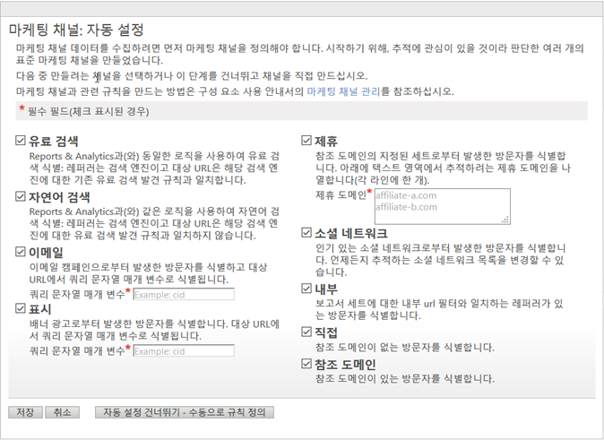

# 자동 설정

마케팅 채널 보고서에 대해 일회성 설정을 실행합니다.

## Automatic setup {#topic_E9ABE9E9E71B4E40A4E7EA9AD2C0372B}

마케팅 채널 보고서에 대해 일회성 설정을 실행합니다.

마케팅 채널 보고서에는 1 회 설정 페이지가 포함되어 있어 작업을 시작할 수 있습니다. 이 보고서는 추적하는 데 사용할 수 있는 여러 가지 마케팅 채널을 제공합니다. 채널과 규칙을 만드는 데 익숙하다면 이 설정을 건너뛸 수 있습니다. 그러나 Adobe에서는 마법사가 사용자 대신 채널을 만들도록 허용할 것을 권장합니다. 자동 설정을 통해 규칙이 구성되는 방식을 보고 원하는 대로 편집할 수 있습니다. 사전 정의된 채널은 언제든지 비활성화하거나 삭제할 수 있습니다.

## 마케팅 채널에 대해 자동 설정 실행{#task_0F694146D48B4647BD7D5F060D394AB7}을 참조하십시오 

마케팅 채널을 자동 설정하는 방법

1. **[!UICONTROL Analytics]** &gt; **[!UICONTROL 관리]** &gt; **[!UICONTROL 보고서 세트를 클릭합니다]**.
1. [!UICONTROL 보고서 세트 관리자]에서 보고서 세트를 선택합니다.
1. Click **[!UICONTROL Edit Settings]** &gt; **[!UICONTROL Marketing Channels]** &gt; **[!UICONTROL Marketing Channel Manager]**.

   

   >[!NOTE]
   >
   >The [!UICONTROL Marketing Channels: Auto Setup] page displays automatically when you access channel configuration applications in Admin Tools. [(마케팅 채널 관리자를 참조하십시오](../../components/c-marketing-channels/c-channels.md#topic_45CF1C6A783B4F96ABF6317EAB6A854F).) 보고서 세트에 하나 이상의 마케팅 채널이 포함된 경우에는 이 페이지가 표시되지 않습니다. 마케팅 채널을 포함하지 않는 다른 보고서 세트를 선택하지 않는 한 이 페이지에 다시 액세스할 수 없습니다.

1. 만들려는 채널을 선택해야 합니다.

   When selected, **[!UICONTROL Email]**, **[!UICONTROL Display]**, and **[!UICONTROL Affiliate]** are required fields.

   [마케팅 채널 관리자를 참조하십시오](../../components/c-marketing-channels/c-channels.md#topic_45CF1C6A783B4F96ABF6317EAB6A854F).

1. **[!UICONTROL 저장을 클릭합니다]**.
