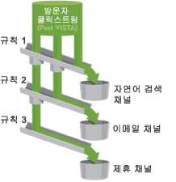

# 채널 및 규칙 정보

보고서에 채널 및 채널 데이터를 표시하려면 먼저 데이터를 처리하는 기초 규칙과 채널을 만들어야 합니다. 또한 관련 채널에 대한 비용 및 예산 금액을 만들고 방문자 유도가 지속되기를 원하는 기간을 지정할 수 있습니다. 보고서 구성 작업은 관리 도구에서 수행합니다.

채널을 일종의 방문 컨테이너로 생각해 보십시오. 이 경우, 규칙은 올바른 컨테이너로 방문을 할당합니다.

Adobe는 자동 설정 중 사전 정의된 채널을 제공하는데  이러한 채널은 사용자 요구에 맞게 편집할 수 있습니다.

>[!NOTE]
>
>테스트 목적으로 템플릿으로 사용할 수 있도록 보고서 세트에 보고서를 설정하는 것이 좋습니다. 템플릿을 사용하여 하나 이상의 생산 보고서 세트에 전역으로 채널 및 규칙 세트를 적용할 수 있습니다.
>
>자세한 내용은 [여러 보고서 세트에 템플릿 보고서 세트 설정 적용](/help/components/c-marketing-channels/t-template.md)을 참조하십시오.

다음 항목을 검토하십시오.

* [전제 조건](/help/components/c-marketing-channels/c-channels-rules.md#prereqs)
* [중요한 처리 정보](/help/components/c-marketing-channels/c-channels-rules.md#important-proc-rules)

## 전제 조건 {#prereqs}

필요한 경우 Customer Care로 연락하여 이러한 전제 조건에 대한 도움을 받으십시오.

* In the Administration Console (General Account Settings), enable the **[!UICONTROL Conversion Level]** (e-commerce) option for the report suite.

   See [General Account Settings](https://marketing.adobe.com/resources/help/en_US/reference/general_acct_settings_admin.html) in Analytics help for more information.

* **[!UICONTROL 마케팅 채널 보고서에 대한 사용자 그룹 액세스 권한을 설정합니다]**.

   See [Configure User Group Access](/help/components/c-marketing-channels/t-user-groups.md).

* Ensure that your account manager has enabled **[!UICONTROL Channel Reports]** for your report suite.

## Important processing notes {#important-proc-rules}

* 시스템은 사용자가 지정하는 순서대로 규칙을 처리하며, 규칙이 충족되면 시스템이 나머지 규칙의 처리를 중지합니다.
* 규칙은 VISTA가 설정한 변수에 액세스할 수 있지만 VISTA가 삭제한 데이터에는 액세스할 수 없습니다.
* 채널은 전환 지표만 저장합니다. 트래픽 지표는 사용할 수 없습니다.
* 두 개의 마케팅 채널이 동일 이벤트(예: 구매 횟수 또는 클릭 수)에 대한 크레디트를 받지 않습니다. 이 방법에서, 마케팅 채널은 eVar와 다릅니다(두 개의 eVar가 동일 이벤트에 대한 크레디트를 받을 수 있는 경우).
* 보고서는 한 번에 최대 25개의 채널을 처리할 수 있습니다.

