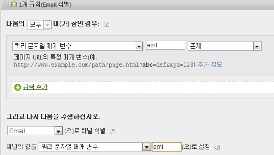
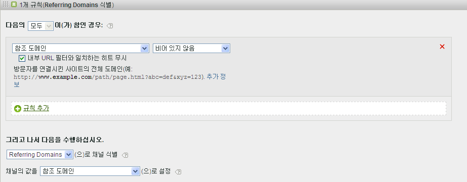
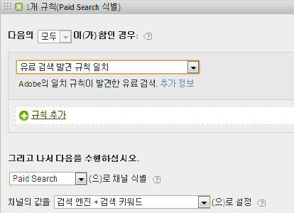
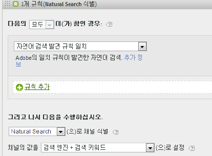
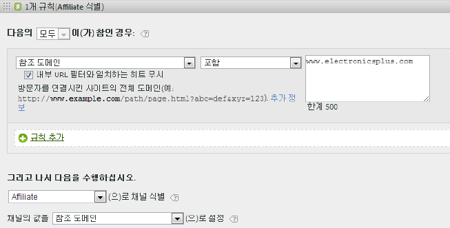
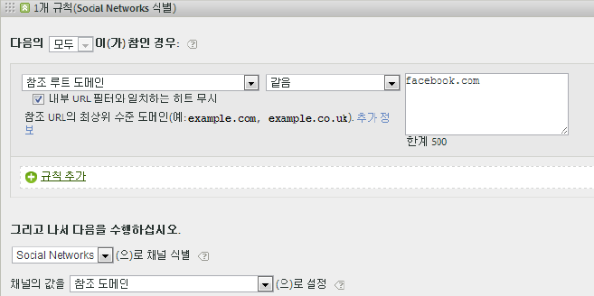
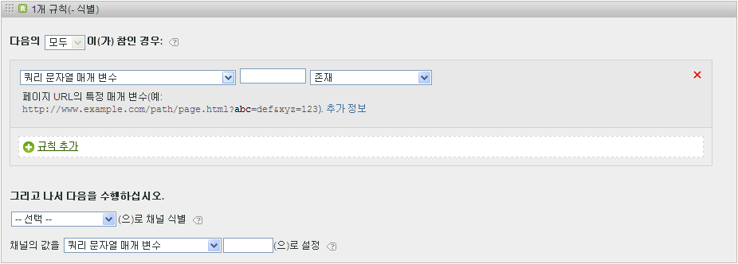
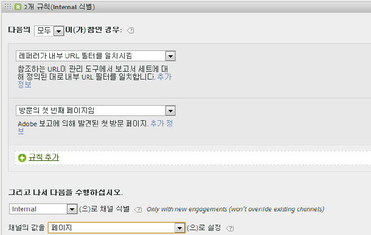
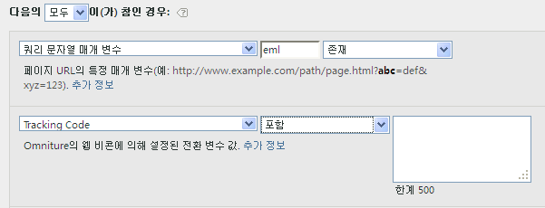
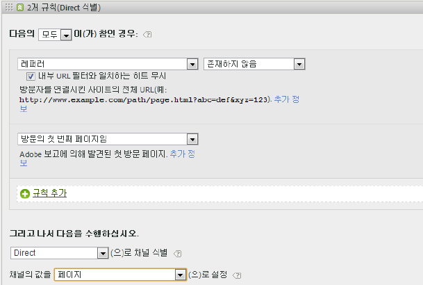

# FAQ 및 예제

마케팅 채널용으로 설정할 수 있는 다양한 규칙을 채우는 방법에 대한 우수 사례 및 예제를 참조하십시오.

* [FAQ](../../components/c-marketing-channels/c-faq.md#section_E490CEAF0E76422C91D34D8A80A0C573)
* [식별된 채널 없음](../../components/c-marketing-channels/c-faq.md#section_451E42994DA247A8A7B8559C715A5EE7)
* [유료 검색](../../components/c-marketing-channels/c-faq.md#section_E934BFE182E4404A93FE07AFEAE64DC1)
* [자연어 검색](../../components/c-marketing-channels/c-faq.md#section_A4C6B8F0360449BE94F0128FF7C71386)
* [제휴](../../components/c-marketing-channels/c-faq.md#section_8D142C7074CD4DEC87DF55B691107622)
* [소셜 네트워크](../../components/c-marketing-channels/c-faq.md#section_492B72A3B261479D9C84F631E90C03D8)
* [표시](../../components/c-marketing-channels/c-faq.md#section_4FD846B89FCE4ECFB7781BD02874A1AB)
* [내부](../../components/c-marketing-channels/c-faq.md#section_179A2BE5C8E24719A9E5C0DC09AF0947)
* [이메일](../../components/c-marketing-channels/c-faq.md#section_4A927BE947B748E39595F4525B7280DE)
* [직접](../../components/c-marketing-channels/c-faq.md#section_D0A1DD9D5EEF4A05A1CC81F9EADC074A)

자세한 내용은 [마케팅 채널 처리 규칙](../../components/c-marketing-channels/t-rules.md#task_84EDE9F46F404CB9B7CA0537328CEE08) [!UICONTROL 만들기를] 참조하십시오.

## FAQ {#section_E490CEAF0E76422C91D34D8A80A0C573}

모든 마케팅 채널 처리 규칙 구현은 추적 코드에 따라 다를 수 있습니다. 원하는 결과를 제공하는 규칙을 구성하려면 문제 해결을 위한 어느 정도의 창의적인 사고가 필요할 수 있습니다.

**질문**: 내 추적 코드가 패턴을 따르지 않으며, 제휴 채널에 대해 지정해야 하는 코드가 수천 개나 있습니다.

*  제거 프로세스를 사용하십시오. 이메일 및 제휴 채널에서 동일한 쿼리 문자열 매개 변수를 사용하지만 몇 개의 이메일 추적 코드만 있는 경우에는 email을 정의하는 규칙 세트에 이메일 추적 코드를 지정할 수 있습니다. 그런 다음 *`affiliates.`*
* In your email system, add a query string parameter to all landing page URLs, such as *`&ch=eml`*. ch 쿼리 매개 변수가 *`eml`*. If it does not contain *`eml`*, then it is an affiliate.

**질문**: 참조 도메인에 예상보다 많은 데이터가 있습니다.

* 처리 규칙 목록에서 참조 도메인이 너무 클 수 있습니다. 처리 순서가 중요하므로 마지막 규칙 세트 중 하나여야 합니다.

**질문**: 쿼리 문자열 매개 변수와 일치하는 규칙을 만들었지만 해당 규칙이 작동하지 않습니다.

*  쿼리 문자열 매개 변수 필드에 매개 변수 이름(보통 영숫자 값)이 지정되어 있고 매개 변수 값이 연산자 뒤에 있는지 확인하십시오(다음 이메일 규칙 예 참조).

   

**질문**: 내가 마지막으로 접촉한 트래픽이 내부 도메인에 귀속되는 이유는 무엇입니까?

*  내부 트래픽에 일치하는 규칙을 가지고 있는 것입니다. 방문자가 사용자 사이트에서 만든 모든(첫 방문만이 아닌) 히트에 대해 이러한 규칙이 처리된다는 점을 염두에 두십시오. 다른 기준 없이 *`Page URL exists`* 와 같은 규칙을 가지고 있는 경우, 페이지 URL이 항상 존재하기 때문에 해당 채널은 사용자 사이트의 연속되는 각 히트에 대해 일치합니다.

**질문**: 보고서에서 [식별된 채널 없음]에 표시되는 트래픽을 디버깅하려면 어떻게 합니까?

*  규칙은 순서대로 처리됩니다. 특정 기준이 일치하지 않으면 히트가 다음 세 가지 카테고리 중 하나에 속하게 됩니다.

1. 레퍼러 없음 (직접 방문).

2. 방문의 첫 번째 페이지에서 내부 레퍼러.

3. 페이지의 결함 처리

다음 세 가지 가능성에 대한 채널이 있는지 확인합니다. 예를 들어 다음과 같은 규칙을 만듭니다.

1. **[!UICONTROL 레퍼러]** , **[!UICONTROL 존재하지]** 않음 및 방문의 **[!UICONTROL 첫 페이지임.]** ([직접 방문](../../components/c-marketing-channels/c-faq.md#section_D0A1DD9D5EEF4A05A1CC81F9EADC074A) 참조)

2. **[!UICONTROL 레퍼러는 내부 URL 필터를]** 일치시키고 방문의 첫 **[!UICONTROL 페이지임]**. ([내부 방문](../../components/c-marketing-channels/c-faq.md#section_179A2BE5C8E24719A9E5C0DC09AF0947) 참조)

3. **[!UICONTROL 레퍼러]** 및 **[!UICONTROL 존재함]** 및 **[!UICONTROL 레퍼러가 내부 URL 필터와 일치하지]**&#x200B;않습니다.

끝으로, [식별된 채널 없음](../../components/c-marketing-channels/c-faq.md#section_451E42994DA247A8A7B8559C715A5EE7)에 설명된 대로, 나머지 히트를 캡처하는 *다른* 채널을 만듭니다.

## 식별된 채널 없음 {#section_451E42994DA247A8A7B8559C715A5EE7}

규칙이 데이터를 캡처하지 않을 때 또는 규칙이 올바르게 구성되지 않은 경우, 보고서의 [!UICONTROL 식별된 채널 없음] 행에 데이터가 표시됩니다. 가령 처리 순서의 끝에, 내부 트래픽까지 식별하는 *기타*&#x200B;라는 규칙 세트를 만들 수 있습니다.

이러한 종류의 규칙은 다목적 캐치(catch-all) 역할을 하여, 채널 트래픽이 항상 외부 트래픽과 일치하도록 하고 일반적으로 **[!UICONTROL 식별된 채널 없음으로 끝나지 않도록 합니다]**. 내부 트래픽까지 식별하는 규칙을 만들지 않도록 주의하십시오. 가장 일반적이고 유용한 [기타] 규칙을 만드는 방법은 채널의 값을 **[!UICONTROL 참조 도메인]**&#x200B;이나 **페이지 URL]로 설정하는 것입니다.[!UICONTROL **

>[!NOTE]
>
>채널 식별된 없음으로 분류할 수 있는 채널 트래픽이 여전히 있을 수 있습니다. 예: 방문자가 사이트를 방문하고 페이지를 책갈피로 지정한 다음 책갈피를 통해 동일한 방문 내에서 페이지로 다시 돌아옵니다. 방문의 첫 페이지가 아니므로 참조 도메인이 없기 때문에 직접 채널이나 기타 채널로 이동하지 않습니다.

## 유료 검색 {#section_E934BFE182E4404A93FE07AFEAE64DC1}

유료 검색은 검색 결과에 배치하기 위해 검색 엔진에 비용을 지불하는 단어 또는 구문입니다. 마케팅 채널은 유료 검색 감지 규칙에 맞추기 위해 [!UICONTROL 유료 검색 감지] 페이지에 구성된 설정을 사용합니다. ( **[!UICONTROL Admin]** &gt; **[!UICONTROL Report Suites]** &gt; **[!UICONTROL Edit Settings]** &gt; **[!UICONTROL General]** &gt; **[!UICONTROL Paid Search Detection]**). 대상 URL은 해당 검색 엔진에 대한 기존 유료 검색 감지 규칙을 일치시킵니다.

마케팅 채널 규칙의 경우, [!UICONTROL 유료 검색] 설정은 다음과 같습니다.

자세한 내용은 관리의 [유료 검색 감지](https://marketing.adobe.com/resources/help/en_US/reference/index.html?f=paid_search_detection)를 참조하십시오.

## 자연어 검색 {#section_A4C6B8F0360449BE94F0128FF7C71386}

자연어 검색은 비용을 지불하지 않고 검색 엔진이 사이트 등급을 지정하는 웹 검색을 통해 방문자가 웹사이트를 찾을 때 발생합니다. 검색 엔진이 사이트에 연결하는 데 사용하는 대상 URL을 제어할 수 있습니다. 이 URL을 사용하면 Analytics에서 검색이 자연어인지를 식별할 수 있습니다.

Analytics에는 자연어 검색 감지 기능이 없습니다. 유료 검색 감지가 설정되면 검색 레퍼러가 유료 검색 레퍼러가 아닌 경우 시스템에서 자연어 검색 레퍼러로 인식합니다. 자연어 검색의 경우, 대상 URL은 해당 검색 엔진에 대한 기존 유료 검색 탐지 규칙을 일치시키지 않습니다.

마케팅 채널 규칙의 경우, 자연어 검색 설정은 다음과 같습니다.

자세한 내용은 관리의 [유료 검색 감지](https://marketing.adobe.com/resources/help/en_US/reference/index.html?f=paid_search_detection)를 참조하십시오.

## 제휴 {#section_8D142C7074CD4DEC87DF55B691107622}

제휴 규칙은 지정된 참조 도메인에서 온 방문자를 식별합니다. 규칙에서, 추적할 방문자의 제휴의 도메인을 다음과 같이 나열합니다.

## 소셜 네트워크 {#section_492B72A3B261479D9C84F631E90C03D8}

이 규칙은 Facebook* 같은 소셜 네트워크에서 온 방문자를 식별합니다. 설정은 다음과 같습니다.

## 표시 {#section_4FD846B89FCE4ECFB7781BD02874A1AB}

이 규칙은 배너 광고로부터 온 방문자를 식별합니다. 대상 URL의 쿼리 문자열 매개 변수( *`Ad_01`*.

## 내부 {#section_179A2BE5C8E24719A9E5C0DC09AF0947}

이 규칙은 보고서 세트에 대한 내부 URL 필터를 일치시키는 레퍼러를 통해서 온 방문자를 식별합니다.

## 이메일 {#section_4A927BE947B748E39595F4525B7280DE}

이 규칙을 설정하려면 이메일 캠페인에 대한 쿼리 문자열 매개 변수를 제공합니다. 이 예에서 매개 변수는 *`eml`*:

규칙에 추적 코드가 포함된 경우, 여기 보여진 것처럼 라인당 하나의 값을 입력하십시오.

## 직접 {#section_D0A1DD9D5EEF4A05A1CC81F9EADC074A}

이 규칙은 참조 도메인이 없는 방문자를 식별합니다. 이 규칙에는 즐겨찾기 링크를 사용하거나 링크를 브라우저에 붙여 넣는 방식으로 직접 사이트를 방문한 방문자가 포함됩니다.

