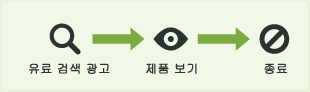
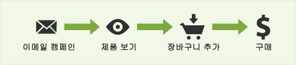
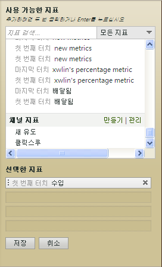

# 마케팅 채널 보고서에 사용된 지표

마케팅 채널 보고서에서 지표를 사용하는 방법입니다.

## Metrics used in Marketing Channel reports {#topic_F83F5D4C3E144967AD90D956F0E8A999}

마케팅 채널 보고서에서 지표를 사용하는 방법입니다.

지표 추가(또는 편집)

 보고서에 열 추가

## First and last-touch metrics {#concept_68D9A50204304BA58C1F8013451E7853}

첫 번째 접촉 및 마지막 접촉은 채널에서 방문자 활동으로 인한 새 참여 횟수 (또는 제품 보기, 매출 및 주문 수와 같은 지표 데이터) 를 확인할 수 있는 채널 특성입니다.

When a success event occurs, Analytics looks at the entire visitor's activity and history (back to the [visitor's engagement expiration](../../components/c-marketing-channels/visitor-engagement.md#topic_32ADFDB12D3A4F35843A4545AC97C49F)). 여기에는 사용자가 들어온 처음 채널과 최근 채널이 표시됩니다. 그리고 각 해당 채널에 성공 이벤트에 대한 크레딧을 줍니다.

<!-- 

<note>
  A first-touch value has a rolling expiration based on the frequency of a visitor returning to the site. This first-touch expiration resets whenever a visitor returns to the site. This effects reporting by causing first-touch values to persist longer than you might expect. For example, this can occur if an instance of an first-touch channel was created a year ago. Remove the values on the eVar in the admin console to reset. 
</note>

 -->

**예**

유료 검색 및 이메일 캠페인과 같은 두 개의 마케팅 채널을 설정한다고 가정합니다.

유료 검색은 제품에 대한 광고로, 방문자의 관심 사항을 파악하고 제품 뷰를 생성하지만 전환 이벤트로 유도하지는 않습니다.

한 달 후 동일 제품에 대해 이메일 캠페인을 실행합니다. 그 결과 $100의 구매(또는 다른 원하는 전환 이벤트)가 발생합니다.

마케팅 채널 보고서에는 다음과 같이 결과가 표시될 수 있습니다.

유료 검색 채널은 매출에 대해 첫 번째 접촉 채널로 $100에 대해 크레디트되고 첫 번째 접촉 주문 수는 1입니다. 이메일 캠페인 채널은 마지막 접촉 매출 채널(전환 이벤트 전에 사용자가 마지막으로 접촉한 채널)로 $100에 대해 크레디트되며 마지막 접촉 주문은 1입니다. 즉, 보고서의 기본 목적은 첫 번째 접촉 채널들 간 매출 상세 분류가 마지막 접촉 채널들 간 매출 상세 분류와 어떻게 다른지를 확인하는 것입니다.

모든 성공 이벤트 인스턴스에는 첫 번째 접촉 채널과 마지막 접촉 채널이 정확하게 하나씩 있습니다. 즉, 성공 이벤트에 대한 지정된 지표 열을 모두 합하면 항상 같은 기간에 대한 합계와 정확하게 일치합니다. 이 합계는 또한 해당 [!UICONTROL 사이트 지표] &gt; [!UICONTROL 사용자 지정 이벤트] 보고서의 전체 이벤트 수와 정확하게 일치합니다. 방문 및 방문자와 같은 성공 이벤트 외의 지표는 한 번의 방문에 대해 여러 채널에서 발동될 수 있으므로 1대 1로 일치하지 않습니다.

>[!NOTE]
>
>이 보고서는 각 지표의 첫 번째 접촉 또는 마지막 접촉 버전을 사용합니다. 따라서 [!UICONTROL 마케팅 채널] 보고서에 표시된 데이터가 다른 보고서에 표시된 데이터와 일치하지 않을 수 있습니다.

## Metric definitions {#section_364D003D34D748B79503DFA4DD208EDB}

| 지표 | 정의 |
|--- |--- |
| 첫 번째 접촉 채널 | 방문자를 참여시키는 첫 번째 마케팅 채널입니다. 기술적으로 첫 번째 접촉 채널은 원래 할당이 있는 Evar 입니다. |
| 첫 번째 접촉 방문자 | 채널 보고서에서 첫 번째 접촉 방문자는 채널로부터 온 일별 고유 방문자입니다. 방문자의 참여는 방문자가 사이트에 머문 기간 동안(많은 방문이 지속될 수 있음) 저장됩니다. |
| 마지막 접촉 채널 | 전환 채널로서 방문자를 전환으로 이끄는 마지막 마케팅 채널입니다. 하나의 채널만 첫 번째 접촉 채널로 설정되며, 마지막 접촉 채널은 사이트에 재방문할 때마다 바뀔 수 있습니다. 모든 방문에는 첫 번째 접촉 및 마지막 접촉 채널이 있지만 첫 번째 접촉 채널의 값은 후속 방문으로 변경되지 않습니다. |

## 클릭스루 {#reference_55E2254F02EF4E7EB0AD2838C948347A}

클릭스루는 마지막 접촉 채널의 인스턴스입니다. 이는 가장 최근 할당이 있는 eVar입니다.

예를 들어 방문자가 방문 시마다 다른 마케팅 채널을 통해 하루에 한 번 사이트를 방문한다고 가정합니다.

* 1일: 유료 검색
* 2일: 표시
* 3일: 자연어 검색
* 4일: 표시
* 5일: 유료 검색
* 6일: 표시
* 7일: 자연어 검색

첫 번째 접촉 채널 보고서는 유료 검색에 대해 1개의 새 유도를 표시합니다. 각각의 다른 채널은 0개의 새 유도를 표시합니다. 마지막 접촉 채널 보고서는 유료 검색에 대해 2개, 표시에 대해 3개, 자연어 검색에 대해 2개의 클릭스루를 표시합니다.

## 마케팅 채널 보고서에 지표 추가 {#task_D381139E00504666AB2402D553CFEA5B}

마케팅 채널 보고서에 지표를 추가합니다. 보고서의 각 열에 최대 4개의 지표를 추가할 수 있으며, 추가 가능한 열 수에는 제한이 없습니다.

1. [!UICONTROL 마케팅 채널 보고서를 엽니다].
1. 지표 추가를 클릭합니다.

   

1. [!UICONTROL 사용 가능한 지표] 아래의 [!UICONTROL 사용 가능한 지표] 섹션에서 지표를 드래그하여 [!UICONTROL 선택된 지표]에 놓습니다.

   

1. To create calculated metrics, scroll to [!UICONTROL Calculated Metrics], then click **[!UICONTROL Create]**.
1. **[!UICONTROL 저장을 클릭합니다.]**
