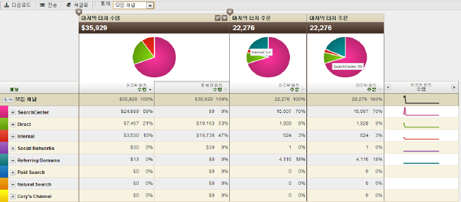

# 마케팅 채널 보고서 정보

마케팅 채널 보고서를 통해 마케팅 채널에서 생성한 매출액을 확인할 수 있습니다. 이 보고서에는 매출, 주문, 비용과 같은 중요한 표준 지표와 함께, 첫 번째 및 마지막 접촉 채널 할당에 대한 개요 보고서가 포함되어 있습니다.

채널 정의 규칙은 관리 도구에서 구성합니다. 채널 보고서에 적합한 API를 사용할 수 있습니다. [!UICONTROL 마케팅 채널] 보고서 실행을 위해 외부 구현을 변경할 필요는 없습니다.

* [예제 보고서](/help/components/c-marketing-channels/c-overview.md)
* [사용 가능한 보고서](/help/components/c-marketing-channels/c-overview.md)

## 예제 보고서 {#example-rpt}

채널 데이터는 대시보드, API, Report Builder(Excel용), Ad Hoc Analysis, Data Warehouse 및 Data Extract에서 지원됩니다.

지표 추가(또는 편집)

 보고서에 열 추가

## 사용 가능한 보고서 {#available-rpts}

다음의 [!UICONTROL 마케팅 채널] 보고서는 Experience Cloud에서 사용할 수 있습니다.

| 보고서 | 설명 |
|--- |--- |
| 채널 개요 |  개요 보고서는 선택된 시간대 동안의 트렌드를 알려주는 파이 차트와 그래프를 표시하는 요약 보고서입니다. 이 보고서에 대해 첫 번째 및 마지막 접촉 지표를 추가하거나 계산된 지표를 만들 수 있습니다. 또한 개요 표로부터 첫 번째 및 마지막 접촉 채널과 상세 보고서를 드릴다운할 수도 있습니다. 다른 마케팅 채널 보고서를 활용하면 이 보고서에 요약된 데이터를 더 깊이 있게 파악할 수 있습니다.  보고서에서 채널을 확장하면 채널 값에 대한 분류 보고를 확인할 수 있습니다. 채널 값은 채널 세부 사항에서 분류되지 않은 값입니다. |
| 첫 번째 또는 마지막 접촉 채널 | 특정 첫 번째 접촉 또는 마지막 접촉 채널에 대한 데이터를 알려주는 지표를 표시합니다. 이러한 보고서에서 채널을 세분하고 각 채널의 상세 정보를 표시할 수 있습니다. |
| 첫 번째 또는 마지막 접촉 채널 세부 사항 | 규칙을 구성할 때 채널의 값을 다음으로 설정 옵션에서 설정한 채널 값에서 가져온 페이지 이름 및 레퍼러와 같은 세부 사항을 표시합니다. 채널 상세 보고서에서 개요 보고서의 채널 상세 정보 값을 면밀하게 검토할 수 있습니다. |
