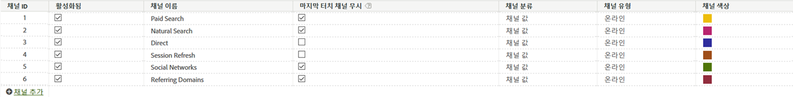

# 마케팅 채널의 처리 규칙

마케팅 채널 처리 규칙은 방문자 히트가 채널에 할당된 기준을 충족하는지 여부를 결정합니다. 규칙은 방문자가 사이트에서 수행하는 모든 히트를 처리합니다. 규칙이 채널에 대한 기준을 충족하지 않거나 규칙이 올바르게 구성되지 않은 경우 시스템이 히트를 식별된 채널 없음에 할당합니다.

다음은 규칙을 만들기 위한 중요한 지침입니다.

* 규칙을 처리할 순서대로 정렬합니다.
* 목록 끝에 기타 등의 모든 catch-all 규칙을 포함합니다. 이 규칙은 외부 트래픽을 식별하지만 내부 트래픽은 식별합니다.

   [식별된 채널 없음](/help/components/c-marketing-channels/c-faq.md)을 참조하십시오.

>[!NOTE] 이러한 규칙은 마케팅 채널 외부의 보고에 영향을 주지 않지만 마케팅 채널 데이터 수집에는 영향을 줍니다. 이러한 규칙으로 수집된 데이터는 100% 영구적이며, 데이터를 수집한 후 변경된 규칙은 소급 적용되지 않습니다. 데이터가 잘못된 채널에서 수집되는 것을 줄이기 위해 저장하기 전에 모든 상황을 검토하고 고려하는 것이 좋습니다. [!UICONTROL Marketing Channel Processing Rules]

## 전제 조건

* 마케팅 채널 시작에서 [개념 정보를 검토하십시오](/help/components/c-marketing-channels/c-getting-started-mchannel.md).
* 규칙을 할당할 수 있도록 하나 이상의 채널을 만듭니다. See [Add marketing channels.](/help/components/c-marketing-channels/c-channels.md)

## 마케팅 채널 처리 규칙 만들기

방문자 히트가 채널에 지정된 기준을 충족하는지 여부를 결정하는 마케팅 채널 처리 규칙을 만듭니다.

이 절차에서는 이메일 규칙을 예로 사용합니다. 이 예에서는 마케팅 채널 관리자 페이지의 채널 목록에 이메일 채널을 추가했다고 가정합니다.

1. Click **[!UICONTROL Analytics]** > **[!UICONTROL Admin]** > **[!UICONTROL Report Suites]**.
1. 보고서 세트 선택.

   If your report suite does not have channels defined, the [!UICONTROL Marketing Channels: Auto Setup] page displays.

   See [Run the Automatic Setup](/help/components/c-marketing-channels/c-getting-started-mchannel.md).

1. Click **[!UICONTROL Edit Settings]** > **[!UICONTROL Marketing Channels]** > **[!UICONTROL Marketing Channel Processing Rules]**.

   

1. 메뉴에서 **[!UICONTROL Add New Rule Set]** 을 선택합니다 **[!UICONTROL Email]**.

   여기에서 채널을 선택하는 것이 아니라, 필요한 몇 가지 매개 변수로 규칙을 채우는 템플릿을 선택하는 것입니다.

   

   부울 논리(if / then 문)를 사용하여 규칙을 구성합니다. 예를 들어 이메일 채널 규칙에서 다음 규칙 문에서 강조된 설정 또는 정보를 제공합니다.

   `"If **[!UICONTROL All]** or **[!UICONTROL Any]** of the following are true:  **[!UICONTROL Query String Parameter]** *<value>* **[!UICONTROL exists]**...`

   `"Then identify the channel as **[!UICONTROL Email]**...`

   `"Then set the channel's value to **[!UICONTROL Query String Parameter]** *<value>*."`

   이 예에서 *`<value>`*&#x200B;는 이메일 캠페인에 사용하는 쿼리 문자열 매개 변수입니다(예:*`eml`*).
1. 규칙을 계속 만들려면 을 클릭합니다 **[!UICONTROL Add Rule]**.
1. 규칙의 우선 순위를 정하려면 규칙을 드래그하여 원하는 위치에 놓습니다.
1. 확대/축소한 후에 **[!UICONTROL Save.]**

>[!MORELIKETHIS]
>
>* [FAQ 및 예제](/help/components/c-marketing-channels/c-faq.md)를 참조하십시오.

## 마케팅 채널 규칙 기준

이 참조 테이블은 마케팅 채널 처리 규칙 페이지에서 선택할 수 있는 필드, 옵션 및 히트 속성을 정의합니다.

| 용어 | 정의 |
|--- |--- |
| 모두 | 번호가 매겨진 규칙의 모든 규칙이 참인 경우에만 이 채널을 활성화합니다. |
| 임의 | 규칙 세트의 규칙 중 하나가 참이면 이 채널을 활성화합니다. 이 옵션은 번호가 매겨진 규칙에 두 개 이상의 규칙이 있는 경우에만 사용할 수 있습니다. |
| AMO ID | Advertising Cloud 및 Advertising Analytics 통합에서 사용하는 기본 추적 코드. 이러한 통합 중 하나가 활성화되면 추적 코드 접두사를 사용하여 Advertising Cloud에 대한 채널을 식별할 수 있습니다. AMO ID는 검색의 경우 &quot;AL&quot;, 표시의 경우 &quot;AC&quot;, 소셜의 경우 &quot;AO&quot;로 시작합니다. AMO ID를 마케팅 채널에서 사용하면 클릭/비용/노출 지표가 적절한 채널에 귀속될 수 있습니다. (구성하지 않으면 이러한 지표는 직접 또는 없음으로 표시됩니다.) |
| AMO ED ID | Advertising Cloud에서 사용하는 보조 추적 코드. 이 추적 코드의 주된 목적은 데이터를 다시 Ad Cloud로 전송하는 키의 역할을 하는 것입니다. 또한 두 개의 분리된 마케팅 채널로 보려는 경우 디스플레이 클릭스루와 디스플레이 뷰스루를 식별하는 데 사용할 수도 있습니다. 이 작업은 디스플레이 클릭스루의 경우 &quot;:d&quot;로 끝나고 디스플레이 뷰스루의 경우 &quot;:i&quot;로 끝나는 &quot;AMO EF ID&quot;에 대한 마케팅 채널 논리를 설정하여 수행할 수 있습니다. 디스플레이를 두 개의 채널로 분할하지 않으려면 AMO ID 차원을 대신 사용하십시오. |
| 전환 변수 | 이 보고서 세트에 대해 활성화된 eVar로 구성되며, 이러한 변수가 페이지의 Adobe 코드를 통해 설정된 경우에만 적용됩니다.   구현 안내서를 참조하십시오. |
| 존재 | 다음을 포함하여 몇 가지 선택 사항을 사용할 수 있습니다.<ul><li>**존재하지 않음**: 히트 속성이 요청에 존재하지 않음을 나타냅니다. 예를 들어 참조 도메인에서 사용자가 URL을 입력하거나 책갈피를 클릭할 경우, 참조 도메인 속성이 존재하지 않습니다.</li><li>**비어 있음**: eVar 또는 쿼리 문자열 매개 변수 같은 히트 속성이 존재하지만 히트 속성과 연관된 값은 없다는 것을 나타냅니다.</li><li>**포함하지 않음**:예를 들어 참조 도메인에 특정 값이 포함되지 않도록 지정할 수 있습니다(선택 항목 &quot;포함&quot;을 사용하는 대신).</li></ul> |
| 다음으로 채널 식별 | 마케팅 채널 관리자 페이지에 추가한 마케팅 채널과 규칙을 연관시킵니다.  마케팅 채널 추가를 참조하십시오. |
| 유료 검색 발견 규칙 일치 | Adobe에서 발견한 유료 검색. 유료 검색은 검색 엔진이 사이트를 나열하는 데 필요한 비용을 지불하는 경우입니다. 유료 검색은 일반적으로 검색 결과의 상단 또는 오른쪽에 표시됩니다. |
| 자연어 검색 발견 규칙 일치 | Adobe 보고에 의해 검색된 유료 검색. |
| 레퍼러가 내부 URL 필터를 일치시킴 | 페이지 URL이 관리자 도구의 보고서 세트에 대해 정의된 대로 내부 URL 필터와 일치하는 방문입니다. |
| 레퍼러가 내부 URL 필터를 일치시키지 않음 | 참조하는 URL이 관리자 도구의 보고서 세트에 대해 정의된 대로 내부 URL 필터와 일치하지 않습니다. 페이지 URL 및 존재와 함께 이 설정을 사용하여 모든 캐치(catch-all) 규칙을 설정할 수 있으므로 보고서의 식별된 채널 없음 섹션에 방문이 없습니다. |
| 내부 URL 필터와 일치하는 히트 무시 | (레퍼러의 경우) 외부에서 참조된 사이트에서 오는 히트만 추적합니다. 일반적으로 내부 트래픽을 포함하려는 경우를 제외하고 이 설정을 사용하도록 설정합니다. |
| 방문의 첫 번째 페이지임 | Adobe 보고에 의해 감지된 방문의 첫 번째 페이지. |
| 페이지 | Adobe의 웹 비콘을 사용하여 태그를 추가하는 사이트 웹 페이지의 페이지 이름. 이 값은 s.pageName과 같습니다. 예로는 `Home Page` 및 `About Us`가 있습니다. |
| 페이지 도메인 | 방문자가 들어오는 페이지의 도메인(예: `products.example.co.uk`). |
| 페이지 도메인 및 경로 | The domain and path, such as `products.example.co.uk/mens/pants/overview.html` . |
| 페이지 루트 도메인(TLD+1) | 방문자가 들어오는 페이지의 루트 도메인(예: example.co.uk). |
| 페이지 URL | 사이트에 있는 웹 페이지의 URL. |
| 참조 도메인 | 방문자가 사용자 사이트를 방문하기 전에 있었던 도메인(예: `abcsite.com` 대 `xyzsite.com`에서 온 레퍼러). |
| 쿼리 문자열 매개 변수 | If a page URL on your site looks like `https://example.com/?page=12345&cat=1`, then page and cat are both query string parameters. (참조 `https://en.wikipedia.org/wiki/Query_string`.)  규칙 세트당 하나의 쿼리 문자열 매개 변수만 지정할 수 있습니다. To add additional query string parameters, use `ANY` as your operator, then add new query string parameters to the rule. |
| 레퍼러 | 방문자가 사이트에 오기 전에 있었던 웹 페이지 위치(전체 URL). 레퍼러는 정의된 도메인 외부에 존재합니다. |
| 참조 도메인 및 경로 | 참조 도메인 및 URL 경로의 연결. 예:   `www.example.com/products/id/12345` 또는 `ad.example.com/foo` |
| 참조 매개 변수 | 레퍼러 URL의 쿼리 문자열 매개 변수입니다. 예를 들어 방문자가 `example.com/?page=12345&cat=1`에서 온 경우 page 및 cat가 참조 매개 변수입니다. |
| 참조 루트 도메인 | 레퍼러의 루트 도메인. 레퍼러는 정의된 도메인 외부에 존재합니다. |
| 검색 엔진 | Google이나 Yahoo! 같이 방문자를 사용자 사이트로 연결시킨 검색 엔진. |
| 검색 키워드 | 검색 엔진을 사용하여 검색을 수행하는 데 사용되는 단어 |
| 검색 엔진 + 키워드 | 검색 엔진을 고유하게 식별하는 검색 키워드 및 검색 엔진의 연결. 예를 들어 computer라는 단어를 검색하는 경우 검색 엔진과 키워드는 다음과 같이 식별됩니다.참고 `Search Tracking Code = "<search_type>:<search engine>:<search keyword>" where    search_type = "n" or "p", search_engine = "Google", and search_keyword = "computer"`**사항:**n = natural;p = 유료 |
| 채널의 값을 다음으로 설정 | 어떤 마케팅 채널이 방문자를 사이트로 유도하는지를 파악하는 것 외에, 방문자의 사이트 활동에서 크레디트를 유발하는 배너 광고, 검색 키워드 또는 채널 내 이메일 캠페인을 파악할 수 있습니다. 이 ID는 채널과 함께 저장되는 채널 값입니다. 종종 이 값은 랜딩 페이지나 참조 URL에 포함된 캠페인 ID입니다.다른 경우에는 검색 엔진 및 검색 키워드 조합이거나 특정 채널에서 방문자를 가장 정확하게 식별하는 참조 URL입니다. |

## 내부(세션 새로 고침) 채널

내부 채널(종종 세션 새로 고침으로 이름이 변경됨)은 참조 URL이 Admin Console의 내부 URL 필터 설정과 일치하는 사이트에 대한 방문으로 구성됩니다. 이것은 방문자가 사이트 내에서 와서 방문을 시작했음을 의미합니다.

### 무시 권장 사항

직접 및 내부 채널이 다른 지속적인 마지막 터치 채널(또는 서로)에서 크레딧을 받을 수 없도록, 직접 및 내부 채널에 대한 마지막 터치 무시 옵션을 선택 취소하는 것이 좋습니다.

>[!NOTE]이 문서에서는 직접 및 세션 새로 고침에 무시 설정이 선택 취소되어 있다고 가정합니다.

### 참여 기간

방문자에 대한 첫 번째 및 마지막 터치 채널은 모두 해당 브라우저에서 30일 동안 사용되지 않으면 재설정됩니다.

>[!NOTE] 30일은 기본값이며 필요에 따라 관리자 설정을 통해 수정할 수 있습니다.

방문자가 사이트를 자주 사용하는 경우 참여 기간이 방문자와 함께 표시됩니다. 기간이 만료되어 채널이 재설정되려면 30일 동안 비활성화 상태여야 합니다.
예:

* 1일: 사용자가 표시에 있는 사이트로 이동합니다. 첫 번째 및 마지막 터치 채널이 표시로 설정됩니다.

* 2일: 사용자가 자연어 검색에 있는 사이트로 이동합니다. 첫 번째 터치는 표시로 유지되며 마지막 터치는 자연어 검색으로 설정됩니다.

* 35일: 사용자가 33일 동안 사이트를 방문하지 않았는데 브라우저에서 열린 탭을 사용하여 다시 돌아옵니다. 30일 참여 기간을 가정하면 기간은 종료되었을 것이고 마케팅 채널 쿠키는 만료됩니다. 첫 번째 터치와 마지막 터치 채널은 재설정되며, 사용자가 내부 URL에서 왔기 때문에 이 채널들은 세션 새로 고침으로 설정됩니다.

### 첫 번째 터치와 마지막 터치 간의 관계

첫 번째 터치와 마지막 터치 간의 상호 작용을 이해하고 무시가 예상대로 작동하는지 확인하기 위해, 주요 성공 지표가 추가된 상태로 마지막 터치 채널 보고서와 하위 관계를 갖는 첫 번째 터치 채널 보고서를 가져올 수 있습니다(아래 예 참조). 이 예는 첫 번째 터치 채널과 마지막 터치 채널 간의 상호 작용을 보여줍니다.

첫 번째 터치와 마지막 터치가 같은 교차 지점은 주황색으로 강조 표시되어 있습니다. 다른 지속되는 채널에서 크레딧을 받을 수는 없으므로 직접 및 세션 새로 고침은 모두 마지막 터치 채널이기도 하고 첫 번째 터치 채널이기도 한 경우 마지막 터치 크레딧만 받습니다(회색으로 강조 표시된 행).

### 세션 새로 고침은 왜 발생합니까?

마지막 터치 세션 새로 고침은 첫 번째 터치이기도 한 경우에만 발생할 수 있으므로 아래 시나리오는 세션 새로 고침이 어떻게 첫 번째 터치 채널이 될 수도 있는지를 설명합니다.

**시나리오 1: 세션 시간 초과**

방문자가 웹 사이트를 방문한 다음 나중에 사용할 수 있도록 브라우저에서 탭을 열어 둡니다. 방문자의 참여 기간이 만료되고(또는 자발적으로 쿠키를 삭제) 방문자가 열려 있는 탭을 사용하여 웹 사이트를 다시 방문합니다. 참조 URL이 내부 도메인이므로 이 방문은 세션 새로 고침으로 분류됩니다.

**시나리오 2: 일부 사이트 페이지에 태그가 지정되어 있지 않음**

방문자가 태그가 지정되지 않은 페이지 A에 도착한 다음, 태그가 지정된 페이지 B로 이동합니다. 페이지 A는 내부 레퍼러로 보여지며 방문은 세션 새로 고침으로 분류됩니다.

**시나리오 3: 리디렉션**

레퍼러 데이터를 새 랜딩 페이지로 전달하도록 리디렉션을 설정하지 않은 경우, 진짜 항목 레퍼러 데이터가 유실되고 이제 리디렉션 페이지(내부 페이지일 수 있음)가 참조 도메인으로 표시됩니다. 이 방문은 세션 새로 고침으로 분류됩니다.

**시나리오 4: 도메인 간 트래픽**

방문자가 세트 A로 실행되는 한 도메인에서 세트 B로 실행되는 두 번째 도메인으로 이동합니다. 세트 B에서 내부 URL 필터가 첫 번째 도메인을 포함하는 경우 마케팅 채널은 방문을 두 번째 세트에서 새 방문으로 간주하므로 세트 B의 방문은 내부로 기록됩니다. 이 방문은 세션 새로 고침으로 분류됩니다.

**시나리오 5: 긴 시작 페이지 로드 시간**

방문자가 컨텐츠가 많은 페이지 A에 도착하고 Adobe Analytics 코드가 페이지 하단에 있습니다. 모든 컨텐츠(Adobe Analytics 이미지 요청 포함)를 로드하기 전에 방문자가 클릭하여 페이지 B로 이동합니다. 페이지 B가 해당 Adobe Analytics 이미지 요청을 실행합니다. 페이지 A의 이미지 요청이 로드되지 않았으므로 두 번째 페이지는 Adobe Analytics에서 방문의 첫 번째 히트로 나타나고 페이지 A는 레퍼러가 됩니다. 이 방문은 세션 새로 고침으로 분류됩니다.

**시나리오 6: 사이트 중간에서 쿠키 지우기**

방문자가 사이트를 방문하고 중간 세션에서 쿠키를 지웁니다. 첫 번째와 마지막 터치 채널 이 모두 재설정되며, 방문은 세션 새로 고침으로 분류됩니다(레퍼러가 내부이므로).
