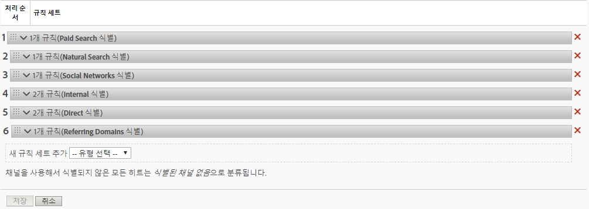
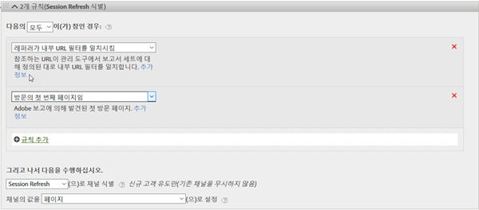

# 마케팅 채널의 처리 규칙

마케팅 채널 처리 규칙은 방문자가 사이트에서 수행하는 모든 히트를 처리하여 방문자 히트가 채널에 할당된 기준을 충족하는지 여부를 결정합니다. 규칙은 지정한 순서대로 처리되며 규칙이 충족되면 시스템이 나머지 규칙의 처리를 중지합니다.

처리에 대한 추가 참고 사항:
* 이러한 규칙으로 수집한 데이터는 100% 영구적이며 데이터를 수집한 후에 수정한 규칙은 되돌릴 수 없습니다. 데이터가 잘못된 채널에서 수집되는 일을 막을 수 있도록 [!UICONTROL 마케팅 채널 처리 규칙]을 저장하기 전에 모든 상황을 검토 및 고려하는 것이 좋습니다.
* 보고서는 한 번에 최대 25개의 채널을 처리할 수 있습니다.
* 규칙은 VISTA가 설정한 변수에 액세스할 수 있지만 VISTA가 삭제한 데이터에는 액세스할 수 없습니다.
* 두 개의 마케팅 채널이 동일 이벤트(예: 구매 횟수 또는 클릭 수)에 대한 크레디트를 받지 않습니다. 이 방법에서, 마케팅 채널은 eVar와 다릅니다(두 개의 eVar가 동일 이벤트에 대한 크레디트를 받을 수 있는 경우).
* 규칙에 대한 차이 범위가 있는 경우 식별된 채널 [없음이 표시될 수 있습니다.](/help/components/c-marketing-channels/c-faq.md)

## 전제 조건

* [마케팅 채널 시작](/help/components/c-marketing-channels/c-getting-started-mchannel.md)에서 개념 정보를 검토하십시오.
* 규칙을 할당할 수 있도록 하나 이상의 채널을 만듭니다. [마케팅 채널 추가](/help/components/c-marketing-channels/c-channels.md)를 참조하십시오.

## 마케팅 채널 처리 규칙 만들기

방문자 히트가 채널에 지정된 기준을 충족하는지 여부를 결정하는 마케팅 채널 처리 규칙을 만듭니다.

이 절차에서는 이메일 규칙을 하나의 예로 사용합니다. 이 예에서는 마케팅 채널 관리자 페이지의 채널 목록에 이메일 채널을 추가했다고 가정합니다.

1. **[!UICONTROL Analytics]** > **[!UICONTROL 관리]** > **[!UICONTROL 보고서 세트]**&#x200B;를 클릭합니다.
2. 보고서 세트 선택.

   보고서 세트에 정의된 채널이 없으면 [!UICONTROL 마케팅 채널: 자동 설정] 페이지가 표시됩니다.

   자세한 내용은 [자동 설정 실행](/help/components/c-marketing-channels/c-getting-started-mchannel.md).

3. **[!UICONTROL 편집 설정]** > **[!UICONTROL 마케팅 채널]** > **[!UICONTROL 마케팅 채널 처리 규칙]**&#x200B;을 클릭합니다.

   

4. **[!UICONTROL 새 규칙 세트 추가]** 메뉴에서 **[!UICONTROL 이메일을]** 선택합니다.

   여기에서 채널을 선택하는 것이 아니라, 필요한 몇 가지 매개 변수로 규칙을 채우는 템플릿을 선택하는 것입니다. 필요에 따라 이 템플릿을 수정할 수 있습니다.

   

5. 규칙 만들기를 계속하려면 **[!UICONTROL 규칙 추가]**&#x200B;를 클릭합니다.
6. 규칙의 우선 순위를 정하려면 규칙을 드래그하여 원하는 위치에 놓습니다.
7. **[!UICONTROL 저장을 클릭합니다.]**

더 많은 정의 예와 채널 규칙 순서에 대한 권장 사항을 보려면 이 페이지를 계속 아래로 이동합니다.

### 마케팅 채널 값 설정

**[!UICONTROL 규칙&#x200B;]**추가&#x200B;**채널의 값 설정]해당 채널에 사용할 수 있는 마케팅 채널 세부 사항 차원을 정의합니다. 이를 통해 마케팅 채널 차원을 분류하고 채널에 대한 자세한 정보를 볼 수 있습니다.

채널 자체를 정의하는 데 사용되는 것과 동일한 기준으로 채널 값을 설정하는 것이 좋습니다. 예를 들어 쿼리 문자열 매개 변수를 사용하여 채널을 정의하는 경우 쿼리 문자열 매개 변수를 채널 값으로 설정합니다.

### 규칙 기준

이 참조 테이블은 마케팅 채널 처리 규칙을 정의하는 데 사용할 수 있는 필드, 옵션 및 히트 속성을 정의합니다.

| 용어 | 정의 |
|--- |--- |
| 모두 | 번호가 매겨진 형식의 모든 규칙이 참인 경우에만 이 채널을 활성화합니다. |
| 임의 | 규칙 세트의 일부 규칙이 참이면 이 채널을 활성화합니다. 이 옵션은 번호가 매겨진 규칙에 두 개 이상의 규칙이 있는 경우에만 사용할 수 있습니다. |
| AMO ID | Advertising Cloud 및 Advertising Analytics 통합에서 사용하는 기본 추적 코드. 이러한 통합 중 하나가 활성화되면 추적 코드 접두사를 사용하여 Advertising Cloud에 대한 채널을 식별할 수 있습니다. AMO ID는 검색의 경우 &quot;AL&quot;, 표시의 경우 &quot;AC&quot;, 소셜의 경우 &quot;AO&quot;로 시작합니다. AMO ID를 마케팅 채널에서 사용하면 클릭/비용/노출 지표가 적절한 채널에 귀속될 수 있습니다. (구성하지 않으면 이러한 지표는 직접 또는 없음으로 표시됩니다.) |
| AMO ED ID | Advertising Cloud에서 사용하는 보조 추적 코드. 이 추적 코드의 주된 목적은 데이터를 다시 Ad Cloud로 전송하는 키의 역할을 하는 것입니다. 또한 두 개의 분리된 마케팅 채널로 보려는 경우 디스플레이 클릭스루와 디스플레이 뷰스루를 식별하는 데 사용할 수도 있습니다. 이 작업은 디스플레이 클릭스루의 경우 &quot;:d&quot;로 끝나고 디스플레이 뷰스루의 경우 &quot;:i&quot;로 끝나는 &quot;AMO EF ID&quot;에 대한 마케팅 채널 논리를 설정하여 수행할 수 있습니다. 디스플레이를 두 개의 채널로 분할하지 않으려면 AMO ID 차원을 대신 사용하십시오. |
| 전환 변수 | 이 보고서 세트에 대해 활성화된 eVar들로 구성되며 이러한 변수가 페이지의 Adobe 코드를 통해 설정된 경우에만 적용됩니다.  구현 안내서를 참조하십시오. |
| 존재 | 다음을 포함하여 여러 가지 선택 사항이 있습니다.<ul><li>**존재하지 않음**: 히트 속성이 요청에 존재하지 않음을 나타냅니다. 예를 들어 참조 도메인에서 사용자가 URL을 입력하거나 책갈피를 클릭할 경우, 참조 도메인 속성이 존재하지 않습니다.</li><li>**비어 있음**: eVar 또는 쿼리 문자열 매개 변수 같은 히트 속성이 존재하지만 히트 속성과 연관된 값은 없다는 것을 나타냅니다.</li><li>**포함하지 않음**: 가령 추천 도메인이 특정 값을 포함하지 않음을 지정할 수 있습니다(다음을 선택할 경우와 반대: &quot;다음 포함&quot;.)</li></ul> |
| 다음으로 채널 식별 | 마케팅 채널 관리자 페이지에 추가한 마케팅 채널과 규칙을 연관시킵니다.  마케팅 채널 추가를 참조하십시오. |
| 유료 검색 발견 규칙 일치 | Adobe가 발견한 유료 검색. 유료 검색은 검색 엔진이 해당 기업 사이트를 나열하는 대가로 비용을 지불하는 검색 유형입니다. 유료 검색은 보통 검색 결과의 상단 또는 오른쪽에 나타납니다. |
| 자연어 검색 발견 규칙 일치 | Adobe 보고에 의해 발견된 무료 검색 |
| 레퍼러가 내부 URL 필터를 일치시킴 | 페이지 URL이 관리자 도구의 보고서 세트에 대해 정의된 대로 내부 URL 필터와 일치하는 방문입니다. |
| 레퍼러가 내부 URL 필터를 일치시키지 않음 | 참조하는 URL이 관리 도구의 보고서 세트에 대해 정의된 대로 내부 URL 필터와 일치하지 않습니다. 이 설정을  페이지 URL 및 존재와 함께 사용하여 보고서의 식별된 채널 없음 섹션에 도착하는 방문이 없도록 다목적 캐치(catch-all) 규칙을 설정할 수 있습니다. |
| 내부 URL 필터와 일치하는 히트 무시 | (레퍼러의 경우) 외부에서 추천한 사이트에서 온 히트만 추적합니다. 일반적으로, 내부 트래픽을 포함하기를 원하지 않는 한 이 옵션을 계속 사용하도록 설정하십시오. |
| 방문의 첫 번째 페이지임 | Adobe 보고에 의해 발견된 첫 방문 페이지 |
| 페이지 | Adobe의 웹 비콘을 사용하여 태그를 추가하는 사이트 웹 페이지의 페이지 이름. 이 값은 s.pageName과 같습니다. 예: `Home Page` 및 `About Us`. |
| 페이지 도메인 | 방문자가 들어오는 페이지의 도메인(예: `products.example.co.uk`). |
| 페이지 도메인 및 경로 | `products.example.co.uk/mens/pants/overview.html`과 같은 도메인과 경로. |
| 페이지 루트 도메인(TLD+1) | 방문자가 들어오는 페이지의 루트 도메인(예: example.co.uk). |
| 페이지 URL | 사이트에서 웹 페이지의 URL |
| 참조 도메인 | 방문자가 사용자 사이트를 방문하기 전에 있었던 도메인(예: `abcsite.com` 대 `xyzsite.com`에서 온 레퍼러). |
| 쿼리 문자열 매개 변수 | 사이트의 페이지 URL이 `https://example.com/?page=12345&cat=1`과 유사하면 page와 cat 모두 쿼리 문자열 매개 변수입니다. (참조 `https://en.wikipedia.org/wiki/Query_string`.)  규칙 세트당 하나의 쿼리 문자열 매개 변수만 지정할 수 있습니다. 쿼리 문자열 매개 변수를 더 추가하려면 연산자로 `ANY`를 사용한 다음, 새 쿼리 문자열 매개 변수를 규칙에 추가하십시오. |
| 레퍼러 | 방문자가 사이트에 오기 전에 있었던 웹 페이지 위치(전체 URL). 레퍼러는 정의된 도메인 외부에 존재합니다. |
| 참조 도메인 및 경로 | 참조 도메인과 URL 경로의 연결. 예: `www.example.com/products/id/12345` 또는 `ad.example.com/foo` |
| 참조 매개 변수 | 레퍼러 URL의 쿼리 문자열 매개 변수. 예를 들어 방문자가 `example.com/?page=12345&cat=1`에서 온 경우 page 및 cat가 참조 매개 변수입니다. |
| 참조 루트 도메인 | 레퍼러의 루트 도메인. 레퍼러는 정의된 도메인 외부에 존재합니다. |
| 검색 엔진 | Google이나 Yahoo! 같이 방문자를 사용자 사이트로 연결시킨 검색 엔진. |
| 검색 키워드 | 검색 엔진을 사용하여 검색을 수행하는 데 사용되는 단어 |
| 검색 엔진 + 키워드 | 검색 엔진을 고유하게 식별하는 검색 키워드 및 검색 엔진의 연결. 예를 들어 computer라는 단어를 검색하는 경우, 검색 엔진과 키워드는 다음과 같이 식별됩니다. `Search Tracking Code = "<search_type>:<search engine>:<search keyword>" where    search_type = "n" or "p", search_engine = "Google", and search_keyword = "computer"`**참고:**n = 자연어, p = 유료 |
| 채널의 값을 다음으로 설정 | 어떤 마케팅 채널이 방문자를 사이트로 유도하는지를 파악하는 것 외에, 방문자의 사이트 활동에서 크레디트를 유발하는 배너 광고, 검색 키워드 또는 채널 내 이메일 캠페인을 파악할 수 있습니다. 이 ID는 채널과 함께 저장되는 채널 값입니다. 종종 이 값은 랜딩 페이지 또는 참조 URL에 삽입되는 캠페인 ID입니다. 또한 검색 엔진 및 검색 키워드 조합이거나 특정 채널에서 온 방문자를 가장 올바르게 식별하는 참조 URL일 수도 있습니다. |

## 마케팅 채널 규칙 순서 및 정의 {#channel-rules}

채널 규칙은 지정한 순서대로 처리됩니다. 유료 또는 관리되는 채널(예: 유료 검색, 자연어 검색, 디스플레이, 이메일)을 먼저 배치하여 크레딧을 받고 일반 채널(예: 직접, 내부, 참조 도메인)이 뒤따르는 것이 좋습니다.

다음은 채널 규칙 및 예제 정의에 대한 권장 주문입니다.

### 유료 검색 {#paid-search}

유료 검색은 검색 결과에 배치하기 위해 검색 엔진에 비용을 지불하는 단어 또는 구문입니다. 이 채널은 일반적으로 쿼리 문자열 매개 변수(디스플레이 채널 예 참조) 또는 유료 검색 탐지 규칙을 기반으로 정의됩니다. 의사 결정은 기록할 마케팅 채널 세부 정보에 따라 다릅니다.

#### 유료 검색 감지

마케팅 채널은 유료 검색 감지 규칙에 맞추기 위해 [!UICONTROL 유료 검색 감지] 페이지에 구성된 설정을 사용합니다. ( **[!UICONTROL 관리]** > **[!UICONTROL 보고서 세트]** > **[!UICONTROL 설정 편집]** > **[!UICONTROL 일반]** > **[!UICONTROL 유료 검색 감지]**). 대상 URL은 해당 검색 엔진에 대한 기존 유료 검색 감지 규칙을 일치시킵니다.

마케팅 채널 규칙의 경우, [!UICONTROL 유료 검색] 설정은 다음과 같습니다.

자세한 내용은 관리의 [유료 검색 감지](https://docs.adobe.com/content/help/ko-KR/analytics/admin/admin-tools/paid-search-detection/paid-search-detection.html)를 참조하십시오.

### 자연어 검색 {#natural-search}

자연어 검색은 비용을 지불하지 않고 검색 엔진이 사이트 등급을 지정하는 웹 검색을 통해 방문자가 웹사이트를 찾을 때 발생합니다.

Analytics에는 자연어 검색 감지 기능이 없습니다. 유료 검색 감지가 설정되면 검색 레퍼러가 유료 검색 레퍼러가 아닌 경우 시스템에서 자연어 검색 레퍼러로 인식합니다. 자세한 내용은 관리자의 [유료 검색 감지](https://docs.adobe.com/content/help/ko-KR/analytics/admin/admin-tools/paid-search-detection/paid-search-detection.html)를 참조하십시오.

마케팅 채널 규칙의 경우, 자연어 검색 설정은 다음과 같습니다.

### 표시 {#display}

이 규칙은 배너 광고로부터 온 방문자를 식별합니다. 대상 URL의 쿼리 문자열 매개 변수( *`Ad_01`*.

### 이메일 {#email}

이 규칙은 이메일 캠페인에서 온 방문자를 식별합니다. It is identified by a query string parameter in the destination URL, in this case *`eml`*:

### 제휴 {#afilliates}

이 규칙은 지정된 참조 도메인에서 온 방문자를 식별합니다. 규칙에서, 추적할 방문자의 제휴의 도메인을 다음과 같이 나열합니다.

### 기타 캠페인 {#other-campaigns}

가장 좋은 방법은 모든 유료 채널 규칙에 따라 &quot;기타 캠페인&quot; 채널을 포함하는 것입니다. 이 채널은 분류되지 않은 유료 트래픽에 대한 다목적 역할을 합니다.

### 소셜 네트워크 {#social-networks}

이 규칙은 Facebook* 같은 소셜 네트워크에서 온 방문자를 식별합니다. 채널은 종종 유기 소셜로 이름이 바뀝니다. 설정은 다음과 같습니다.

### 내부(세션 새로 고침) 채널 {#internal}

참조 URL이 관리 콘솔의 내부 URL 필터 설정과 일치하는 이 규칙 방문자. 즉, 방문자가 방문을 시작하기 위해 사이트 내에서 왔음을 의미합니다. 이 채널은 종종 세션 새로 고침으로 이름이 바뀝니다.

이 [채널이 발생하는 이유에 대한 자세한 내용은 내부(세션 새로 고침)](https://docs.adobe.com/content/help/en/analytics/components/marketing-channels/c-faq.html) 이유를 참조하십시오.

### 직접 {#direct}

이 규칙은 즐겨찾기 링크 또는 브라우저에 링크를 붙여넣는 등 사이트에 직접 방문하는 방문자를 포함하는 참조 도메인이 없는 방문자를 식별합니다. 이 채널은 종종 직접 입력/책갈피 표시로 이름이 바뀝니다.

### 참조 도메인 채널 {#referring-domains}

참조 도메인 채널은 참조 도메인이 있는 방문자를 식별합니다. 함께, 내부, 직접 및 참조 도메인 채널은 아직 채널로 분류되지 않은 나머지 모든 히트에 대한 다목적 캐치 역할을 합니다.

