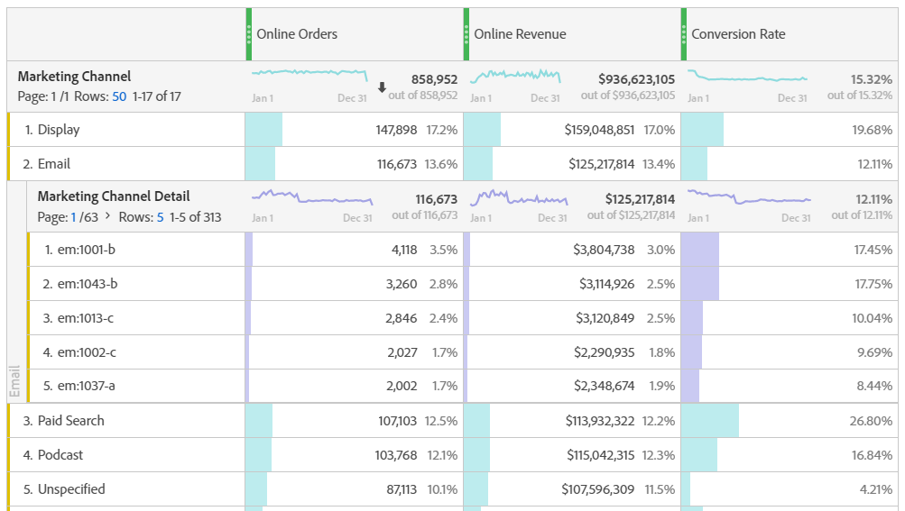
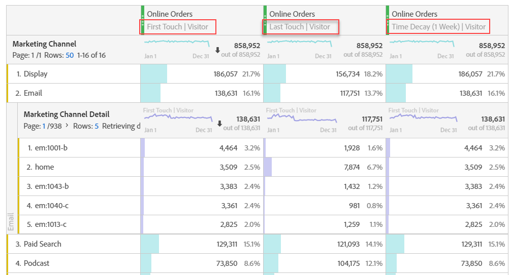

# 마케팅 채널 분석

가장 효과적인 마케팅 채널 중 어떤 채널을 누구에게 활용하고 있는지 알고 싶을 수 있으므로 마케팅 활동을 효과적으로 타겟팅하고 더 나은 마케팅 수익을 얻을 수 있습니다. Adobe Analytics에서 작업 공간의 마케팅 채널 차원 및 지표는 주문, 매출 등에 대한 다양한 채널의 영향을 추적하는 데 도움이 되는 도구 중 하나입니다. 유용한 채널 인사이트를 제공합니다. 다음은 마케팅 채널과 관련하여 사용할 수 있는 차원 및 지표입니다.

| 차원/지표 | 정의 |
|---|---|
| 마케팅 채널 | 이 차원은 우리가 사용하는 마케팅 채널 차원입니다. 런타임 시 기여도 IQ 모델을 적용할 수 있습니다. 일반 마케팅 채널 차원은 마지막 터치 채널 크기와 동일하게 동작하지만 다른 속성 모델과 함께 사용할 때 혼동을 방지하기 위해 다르게 레이블이 지정됩니다. |
| 마지막 터치 채널 | 이전 차원입니다. |
| 첫 번째 터치 채널 | 이전 차원입니다. |
| [마케팅 채널 인스턴스이 지표...] |
| 새로운 참여 | 채널에 &#39;첫 번째 터치&#39; 할당이 적용되는 경우에만 증가되는 기존 지표입니다. |

## 기본 분석

이 자유 형식 테이블은 각 마케팅 채널에 대한 온라인 주문, 온라인 매출 및 전환율을 보여줍니다.

여기에서는 도넛형 차트에 각 마케팅 채널의 온라인 주문 및 온라인 매출을 확인할 수 있습니다.

이 라인 차트는 시간에 따른 다양한 채널의 온라인 주문 트렌드를 보여줍니다.

## 고급 분석

마케팅 채널 세부 사항은 각 채널을 자세히 분석하여 특정 캠페인, 배치 등을 보여줍니다. 각 마케팅 채널을 세부적으로 분류할 수 있습니다.

## 기여도 모델 적용

기여도 IQ를 사용하여 [다른](https://docs.adobe.com/content/help/en/analytics/analyze/analysis-workspace/panels/attribution/use-attribution.html) 기여도 모델을 즉시 적용할 수 있습니다.

다른 속성 모델을 적용할 때 동일한 지표(온라인 주문)가 어떻게 다른 결과를 생성하는지 확인하십시오.

다음은 기여도 IQ를 설명하는 몇 가지 비디오입니다.속성 [IQ 재생 목록입니다](https://www.youtube.com/playlist?list=PL2tCx83mn7GuDzYEZ8jQlaScruZr3tBTR).

## 크로스탭 마케팅 분석

기존 첫 번째 접촉 채널과 마지막 접촉 채널을 사용하면 채널 상호 작용에 유용한 정보를 얻을 수 있습니다.

이 [비디오에서](https://www.youtube.com/watch?v=M3EOdONa-3E)자세한 내용을 살펴보십시오.