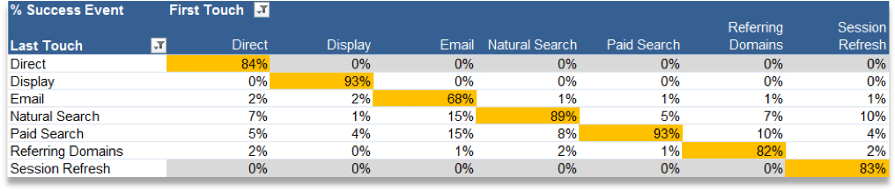

# 내부(세션 새로 고침) 채널

내부 채널(종종 세션 새로 고침으로 이름이 변경됨)은 참조 URL이 Admin Console의 내부 URL 필터 설정과 일치하는 사이트에 대한 방문으로 구성됩니다. 이것은 방문자가 사이트 내에서 와서 방문을 시작했음을 의미합니다.

## 무시 권장 사항

직접 및 내부 채널이 다른 지속적인 마지막 터치 채널(또는 서로)에서 크레딧을 받을 수 없도록, 직접 및 내부 채널에 대한 마지막 터치 무시 옵션을 선택 취소하는 것이 좋습니다.

>[!NOTE]이 문서에서는 직접 및 세션 새로 고침에 무시 설정이 선택 취소되어 있다고 가정합니다.

## 참여 기간

방문자에 대한 첫 번째 및 마지막 터치 채널은 모두 해당 브라우저에서 30일 동안 사용되지 않으면 재설정됩니다.

>[!NOTE] 30일은 기본값이며 필요에 따라 관리자 설정을 통해 수정할 수 있습니다.

방문자가 사이트를 자주 사용하는 경우 참여 기간이 방문자와 함께 표시됩니다. 기간이 만료되어 채널이 재설정되려면 30일 동안 비활성화 상태여야 합니다.
예:

* 1일: 사용자가 표시에 있는 사이트로 이동합니다. 첫 번째 및 마지막 터치 채널이 표시로 설정됩니다.

* 2일: 사용자가 자연어 검색에 있는 사이트로 이동합니다. 첫 번째 터치는 표시로 유지되며 마지막 터치는 자연어 검색으로 설정됩니다.

* 35일: 사용자가 33일 동안 사이트를 방문하지 않았는데 브라우저에서 열린 탭을 사용하여 다시 돌아옵니다. 30일 참여 기간을 가정하면 기간은 종료되었을 것이고 마케팅 채널 쿠키는 만료됩니다. 첫 번째 터치와 마지막 터치 채널은 재설정되며, 사용자가 내부 URL에서 왔기 때문에 이 채널들은 세션 새로 고침으로 설정됩니다.

## 첫 번째 터치와 마지막 터치 간의 관계

첫 번째 터치와 마지막 터치 간의 상호 작용을 이해하고 무시가 예상대로 작동하는지 확인하기 위해, 주요 성공 지표가 추가된 상태로 마지막 터치 채널 보고서와 하위 관계를 갖는 첫 번째 터치 채널 보고서를 가져올 수 있습니다(아래 예 참조). 이 예는 첫 번째 터치 채널과 마지막 터치 채널 간의 상호 작용을 보여줍니다.

첫 번째 터치와 마지막 터치가 같은 교차 지점은 주황색으로 강조 표시되어 있습니다. 다른 지속되는 채널에서 크레딧을 받을 수는 없으므로 직접 및 세션 새로 고침은 모두 마지막 터치 채널이기도 하고 첫 번째 터치 채널이기도 한 경우 마지막 터치 크레딧만 받습니다(회색으로 강조 표시된 행).

## 세션 새로 고침은 왜 발생합니까?

마지막 터치 세션 새로 고침은 첫 번째 터치이기도 한 경우에만 발생할 수 있으므로 아래 시나리오는 세션 새로 고침이 어떻게 첫 번째 터치 채널이 될 수도 있는지를 설명합니다.

### 시나리오 1: 세션 시간 초과

방문자가 웹 사이트를 방문한 다음 나중에 사용할 수 있도록 브라우저에서 탭을 열어 둡니다. 방문자의 참여 기간이 만료되고(또는 자발적으로 쿠키를 삭제) 방문자가 열려 있는 탭을 사용하여 웹 사이트를 다시 방문합니다. 참조 URL이 내부 도메인이므로 이 방문은 세션 새로 고침으로 분류됩니다.

### 시나리오 2: 일부 사이트 페이지에 태그가 지정되어 있지 않음

방문자가 태그가 지정되지 않은 페이지 A에 도착한 다음, 태그가 지정된 페이지 B로 이동합니다. 페이지 A는 내부 레퍼러로 보여지며 방문은 세션 새로 고침으로 분류됩니다.

### 시나리오 3: 리디렉션

레퍼러 데이터를 새 랜딩 페이지로 전달하도록 리디렉션을 설정하지 않은 경우, 진짜 항목 레퍼러 데이터가 유실되고 이제 리디렉션 페이지(내부 페이지일 수 있음)가 참조 도메인으로 표시됩니다. 이 방문은 세션 새로 고침으로 분류됩니다.

### 시나리오 4: 도메인 간 트래픽

방문자가 세트 A로 실행되는 한 도메인에서 세트 B로 실행되는 두 번째 도메인으로 이동합니다. 세트 B에서 내부 URL 필터가 첫 번째 도메인을 포함하는 경우 마케팅 채널은 방문을 두 번째 세트에서 새 방문으로 간주하므로 세트 B의 방문은 내부로 기록됩니다. 이 방문은 세션 새로 고침으로 분류됩니다.

### 시나리오 5: 긴 시작 페이지 로드 시간

방문자가 컨텐츠가 많은 페이지 A에 도착하고 Adobe Analytics 코드가 페이지 하단에 있습니다. 모든 컨텐츠(Adobe Analytics 이미지 요청 포함)를 로드하기 전에 방문자가 클릭하여 페이지 B로 이동합니다. 페이지 B가 해당 Adobe Analytics 이미지 요청을 실행합니다. 페이지 A의 이미지 요청이 로드되지 않았으므로 두 번째 페이지는 Adobe Analytics에서 방문의 첫 번째 히트로 나타나고 페이지 A는 레퍼러가 됩니다. 이 방문은 세션 새로 고침으로 분류됩니다.

### 시나리오 6: 사이트 중간에서 쿠키 지우기

방문자가 사이트를 방문하고 중간 세션에서 쿠키를 지웁니다. 첫 번째와 마지막 터치 채널 이 모두 재설정되며, 방문은 세션 새로 고침으로 분류됩니다(레퍼러가 내부이므로).
