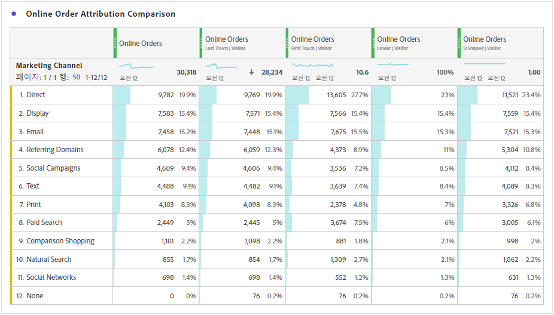
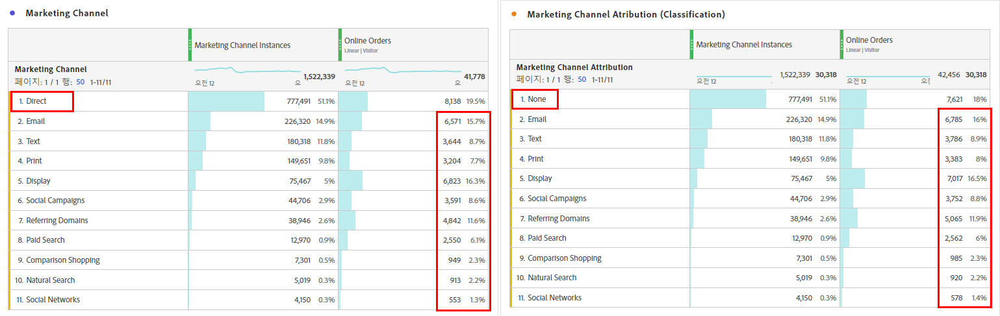
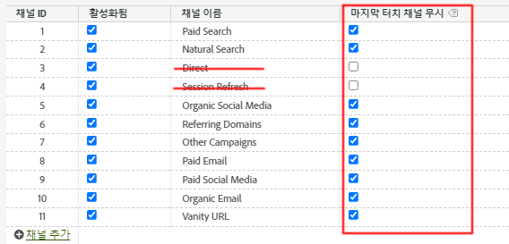
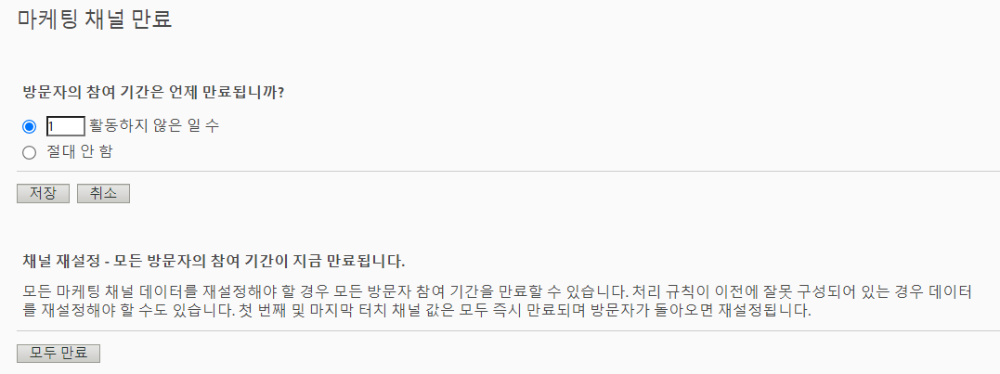

# Attribution IQ와 마케팅 채널 - 모범 사례

[마케팅 채널](/help/components/c-marketing-channels/c-getting-started-mchannel.md)은 Adobe Analytics의 귀중하고 강력한 기능입니다. 마케팅 채널 구현에 관한 현재 지침은 [Attribution IQ](https://experienceleague.adobe.com/docs/analytics/analyze/analysis-workspace/attribution/overview.html#analysis-workspace) 또는 [Customer Journey Analytics](https://experienceleague.adobe.com/docs/analytics-platform/using/cja-usecases/marketing-channels.html?lang=ko-KR#cja-usecases)가 존재하지 않았을 때 작성되었습니다.

마케팅 채널 구현의 미래를 보장하고 Attribution IQ 및 Customer Journey Analytics와의 보고 일관성을 보장하기 위해 Adobe는 업데이트된 모범 사례 세트를 발표하고 있습니다. 이미 마케팅 채널을 사용하고 있는 경우 이러한 새로운 지침 중에서 최상의 옵션을 선택할 수 있습니다. 마케팅 채널을 처음 사용하는 경우 모든 새로운 모범 사례를 준수하는 것이 좋습니다.

마케팅 채널이 처음 도입되었을 때는 첫 번째 접점 차원과 마지막 접점 차원에서만 제공되었습니다. 현재 버전의 속성을 사용할 경우 명확한 첫 번째/마지막 접촉 차원이 더 이상 필요하지 않습니다. Adobe는 일반적인 “마케팅 채널” 및 “마케팅 채널 세부 정보” 차원을 제공하므로 원하는 속성 모델과 함께 사용할 수 있습니다. 이러한 일반 차원은 마지막 접점 채널 차원과 동일하게 작동하지만 다른 속성 모델과 함께 마케팅 채널을 사용할 때 혼동을 방지하기 위해 레이블이 다르게 지정됩니다.

마케팅 채널 차원은 기존 Visit Definition(처리 규칙에 정의된)에 따라 다르므로 이 차원의 Visit Definition는 가상 보고서 세트를 사용하여 변경할 수 없습니다. 이러한 수정된 사례는 Attribution IQ 및 CJA를 통해 명확하고 통제된 전환 확인 기간을 사용할 수 있습니다.

## 모범 사례 #1: 통제된 분석을 위해 Attribution IQ 활용

기존 마케팅 채널 속성 대신 [Attribution IQ](https://experienceleague.adobe.com/docs/analytics/analyze/analysis-workspace/attribution/overview.html#analysis-workspace)를 사용하여 마케팅 채널 분석을 미세 조정하는 것이 좋습니다. Attribution IQ를 사용한 분석에 대한 일관성과 강력한 통제력을 보장하기 위해 다른 모범 사례에 따르십시오.

* 차원 마케팅 채널 및 마케팅 채널 세부 정보의 구성은 각 마케팅 채널 인스턴스에 해당하는 터치포인트를 설정하여 평가합니다.
* 지표 분석의 경우 조직에서 하나 이상의 속성 모델에 맞춰 조정해야 합니다. 쉽게 재사용할 수 있도록 이 모델을 사용하여 사용자 지정 지표를 저장합니다.
* 기본적으로 데이터는 마지막 접점 및 방문자 참여 기간 설정을 사용하여 할당됩니다. Attribution IQ 지표 모델을 [알고리즘 속성](https://experienceleague.adobe.com/docs/analytics/analyze/analysis-workspace/attribution/algorithmic.html#analysis-workspace)를 포함하여 전환 확인 기간에 대한 더 큰 통제력과 더 많은 다양성을 제공합니다.

## 모범 사례 #2: 직접 및 세션 새로 고침 채널 정의 없음

직접 및 내부/세션 새로 고침 채널은 사용자 지정 속성 모델(Attribution IQ)과 함께 사용하지 않는 것이 좋습니다.

조직에 이미 직접 및 세션 새로 고침이 구성되어 있는 경우 어떻게 합니까? 이 경우 첫 번째 접점과 마지막 접점에 대해 [분류를 만들고](https://experienceleague.adobe.com/docs/analytics/components/marketing-channels/classifictions-mchannel.html) 직접 및 세션 새로 고침 채널은 분류되지 않은 상태로 두는 것이 좋습니다. 해당 채널들이 구성된 적이 없었던 것처럼 분류된 차원은 동일한 Attribution IQ 결과를 산출합니다.

## 모범 사례 #3: 모든 채널에 대해 마지막 접점 채널 재정의 활성화

Workspace에서 마케팅 채널 차원과 함께 사용되는 사용자 지정 속성 모델은 이 설정이 활성화된 경우 가장 잘 작동합니다. 이 설정을 활성화하면 새 채널/세부 정보가 발견될 때 마케팅 채널 인스턴스가 계산됩니다. 사용자 지정 속성 모델(Attribution IQ)과 함께 사용하는 것이 더 이상 권장되지 않는 직접 또는 내부/세션 새로 고침을 제외한 모든 채널에 대해 이 기능을 활성화해야 합니다.

## 모범 사례 #4: 방문자 참여 기간 최소화

방문자 참여 기간을 최소 “1일”로 설정하면 값이 지속될 가능성이 최소화됩니다. 사용자 지정 속성 모델(AIQ)은 유연한 전환 확인 기간을 허용하므로 이 설정의 영향을 최소화하기 위해 최소값을 설정하는 것이 좋습니다.

## 모범 사례 #5: 마케팅 채널 처리 규칙은 활성화된 채널에만 존재해야 함

비활성화된 채널에 대한 마케팅 채널 처리 규칙을 제거했는지 확인하십시오. 활성화된 것으로 확인된 마케팅 채널에 대해서만 규칙이 있어야 합니다.
