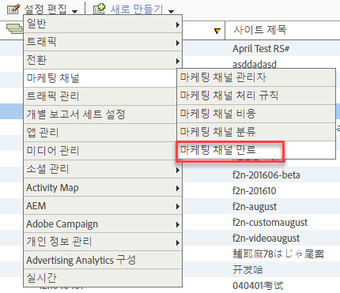

# 방문자 유도 만료

마케팅 채널에서 방문자 참여 만료를 지정하는 방법을 알아봅니다.

## 방문자 유도 만료 {#topic_32ADFDB12D3A4F35843A4545AC97C49F}

마케팅 채널에서 방문자 참여 만료를 지정하는 방법을 알아봅니다.

방문자 유도는 사이트에서 방문자가 이전에 수행한 활동이 첫 번째 접촉 채널에 속하는 것으로 허용하려는 시간 길이입니다.

예를 들어 방문자가 유료 검색 캠페인을 통해 자주 클릭하고 제품을 장바구니에 추가하지만 전환 이벤트 전에 세션을 종료하는 경우가 있습니다. 방문자가 나중에 돌아와 구매를 할 경우, 이전 및 현재 활동이 하나의 유도로 카운트될지 여부를 지정할 수 있습니다. 기본 만료 설정값은 30일입니다.

| 필드 | 정의 |
|--- |--- |
| 활동하지 않은 일 수 | 방문자의 첫 번째 접촉 유도가 만료되기 전까지 경과해야 하는 일 수. 기본값은 30입니다. |
| 절대 안 함 | 방문자의 유도 기간이 만료되지 않습니다. |
| 채널 재설정 | 모든 방문자 참여 기간이 만료됩니다.  모든 마케팅 채널 데이터를 재설정해야 할 경우 모든 방문자 참여 기간을 만료할 수 있습니다. 처리 규칙이 이전에 잘못 구성되어 있는 경우 데이터를 재설정해야 할 수도 있습니다. 첫 번째 및 마지막 접촉 채널 값은 모두 즉시 만료되며 방문자가 돌아오면 재설정됩니다. |

## 방문자 참여 만료 지정 {#task_A8B8B5A07C5A4882BB895252A018FDED}

방문자 참여 만료 지정

1. Click **[!UICONTROL Analytics]** &gt; **[!UICONTROL Admin]** &gt; **[!UICONTROL Report Suites]**.
1. In the [!UICONTROL Report Suite Manager], click **[!UICONTROL Edit Settings]** &gt; **[!UICONTROL Marketing Channels]** &gt; **[!UICONTROL Marketing Channel Expiration]**.

   

1. 방문자 참여 만료 필드를 구성합니다.
1. **[!UICONTROL 저장을 클릭합니다.]**
