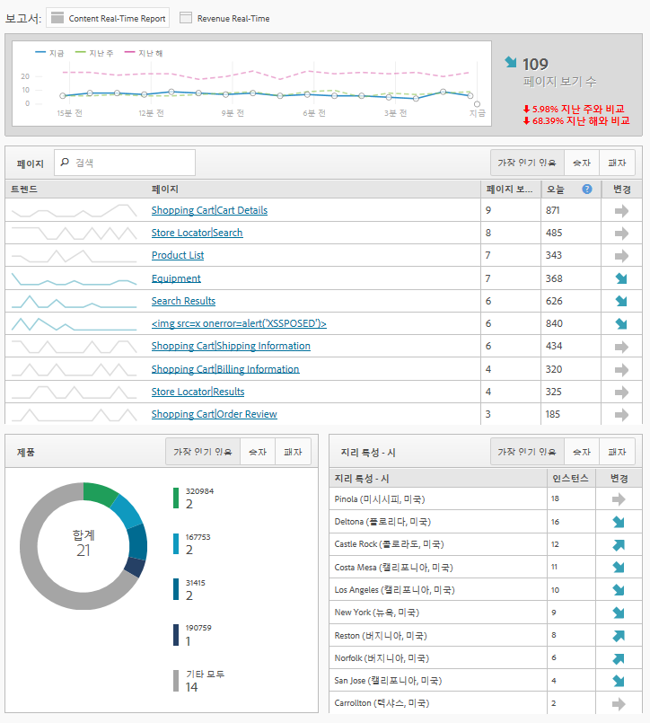

# 실시간 보고 개요

실시간 보고에서는 웹 페이지 트래픽을 표시하고 페이지 보기 횟수의 등급을 실시간으로 지정합니다. 비즈니스 상의 결정에 기준으로 사용할 유용한 데이터를 제공합니다.

>[!NOTE]
>
>실시간 보고서에는 추가 구현 또는 태깅이 필요하지 않습니다. 기존 Adobe Analytics 구현을 활용합니다. 실시간 보고서를 구성하려면 [실시간 보고서 구성](../../components/c-real-time-reporting/t-realtime-admin.md#task_1CD03E9B6BDB48B08E9E612183557F40).

**[!UICONTROL 사이트 지표]** &gt; **[!UICONTROL 실시간]**

실시간 보고서는 사이트 트렌드는 무엇이며 그러한 트렌드의 이유는 무엇인가와 같은 질문들에 대해 대답해줍니다. 실시간 보고서를 사용하면 마케터로서 신속히 대응하고 마케팅 컨텐츠와 캠페인의 성능을 관리할 수 있습니다. 보고서의 실시간 데이터는 2분 미만으로 잠재해 있다가 분 단위로 자동 업데이트됩니다.

대시보드는 동적 뉴스 및 소매 웹 사이트의 트래픽 및 페이지 보기 트렌드를 시각적으로 보고하기 위해 Adobe Analytics의 빈도가 높은 지표 및 사이트 분석을 포함합니다. 실시간은 모음이 발생하자 마자 분 단위로 데이터의 트렌드를 파악합니다. 컨텐츠의 실시간 상관 관계와 추적 및 일부 전환을 사용하여 데이터를 수집하고 자동 업데이트 UI에 스트리밍합니다.

가장 일반적인 사용 시나리오 중 두 가지는 스토리를 사용자 활동 변경 사항으로 승격/강등하려는 게시자와 새로운 제품 라인의 시작을 추적하려는 마케터입니다.

관리자라면,

* 기존 측정기준이나 분류와 지표를 사용하여 보고서 세트당 최대 3개의 실시간 보고서를 만들 수 있습니다. 보조 측정기준을 사용하여 기본 측정기준과의 상관 관계를 지정하거나 분류할 수 있습니다.
* 1개의 사이트 전체 지표 이외에 보고서당 3개의 측정기준(또는 분류)(기본 하나와 보조 두 개)을 추가할 수 있습니다.
* 모든 사용자 지정 이벤트, 장바구니 이벤트 또는 인스턴스를 사용할 수 있습니다.
* 최대 2시간의 실시간 내역 데이터를 보고, 다음 설정을 수정할 수 있습니다.

   * 지난 15분: 1분 세부기간
   * 지난 30분: 1분 세부기간
   * 지난 1시간: 2분 세부기간
   * 지난 2시간: 4분 세부기간

* 예를 들면 지난 주의 값을 작년 값(및 오늘 합계)과 비교합니다.

지속성 개념이 없으므로 eVar(전환 지표)는 지원되지 않는다는 것을 잊지 마십시오. 전환 지표를 선택할 수 있을 때 전환 지표는 측정기준과 동일한 페이지에서 설정되어 있을 경우에만 작동합니다. 자세한 내용은 [실시간 보고서 설정](../../components/c-real-time-reporting/t-realtime-admin.md#task_1CD03E9B6BDB48B08E9E612183557F40).

실시간 보고서를 설정하고 보는 것은 관리자와 "모든 보고서 액세스" 및 "고급 보고" 권한 그룹의 사용자에게로 제한됩니다. 하지만, 실시간 보고서는 권한을 준수합니다. 예를 들어 사용자가 매출액을 볼 수 있는 권한을 가지고 있지 않은 경우 매출 데이터가 포함된 실시간 보고서를 볼 수 없습니다.

## A4T 구성 결과로 데이터 지연 {#section_806CE36354FC4C539A0DED9266A5C704}

After the A4T integration is enabled in Adobe [!DNL Target], you will experience an additional 5-10 minutes of latency in Adobe Analytics. This latency increase allows data from Analytics and [!DNL Target] to be stored on the same hit, allowing you to break down tests by page and site section.

추가적인 지연 시간은 라이브 스트림 및 실시간 보고를 비롯하여 모든 Adobe Analytics 서비스 및 도구에서 반영되며 다음과 같은 시나리오에서 적용됩니다.

* 라이브 스트림, 실시간 보고서 및 API 요청, 트래픽 변수의 현재 데이터의 경우 보충 데이터 ID가 있는 히트 수만 지연됩니다.
* 전환 지표의 현재 데이터, 완료된 데이터, 데이터 피드의 경우 모든 히트 수가 추가적으로 5-7분 지연됩니다.

ID 서비스를 구현한 후 이 통합을 완전히 구현하지 않은 경우에도 지연 증가가 시작됩니다.
