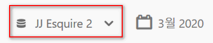
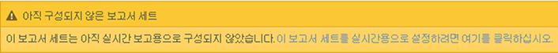
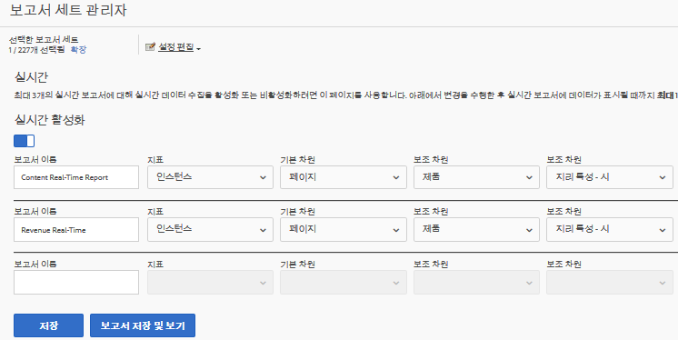
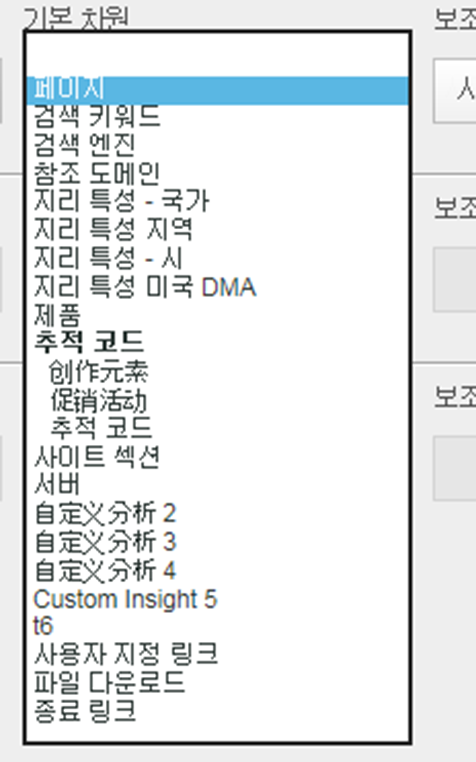
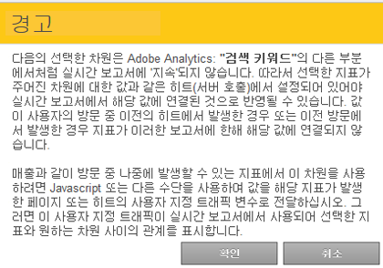

# 실시간 보고서 구성

실시간 보고서를 설정하는 관리 단계입니다.

Setting up real-time reports within [!UICONTROL Reports &amp; Analytics] consists of selecting the report suite and configuring up to 3 reports for it.

1. 실시간 보고서를 활성화할 보고서 세트를 선택합니다.

   **[!UICONTROL Analytics]** &gt; **[!UICONTROL 보고서]** &gt; 모든 보고서 **[!UICONTROL 보기 &gt; 사이트 지표]** &gt; **[!UICONTROL 실시간으로 이동하고]** 맨 위의 드롭다운에서 보고서 세트를 선택합니다.

   

   실시간 보고에 대해 설정되지 않은 보고서 세트에 대한 실시간 보고서를 보려고 하면 보고서 세트를 설정할 수 있다는 메시지가 표시됩니다.

   

1. **[!UICONTROL 구성]** (톱니바퀴 아이콘) 를 클릭하여 [!UICONTROL 보고서 세트 관리자를 실행합니다].

   **[!UICONTROL (Analytics]** &gt; **[!UICONTROL 관리 &gt; 보고서 세트]** &gt; 설정 **[!UICONTROL 편집]** &gt; **[!UICONTROL 실시간에서도 사용할 수]**&#x200B;있습니다.)

1. **[!UICONTROL 실시간 활성화]** 설정을 켭니다.
1. 최대 3개의 보고서(보고서당 지표 한 개와 측정기준 또는 분류 세 개가 있음)에 대한 실시간 데이터 수집을 설정합니다.

   

   For information on supported real-time metrics and dimensions, see [Supported Metrics and Dimensions](../../components/c-real-time-reporting/realtime-metrics.md#concept_B86D8DF89AD448839332AD84B1DF2AE7).

   분류를 생성한 경우, 분류가 정의된 측정기준 아래에 분류가 들여 써진 채로 표시됩니다.

   

   >[!NOTE]
   >
   >단일 실시간 보고서의 경우, 현재 각 차원에 대해 다른 분류를 선택하더라도 중복 차원 활성화를 지원하지 않습니다.

   For more information about classifications, see [About Classifications](../../components/c-classifications2/c-classifications.md#concept_4CEC7FF1A9E24204A7DA6B9AC70709DE).

   >[!NOTE]
   >
   >" 검색 키워드 "또는" 제품 "과 같은 일부 차원은 Adobe Analytics의 다른 곳에서 실시하듯이 실시간으로 지속되지 않습니다. 지속되지 않는 지표를 선택하면 다음 경고가 표시됩니다.

   

1. **[!UICONTROL 저장]** 또는 보고서 **[!UICONTROL 저장 및 보기를 클릭합니다]**.

   이 초기 보고서 설정 후 데이터 스트리밍이 시작되는 데에는 최대 20까지 소요될 수 있습니다. 그때부터는 데이터를 즉시 사용할 수 있습니다. 실시간 보고서 보기에 대한 자세한 내용은 [실시간 보고서 실행](https://marketing.adobe.com/resources/help/en_US/sc/user/reports_realtime.html)을 참조하십시오.

1. 기본적으로 실시간 보고서에 대한 액세스 권한은 모든 사용자에게 있습니다.
