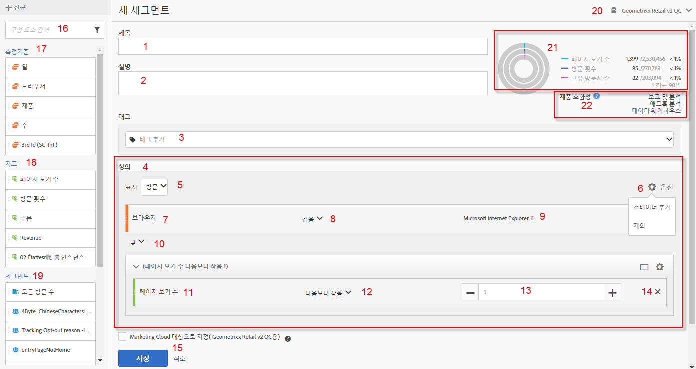
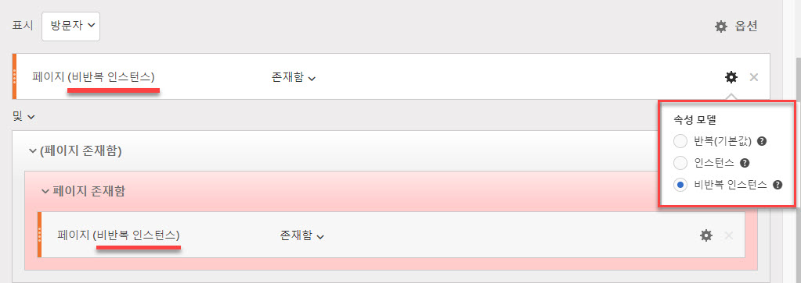
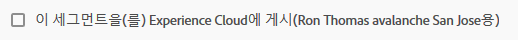
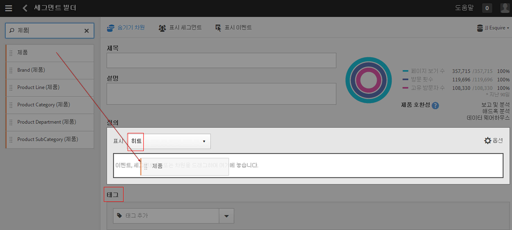
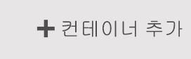
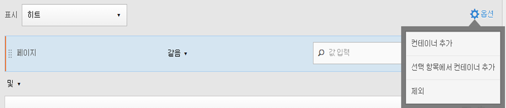
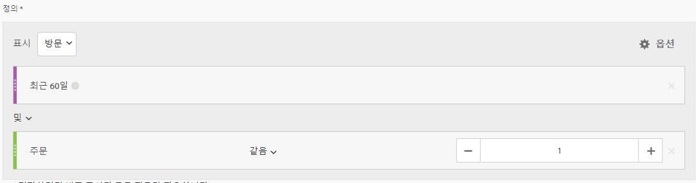
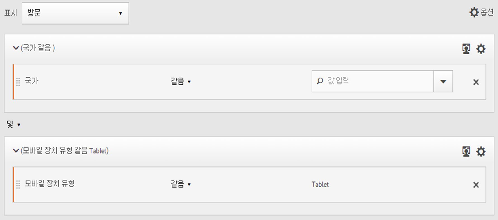
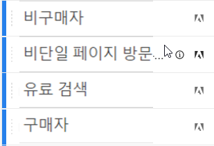
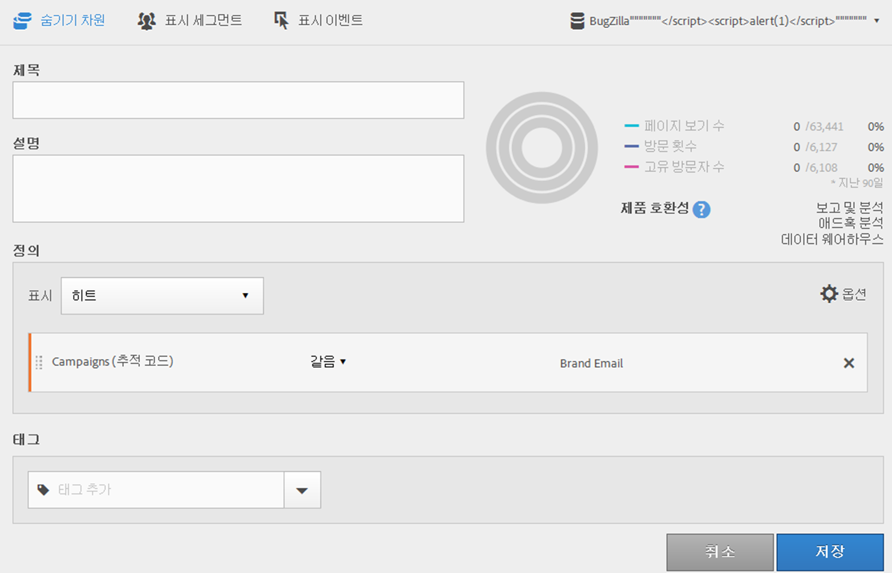

# 세그먼트 빌더

세그먼트 빌더는 컨테이너 계층 논리, 규칙 및 연산자를 기준으로 지표 차원, 세그먼트 및 이벤트를 세그먼트 방문자로 드래그하여 놓을 수 있는 캔버스를 제공합니다. 이러한 통합 개발 도구를 사용하여 방문과 페이지 히트에 걸쳐 방문자 특성 및 작업을 식별하는 간단하거나 복잡한 세그먼트를 작성하고 저장할 수 있습니다.

[!UICONTROL 세그먼트 빌더]는 컨테이너 계층 논리, 규칙 및 연산자를 기준으로 지표 차원, 세그먼트 및 이벤트를 세그먼트 방문자로 드래그하여 놓을 수 있는 캔버스를 제공합니다. 이러한 통합 개발 도구를 사용하여 방문과 페이지 히트에 걸쳐 방문자 특성 및 작업을 식별하는 간단하거나 복잡한 세그먼트를 작성하고 저장할 수 있습니다.

>[!IMPORTANT]
>
>2019 년 6 월 릴리스에서 차원 기여도 모델을 도입했습니다. 아래의 웹 UI 기능 아래에서 # 6를 참조하십시오.

세그먼트 빌더에 액세스하는 방법에는 여러 가지가 있습니다.

* **Analytics 위쪽 탐색:** **[!UICONTROL Analytics]** &gt; **[!UICONTROL 구성 요소]** &gt; **[!UICONTROL 세그먼트를 클릭합니다]**.
* **[!UICONTROL 분석 작업 공간]:** **[!UICONTROL Analytics]** &gt; **[!UICONTROL 작업 영역을]**&#x200B;클릭하고 프로젝트를 연 다음 **[!UICONTROL + 새로 만들기]** &gt; 세그먼트 **[!UICONTROL 만들기를]**&#x200B;클릭합니다.
* **[!UICONTROL 보고 및 분석]:** **[!UICONTROL Analytics]** &gt; **[!UICONTROL 보고서를]**&#x200B;클릭하고, 기존 보고서를 열고, 왼쪽 탐색에서 세그먼트 아이콘을  클릭한 다음 **[!UICONTROL 추가를 클릭합니다]**.
* **[!UICONTROL 애드혹 분석]:**[애드혹 분석에서 세그먼트를 만듭니다](../../../components/c-segmentation/c-segmentation-workflow/seg-build.md#section_E440630183D64999BA2369D1B8048AA6).
* **[!UICONTROL 리포트 빌더:]**&#x200B;리포트 빌더에서 세그먼트를 추가하거나 편집합니다[.](https://marketing.adobe.com/resources/help/en_US/arb/segmentation.html)

## Segment Builder user interface {#concept_643F2DF74C544796B58F4656ABC5F726}

[!UICONTROL 세그먼트 빌더]를 사용하여 방문과 페이지 히트에 걸쳐 방문자 특성 및 작업을 식별하는 간단하거나 복잡한 세그먼트를 작성할 수 있습니다. 여기서는 계층 구조 논리, 규칙 및 연산자에 따라 방문자를 세그먼트화하기 위해 지표 차원, 이벤트 또는 기타 세그먼트를 드래그하여 놓을 수 있는 캔버스를 제공합니다.

## 웹 UI 기능 {#section_F61C4268A5974C788629399ADE1E6E7C}

[!UICONTROL 세그먼트 빌더]를 사용하여 웹 UI(또는 [Ad Hoc Analysis의 Java UI](../../../components/c-segmentation/c-segmentation-workflow/seg-workflow.md#section_E440630183D64999BA2369D1B8048AA6))에서 세그먼트를 작성 및 편집할 수 있습니다. 규칙 정의 및 컨테이너를 추가하여 세그먼트를 세분화하고 스택하고 중첩하여 개선할 수 있습니다. 또한 현재 세그먼트 정의에서 파생된 페이지 보기, 방문 및 고유한 방문자 결과가 유효한지 검증할 수도 있습니다. 또 나중에 사용할 수 있도록 세그먼트를 저장할 수 있습니다.

세그먼트 빌더 액세스 방법

* 기존 보고서를 표시하고 왼쪽 탐색에서 세그먼트 아이콘  표시되는 세그먼트 레일에서 **[!UICONTROL 추가를 클릭합니다]**.

* From within the Segment Manager, clicking **[!UICONTROL + Add]**.
* 세그먼트 관리자에서 기존 세그먼트 제목을 클릭하여 세그먼트 빌더에서 세그먼트 편집

1. **[!UICONTROL title:]** 세그먼트 이름을 지정하거나 이름을 변경할 수 있습니다.
1. **[!UICONTROL 설명:]** 세그먼트에 대한 설명을 제공합니다. 세그먼트를 공유하려면 설명을 제공해야 합니다.
1. **[!UICONTROL 태그:]**[태그를 기존](../../../components/c-segmentation/c-segmentation-workflow/seg-workflow.md#concept_CD892CEB326C4986A1B67487052DBA50) 태그 목록에서 선택하거나 새 태그를 만들어 만듭니다.
1. **[!UICONTROL 정의:]** 여기에서 세그먼트를 작성 및 구성하고, 규칙을 추가하고, 컨테이너를 중첩하고 순서를 지정할 수 있습니다. 컨테이너를 선택하고 차원, 세그먼트 또는 지표를 드래그하여 정의에 드롭하는 식으로 새 세그먼트 설명을 입력할 수 있습니다.
1. **[!UICONTROL 표시:]** (상단 컨테이너 선택기) Lets you select the top-level [container](../../../components/c-segmentation/seg-overview.md#concept_A38E7000056547399E346559D85E2551) ( [!UICONTROL Visitor], [!UICONTROL Visit], [!UICONTROL Hit]). 기본 최상위 수준 컨테이너는 히트 컨테이너입니다.
1. **[!UICONTROL 옵션:]** (톱니바퀴) 아이콘

   * **[!UICONTROL + 컨테이너 추가:]** 세그먼트 정의에 새 컨테이너 (최상위 컨테이너 아래) 를 추가할 수 있습니다.
   * **[!UICONTROL + 선택에서 컨테이너 추가:]** 정의 필드에서 선택한 (다중) 요소로부터 새 컨테이너를 만들 수 있습니다.
   * **[!UICONTROL 제외:]** 하나 이상의 차원, 세그먼트 또는 지표를 제외하여 세그먼트를 정의할 수 있습니다.
   **[!UICONTROL 기여도 모델:]** for dimension segmentation. 차원 모델은 흐름 시각화를 지원하는 세그먼트에서와 같이 순차적 세그먼테이션에서 특히 유용합니다.
   * **[!UICONTROL 반복]** (기본값): 차원에 대한 인스턴스와 지속적인 값을 포함합니다.
   * **[!UICONTROL instance]**: 차원에 대한 인스턴스를 포함합니다.
   * **[!UICONTROL 반복되지 않는 인스턴스]**: 차원에 대한 고유 인스턴스 (반복되지 않음) 를 포함합니다.
   

1. **[!UICONTROL 차원:]** 차원을 차원 목록 (주황색 세로 막대) 에서 드래그하여 놓습니다.
1. **[!UICONTROL 비교:]** 선택한 연산자를 사용하여 값을 비교하고 제한할 수 있습니다.
1. **[!UICONTROL 값:]** 차원이나 세그먼트 또는 지표에 대해 입력하거나 선택한 값입니다.
1. **[!UICONTROL And/Or/Then]**: 컨테이너 또는 규칙 사이에 [!UICONTROL AND/OR/THEN] 연산자를 지정합니다. The THEN operator lets you [define sequential segments](../../../components/c-segmentation/c-segmentation-workflow/seg-sequential-build.md#concept_83AEC78CD25F442EBEE364856A889560).
1. **[!UICONTROL 지표]**: (녹색 사이드바) 지표 목록에서 드래그하여 놓은 지표.
1. **[!UICONTROL 비교]** 연산자: 선택한 연산자를 사용하여 값을 비교하고 제한할 수 있습니다.
1. **[!UICONTROL 값]**: 차원이나 세그먼트 또는 지표에 대해 입력하거나 선택한 값입니다.
1. **[!UICONTROL X]**: (삭제) 세그먼트 정의의 이 부분을 삭제할 수 있습니다.
1. **[!UICONTROL 저장]** 또는 **[!UICONTROL 취소]**: 세그먼트를 저장하거나 취소합니다. **[!UICONTROL 저장을]**&#x200B;클릭하면 세그먼트를 관리할 수 있는 세그먼트 관리자로 이동됩니다.
1. **[!UICONTROL 검색:]** 차원, 세그먼트 또는 지표 목록을 검색합니다.
1. **[!UICONTROL 차원:]** (목록) 확장할 헤더를 클릭합니다.
1. **[!UICONTROL 지표:]** 확장할 헤더를 클릭합니다.
1. **[!UICONTROL 세그먼트:]** 확장할 헤더를 클릭합니다.
1. **[!UICONTROL 보고서 세트 선택기:]** 이 세그먼트가 저장될 보고서 세트를 선택할 수 있습니다. 모든 보고서 세트의 세그먼트를 계속 활용할 수 있습니다.
1. **[!UICONTROL 세그먼트 미리 보기:]** 주요 지표를 미리 보고 유효한 세그먼트가 있는지와 세그먼트가 얼마나 광범위한지 확인할 수 있습니다. 이 세그먼트를 적용할 경우 표시될 것으로 예상되는 데이터 분류를 표시합니다. 3개의 동심원 및 목록을 표시하여 데이터 세트에 대해 실행된 세그먼트와 일치하는 [!UICONTROL 히트], [!UICONTROL 방문] 및 [!UICONTROL 방문자] 수 및 비율을 표시합니다. 이 차트는 세그먼트 정의를 만들거나 변경한 직후에 업데이트됩니다.
1. **[!UICONTROL 제품 호환성:]** 작성한 세그먼트가 호환되는 Adobe Analytics 제품 (분석 작업 공간, [!UICONTROL 보고 및 분석], 애드혹 분석, 데이터 웨어하우스) 목록을 제공합니다. 대부분의 세그먼트는 모든 제품과 호환됩니다. 하지만 모든 연산자 및 차원이 모든 Analytics 제품(특히 [Data Warehouse](../../../components/c-segmentation/seg-reference/seg-compatibility.md#concept_7A2CC00352274A75ACD4949CA3C144D4). 이 차트는 세그먼트 정의를 변경한 직후에 업데이트됩니다.

   Segments with embedded date ranges continue to operate differently in Analysis Workspace versus [!UICONTROL Reports &amp; Analytics]: In Workspace, a segment with an embedded date range overrides the panel date range. By contrast, [!UICONTROL Reports &amp; Analytics] gives you the intersection of the report date range and the segment's embedded date range.

**[!UICONTROL Experience Cloud에 게시 (for`<report suite name>`)]**: (화면에 표시되지 않음) 이 옵션은 이 세그먼트를 저장할 보고서 세트가 Experience Cloud에 대해 [활성화된 경우에만 나타납니다](../../../components/c-segmentation/c-segmentation-workflow/seg-workflow.md#concept_1E9FC92437D748C392546542B6511D01). By publishing a segment to the Experience Cloud, you can use the segment for marketing activity in the [!UICONTROL Audience Library], [!DNL Target], and [!DNL Audience Manager]. 세그먼트 제목 및 설명이 필요합니다.

>[!NOTE]
>
>Analytics에서 게시된 세그먼트를 편집하거나 삭제할 수 있습니다. 세그먼트가 사용 중인 경우 세그먼트를 편집할 때 경고 메시지가 표시됩니다. 게시된 세그먼트가 Adobe [!DNL Target]에서 사용 중이면 삭제할 수 없습니다.

>[!IMPORTANT]
>
>추가 처리 지연을 방지하려면 Analytics에서 20로 공유한 대상 수를 제한해야 합니다. Analytics에서 Experience Cloud로 공유하는 대상은 2천만 명의 고유 구성원을 초과할 수 없습니다. 또한 캐싱으로 인해, Analytics의 삭제된 보고서 세트가 Experience Cloud에 표시되려면 12시간이 필요합니다.

>[!IMPORTANT]
>
>Once a visitor qualifies for the audience shared from Analytics, there is a 24 - 48 hour delay before that information is actionable in [!DNL Target], [!DNL Advertising Cloud], and [!DNL Campaign].

## Build segments {#section_050E3343533E45C3923242398E0E0213}

1. 차원, 세그먼트 또는 지표 이벤트를 왼쪽 창에서 [!UICONTROL 정의] 필드로 드래그하기만 하면 됩니다.

   

   요소를 [!UICONTROL 정의]로 드래그하면 기본 최상위 [!UICONTROL 히트] 컨테이너가 표시됩니다. **[!UICONTROL 표시]드롭다운 메뉴에서 컨테이너 유형을 방문 또는 방문자로 변경할 수 있습니다.**

1. Set the [operator](../../../components/c-segmentation/seg-reference/seg-operators.md) from the drop-down menu.
1. 선택한 항목에 대한 값을 입력하거나 선택합니다.
1. Add additional containers if needed, using **[!UICONTROL And]**, **[!UICONTROL Or]**, or **[!UICONTROL Then]** rules.
1. 컨테이너를 배치하고 규칙을 설정한 후에는 오른쪽 위의 유효성 검증 차트에서 세그먼트 결과를 확인합니다. 유효성 검사기는 작성한 세그먼트와 일치하는 페이지 보기, 방문 및 고유한 방문자의 비율 및 절대값을 표시합니다.
1. **[!UICONTROL 태그]**&#x200B;아래에서 기존 태그를 선택하거나 새 태그를 만들어 컨테이너에 [태깅합니다.](../../../components/c-segmentation/c-segmentation-workflow/seg-tag.md#concept_CD892CEB326C4986A1B67487052DBA50)
1. **[!UICONTROL 저장]을 클릭하여 세그먼트를 저장합니다.**

You are now taken to the [Segment Manager](../../../components/c-segmentation/c-segmentation-workflow/seg-manage.md#concept_7A2E019317864065B7C641DC3315928F), where you can tag, share, and manage your segment in multiple ways.

## Build and nest containers {#section_1C38F15703B44474B0718CEF06639EFD}

You can [build a framework of containers](../../../components/c-segmentation/seg-overview.md#concept_82653C7E29FE49F5A4B5E5E93B0A6399) and then place logic rules and operators between.

1. **[!UICONTROL 옵션 &gt; 컨테이너 추가를 클릭합니다]**.

   

   새로운 [!UICONTROL 히트] 컨테이너가 식별된 [!UICONTROL 히트](페이지 보기) 없이 열립니다.

   

1. 필요에 따라 컨테이너 유형을 변경합니다.
1. 왼쪽 창의 차원, 세그먼트 또는 이벤트를 컨테이너로 드래그합니다.
1. Continue to add new containers from the top-level **[!UICONTROL Options]** &gt; **[!UICONTROL Add container]** button at the top of the definition, or add containers from within a container to nest logic.

   **또는**

   Select one or more rules and then click **[!UICONTROL Options]** &gt; **[!UICONTROL Add container from selection]**. 이렇게 하면 선택 영역이 별도의 컨테이너로 바뀝니다.

## Use date ranges in segments {#concept_252A83D43B6F4A4EBAB55F08AB2A1ACE}

진행 중인 캠페인 또는 이벤트에 대한 질문에 답변하는 순서로 롤링 날짜 범위를 포함하는 세그먼트를 작성할 수 있습니다.

예를 들면 "지난 60일 동안 구매한 모든 사람"을 포함하는 세그먼트를 쉽게 작성할 수 있습니다.

방문 컨테이너를 만들고, 그 안에서 AND 연산자와 함께 [!UICONTROL 최근 60일] 시간 범위와 [!UICONTROL 주문이 1보다 크거나 같음] 지표를 추가할 수 있습니다.

## Stack segments {#task_58140F17FFD64FF1BC30DC7B0A1B0E6D}

세그먼트 스택은 'and' 연산자를 사용하여 각 세그먼트에서 기준을 조합한 다음 조합된 기준을 적용하는 방식으로 진행됩니다.

예를 들어 "휴대폰 사용자" 세그먼트 및 "미국 지리" 세그먼트는 미국의 휴대폰 사용자에 대한 데이터만 반환합니다.

이러한 세그먼트를 사용자들이 필요할 때 사용할 수 있도록 세그먼트 라이브러리에 포함할 수 있는 기본 구성 요소 또는 모듈로 생각하십시오. 이러한 식으로 필요한 세그먼트 수를 획기적으로 줄일 수 있습니다. 예를 들어 다음과 같은 40개의 세그먼트가 있을 수 있습니다.

* 다른 국가의 휴대폰 사용자를 위한 20개 세그먼트(US_mobile, Germany_mobile, France_mobile, Brazil_mobile 등)
* 다른 국가의 태블릿 사용자를 위한 20개 세그먼트(US_tablet, Germany_tablet, France_tablet, Brazil_tablet 등)

세그먼트 스택을 사용하여 세그먼트 수를 22개로 줄이고 필요에 따라 스택할 수 있습니다. 다음 세그먼트를 만들어야 합니다.

* 휴대폰 사용자를 위한 단일 세그먼트
* 태블릿 사용자를 위한 단일 세그먼트
* 다른 지리적 위치에 대한 20개 세그먼트

>[!NOTE]
>
>두 세그먼트를 스택할 때 기본적으로 AND 문으로 연결됩니다. 이것을 OR 문으로 변경할 수 없습니다.

1. 세그먼트 빌더로 이동합니다.
1. 세그먼트의 제목 및 설명을 제공합니다.

   단계 결과 1. **[!UICONTROL 세그먼트 표시]를 클릭하여 왼쪽 탐색 영역에 세그먼트 목록을 표시합니다.**

   단계 결과 1. 스택할 세그먼트를 세그먼트 정의 캔버스에 드래그하여 놓습니다. 다음은 기존 세그먼트 "Visits from Tablets" 및 "US Geo"를 스택하는 세그먼트의 예입니다.

   

1. 세그먼트를 저장합니다.

   단계 결과

## Use segment templates {#concept_5098446CC78D441E93B8E4D1D1EA6558}

템플릿은 미리 구성된 이전 Suite 세그먼트를 나타냅니다.

In the Segment Manager, click **[!UICONTROL Add]**, which takes you to the Segment Builder. Now click the Segments icon  

To bring up the segment rail. 세그먼트 템플릿이 세그먼트 목록 아래쪽에 나타납니다. 이러한 템플릿은 템플릿 이름 왼쪽의 폴더 아이콘으로 구별할 수 있습니다.

이러한 템플릿을 정의 캔버스로 드래그한 후 정의한 다음 사용하거나 수정할 수 있습니다.

<table id="table_98B87D807E9344C9BEBF072C65D87B1B"> 
 <thead> 
  <tr> 
   <th colname="col1" class="entry"> 템플릿 이름 </th> 
   <th colname="col2" class="entry"> 설명 </th> 
  </tr> 
 </thead>
 <tbody> 
  <tr> 
   <td colname="col1"> 장바구니 포기 </td> 
   <td colname="col2">장바구니에 품목을 추가했지만 아직 주문하지 않은 방문자의 데이터를 표시합니다. 세그먼트 정의에서 이 컨테이너는 방문입니다. 순차적 세그먼트에 대한 규칙은 다음과 같습니다. 
 장바구니 추가는 null입니다. 
 
Then 
 
주문은 0입니다. 
 </td> 
  </tr> 
  <tr> 
   <td colname="col1"> 최초 방문 </td> 
   <td colname="col2">최대 [1]회 방문한 방문자에 대한 데이터를 봅니다. 세그먼트 정의에서 이 컨테이너는 방문입니다. 규칙: 
방문 번호가 1입니다. 
 </td> 
  </tr> 
  <tr> 
   <td colname="col1"> 비구매자 </td> 
   <td colname="col2">주문 이벤트에 참가하지 않은 방문자에 대한 데이터를 봅니다. 세그먼트 정의에서 이 컨테이너는 방문자입니다. 이 세그먼트는 제외 로직을 사용합니다. 규칙: 
주문은 null이 아닙니다. 
 </td> 
  </tr> 
  <tr> 
   <td colname="col1"> 단일 페이지 방문 아님(바운스 아님) </td> 
   <td colname="col2">두 번 이상 방문한 방문자의 데이터를 표시합니다. 세그먼트 정의에서 이 컨테이너는 방문자입니다. 이 세그먼트는 제외 로직을 사용합니다. 규칙: 
단일 액세스가 null이 아닙니다. 
 </td> 
  </tr> 
  <tr> 
   <td colname="col1"> 유료 검색 </td> 
   <td colname="col2">유료 검색에서 시작한 방문자의 데이터를 표시합니다. 세그먼트 정의에서 이 컨테이너는 방문입니다. 규칙: 
유료 검색은 1입니다. 
 </td> 
  </tr> 
  <tr> 
   <td colname="col1"> 구매자 </td> 
   <td colname="col2">주문 이벤트에 참가한 방문자에 대한 데이터를 봅니다. 세그먼트 정의에서 이 컨테이너는 방문자입니다. 규칙: 
주문은 null이 아닙니다. 
 </td> 
  </tr> 
  <tr> 
   <td colname="col1"> 재방문 </td> 
   <td colname="col2">1번 이상 방문한 방문자의 데이터를 표시합니다. 세그먼트 정의에서 이 컨테이너는 방문입니다. 규칙: 
방문 번호가 1보다 큼. 
 </td> 
  </tr> 
  <tr> 
   <td colname="col1"> 단일 페이지 방문 횟수 </td> 
   <td colname="col2"> 해당 방문 중에 여러 페이지 보기를 제출할 수 있더라도 단일 페이지 값을 열람한 방문의 데이터를 표시합니다. 종료 링크 이벤트가 있는 단일 페이지 방문이 세그먼트에 포함됩니다. 세그먼트 정의에서 이 컨테이너는 방문입니다. 규칙: 
단일 페이지 방문 횟수는 1입니다. 
 </td> 
  </tr> 
  <tr> 
   <td colname="col1"> 열람되었지만 장바구니에 추가되지 않은 제품 </td> 
   <td colname="col2">제품을 열람했지만 장바구니에 추가하지 않은 방문자의 데이터를 표시합니다. 세그먼트 정의에서 이 컨테이너는 방문입니다. 순차적 세그먼트에 대한 규칙은 다음과 같습니다. 
제품 보기가 null이 아닙니다. 
 
Then 
 
 장바구니 추가는 0입니다. 
 </td> 
  </tr> 
  <tr> 
   <td colname="col1"> 캠페인에서 방문 </td> 
   <td colname="col2">캠페인에서 참조한 방문자에 대한 데이터를 표시합니다. 세그먼트 정의에서 이 컨테이너는 방문입니다. 규칙: 
추적 코드가 null이 아닙니다. 
 </td> 
  </tr> 
  <tr> 
   <td colname="col1"> 모바일 기기로부터 찾아온 방문 </td> 
   <td colname="col2">모바일 장치를 사용한 방문자의 데이터를 표시합니다. 세그먼트 정의에서 이 컨테이너는 방문입니다. 규칙: 
모바일 장치가 널이 아닙니다. 
 </td> 
  </tr> 
  <tr> 
   <td colname="col1"> 자연어 검색으로 찾아온 방문 </td> 
   <td colname="col2">유료 검색에서 시작하지 않은 방문자의 데이터를 표시합니다. 세그먼트 정의에서 이 컨테이너는 방문입니다. 규칙: 
유료 검색은 0입니다. 
 </td> 
  </tr> 
  <tr> 
   <td colname="col1"> 비모바일 장치에서 시작된 방문 </td> 
   <td colname="col2">모바일 장치를 사용하지 않은 방문자의 데이터를 표시합니다. 세그먼트 정의에서 이 컨테이너는 방문입니다. 이 세그먼트는 제외 로직을 사용합니다. 규칙: 
모바일 장치 유형이 휴대 전화와 같음 
 
또는 
 
모바일 장치 유형이 태블릿과 같음. 
 </td> 
  </tr> 
  <tr> 
   <td colname="col1"> 휴대폰에서 시작된 방문 </td> 
   <td colname="col2">휴대폰을 사용한 방문자의 데이터를 표시합니다. 세그먼트 정의에서 이 컨테이너는 방문입니다. 규칙: 
장치 유형이 휴대폰입니다. 
 </td> 
  </tr> 
  <tr> 
   <td colname="col1"> 검색 엔진에서 시작된 방문 </td> 
   <td colname="col2">검색 엔진에서 참조한 방문자에 대한 데이터를 표시합니다. 세그먼트 정의에서 이 컨테이너는 방문입니다. 규칙: 
레퍼러 유형이 검색 엔진입니다. 
 </td> 
  </tr> 
  <tr> 
   <td colname="col1"> 소셜 사이트에서 찾아온 방문 </td> 
   <td colname="col2">소셜 사이트에서 참조한 방문자에 대한 데이터를 봅니다. 세그먼트 정의에서 이 컨테이너는 방문입니다. 규칙: 
레퍼러 유형이 소셜 네트워크. 
 </td> 
  </tr> 
  <tr> 
   <td colname="col1"> 태블릿에서 시작된 방문 </td> 
   <td colname="col2">태블릿을 사용한 방문자의 데이터를 표시합니다. 세그먼트 정의에서 이 컨테이너는 방문입니다. 규칙: 
장치 유형이 태블릿입니다. 
 </td> 
  </tr> 
  <tr> 
   <td colname="col1"> 방문자 ID를 갖는 방문 </td> 
   <td colname="col2">영구적 쿠키가 필요한 사이트의 방문자에 대한 데이터를 표시합니다. 세그먼트 정의에서 이 컨테이너는 방문입니다. 규칙: 
영구적 쿠키는 1입니다. 
 </td> 
  </tr> 
 </tbody> 
</table>

## Example: Campaign visitors segment {#concept_61AC6115097B4EB3AEFE8CE98F38315D}

자주 사용되는 이 세그먼트의 예를 표시합니다.

많은 고객들은 특정 캠페인에 반응한 방문자의 지표를 보기 원합니다. 캠페인 방문자 세그먼트를 만들면 이 데이터를 쉽게 얻을 수 있습니다.

세그먼트 빌더에서 이 세그먼트를 작성할 경우 최상위 방문 컨테이너에서 캠페인 차원(이 경우 캠페인 이름)을 드래그합니다.

(선택 사항) 모든 캠페인 관련 세그먼트를 쉽게 필터링하려는 경우 이 세그먼트에 캠페인 태그를 적용할 수도 있습니다.
