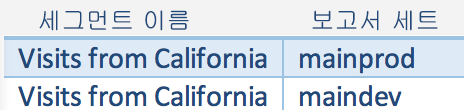

# 세그먼트 삭제

세그먼트를 삭제하기 전에 알아야 하는 몇 가지 고려 사항을 표시합니다.

세그먼트를 삭제할 때

* 이 세그먼트가 적용된 예약된 보고서 및 대시보드는 정상적으로 계속 작동합니다(예: 세그먼트 또는 대시보드는 삭제된 세그먼트를 계속 사용함).
* 예약된 보고서는 같은 이름의 세그먼트를 편집해도 업데이트되지 않습니다. 예를 들어 이름이 같은 2개의 세그먼트가 다른 보고서 세트에 있을 수 있습니다.

   

   기본 제품 보고서 세트의 세그먼트를 참조하는 책갈피가 있습니다. 그런 다음 해당 세그먼트가 중복되므로 삭제합니다. 책갈피는 계속 실행되며 삭제된 세그먼트의 정의를 참조합니다. 남은 세그먼트에 대한 세그먼트 정의를 Catalina Island 및 Tijuana Mexico를 포함하도록 변경해도 해당 책갈피에 적용된 세그먼트는 변경되지 않습니다. 또한 이전 정의를 사용합니다. 이 문제를 해결하려면 새 정의를 참조하도록 책갈피를 업데이트합니다. 책갈피, 대시보드 또는 예약된 보고서가 삭제된 세그먼트를 사용하는지 확실하지 않은 경우 책갈피가 나머지 세그먼트를 사용하는지 여부를 더 명확히 알 수 있도록 나머지 세그먼트의 이름을 변경할 수 있습니다.

## Edit Embedded Deleted Segments in Ad Hoc Analysis {#section_976D601DBD2244E38B0A0222E31D2610}

Ad Hoc Analysis을 사용하면 이제 [계산된 지표 빌더](https://marketing.adobe.com/resources/help/en_US/analytics/calcmetrics/) 내에서 삭제된 포함 세그먼트를 편집하고 해당 세그먼트에서 "다른 이름으로 저장" 작업을 수행할 수 있습니다.

하지만, 삭제된 세그먼트를 참조하는 다른 모든 삭제된 세그먼트는 변경되지 않고 유지됩니다.
