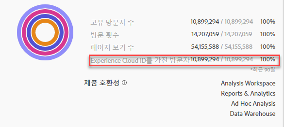

# Experience Cloud에 세그먼트 게시

>[!IMPORTANT]
>
>세그먼트 게시와 관련하여 향상된 지연과 이 페이지에 설명된 사용자 인터페이스는 아직 모든 고객에게 롤아웃되지 않았습니다. 현재 제작 환경은 [여기에](https://docs.adobe.com/content/help/en/core-services/interface/audiences/t-publish-audience-segment.html)설명되어 있습니다.

세그먼트를 Experience Cloud에 게시하면 대상 라이브러리, [!UICONTROL 및][!DNL Target]에서 마케팅 활동에 세그먼트를 사용할 [!DNL Audience Manager]수 [!DNL Advertising Cloud]있습니다. 최근 업데이트는 게시 워크플로우를 크게 최적화했습니다. 이전에는 사용 가능한 세그먼트를 게시하는 데 약 48시간이 걸렸습니다.

이제 처리에는 최대 8시간이 소요될 수 있지만, 다른 트래픽 및 세그먼트 크기에 따라 처리 속도가 더욱 빨라질 수 있습니다. (그러나 현재 세그먼트를 사용할 수 있는 방법은 없으므로 수동으로 확인해야 합니다.) 또한 게시 가능한 최대 세그먼트 수를 75개(20개)로 늘렸습니다. 구성 요소 &gt; 세그먼트에서 게시된 세그먼트를 볼 수 있습니다.

## 전제 조건

* Ensure that the report suite that you are saving this segment to is [enabled for the Experience Cloud](https://docs.adobe.com/content/help/en/core-services/interface/audiences/t-publish-audience-segment.html). 그렇지 않으면 Experience Cloud에 게시할 수 없습니다.
* Experience Cloud 조직에 [매핑된 보고서 세트에서](https://docs.adobe.com/content/help/en/core-services/interface/about-core-services/report-suite-mapping.html)작업하고 있는지 확인합니다.
* 조직에서 Experience Cloud ID를 사용하고 있는지 확인합니다.
* 세그먼트를 게시하려면 먼저 관리자가 관리 [!UICONTROL 콘솔의] 제품 프로필에 세그먼트 게시 [권한을](https://docs.adobe.com/content/help/en/core-services/interface/manage-users-and-products/admin-getting-started.html)할당하고사용자를 제품 프로필에 추가해야 합니다.

## 고려 사항

* **보고서 세트 제한**:보고서 세트당 최대 75개의 세그먼트를 게시할 수 있습니다. 이 제한은 적용됩니다. 이미 75개의 세그먼트를 게시한 경우 75개의 세그먼트 임계값 이하로 확보하기에 충분한 세그먼트를 게시 취소해야 추가 세그먼트를 게시할 수 있습니다.
* **멤버십 제한**:Analytics에서 Target [!DNL Experience Cloud] 에 공유된 대상은 2천만 명의 고유 구성원을 초과할 수 없습니다.
* **데이터 개인 정보**:대상은 방문자의 인증 상태에 따라 필터링되지 않습니다. 방문자가 인증되지 않음 및 인증됨 상태의 사이트를 검색할 수 있는 경우 방문자가 인증되지 않음 상태일 때 발생하는 작업 때문에 여전히 방문자가 대상에 포함될 수 있습니다. Adobe [Experience Cloud 개인 정보](https://www.adobe.com/privacy/experience-cloud.html) 보호를 검토하여 고객 공유의 개인 정보 보호에 대한 전체적인 의미를 파악합니다.
* 세그먼트와 세그먼트 간의 **차이점에 대한 자세한 내용은[!DNL Adobe Analytics]여기를[!DNL Audience Manager]**&#x200B;참조하십시오 .

## 세그먼트 게시 타임라인

| 사용 가능한 제품 | 사용 가능한 시기 | 이용 가능한 위치 |
|---|---|---|
| 메타 데이터(세그먼트 제목 및 정의) | 게시 즉시 | [!DNL Audience Manager], [!UICONTROL Experience Cloud 대상 라이브러리], [!DNL Target] |
| 멤버십을 통한 유용한 세그먼트 | 게시 후 8시간 | 방문자 프로필 뷰어 [!DNL Audience Manager] |
| 특성 및 회원 수 | 24시간 이내 | [!DNL Audience Manager] |

## 세그먼트 빌더에서 [!UICONTROL 세그먼트 게시]

1. Analytics &gt; **[!UICONTROL 작업 영역 &gt; 구성 요소 &gt; 세그먼트]&gt; +로 이동합니다.**
1. 세그먼트 빌더에서 세그먼트를 [!UICONTROL 만듭니다].
1. 세그먼트에 대한 제목과 설명을 제공합니다. 그렇지 않으면 저장할 수 없습니다.
1. Check **[!UICONTROL Publish this segment to the Experience Cloud (for *report suite*)]**.

>[!IMPORTANT]
>
>Adobe Analytics 번호를 Audience Manager 번호와 비교할 때 Analytics의 총 "고유 방문자" 세그먼트 미리 보기 대신 세그먼트 미리 보기를 볼 때 "Experience Cloud ID가 있는 방문자"를 사용해야 합니다.
>
>

| 요소 | 설명 |
|---|---|
| **[!UICONTROL 이 세그먼트를 Experience Cloud에 게시(*<report suite>*)]** | 이 옵션을 활성화하면 세그먼트 제목 및 정의(즉, 광고 플랫폼에서 자주 사용되는 셸 대상자)가 Experience Cloud와 즉시 공유되고, 세그먼트 멤버십은 4시간마다 평가되고 공유됩니다.   예를 들어 해당 대상이 의 활동과 [!DNL Target]연결되면, [!DNL Analytics] 해당 Experience Cloud 및 [!DNL Target] 대상의 자격을 갖춘 방문자를 위한 ID 전송을 시작합니다. 이때 대상 이름 및 해당 데이터가 Experience Cloud 대상 페이지에 표시되기 시작합니다.   |
| **[!UICONTROL 대상 만들기 기간]** | 선택한 기간은 롤링 달력을 기준으로 대상을 만드는 데 사용됩니다. 예를 들어 "지난 30일"(기본값)에는 오늘 날짜로부터 지난 30일 동안(세그먼트가 생성된 원래 날짜에서 NOT) 대상의 자격을 갖춘 방문자가 포함됩니다. |
| **[!UICONTROL 대상 라이브러리에서 만들기]** | 만들고 게시하는 세그먼트는 Experience Cloud 대상 라이브러리에서 지연 없이 사용할 수 있습니다. 이러한 지표는 Analytics 업데이트에 종속되지 않습니다. 이러한 세그먼트는 게시된 75개의 세그먼트 제한에 대해 계산되지 않습니다. |
| **[!UICONTROL 75개 중 x 게시됨]** | Experience Cloud에 게시한 세그먼트 수를 표시합니다. 링크를 클릭하여 게시된 세그먼트 목록, 관련 보고서 세트 및 소유자를 봅니다. |
| **[!UICONTROL 저장]** | 이 세그먼트를 저장합니다. |

## 세그먼트 게시 취소 또는 삭제

Experience Cloud에 게시된 세그먼트를 삭제하려면 먼저 게시를 취소해야 합니다. 세그먼트 게시를 취소하려면 게시할 때 사용한 확인란을 **클릭하여 선택 취소**&#x200B;하면 됩니다.

>[!NOTE]
>
>현재 다음 Adobe 솔루션에서 사용 중인 세그먼트를 게시 취소&#x200B;**할 수 없습니다**. [!DNL Analytics]([!DNL Audience Analytics]에서), [!DNL Campaign], [!DNL Advertising Cloud]([!DNL Core Service] 및 [!DNL Audience Manager] 고객용) 및 기타 모든 외부 파트너([!DNL Audience Manager] 고객용). [!DNL Target]에서 사용 중인 세그먼트의 게시를 취소&#x200B;**할 수 있습니다**.

## 세그먼트 관리자에서 세그먼트 게시 [!UICONTROL 상태 보기]

1. Analytics &gt; [!UICONTROL 구성 요소 &gt; 세그먼트로 이동합니다].
1. 새 게시된 [!UICONTROL 열을] 확인합니다. 예/아니오는 세그먼트가 Experience Cloud에 게시되었는지 여부를 나타냅니다.

## UUID [!DNL Audience Manager] 검색

현재 브라우저와 연결된 AAM UUID를 캡처하는 방법에는 두 가지가 있습니다.

* Adobe Experience Cloud Debugger
* 브라우저의 기본 개발자 도구(예: Chrome 개발자 도구)

다음 스크린샷은 브라우저에서 AAM UUID를 검색하고 Audience Manager 방문자 프로필 뷰어에서 사용하여 트레이트 및 세그먼트 멤버십을 확인하는 방법을 보여줍니다.

**방법 1:Adobe Experience Cloud Debugger 사용**

1. Chrome 웹 [스토어에서 Adobe Experience Cloud](https://docs.adobe.com/content/help/en/analytics/implementation/testing-and-validation/debugger.html) Debugger를 다운로드하여 설치합니다.
1. 페이지를 로드할 때 디버거를 시작합니다.
1. Audience Manager 섹션으로 스크롤하여 현재 브라우저 페이지에서 설정된 AAM UUID를 찾습니다(아래`50814298273775797762943354787774730612` 예).

**방법 2:Chrome 개발자 도구 사용(또는 기타 브라우저 개발자 도구)**

1. 페이지를 로드하기 전에 Chrome 개발자 도구 실행
1. 페이지를 로드하고 애플리케이션 &gt; 쿠키를 선택합니다. AAM UUID는 3rd-partyDemdex 쿠키(아래 예제의[adobe.demdex.net](https://marketing.adobe.com/resources/help/en_US/aam/demdex-calls.html) )에서 설정해야 합니다. 필드 demdex는 브라우저에서 AAM UUID 설정입니다(아래`50814298273775797762943354787774730612` 예).

## Audience Manager [!UICONTROL 방문자 프로필 뷰어 사용]

방문자 프로필 뷰어가 로드되면 기본적으로 브라우저의 AAM [!UICONTROL UUID가] 사용됩니다. 다른 사용자에 대한 트레이트 재할당을 확인하는 경우 UUID 필드에 UUID를 입력하고 새로 고침을 [!UICONTROL 클릭합니다]. 자세한 내용은 [방문자 프로필](https://marketing.adobe.com/resources/help/en_US/aam/t_visitor_profile_viewer.html) 뷰어를 참조하십시오.

## 세그먼트 트레이트를 [!DNL Audience Manager]

AAM에서, Analytics가 Experience Cloud와 세그먼트를 공유하므로 ECID가 지정된 세그먼트에 대한 방문자 목록은 스트리밍 방식으로 평가됩니다.

1. 에서 [!DNL Audience Manager]대상 데이터 [!UICONTROL &gt; 트레이트 &gt; 분석 트레이트로 이동합니다]. Experience Cloud 조직에 매핑되는 각 Analytics 보고서 세트에 대한 폴더가 표시됩니다. 이러한 폴더(트레이트, 세그먼트 및 Data Sources의 경우)는 프로필 및 대상/사람 핵심 서비스가 시작되거나 제공되면 생성됩니다.
1. 공유할 세그먼트를 이전에 만든 보고서 세트의 폴더를 [!DNL Audience Manager]선택합니다. 만든 세그먼트/대상이 표시됩니다. 세그먼트를 공유할 때 다음 두 가지 사항이 [!DNL Audience Manager]발생합니다.
* 우선 데이터가 없는 트레이트가 생성됩니다. 약. 세그먼트가 게시된 후 8시간 [!DNL Analytics][!DNL Audience Manager] 후 ECID 목록은 온보드 및 다른 Experience Cloud 솔루션과 공유됩니다.

* 하나의 트레이트 세그먼트가 만들어집니다. 세그먼트를 게시한 보고서 세트와 연관된 데이터 소스를 사용합니다.

## 세그먼트 보기 [!DNL Adobe Target]

The [!UICONTROL Publish this segment to the Experience Cloud] checkbox during the segment creation process in Adobe Analytics allows the segment to be available within the Adobe Target's custom audience library. Analytics나 Audience Manager에서 만들어진 세그먼트는 Target의 활동에 사용할 수 있습니다. 예를 들어 Analytics에서 만들어진 대상 세그먼트 및 Analytics 전환 지표에 따라 캠페인 활동을 만들 수 있습니다.
], 대상을 [!UICONTROL 클릭합니다].
1. On the [!UICONTROL Audiences] page, locate the audience sourced from the [!DNL Experience Cloud]. These audiences are available for use in [!DNL Target] activities.

