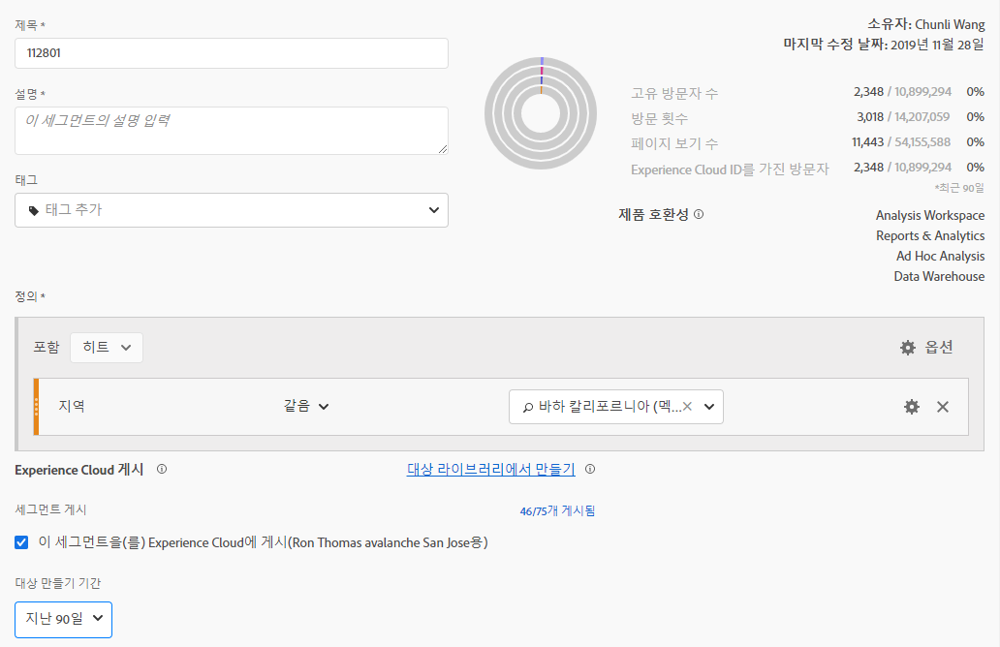
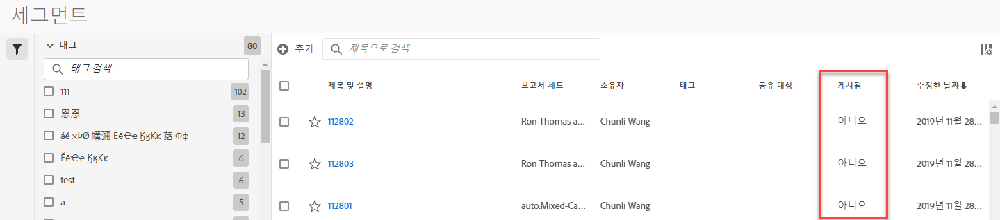
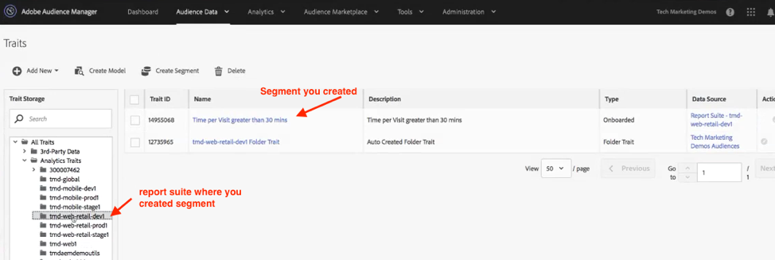

# Experience Cloud에 세그먼트 게시

>[!IMPORTANT]
>
>이 페이지에 설명된 세그먼트 게시에 대한 지연 시간 및 사용자 인터페이스는 모든 고객에게 아직 롤아웃되지 않습니다. The current production environment is described [here](https://docs.adobe.com/content/help/en/core-services/interface/audiences/t-publish-audience-segment.html).

Publishing a segment to the Experience Cloud lets you use the segment for marketing activity in the [!UICONTROL Audience Library], [!DNL Target], [!DNL Audience Manager], and [!DNL Advertising Cloud]. 최근 업데이트는 게시 워크플로우를 크게 최적화했습니다. 이전에는 사용 가능한 세그먼트를 게시하는 데 약 48 시간이 걸렸습니다.

처리 시간은 최대 8 시간까지 소요될 수 있지만 다른 트래픽과 세그먼트 크기에 따라 처리 속도가 더 빨라질 수 있습니다. 그러나 현재 세그먼트가 사용 가능한지 여부를 알려주는 방법이 없으므로 수동으로 확인해야 합니다. 게시 가능한 최대 세그먼트 수 또한 75 개에서 75 개로 늘었습니다 (20 개). 구성 요소 &gt; 세그먼트에서 게시된 세그먼트를 볼 수 있습니다.

## 전제 조건

* Ensure that the report suite that you are saving this segment to is [enabled for the Experience Cloud](https://docs.adobe.com/content/help/en/core-services/interface/audiences/t-publish-audience-segment.html). 그렇지 않으면 Experience Cloud에 게시할 수 없습니다.
* Make sure you are working in a report suite that is [mapped to your Experience Cloud organization](https://docs.adobe.com/content/help/en/core-services/interface/about-core-services/report-suite-mapping.html).
* Before you can publish segments, your Admin needs to assign the [!UICONTROL Segment Publishing] permission to a product profile in the [Admin Console](https://docs.adobe.com/content/help/en/core-services/interface/manage-users-and-products/admin-getting-started.html), and add you to the product profile.

## 고려 사항

* **보고서 세트 제한**: 보고서 세트당 최대 75 개의 세그먼트를 게시할 수 있습니다. 이 제한이 적용됩니다. 이미 75 개의 세그먼트가 게시된 경우 75 개 세그먼트 임계값 아래로 내려갈 충분한 세그먼트를 제거해야 추가 세그먼트를 게시할 수 있습니다.
* **멤버십 제한**&#x200B;사항: Analytics [!DNL Experience Cloud] 에서 공유한 대상은 2,000만 명의 고유 구성원을 초과할 수 없습니다.
* **데이터 개인 정보: 대상은 방문자의 인증 상태에 따라 필터링되지 않습니다.** 방문자가 인증되지 않음 및 인증됨 상태의 사이트를 검색할 수 있는 경우 방문자가 인증되지 않음 상태일 때 발생하는 작업 때문에 여전히 방문자가 대상에 포함될 수 있습니다. Review [Adobe Experience Cloud privacy](https://www.adobe.com/privacy/experience-cloud.html) to understand the full privacy implications of audience sharing.
* For a discussion about the differences between segments in [!DNL Adobe Analytics] and [!DNL Audience Manager], go [here](https://docs.adobe.com/content/help/en/analytics/integration/audience-analytics/audience-analytics-workflow/aam-analytics-segments.html).

## 세그먼트 게시 타임라인

| 이용 가능한 제품 | 사용 가능한 시기 | 사용 가능한 위치 |
|---|---|---|
| 메타 데이터 (세그먼트 제목 및 정의) | 게시 직후 | [!DNL Audience Manager], [!UICONTROL Experience Cloud 대상 라이브러리], [!DNL Target] |
| 멤버십이 포함된 사용 가능한 세그먼트 | 게시 후 ~ 8 시간 | Visitor Profile Viewer in [!DNL Audience Manager] |
| 특성 및 멤버십 모집단 | 24 시간 이내 | [!DNL Audience Manager] |

## Publish segments in [!UICONTROL Segment Builder]

1. [!UICONTROL Analytics &gt; 작업 영역 &gt; 구성 요소 &gt; 세그먼트] &gt; +로 이동합니다.
1. [!UICONTROL 세그먼트 빌더에서 세그먼트를 만듭니다].
1. 세그먼트에 대한 제목과 설명을 제공합니다. 다른 이름으로 저장할 수 없습니다.
1. Check [!UICONTROL Publish this segment to the Experience Cloud (for *report suite*)].

| 요소 | 설명 |
|---|---|
| 이 세그먼트를 Experience Cloud에 게시(`<report suite>`용) | 이 옵션이 활성화되면 세그먼트 제목 및 정의 (광고 플랫폼에서 자주 사용하는 셸 대상자) 가 Experience Cloud와 즉시 공유되지만 세그먼트 멤버십은 4 시간마다 평가 및 공유됩니다.   예를 들어 해당 대상이 활동에 연결되면, [!DNL Target]방문자를 위한 ID [!DNL Analytics] 를 Adobe Experience Cloud 및 [!DNL Target] 대상의 자격을 갖춘 방문자로 전송하기 시작합니다. 이때 대상 이름 및 해당 데이터가 Experience Cloud 대상 페이지에 표시되기 시작합니다.   |
| 대상 만들기 기간 | 선택하는 기간은 일정 단위로 대상을 생성하는 데 사용됩니다. 예를 들어 «지난 30 일» (기본값) 에는 오늘 날짜로부터 지난 30 일 동안 대상에 대한 자격을 갖춘 방문자가 포함됩니다 (세그먼트가 만들어진 원래 날짜가 아니라). |
| 대상 라이브러리에서 만들기 | 만들고 게시하는 세그먼트는 Experience Cloud 대상 라이브러리의 지연 없이 사용할 수 있습니다. Analytics 업데이트에 종속되지 않습니다. 이러한 세그먼트는 75 개의 게시된 세그먼트 제한을 기준으로 계산되지 않습니다. |
| X 75 게시됨 | Experience Cloud에 게시한 세그먼트 수를 표시합니다. 링크를 클릭하면 게시된 세그먼트 목록과 해당 보고서 세트 및 소유자가 표시됩니다. |
| 저장 | 이 세그먼트를 저장합니다. |

## 세그먼트 게시 취소 또는 삭제

Experience Cloud에 게시된 세그먼트를 삭제하려면 먼저 게시 취소해야 합니다. To unpublish a segment, just **unclick** the checkbox that you used to publish it.

>[!NOTE]
>
>You **cannot** unpublish a segment that is currently in use by any of the following Adobe solutions: [!DNL Analytics] (in [!DNL Audience Analytics]), [!DNL Campaign], [!DNL Advertising Cloud] (for [!DNL Core Service] &amp; [!DNL Audience Manager] customers) and all other external partners (for [!DNL Audience Manager] customers). You **can** unpublish a segment that is in use by [!DNL Target].

## View segment publishing status in the [!UICONTROL Segment Manager]

1. [!UICONTROL Analytics &gt; 구성 요소 &gt; 세그먼트로 이동합니다].
1. [!UICONTROL 새로 게시된] 열을 확인합니다. 예/아니요 세그먼트가 Experience Cloud에 게시되었는지 여부를 나타냅니다.

## [!DNL Audience Manager] UUID 가져오기

현재 브라우저와 연관된 AAM UUID를 캡처하는 방법은 두 가지가 있습니다.

* Adobe Experience Cloud Debugger
* 브라우저의 기본 개발자 도구 (예: Chrome 개발자 도구)

다음 스크린샷은 브라우저에서 AAM UUID를 검색하고 Audience Manager 방문자 프로필 뷰어에서 사용하여 트레이트 및 세그먼트 멤버십을 검증하는 방법을 보여줍니다.

**방법 1: Adobe Experieence CLoud Debugger 사용**

1. Download and install [Adobe Experience Cloud Debugger](https://docs.adobe.com/content/help/en/analytics/implementation/testing-and-validation/debugger.html) in the Chrome Web Store.
1. 페이지를 로드할 때 디버거를 시작합니다.
1. Scroll to the Audience Manager section and find the AAM UUID set on the current browser page
(`50814298273775797762943354787774730612` in the example below)

**방법 2: Chrome 개발자 도구 (또는 기타 브라우저 개발자 도구) 사용**

1. 페이지를 로드하기 전에 Chrome 개발자 도구 실행
1. 페이지를 로드하고 애플리케이션 &gt; 쿠키를 확인합니다. The AAM UUID should be set in the 3rd-party
Demdex cookie ([adobe.demdex.net](https://marketing.adobe.com/resources/help/en_US/aam/demdex-calls.html) in the example below). The field demdex is the AAM UUID set
on the browser (`50814298273775797762943354787774730612` in the example below).

## Use Audience Manager [!UICONTROL Visitor Profile Viewer]

The AAM UUID on the browser will be used by default when [!UICONTROL Visitor Profile Viewer] is loaded. If verifying trait realizations for other users, input a UUID in the UUID field and click [!UICONTROL Refresh]. Refer to [Visitor Profile Viewer](https://marketing.adobe.com/resources/help/en_US/aam/t_visitor_profile_viewer.html) for more information.

## View the segment traits in [!DNL Audience Manager]

AAM에서 지정된 세그먼트에 대한 ECID가 있는 방문자 목록은 Analytics가 Experience Cloud와 세그먼트를 공유하므로 스트리밍 방식으로 평가됩니다.

1. In [!DNL Audience Manager], go to [!UICONTROL Audience Data &gt; Traits &gt; Analytics Traits]. Experience Cloud 조직에 매핑된 각 Analytics 보고서 세트에 대한 폴더가 표시됩니다. 이러한 폴더 (트레이트, 세그먼트 및 데이터 소스) 는 프로필 및 대상/핵심 서비스가 시작 또는 프로비저닝될 때 생성됩니다.
1. Select the folder for the report suite in which you previously created the segment you wanted to share with [!DNL Audience Manager]. 만든 세그먼트/대상이 표시됩니다. When you share a segment, 2 things happen in [!DNL Audience Manager]:
* 트레이트 안에 데이터가 없는 속성이 생성됩니다. 약. 8 hours after the segment gets published in [!DNL Analytics], the list of ECIDs gets onboarded and shared with [!DNL Audience Manager] and other Experience Cloud solutions.

* 한 특성 세그먼트가 생성됩니다. 세그먼트를 게시한 보고서 세트와 연관된 데이터 소스를 사용합니다.

## View the segment in [!DNL Adobe Target]

The [!UICONTROL Publish this segment to the Experience Cloud] checkbox during the segment creation process in Adobe Analytics allows the segment to be available within the Adobe Target's custom audience library. Analytics나 Audience Manager에서 만들어진 세그먼트는 Target의 활동에 사용할 수 있습니다. 예를 들어 Analytics에서 만들어진 대상 세그먼트 및 Analytics 전환 지표에 따라 캠페인 활동을 만들 수 있습니다.
], click [!UICONTROL Audiences].
1. [!UICONTROL 대상] 페이지에서에서 소스 소스를 찾습니다 [!DNL Experience Cloud]. These audiences are available for use in [!DNL Target] activities.
