# 순차적 세그먼트 작성

순차적 세그먼트는 AND 또는 OR 대신 THEN 연산자를 사용하여 작성됩니다. THEN은 하나의 세그먼트 기준이 발생하고 그 뒤에 다른 하나의 세그먼트 기준이 있음을 의미합니다. 기본적으로 순차적 세그먼트는 일치하는 모든 데이터를 식별하고 "모든 사용자 포함" 필터를 표시합니다. 순차적 세그먼트는 추가적으로 "시퀀스 이전에만" 및 "시퀀스 이후에만" 옵션을 사용하여 일치하는 항목의 하위 집합으로 필터링될 수 있습니다.

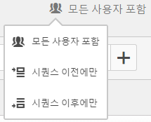

또한 [After와 Within 연산자](../../../components/c-segmentation/c-segmentation-workflow/seg-sequential-build.md#concept_07708877D06742998C6237DD9FD194EA)를 사용하여 순차적 세그먼트를 특정한 길이의 시간, 세부기간, 체크포인트 사이의 카운트로 제한할 수도 있습니다.

## 모든 사용자 포함 {#section_75ADDD5D41F04800A09E592BB2940B35}

"모든 사용자 포함"이 설정된 세그먼트를 만들 때, 세그먼트는 전체로서 주어진 패턴과 일치하는 경로를 식별합니다. 이것은 동일한 방문자가 방문하면 다른 히트(페이지 B)가 뒤따르는 하나의 히트(페이지 A)를 찾는 기본 시퀀스 세그먼트의 예입니다. 세그먼트는 [모든 사용자 포함]으로 설정되어 있습니다.

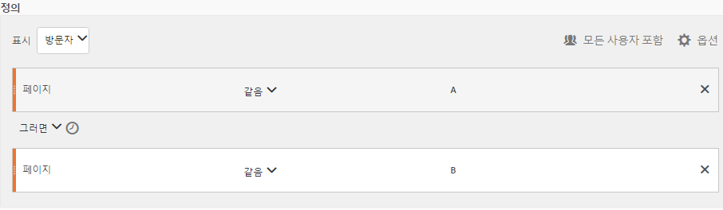

| 결과... | 시퀀스 |
|--- |--- |
| matches | A BA then (a different visit) ba then d then b |
| 일치하지 않음 | B 다음에 A |

## '시퀀스 이전에만' 및 '시퀀스 이후에만' {#section_736E255C8CFF43C2A2CAAA6D312ED574}

**[!UICONTROL 시퀀스 이전에만]** 및 **시퀀스 이후에만[!UICONTROL 옵션은 지정된 시퀀스의 전 또는 후에 세그먼트를 데이터 하위 집합으로 필터링합니다.]**

* **시퀀스 이전에만**: 시퀀스 전의 모든 히트 수 + 시퀀스 자체의 첫 번째 히트를 포함합니다(예 1, 3 참조). 시퀀스가 경로에 여러 번 나타나면 "시퀀스 이전에만"은 시퀀스가 마지막으로 발생했을 때의 첫 번째 히트와 그 전에 오는 모든 히트를 포함합니다(예 2 참조).
* **시퀀스 이후에만**: 시퀀스 후의 모든 히트 수 + 시퀀스 자체의 마지막 히트를 포함합니다(예 1, 3 참조). 시퀀스가 경로에 여러 번 나타나면 "시퀀스 이후에만"은 시퀀스가 처음 발생했을 때의 마지막 히트와 그 다음에 오는 모든 히트를 포함합니다(예 2 참조).

예를 들어, B -&gt; D의 시퀀스를 생각해 보십시오. 세 개의 필터는 다음과 같이 히트를 식별합니다.

**예 1: B -&gt; D가 한 번 나타남**

| 예 | A | B | C | D | E | F |
|---|---|---|---|---|---|---|
| 모든 사용자 포함 | A | B | C | D | E | F |
| 시퀀스 이전에만 | A | B |  |  |  |  |
| 시퀀스 이후에만 |  |  |  | D | E | F |

**예 2: B -&gt; D가 여러 번 나타남**

| 예 | A | B | C | D | B | C | D | E |
|---|---|---|---|---|---|---|---|---|
| 모든 사용자 포함 | A | B | C | D | B | C | D | E |
| 시퀀스 이전에만 | A | B | C | D | B |  |  |  |
| 시퀀스 이후에만 |  |  |  | D | B | C | D | E |

또한 이 개념을 히트 깊이 차원으로 표현해 보겠습니다.

**예제 3: 히트 깊이 3 -&gt; 5**

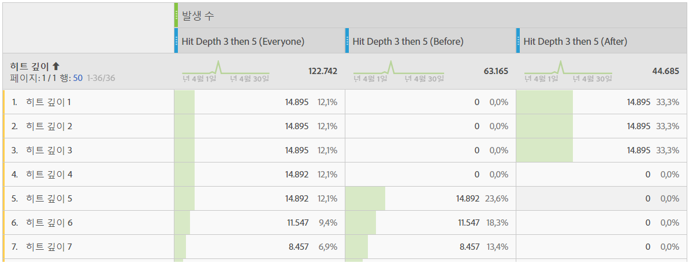

## 차원 제한 {#section_EAFD755F8E674F32BCE9B642F7F909DB}

"within" 절, THEN 문 사이에 "1개 이내의 검색 키워드 인스턴스", "1개 이내의 eVar 47 인스턴스" 등을 추가할 수 있습니다. 이 경우 측정 기준의 한 개 인스턴스 이내로 세그먼트를 제한합니다.

규칙 간 "차원 내" 절을 설정하면 세그먼트가 데이터를 해당 절을 충족하는 시퀀스로 제한할 수 있습니다. 제한이 "1페이지 내"로 설정되어 있을 경우 아래 예를 참조하십시오.

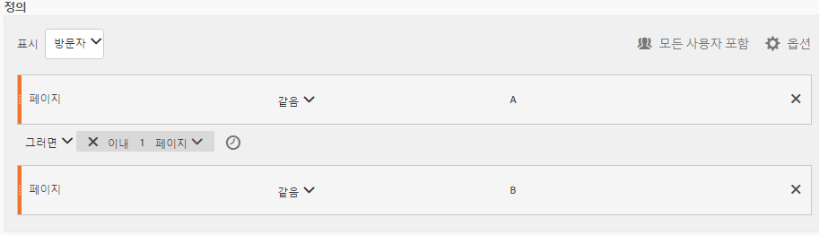

| 결과... | 시퀀스 |
|--- |--- |
| matches | A 다음에 B |
| 일치하지 않음 | A then c then b (b because not within 1 page of a) **참고:** 차원 제한을 풀면 "a then b" 및 "a then c then b" 가 모두 일치합니다. |

## 간단한 페이지 보기 시퀀스

하나의 페이지를 본 다음 다른 페이지를 본 방문자를 식별합니다. 히트 수준 데이터는 이 시퀀스를 이전, 과거 또는 중간 방문 세션이나 시간 또는 그 사이에 일어나는 페이지 보기 수에 관계없이 필터링합니다.

****&#x200B;예: 방문자가 페이지 A를 본 다음 같은 방문이나 다른 방문에서 페이지 B를 보았습니다.

**사용 사례**

다음은 이러한 세그먼트를 사용할 수 있는 방법의 예입니다.

1. 스포츠 사이트 방문자는 같은 방문일 필요는 없지만 축구 랜딩 페이지를 열람한 다음 농구 랜딩 페이지를 순차적으로 열람합니다. 이러한 사실 때문에 축구 세션 중에 농구 컨텐츠를 축구 시청자로 푸시하는 캠페인이 촉진됩니다.
1. 자동차 판매업체는 고객 충성도 페이지를 방문했다가 해당 방문이나 다른 방문 중에 비디오 페이지로 이동한 방문자 간 관계를 파악합니다.

**이 세그먼트 만들기**

최상위 [!UICONTROL 방문자] 컨테이너 내에 2개의 페이지 규칙을 중첩하고 [!UICONTROL THEN] 연산자를 사용하여 페이지 히트의 순서를 지정합니다.

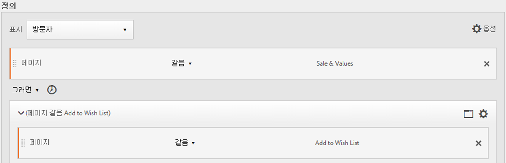

## 방문 간 방문자 시퀀스

캠페인에서 벗어났으나 다른 세션에서 페이지 보기 시퀀스로 복귀한 방문자를 식별합니다.

****&#x200B;예: 방문자가 한 번의 방문으로 페이지 A를 본 다음 다른 방문에서 페이지 B를 보았습니다.

**사용 사례**

다음은 이러한 유형의 세그먼트를 사용할 수 있는 방법의 예입니다.

* 방문자가 뉴스 사이트의 스포츠 페이지를 방문한 다음 다른 세션에서 스포츠 페이지를 재방문했습니다.
* 의류 판매업체는 한 세션에서 랜딩 페이지를 방문한 다음 다른 세션에서 체크아웃 페이지로 직접 이동하는 방문자 간 관계를 확인합니다.

**이 세그먼트 만들기**

이 예제에서는 2개의 **[!UICONTROL 방문]** 컨테이너를 최상위 **[!UICONTROL 방문자]컨테이너에 중첩한 다음[!UICONTROL THEN]연산자를 사용하여 세그먼트 시퀀스를 지정합니다.**

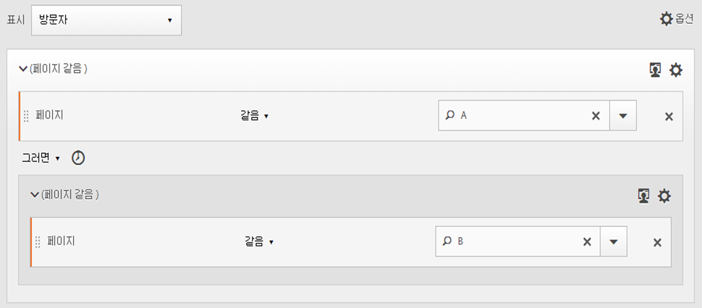

## 혼합 수준 시퀀스

확인되지 않은 방문 횟수에서 2개의 페이지를 열람했으나 별도의 방문에서 또 다른 페이지를 열람한 방문자를 식별합니다.

****&#x200B;예: 방문자는 하나 이상의 방문에서 페이지 A와 페이지 B를 차례로 방문하고 별도의 방문으로 페이지 C를 방문합니다.

**사용 사례**

다음은 이러한 유형의 세그먼트를 사용할 수 있는 방법의 예입니다.

* 방문자는 처음에 새 사이트를 방문한 다음 같은 방문에서 스포츠 페이지를 열람합니다. 또 다른 방문에서 방문자는 날씨 페이지를 방문합니다.
* 판매업체는 메인 페이지로 간 다음 내 계정 페이지로 이동하는 방문자를 정의합니다. 또 다른 방문에서 이러한 방문자는 장바구니 보기 페이지를 방문합니다.

**이 세그먼트 만들기**

1. 왼쪽 창에서 2개의 페이지 차원을 최상위 [!UICONTROL 방문자] 컨테이너 내에 놓습니다.
1. 사이에 THEN 연산자를 추가합니다.
1. **[!UICONTROL 옵션]** &gt; **[!UICONTROL 컨테이너]** 추가를 클릭하고 방문자 수준 아래에 [!UICONTROL 방문] 컨테이너를 [!UICONTROL 추가하고] [!UICONTROL THEN] 연산자를 사용하여 시퀀스를 지정합니다.

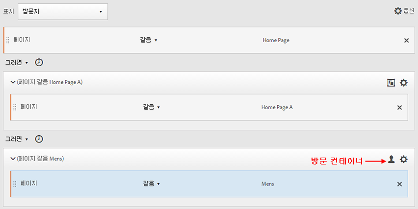

## 컨테이너 집계

[!UICONTROL 방문자] 컨테이너 내에 여러 개의 [!UICONTROL 히트] 컨테이너를 추가하면 같은 유형의 컨테이너 사이에 적절한 연산자를 적용하고, 페이지 및 방문 횟수와 같은 규칙과 차원을 이용하여 페이지 보기를 정의하며, [!UICONTROL 히트] 컨테이너 내에 시퀀스 차원을 제공할 수 있습니다. 히트 수준에서 논리를 적용하면 [!UICONTROL 방문자] 컨테이너 내에 있는 동일 수준의 히트에서 일치 항목을 조합하여 다양한 세그먼트 유형을 만들 수 있습니다.

**예**: 방문자는 페이지 보기 시퀀스(예제의 페이지 D)에서 첫 번째 히트 후에 페이지 A를 방문한 다음, 방문 수에 관계없이 페이지 B나 페이지 C를 방문했습니다.

**사용 사례**

다음은 이러한 유형의 세그먼트를 사용할 수 있는 방법의 예입니다.

* 한 방문에서 기본 랜딩 페이지로 이동한 다음 다른 방문에서 남성복 페이지를 열람하고, 다른 방문에서 여성 또는 아동 랜딩 페이지를 열람하는 방문자를 식별합니다.
* 한 인터넷 잡지는 한 방문에서 홈 페이지로 이동하고, 다른 방문에서 스포츠 페이지로 이동하고, 또 다른 방문에서 의견 페이지로 이동하는 방문자를 캡처합니다.

**이 세그먼트 만들기**

1. 최상위 컨테이너로 [!UICONTROL 방문자] 컨테이너를 선택합니다.
1. 다음 2개의 [!UICONTROL 히트] 수준 컨테이너(같은 [!UICONTROL 히트] 수준에서 [!UICONTROL AND] 및 [!UICONTROL OR] 연산자로 적절한 수치 차원과 연결된 차원)를 추가합니다.
1. [!UICONTROL 방문] 컨테이너 내에 다른 [!UICONTROL 히트] 컨테이너를 추가하고 [!UICONTROL OR] 또는 [!UICONTROL AND] 연산자로 연결된 2개의 추가 [!UICONTROL 히트] 컨테이너를 중첩합니다.

   [!UICONTROL THEN] 연산자로 이러한 중첩 [!UICONTROL 히트] 컨테이너의 시퀀스를 지정합니다.

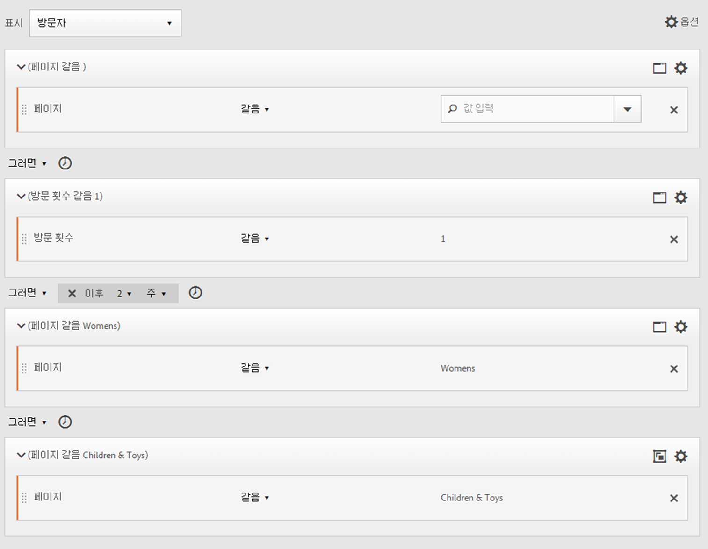

## 순차적 세그먼트에 "중첩"

[!UICONTROL 방문]과 [!UICONTROL 히트] 수준 모두에 체크포인트를 배치함으로써 세그먼트가 특정 방문 및 특정 히트 내에 요구 사항을 충족하도록 제한할 수 있습니다. 

****&#x200B;예: 방문자는 같은 방문에서 페이지 A를 방문하고 페이지 B를 방문했습니다. 새로운 방문에서는 방문자가 페이지 C로 이동했습니다.

**이 세그먼트 만들기**

1. 최상위 [!UICONTROL 방문] 컨테이너 아래로 2개의 페이지 차원을 드래그합니다.
1. Multi-select both rules, click **[!UICONTROL Options]** &gt; **[!UICONTROL Add container from selection]** and change it to a [!UICONTROL Visit] container.
1. [!UICONTROL THEN] 연산자로 두 차원을 연결합니다.
1. [!UICONTROL 방문] 컨테이너의 피어로 히트 컨테이너를 만들고 페이지 차원으로 드래그합니다.
1. 또 하나의 [!UICONTROL THEN] 연산자를 사용하여 [!UICONTROL 방문] 컨테이너의 중첩된 시퀀스를 [!UICONTROL 히트] 컨테이너와 연결합니다.

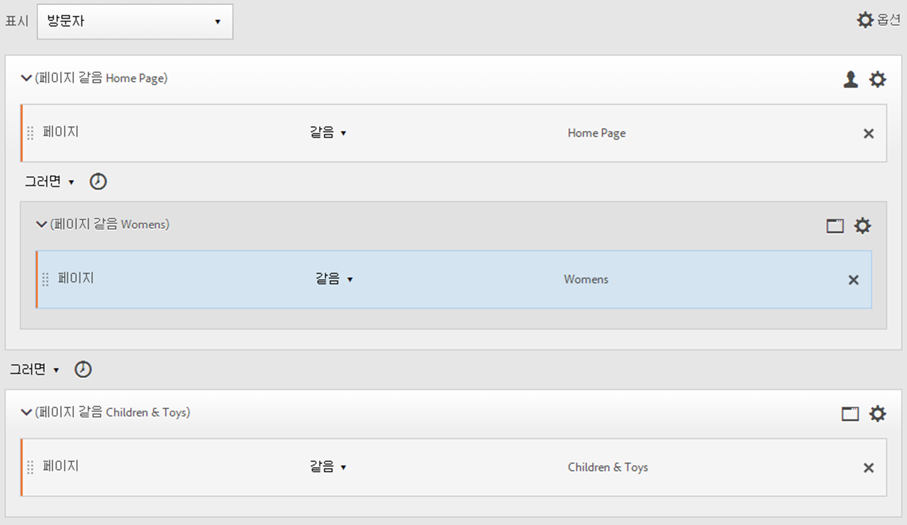

## 히트 제외

[!UICONTROL Exclude] 규칙을 사용하여 [!UICONTROL 방문자], [!UICONTROL 방문] 또는 [!UICONTROL 히트] 데이터를 구체적으로 제외하지 않는 한 세그먼트 규칙은 모든 데이터를 포함합니다. 이를 통해 일반 데이터를 무시하고 더욱 집중적인 세그먼트를 만들 수 있습니다. 또는 검색된 그룹을 제외하는 세그먼트를 만들어서 주문을 한 성공적인 방문자를 포함시킨 다음 다시 제외시켜서 "비구매자"를 가려내는 것과 같이 남은 데이터 세트를 파악할 수 있습니다. 하지만 대부분의 경우 Exclude 규칙을 사용해서 특정한 포함 값을 목표로 하는 것보다 광범위한 값을 [!UICONTROL 제외]시키는 규칙을 만드는 것이 더 좋습니다.

예:

* **페이지 제외**. 세그먼트 규칙을 사용하여 특정 페이지(예: *`Home Page`*) 보고서에서 페이지가 "홈 페이지" 와 같은 히트 규칙을 만든 다음 제외합니다. 이 규칙은 자동으로 홈 페이지를 제외한 모든 값을 포함합니다.
* **참조 도메인 제외**. Google.com의 참조 도메인만 포함하고 나머지는 모두 제외하는 규칙을 사용합니다.
* **비구매자 파악**. 주문이 0보다 큰 경우를 파악하고 해당 [!UICONTROL 방문자]를 제외합니다.

[!UICONTROL 제외] 연산자를 사용하여 방문자가 특정 방문 또는 히트를 수행하지 않는 시퀀스를 식별할 수 있습니다. [!UICONTROL 제외 체크포인트]는 또한  [논리 그룹을](../../../components/c-segmentation/c-segmentation-workflow/seg-sequential-build.md#concept_23CE0E6071E14E51B494CD21A9799112)참조하십시오.

### 체크포인트 사이 제외

체크포인트가 다른 2개의 체크포인트 사이에 분명히 발생하지 않는 곳에서 방문자를 세그먼트화하는 논리를 적용합니다.

****&#x200B;예: 페이지 A를 방문하고 페이지 C를 방문했지만 페이지 B를 방문하지 않은 방문자.

**사용 사례**

다음은 이러한 유형의 세그먼트를 사용할 수 있는 방법의 예입니다.

* 라이프스타일 페이지를 방문한 다음 아트 페이지로 가지 않고 극장 섹션으로 이동한 방문자
* 자동차 판매업체는 기본 랜딩 페이지를 방문한 다음 차량 페이지로 가지 않고 무이익(No Interest) 캠페인으로 직접 이동하는 방문자 간 관계를 확인합니다.

**이 세그먼트 만들기**

단순, 혼합 수준 또는 중첩 순차적 세그먼트와 같은 세그먼트를 만든 다음 컨테이너 요소에 대해 [!UICONTROL EXCLUDE] 연산자를 설정합니다. 아래 예는 집계 세그먼트로서, 여기에서는 3개의 [!UICONTROL 히트] 컨테이너를 캔버스로 드래그하고 [!UICONTROL THEN] 연산자를 지정하여 컨테이너 논리를 연결한 다음 중간 페이지 보기 컨테이너를 제외함으로써, 시퀀스에서 페이지 A로부터 페이지 C로 이동한 방문자만 포함하게 됩니다.

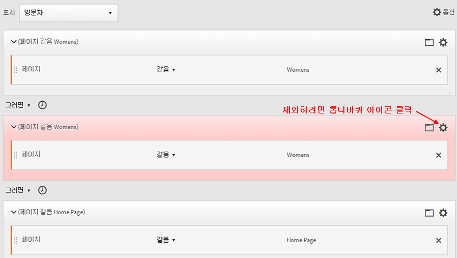

### 시퀀스 시작 부분에서 제외

제외 체크포인트가 순차적 세그먼트의 시작 부분에 있는 경우, 제외된 페이지 보기가 제외되지 않은 첫 번째 히트보다 먼저 발생하지 않았음을 알 수 있습니다.

****&#x200B;예: 방문자가 페이지 B가 아니라 페이지 A를 방문했습니다.

**사용 사례**

다음은 이러한 유형의 세그먼트를 사용할 수 있는 방법의 예입니다.

* 페이지 A는 방문하고 페이지 B는 방문하지 않은 방문자
* 한 식당에서는 기본 랜딩 페이지를 피하고 주문 페이지로 직접 이동하는 단골 사용자를 확인하려고 합니다.

**이 세그먼트 만들기**

최상위 방문자 컨테이너 내에 별도의 히트 컨테이너를 2개 만듭니다. 그런 다음 첫 번째 컨테이너에 대해 [!UICONTROL EXCLUDE] 연산자를 설정합니다.

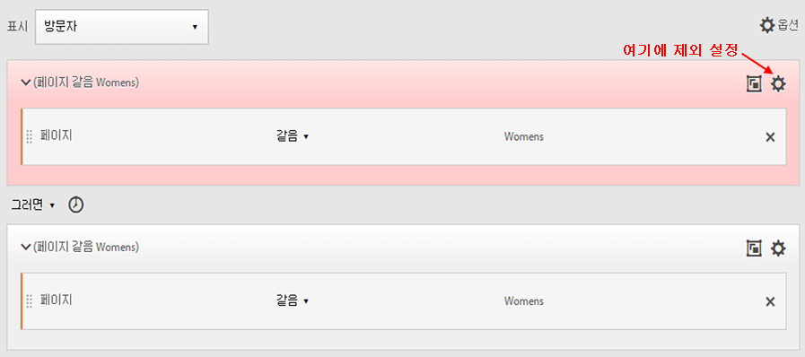

### 시퀀스 끝에서 제외

제외 체크포인트가 시퀀스 끝에 있으면 체크포인트가, 제외되지 않은 마지막 체크포인트와 방문자 시퀀스의 끝 사이에서 발생하지 않았음을 알 수 있습니다.

****&#x200B;예: 방문자는 페이지 A를 방문한 다음 현재 또는 다음 방문에서 페이지 B를 방문하지 않았습니다.

**사용 사례**

다음은 이러한 유형의 세그먼트를 사용할 수 있는 방법의 예입니다.

* 페이지 A는 방문하고 페이지 B는 방문하지 않은 방문자
* 한 식당에서는 기본 랜딩 페이지를 피하고 주문 페이지로 직접 이동하는 단골 사용자를 확인하려고 합니다.

**이 세그먼트 만들기**

Build a simple sequence segment by dragging two [!UICONTROL Hit] containers to the canvas and connecting them using the [!UICONTROL THEN] operator. 그런 다음 [!UICONTROL EXCLUDE] 연산자를 시퀀스의 두 번째 [!UICONTROL 히트] 컨테이너에 할당합니다. 

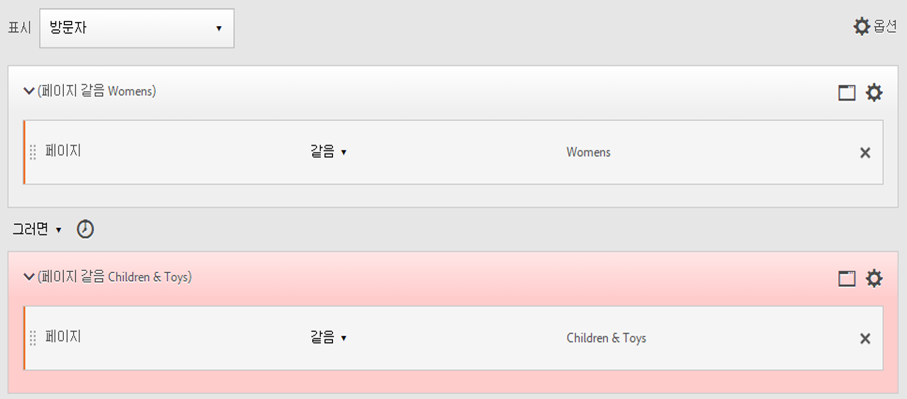

## 논리 그룹 컨테이너

Within sequential segmentation, it is required that containers are ordered strictly within the [container hierarchy](../../../components/c-segmentation/seg-overview.md#concept_A38E7000056547399E346559D85E2551). [!UICONTROL 논리 그룹] 컨테이너는 그룹화된 체크포인트 사이에 순서 지정 없이 *여러 개의 체크포인트를 그룹으로**처리하도록* 설계되었습니다. 즉, 해당 그룹 내의 체크포인트 순서는 신경 쓰지 않습니다. 예를 들어 [!UICONTROL 방문자] 컨테이너를 [!UICONTROL 방문자] 컨테이너 내에 중첩할 수 없습니다. But instead, you can nest a [!UICONTROL Logic Group] container within a [!UICONTROL Visitor] container with specific [!UICONTROL Visit]-level and [!UICONTROL Hit]-level checkpoints.

| 표준 컨테이너 계층 |
|---|
|  |
| [!UICONTROL 방문자] 컨테이너 내에서 [!UICONTROL 방문] 및 [!UICONTROL 히트] 컨테이너는 히트, 방문 횟수, 방문자를 기준으로 세그먼트를 추출하도록 시퀀스에 중첩됩니다. |

>[!NOTE]
>
>[!UICONTROL 논리 그룹은] 순차적 세그먼트에서만 정의할 수 있습니다. 즉 [!UICONTROL , THEN] 연산자가 표현식 내에 사용됨을 의미합니다.

| 논리 컨테이너 비표준 계층 |
|---|
|  |
| [!UICONTROL 논리 그룹] 컨테이너 외부에서 표준 컨테이너 계층도 필요합니다. 하지만 [!UICONTROL 논리 그룹] 컨테이너 안에서는 체크포인트에 순서 또는 계층 설정이 필요 없습니다. 이러한 체크포인트는 방문자가 순서에 관계없이 충족하면 됩니다. |

### Build a Logic Group segment {#section_A5DDC96E72194668AA91BBD89E575D2E}

다른 컨테이너와 마찬가지로 [!UICONTROL 논리 그룹] 컨테이너도 [!UICONTROL 세그먼트 빌더에서 여러 방법으로 작성할]수 있습니다. 다음은 [!UICONTROL 논리 그룹] 컨테이너 중첩에 선호되는 방법입니다. 

1. 왼쪽 창에서 차원, 이벤트 또는 세그먼트를 드래그합니다.
1. 상단 컨테이너를 [!UICONTROL 방문자] 컨테이너로 변경합니다.
1. 기본으로 삽입된 [!UICONTROL AND] 또는 [!UICONTROL OR] 연산자를 THEN 연산자로 바꿉니다.
1. [!UICONTROL 히트] 컨테이너 (차원, 이벤트 또는 항목) 를 선택하고 **[!UICONTROL 옵션]** &gt; 선택에서 컨테이너 **[!UICONTROL 추가를 클릭합니다]**.
1. 컨테이너 아이콘을 클릭하고 **[!UICONTROL 논리 그룹을 선택합니다]**.  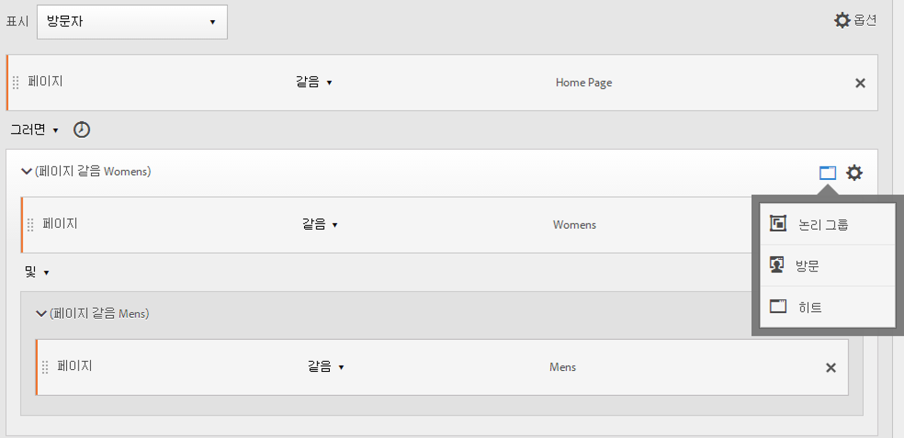
1. 이제 [!UICONTROL 계층]에 상관 없이 [!UICONTROL 히트]를 논리 그룹 컨테이너 내에 설정할 수 있습니다.

### 임의 순서의 논리 그룹 체크포인트

[!UICONTROL 논리 그룹]을 사용하면 해당 그룹 내에 시퀀스 외부에 있는 조건을 충족할 수 있습니다. [!UICONTROL 방문] 또는 [!UICONTROL 히트] 컨테이너가 일반적인 계층에 관계없이 발생하는 세그먼트를 만들 수 있습니다.****

****&#x200B;예: 페이지 A를 방문한 다음 순서에 관계없이 페이지 B와 페이지 C를 방문한 방문자.

**이 세그먼트 만들기**

페이지 B와 C는 바깥쪽 [!UICONTROL 방문자] 컨테이너 내의 [!UICONTROL 논리 그룹] 컨테이너에 중첩되어 있습니다. 그런 다음 A에 대한 [!UICONTROL 히트] 컨테이너 뒤에 [!UICONTROL AND] 연산자로 식별된 B와 C를 포함한 [!UICONTROL 논리 그룹] 컨테이너가 옵니다. [!UICONTROL 논리 그룹] 내에 있기 때문에 시퀀스가 정의되지 않고 페이지 B나 C를 히트하면 인수가 참이 됩니다. 

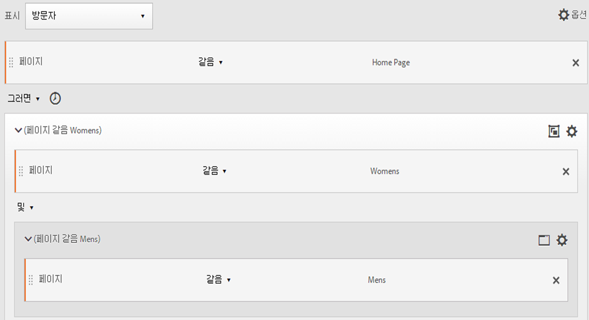

### 논리 그룹 첫 일치

[!UICONTROL 논리 그룹]을 사용하면 해당 그룹 내에 시퀀스 외부에 있는 조건을 충족할 수 있습니다. 이처럼 순서가 없는 최초 일치 세그먼트에서는 먼저 페이지 B 또는 페이지 C의 페이지 보기가 된 다음 필요한 페이지 A 보기가 되도록 [!UICONTROL 논리 그룹] 규칙이 정해집니다.

****&#x200B;예: 페이지 B 나 페이지 C를 방문한 다음 페이지 A를 방문한 방문자.

**이 세그먼트 만들기**

페이지 B와 페이지 C 차원은 [!UICONTROL 논리 그룹] 컨테이너 내에 [!UICONTROL OR] 연산자가 선택된 상태로 그룹화된 다음, 페이지 A의 페이지 보기를 값으로 식별하는 [!UICONTROL 히트] 컨테이너에 그룹화됩니다.

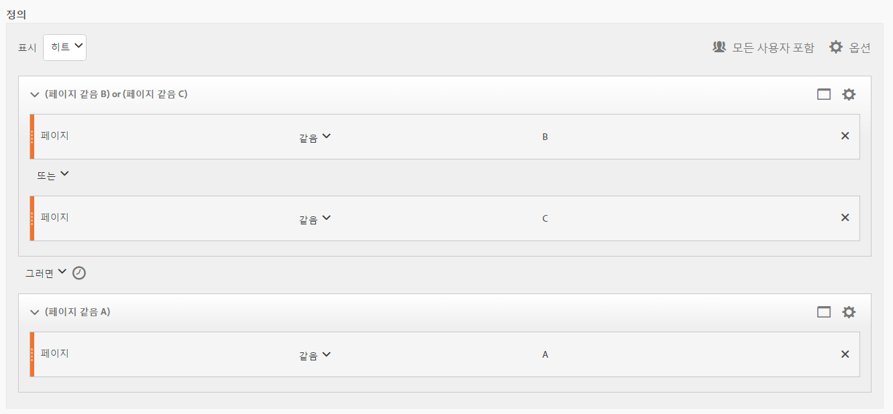

### 논리 그룹 제외 및

여러 페이지 보기를 합계하여 다른 페이지가 확실히 누락된 상태에서 반드시 히트해야 하는 페이지를 정의하는 [!UICONTROL 논리 그룹]을 사용하여 세그먼트를 작성합니다. ****

****&#x200B;예: 방문자는 페이지 A를 방문한 다음 페이지 B 나 C를 확실히 방문하지 않았으나 페이지 D를 히트했습니다.

**이 세그먼트 만들기**

왼쪽 창에서 차원, 이벤트, 사전 작성 세그먼트를 드래그하여 이 세그먼트를 만듭니다. See [Building a Logic Group Segment](../../../components/c-segmentation/c-segmentation-workflow/seg-sequential-build.md#concept_23CE0E6071E14E51B494CD21A9799112).

[!UICONTROL 논리 그룹] 내에 값을 중첩한 다음 **[!UICONTROL 논리 그룹]컨테이너에 있는**[!UICONTROL 제외] 단추를 클릭합니다.

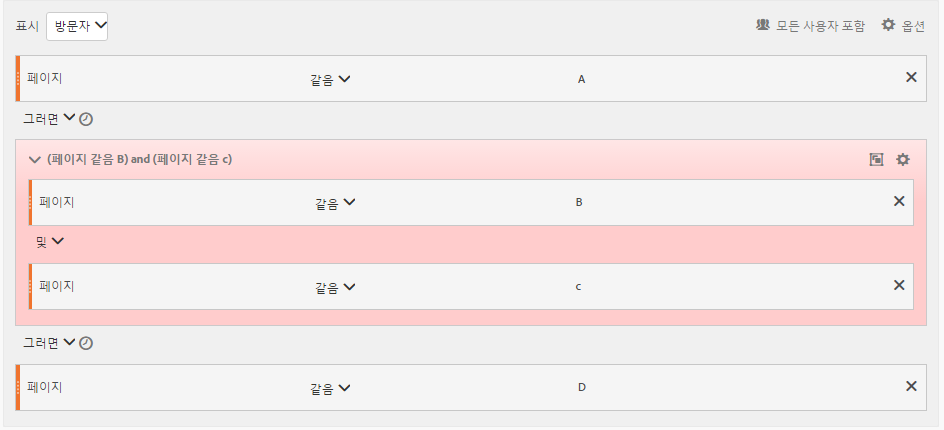

### 논리 그룹 제외 OR

여러 페이지 보기를 합계하여 다른 페이지가 확실히 누락된 상태에서 반드시 히트해야 하는 페이지를 정의하는 [!UICONTROL 논리 그룹]을 사용하여 세그먼트를 작성합니다.

****&#x200B;예: 페이지 A를 방문했지만 페이지 A 앞에 페이지 B 나 페이지 C를 방문하지 않은 방문자

**이 세그먼트 만들기**

처음의 B와 C 페이지가 제외되는 [!UICONTROL 논리 그룹] 컨테이너에서 식별된 후 방문자에 의한 페이지 A 히트가 이어집니다.

왼쪽 창에서 차원, 이벤트, 사전 작성 세그먼트를 드래그하여 이 세그먼트를 만듭니다.

[!UICONTROL 논리 그룹] 내에 값을 중첩한 다음 **[!UICONTROL 논리 그룹]컨테이너에 있는**[!UICONTROL 제외] 단추를 클릭합니다.

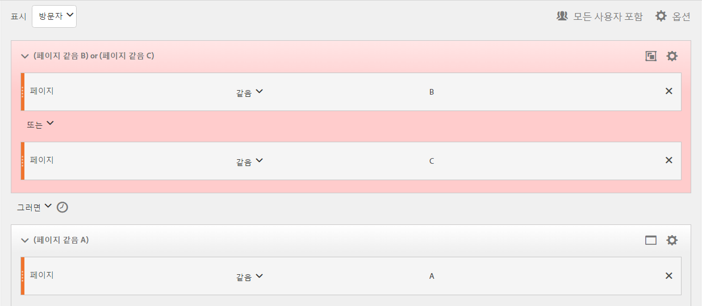

## 시간 초과 및 후 세그먼트 작성

각 컨테이너의 헤더에 포함된 [!UICONTROL Within] 및 [!UICONTROL After] 연산자를 사용하여 시간, 이벤트 및 카운트를 정의합니다.

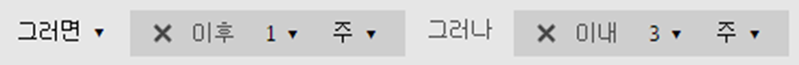

[!UICONTROL Within] 및 [!UICONTROL After] 컨테이너를 사용하고 세부기간 및 카운트를 지정함으로써 지정된 길이의 시간으로 일치를 제한할 수 있습니다. [!UICONTROL Within] 연산자는 두 체크포인트 사이의 시간에 대한 최대 한도 지정에 사용됩니다. [!UICONTROL After] 연산자는 두 체크포인트 사이의 시간에 대한 최소 한도 지정에 사용됩니다.

### After 및 Within 연산자 {#section_CCAF5E44719447CFA7DF8DA4192DA6F8}

세부기간을 나타내는 하나의 대문자와 세부기간의 반복 횟수를 나타내는 숫자를 차례로 지정하여 기간을 지정합니다.

**[!UICONTROL Within]**&#x200B;에는 종점이 포함됩니다(같거나 작음).

**[!UICONTROL After]**&#x200B;에는 종점이 포함되지 않습니다(보다 큼).

| 연산자 | 설명 |
|--- |--- |
| AFTER | After 연산자는 두 체크포인트 사이의 시간에 대한 최소 한도 지정에 사용됩니다. After 값 설정 시에는 세그먼트가 적용될 때 시간 한도가 시작됩니다. 예를 들어 페이지 A를 방문하고 하루가 지날 때까지 돌아와 페이지 B를 방문하지는 않는 방문자를 파악하기 위해 After 연산자를 컨테이너에 설정한 경우 방문자가 페이지 A를 떠날 때 해당 날이 시작됩니다. 방문자가 세그먼트에 포함되려면 페이지 A를 나간 후 페이지 B를 보기 위해 최소 1440 분 (하루) 이 지나야 합니다. |
| WITHIN | Within 연산자는 두 체크포인트 사이의 시간에 대한 최대 한도 지정에 사용됩니다. 예를 들어 페이지 A를 방문한 다음 하루 내에 페이지 B를 방문하도록 돌아온 방문자를 파악하기 위해 Within 연산자를 컨테이너에 설정한 경우 방문자가 페이지 A를 떠날 때 해당 날이 시작됩니다. 세그먼트에 포함하려면 방문자는 페이지 B를 열기 전에 최대 하루의 시간을 갖게 됩니다. 방문자가 세그먼트에 포함되려면 페이지 B를 보기 위해 페이지 A를 나간 후 최대 1440 분 (하루) 내에 페이지 B를 방문해야 합니다. |
| AFTER/WITHIN | After 및 Within 연산자를 모두 사용할 때는 두 연산자가 모두 순차적이 아니라 나란히 시작하고 끝난다는 사실을 이해하는 것이 중요합니다.   For example, if you build a segment with the container set to: `After = 1 Week(s) and Within = 2 Week(s)` Then the conditions to identify visitors in the segment are met only between 1 and 2 weeks. 두 조건 모두 첫 번째 페이지 히트에서만 적용됩니다. |

### After 연산자 사용

* Time After를 사용하면 연도, 월, 일, 시간 및 분별로 추적하여 방문을 일치시킬 수 있습니다.
* Time After는 세밀한 세부기간을 정의할 수 있는 유일한 수준인 [!UICONTROL 히트] 컨테이너에서만 적용됩니다.

****&#x200B;예: 페이지 A를 방문하고 2 주 후에야 페이지 B를 방문한 방문자. ****

**세그먼트 만들기**: 이 세그먼트는 [!UICONTROL 방문자] 컨테이너를 [!UICONTROL 2 개의 히트] 컨테이너와 함께 추가하여 만듭니다. 그런 다음 [!UICONTROL THEN] 연산자를 설정하고 [!UICONTROL AFTER] 연산자 드롭다운을 열어서 주 수를 설정할 수 있습니다.

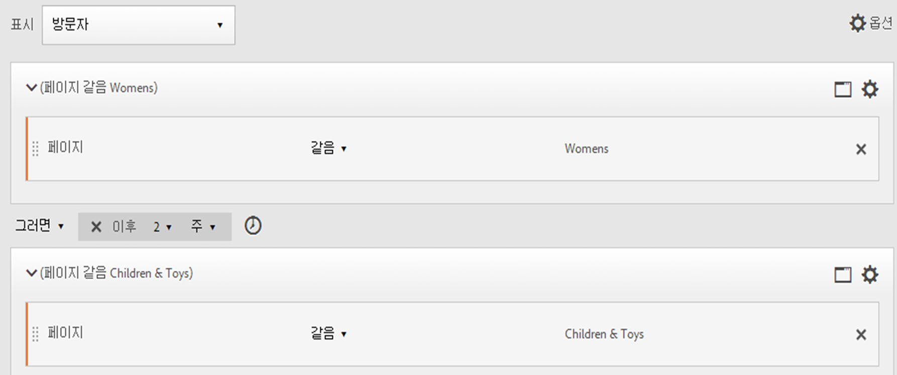

**matches**

"After 2 weeks"로 설정되었을 때 페이지 A 히트가 2019년 6월 1일 00:01에 발생하면, 페이지 B에 대한 다음 히트가 2019년 6월 15일 00:01(14일 후) 전에 발생하는 한 일치합니다. 

| 히트 A | 히트 B | 일치 |
|--- |--- |--- |
| **A** 히트: 2019년 6월 1일 00:01 | **B** 히트: 2019년 6월 15일 00:01 | **일치:** 이 시간 제한은 2019 년 6 월 1 일 이후 (2 주) 이기 때문에 일치합니다. |
| **A** 히트: 2019년 6월 1일 00:01 | **B** 히트: 2019 년 6 월 8 일 00:01 B 히트: 2019 년 6 월 15 일 00:01 | **일치하지 않음:** 페이지 B에 대한 첫 번째 히트는 2 주 후 요구하는 제한과 상충하기 때문에 일치하지 않습니다. |

### Within 연산자 사용

* [!UICONTROL Within]을 사용하면 연도, 월, 일, 시간 및 분별로 추적하여 방문을 일치할 수 있습니다.
* [!UICONTROL Within]은 세밀한 세부기간을 정의할 수 있는 유일한 수준인 [!UICONTROL 히트] 컨테이너에서만 적용됩니다.

>[!IMPORTANT]
>
>"within" 절, THEN 문 사이에 "1개 이내의 검색 키워드 인스턴스", "1개 이내의 eVar 47 인스턴스" 등을 추가할 수 있습니다. 이 경우 측정 기준의 한 개 인스턴스 이내로 세그먼트를 제한합니다.

****&#x200B;예: 페이지 A를 방문하고 5 분 내에 페이지 B를 방문한 방문자.

**세그먼트 만들기**: 이 세그먼트는 [!UICONTROL 방문자] 컨테이너를 추가한 다음 [!UICONTROL 2 개의 히트] 컨테이너와 함께 드래그하여 만듭니다. [!UICONTROL THEN] 연산자를 설정하고 [!UICONTROL AFTER] 연산자 드롭다운을 열고 간격: 히트, 페이지 보기, 방문, 분, 시간, 일, 주, 월, 분기 또는 년을 설정합니다.

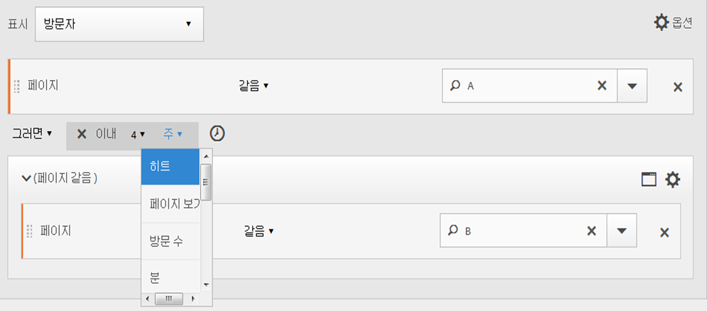

**matches**

시간 제한 내에 일치가 일어나야 합니다. 표현식 의 경우 방문자의 페이지 A 히트가 00:01에 일어나면 그 뒤의 페이지 B 히트는 그것이 00:06 또는 그 전(00:01을 포함하여 5분 후)에 일어나는 한 일치합니다. 같은 분(00:01) 내의 히트도 일치합니다.

### Within 및 After 연산자

[!UICONTROL Within] 및 [!UICONTROL After]를 사용하여 세그먼트의 양 끝에서 최대 및 최소 종점을 제공합니다.

****&#x200B;예: 페이지 A를 방문하고 2 주 후, 단 1 개월 내에 페이지 B를 방문한 방문자.

**세그먼트 만들기**: 방문자 컨테이너 내에서 [!UICONTROL 2 개의 히트] 컨테이너를 시퀀스 지정하여 [!UICONTROL 세그먼트를] 만듭니다. 그런 다음 [!UICONTROL After] 및 [!UICONTROL Within] 연산자를 설정합니다.

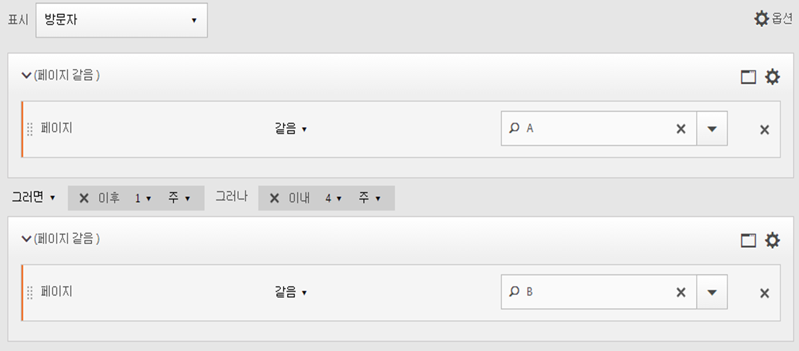

**matches**

2019년 6월 1일에 페이지 A를 히트하고 2019년 6월 15일 이후, 그리고 2019년 7월 1일 *이전*&#x200B;에 돌아오는 모든 방문자가 세그먼트에 포함됩니다. [시간 간격 제외](../../../components/c-segmentation/c-segmentation-workflow/seg-sequential-build.md#concept_C5CB0A391B7C4AC8A95B9724A14E28E8)와 비교해 보십시오.

[!UICONTROL After]와 [!UICONTROL Within] 연산자를 함께 사용하여 순차적 세그먼트를 정의할 수 있습니다.

이 예제는 2주 후, 그러나 1개월 내 두 번째 방문으로 페이지 B를 히트하는 경우를 설명합니다.
