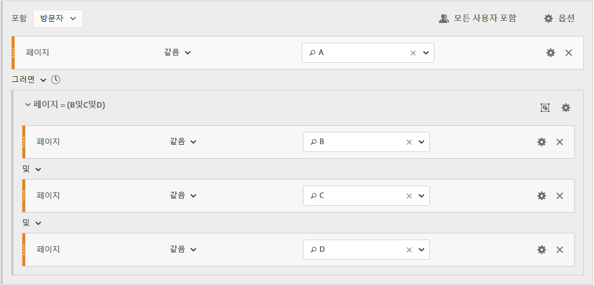
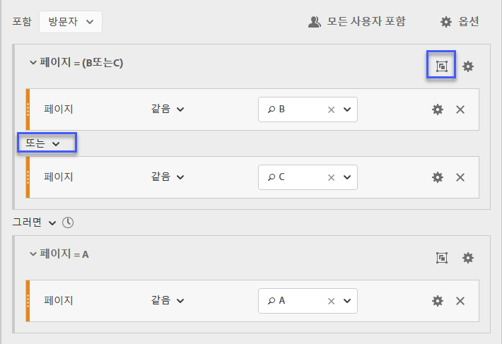

# 순차적 세그먼트 작성

순차적 세그먼트는 AND 또는 OR 대신 THEN 연산자를 사용하여 작성됩니다. THEN은 하나의 세그먼트 기준이 발생하고 그 뒤에 다른 하나의 세그먼트 기준이 있음을 의미합니다. 기본적으로 순차적 세그먼트는 일치하는 모든 데이터를 식별하고 &quot;모든 사용자 포함&quot; 필터를 표시합니다. 순차적 세그먼트는 추가적으로 &quot;시퀀스 이전에만&quot; 및 &quot;시퀀스 이후에만&quot; 옵션을 사용하여 일치하는 항목의 하위 집합으로 필터링될 수 있습니다.

또한 [After와 Within 연산자](/help/components/c-segmentation/c-segmentation-workflow/seg-sequential-build.md)를 사용하여 순차적 세그먼트를 특정한 길이의 시간, 세부기간, 체크포인트 사이의 카운트로 제한할 수도 있습니다.

## 모든 사용자 포함 {#section_75ADDD5D41F04800A09E592BB2940B35}

모든 사용자 포함이 설정된 세그먼트를 만들 때, 세그먼트는 전체로서 주어진 패턴과 일치하는 경로를 식별합니다. 이것은 동일한 방문자가 방문하면 다른 히트(페이지 B)가 뒤따르는 하나의 히트(페이지 A)를 찾는 기본 시퀀스 세그먼트의 예입니다. 세그먼트는 모든 사용자 포함으로 설정되어 있습니다.

| 결과... | 시퀀스 |
|--- |--- |
| 일치 | A 다음 B A 다음(다른 방문에서) B A 다음 D 다음 B |
| 일치하지 않음 | B 다음에 A |

## 시퀀스 이전에만 및 시퀀스 이후에만 {#section_736E255C8CFF43C2A2CAAA6D312ED574}

이 옵션을 **[!UICONTROL Only Before Sequence]** 사용하여 세그먼트를 지정된 시퀀스 전 또는 후 데이터의 하위 집합으로 **[!UICONTROL Only After Sequence]** 필터링합니다.

* **시퀀스 이전에만**: 시퀀스 전의 모든 히트 수 + 시퀀스 자체의 첫 번째 히트를 포함합니다(예 1, 3 참조). 시퀀스가 경로에 여러 번 나타나면 &quot;시퀀스 이전에만&quot;은 시퀀스가 마지막으로 발생했을 때의 첫 번째 히트와 그 전에 오는 모든 히트를 포함합니다(예 2 참조).
* **시퀀스 이후에만**: 시퀀스 후의 모든 히트 수 + 시퀀스 자체의 마지막 히트를 포함합니다(예 1, 3 참조). 시퀀스가 경로에 여러 번 나타나면 &quot;시퀀스 이후에만&quot;은 시퀀스가 처음 발생했을 때의 마지막 히트와 그 다음에 오는 모든 히트를 포함합니다(예 2 참조).

예를 들어, B -> D의 시퀀스를 생각해 보십시오. 세 개의 필터는 다음과 같이 히트를 식별합니다.

**예 1: B -> D가 한 번 나타남**

| 예 | A | B | C | D | E | F |
|---|---|---|---|---|---|---|
| 모든 사용자 포함 | A | B | C | D | E | F |
| 시퀀스 이전에만 | A | B |  |  |  |  |
| 시퀀스 이후에만 |  |  |  | D | E | F |

**예 2: B -> D가 여러 번 나타남**

| 예 | A | B | C | D | B | C | D | E |
|---|---|---|---|---|---|---|---|---|
| 모든 사용자 포함 | A | B | C | D | B | C | D | E |
| 시퀀스 이전에만 | A | B | C | D | B |  |  |  |
| 시퀀스 이후에만 |  |  |  | D | B | C | D | E |

또한 이 개념을 히트 깊이 차원으로 표현해 보겠습니다.

**예제 3: 히트 깊이 3 -> 5**

## 차원 제한 {#section_EAFD755F8E674F32BCE9B642F7F909DB}

&quot;within&quot; 절, THEN 문 사이에 &quot;1개 이내의 검색 키워드 인스턴스&quot;, &quot;1개 이내의 eVar 47 인스턴스&quot; 등을 추가할 수 있습니다. 이 경우 차원의 한 개 인스턴스 이내로 세그먼트를 제한합니다.

규칙 간 &#39;차원 내&#39; 절을 설정하면 세그먼트가 데이터를 해당 절을 충족하는 시퀀스로 제한할 수 있습니다. 제한이 &quot;1페이지 내&quot;로 설정되어 있을 경우 아래 예를 참조하십시오.

| 결과... | 시퀀스 |
|--- |--- |
| 일치 | A 다음에 B |
| 일치하지 않음 | A 다음 C 다음 B (B는 A의 1페이지 내에 없었으므로) **참고:**차원 제한을 제거하는 경우, &quot;A 다음 B&quot;와 &quot;A 다음 C 다음 B&quot;가 모두 일치합니다. |

## 단순 페이지 보기 시퀀스

하나의 페이지를 본 다음 다른 페이지를 본 방문자를 식별합니다. 히트 수준 데이터는 이 시퀀스를 이전, 과거 또는 중간 방문 세션이나 시간 또는 그 사이에 일어나는 페이지 보기 수에 관계없이 필터링합니다.

**예**: 방문자는 페이지 A를 열람한 다음 동일하거나 다른 방문에서 페이지 B를 열람했습니다.

**사용 사례**

다음은 이러한 세그먼트를 사용할 수 있는 방법의 예입니다.

1. 스포츠 사이트 방문자는 같은 방문일 필요는 없지만 축구 랜딩 페이지를 열람한 다음 농구 랜딩 페이지를 순차적으로 열람합니다. 이러한 사실 때문에 축구 세션 중에 농구 컨텐츠를 축구 시청자로 푸시하는 캠페인이 촉진됩니다.
1. 자동차 판매업체는 고객 충성도 페이지를 방문했다가 해당 방문이나 다른 방문 중에 비디오 페이지로 이동한 방문자 간 관계를 파악합니다.

**이 세그먼트 만들기**

You nest two page rules within a top-level [!UICONTROL Visitor] container and sequence the page hits using the [!UICONTROL THEN] operator.

## 방문 간 방문자 시퀀스

캠페인에서 벗어났으나 다른 세션에서 페이지 보기 시퀀스로 복귀한 방문자를 식별합니다.

**예**: 방문자는 한 번의 방문으로 페이지 A를 보고 다음 방문 시 페이지 B를 보았습니다.

**사용 사례**

다음은 이러한 유형의 세그먼트를 사용할 수 있는 방법의 예입니다.

* 방문자가 뉴스 사이트의 스포츠 페이지를 방문한 다음 다른 세션에서 스포츠 페이지를 재방문했습니다.
* 의류 판매업체는 한 세션에서 랜딩 페이지를 방문한 다음 다른 세션에서 체크아웃 페이지로 직접 이동하는 방문자 간 관계를 확인합니다.

**이 세그먼트 만들기**

This example nests two **[!UICONTROL Visit]** containers within the top-level **[!UICONTROL Visitor]** container and sequences the segment using the [!UICONTROL THEN] operator.

## 혼합 수준 시퀀스

확인되지 않은 방문 횟수에서 2개의 페이지를 열람했으나 별도의 방문에서 또 다른 페이지를 열람한 방문자를 식별합니다.

**예**: 방문자는 하나 이상의 방문에서 페이지 A를 방문한 다음 페이지를 B를 방문하고 별도의 방문에서 페이지 C를 방문했습니다.

**사용 사례**

다음은 이러한 유형의 세그먼트를 사용할 수 있는 방법의 예입니다.

* 방문자는 처음에 새 사이트를 방문한 다음 같은 방문에서 스포츠 페이지를 열람합니다. 또 다른 방문에서 방문자는 날씨 페이지를 방문합니다.
* 판매업체는 메인 페이지로 간 다음 내 계정 페이지로 이동하는 방문자를 정의합니다. 또 다른 방문에서 이러한 방문자는 장바구니 보기 페이지를 방문합니다.

**이 세그먼트 만들기**

1. Drop two Page dimensions from the left panes within a top-level [!UICONTROL Visitor] container.
1. 사이에 THEN 연산자를 추가합니다.
1. > **[!UICONTROL Options]** 를 클릭하고 **[!UICONTROL Add container]** 연산자를 사용하여 [!UICONTROL Visit] 레벨 아래에 [!UICONTROL Visitor] 컨테이너를 추가하고 순서를 지정합니다 [!UICONTROL THEN] .

## 컨테이너 합계

Adding multiple [!UICONTROL Hit] containers within a [!UICONTROL Visitor] container lets you employ the appropriate operators between the same type of containers, and to use rules and dimensions such as Page and Visit Number to define the page view and provide a sequence dimension within the [!UICONTROL Hit] container. Applying logic at the Hit-level lets you constrain and combine matches at a same-level of hits within the [!UICONTROL Visitor] container to build a variety of segment types.

**예**: 방문자는 페이지 보기 시퀀스(예제의 페이지 D)에서 첫 번째 히트 후에 페이지 A를 방문한 다음, 방문 수에 관계없이 페이지 B나 페이지 C를 방문했습니다.

**사용 사례**

다음은 이러한 유형의 세그먼트를 사용할 수 있는 방법의 예입니다.

* 한 방문에서 기본 랜딩 페이지로 이동한 다음 다른 방문에서 남성복 페이지를 열람하고, 다른 방문에서 여성 또는 아동 랜딩 페이지를 열람하는 방문자를 식별합니다.
* 한 인터넷 잡지는 한 방문에서 홈 페이지로 이동하고, 다른 방문에서 스포츠 페이지로 이동하고, 또 다른 방문에서 의견 페이지로 이동하는 방문자를 캡처합니다.

**이 세그먼트 만들기**

1. Select the [!UICONTROL Visitor] container as the top-level container.
1. Add two [!UICONTROL Hit]-level containers—a dimension with an appropriate numerical dimension joined at the same [!UICONTROL Hit] level by the [!UICONTROL AND] and [!UICONTROL OR] operator.
1. Within the [!UICONTROL Visit] container, add another [!UICONTROL Hit] container and nest two additional [!UICONTROL Hit] containers joined with an [!UICONTROL OR] or [!UICONTROL AND] operator.

   Sequence these nested [!UICONTROL Hit] containers with the [!UICONTROL THEN] operator.

## 순차적 세그먼트에 &quot;중첩&quot;

By placing checkpoints at both the [!UICONTROL Visit] and [!UICONTROL Hit] level, you can constrain the segment to meet requirements within a specific visit as well as a specific hit.

**예**: 방문자는 같은 방문에서 페이지 A를 방문하고 페이지 B를 방문했습니다. 새로운 방문에서는 방문자가 페이지 C로 이동했습니다.

**이 세그먼트 만들기**

1. Underneath a top-level [!UICONTROL Visit] container, drag in two page dimensions.
1. 두 규칙을 모두 여러 번 선택하고 **[!UICONTROL Options]** > **[!UICONTROL Add container from selection]** 을 클릭한 다음 [!UICONTROL Visit] 컨테이너로 변경합니다.
1. [!UICONTROL THEN] 연산자로 두 차원을 연결합니다.
1. Create a Hit container as a peer to the [!UICONTROL Visit] container and drag in a page dimension.
1. Join the nested sequence in the [!UICONTROL Visit] container with the [!UICONTROL Hit] container using another [!UICONTROL THEN] operator.

## 히트 제외

Segment rules include all data unless you specifically exclude [!UICONTROL Visitor], [!UICONTROL Visit], or [!UICONTROL Hit] data using the [!UICONTROL Exclude] rule. 이를 통해 일반 데이터를 무시하고 더욱 집중적인 세그먼트를 만들 수 있습니다. 또는 검색된 그룹을 제외하는 세그먼트를 만들어서 주문을 한 성공적인 방문자를 포함시킨 다음 다시 제외시켜서 비구매자를 가려내는 것과 같이 남은 데이터 세트를 파악할 수 있습니다. 하지만 대부분의 경우 규칙을 사용해서 특정한 포함 값을 목표로 하는 것보다 광범위한 값을 [!UICONTROL Exclude]제외시키는 규칙을 만드는 것이 더 좋습니다.

예:

* **페이지 제외**. 세그먼트 규칙을 사용하여 특정 페이지(예: *`Home Page`*)를 보고서에서 제외하고, 페이지가 &quot;홈 페이지&quot;와 같은 히트 규칙을 만든 다음 제외시킵니다. 이 규칙은 자동으로 홈 페이지를 제외한 모든 값을 포함합니다.
* **참조 도메인 제외**. Google.com의 참조 도메인만 포함하고 나머지는 모두 제외하는 규칙을 사용합니다.
* **비구매자 파악**. Identify when orders are greater than zero and then exclude the [!UICONTROL Visitor].

The [!UICONTROL Exclude] operator can be employed to identify a sequence where specific visits or hits are not performed by the visitor. [!UICONTROL Exclude Checkpoints] 논리 그룹 내에 포함할 수도 [있습니다](/help/components/c-segmentation/c-segmentation-workflow/seg-sequential-build.md).

### 체크포인트 간 제외 

체크포인트가 다른 2개의 체크포인트 사이에 분명히 발생하지 않는 곳에서 방문자를 세그먼트화하는 논리를 적용합니다.

**예**: 페이지 A를 방문한 다음 페이지 B는 방문하지 않고 페이지 C를 방문한 방문자.

**사용 사례**

다음은 이러한 유형의 세그먼트를 사용할 수 있는 방법의 예입니다.

* 라이프스타일 페이지를 방문한 다음 아트 페이지로 가지 않고 극장 섹션으로 이동한 방문자
* 자동차 판매업체는 기본 랜딩 페이지를 방문한 다음 차량 페이지로 가지 않고 무이익No Interest 캠페인으로 직접 이동하는 방문자 간 관계를 확인합니다.

**이 세그먼트 만들기**

단순한 세그먼트나 혼합 수준 세그먼트 또는 중첩된 순차적 세그먼트에 대해 만드는 것처럼 세그먼트를 만든 다음 컨테이너 요소에 대해 [!UICONTROL EXCLUDE] 연산자를 설정하십시오. The example below is an aggregate segment where the three [!UICONTROL Hit] containers are dragged to the canvas, the [!UICONTROL THEN] operator assigned to join the container logic, then exclude the middle page view container to include only visitors that went from page A to Page C in the sequence.

### 시퀀스를 시작할 때 제외 

제외 체크포인트가 순차적 세그먼트의 시작 부분에 있는 경우, 제외된 페이지 보기가 제외되지 않은 첫 번째 히트보다 먼저 발생하지 않았음을 알 수 있습니다.

**예**: 방문자가 페이지 B가 아니라 페이지 A를 방문했습니다.

**사용 사례**

다음은 이러한 유형의 세그먼트를 사용할 수 있는 방법에 대한 사용 사례 예입니다.

* 페이지 A는 방문하고 페이지 B는 방문하지 않은 방문자
* 한 식당에서는 기본 랜딩 페이지를 피하고 주문 페이지로 직접 이동하는 단골 사용자를 확인하려고 합니다.

**이 세그먼트 만들기**

최상위 방문자 컨테이너 내에 별도의 히트 컨테이너를 2개 만듭니다. 그런 다음 첫 번째 컨테이너에 대해 [!UICONTROL EXCLUDE] 연산자를 설정합니다.

### 시퀀스를 종료할 때 제외 

제외 체크포인트가 시퀀스 끝에 있으면 체크포인트가, 제외되지 않은 마지막 체크포인트와 방문자 시퀀스의 끝 사이에서 발생하지 않았음을 알 수 있습니다.

**예**: 방문자는 페이지 A를 방문한 후 현재 또는 다음 방문에서 페이지 B를 방문하지 않았습니다.

**사용 사례**

다음은 이러한 유형의 세그먼트를 사용할 수 있는 방법의 예입니다.

* 페이지 A는 방문하고 페이지 B는 방문하지 않은 방문자
* 한 식당에서는 기본 랜딩 페이지를 피하고 주문 페이지로 직접 이동하는 단골 사용자를 확인하려고 합니다.

**이 세그먼트 만들기**

Build a simple sequence segment by dragging two [!UICONTROL Hit] containers to the canvas and connecting them using the [!UICONTROL THEN] operator. Then assign the [!UICONTROL EXCLUDE] operator to the second [!UICONTROL Hit] container in the sequence.

## 논리 그룹 컨테이너 

논리 그룹 컨테이너는 조건을 하나의 순차적 세그먼트 체크포인트로 그룹화하는 데 필수입니다. 이 특별한 논리 그룹 컨테이너는 이전의 순차적 체크포인트 후와 다음에 오는 순차적 체크포인트 전에 해당 조건을 충족하기 위해 순차적 세그먼테이션에서만 사용할 수 있습니다. 논리 그룹 체크포인트 자체 내의 조건은 임의의 순서로 충족될 수 있습니다. 그와 대조적으로, 비순차적 컨테이너(히트, 방문, 방문자)는 전체 시퀀스 내에서 조건을 충족할 필요가 없으므로 THEN 연산자와 함께 사용할 경우 직관적이지 않은 결과가 나옵니다.
The [!UICONTROL Logic Group] container was designed to treat *several checkpoints as a group*, *without any ordering* among the grouped checkpoints. 다시 말해, 해당 그룹 내의 체크포인트 순서에 대해서는 신경 쓸 필요가 없습니다. For example, you can&#39;t nest a [!UICONTROL Visitor] container within a [!UICONTROL Visitor] container. But instead, you can nest a [!UICONTROL Logic Group] container within a [!UICONTROL Visitor] container with specific [!UICONTROL Visit]-level and [!UICONTROL Hit]-level checkpoints.

>[!NOTE] 순차적 세그먼트에서만 A를 정의할 [!UICONTROL Logic Group] 수 있습니다. 즉, [!UICONTROL THEN] 연산자는 표현식 내에서 사용됩니다.

| 컨테이너 계층 | 그림 | 정의 |
|---|---|---|
| 표준 컨테이너 계층 |  | Within the [!UICONTROL Visitor] container, the [!UICONTROL Visit] and [!UICONTROL Hit] containers are nested in sequence to extract segments based on hits, the number of visits, and the visitor. |
| 논리 컨테이너 계층 |  | The standard container hierarchy is also required outside of the [!UICONTROL Logic Group] container. But inside the [!UICONTROL Logic Group] container, the checkpoints do not require an established order or hierarchy—these checkpoints simply need to be met by the visitor in any order. |

논리 그룹은 어렵게 보일 수 있습니다. 다음은 이러한 그룹을 사용하는 방법에 대한 좋은 예입니다.

**논리 그룹 또는 히트/방문 컨테이너?**
순차적 체크포인트를 그룹화하려 한다면 &quot;컨테이너&quot;는 논리 그룹입니다. 그러나 이러한 순차적 체크포인트가 단일 히트 또는 방문 범위 내에서 발생해야 한다면 &#39;히트&#39; 또는 &#39;방문&#39; 컨테이너가 필요합니다. 물론, 하나의 히트가 둘 이상의 체크포인트를 크레딧할 수 있으면 순차적 체크포인트 그룹에 대해 &#39;히트&#39;는 적절하지 않습니다.

**논리 그룹이 순차적 세그먼트 작성을 간소화합니까?**
네, 가능합니다. **방문자가 페이지 A 다음에 페이지 B, 또는 페이지 C, 또는 페이지 D를 보았습니까?**&#x200B;라는 질문에 답하려고 한다고 가정해 봅시다.

이 세그먼트를 논리 그룹 컨테이너 없이 만들 수는 있지만 그렇게 하는 것은 복잡하고 힘든 일입니다.
* `Visitor Container [Page A THEN Page B THEN Page C THEN Page D] or`
* `Visitor Container [Page A THEN Page B THEN Page D THEN Page C] or`
* `Visitor Container [Page A THEN Page C THEN Page B THEN Page D] or`
* `Visitor Container [Page A THEN Page C THEN Page D THEN Page B] or`
* `Visitor Container [Page A THEN Page D THEN Page B THEN Page C] or`
* `Visitor Container [Page A THEN Page D THEN Page C THEN Page B]`

논리 그룹 컨테이너는 다음과 같이 이 세그먼트를 작성하는 것을 크게 간소화합니다.

### 논리 그룹 세그먼트 작성 {#section_A5DDC96E72194668AA91BBD89E575D2E}

다른 컨테이너와 마찬가지로 [!UICONTROL Logic Group] 컨테이너도 여러 가지 방법으로 만들 수 [!UICONTROL Segment Builder]있습니다. Here is a preferred way to nest [!UICONTROL Logic Group] containers:

1. 왼쪽 창에서 차원, 이벤트 또는 세그먼트를 드래그합니다.
1. Change the top container to a [!UICONTROL Visitor] container.
1. 기본으로 삽입된 [!UICONTROL AND] 또는 [!UICONTROL OR] 연산자를 THEN 연산자로 바꿉니다.
1. 컨테이너( [!UICONTROL Hit] 차원, 이벤트 또는 항목)를 선택하고 **[!UICONTROL Options]** > **[!UICONTROL Add container from selection]**&#x200B;을 클릭합니다.
1. Click the container icon and select **[!UICONTROL Logic Group]**.  
1. You can now set the [!UICONTROL Hit] within the [!UICONTROL Logic Group] container without regard to hierarchy.

### 모든 순서의 논리 그룹 체크포인트 

Using the [!UICONTROL Logic Group] lets you meet conditions within that group that reside outside of the sequence. This allows you to build segments where a [!UICONTROL Visit] or [!UICONTROL Hit] container happens irrespective of the normal hierarchy.

**예**: 방문자는 페이지 A를 방문한 다음 순서에 관계없이 페이지 B와 페이지 C를 방문했습니다.

**이 세그먼트 만들기**

Page B and C are nested in a [!UICONTROL Logic Group] container within the outer [!UICONTROL Visitor] container. The [!UICONTROL Hit] container for A is then followed by the [!UICONTROL Logic Group] container with B and C identified using the [!UICONTROL AND] operator. Because it is in the [!UICONTROL Logic Group], the sequence is not defined and hitting both page B and C in any order makes the argument true.

**다른 예**: 페이지 B 또는 페이지 C를 방문한 다음 페이지 A를 방문한 방문자:

세그먼트는 논리 그룹의 체크포인트(B 또는 C) 중 적어도 하나와 일치해야 합니다. 또한 논리 그룹 조건은 동일한 히트에서 또는 여러 히트에서 충족될 수 있습니다.&#x200B;

### 논리 그룹 최초 일치

Using the [!UICONTROL Logic Group] lets you meet conditions within that group that reside outside of the sequence. In this unordered first match segment, the [!UICONTROL Logic Group] rules are identified first to be either a page view of page B or page C, then the required view of page A.

**예**: 방문자는 페이지 B 또는 페이지 C를 방문한 다음 페이지 A를 방문했습니다.

**이 세그먼트 만들기**

Page B and page C dimensions are grouped within a [!UICONTROL Logic Group] container with the [!UICONTROL OR] operator selected, then the [!UICONTROL Hit]container identifying a page view of page A as the value.

### 논리 그룹 제외 AND

Build segments using the [!UICONTROL Logic Group] where multiple page views are aggregated to define what pages were necessary to be hit while other pages were specifically missed. ****

**예**: 문자는 페이지 A를 방문한 후 페이지 B와 페이지 C를 확실히 방문하지 않았으나 페이지 D를 히트했습니다. 

**이 세그먼트 만들기**

왼쪽 창에서 차원, 이벤트, 사전 작성 세그먼트를 드래그하여 이 세그먼트를 만듭니다. [논리 그룹 세그먼트 만들기](/help/components/c-segmentation/c-segmentation-workflow/seg-sequential-build.md)를 참조하십시오.

값을 컨테이너 내에 중첩한 [!UICONTROL Logic Group]후 컨테이너 내의 **[!UICONTROL Exclude]** 단추를 클릭합니다 [!UICONTROL Logic Group] .

### 논리 그룹 제외 OR

Build segments using the [!UICONTROL Logic Group] where multiple page views are aggregated to define what pages were necessary to be hit while other pages were specifically missed.

**예**: 방문자는 페이지 A를 방문했지만 그에 앞서 페이지 B나 페이지 C를 방문하지 않았습니다.

**이 세그먼트 만들기**

The initial B and C pages are identified in a [!UICONTROL Logic Group] container that is excluded, and then followed by a hit to page A by the visitor.

왼쪽 창에서 차원, 이벤트, 사전 작성 세그먼트를 드래그하여 이 세그먼트를 만듭니다.

값을 컨테이너 내에 중첩한 [!UICONTROL Logic Group]후 컨테이너 내의 **[!UICONTROL Exclude]** 단추를 클릭합니다 [!UICONTROL Logic Group] .

## 세그먼트 최대/최소 시간 작성

각 컨테이너의 헤더에 포함된 [!UICONTROL Within] 및 [!UICONTROL After] 연산자를 사용하여 시간, 이벤트 및 카운트를 정의합니다.

[!UICONTROL Within] 및 [!UICONTROL After] 컨테이너를 사용하고 세부기간 및 카운트를 지정함으로써 지정된 길이의 시간으로 일치를 제한할 수 있습니다. [!UICONTROL Within] 연산자는 두 체크포인트 사이의 시간에 대한 최대 한도 지정에 사용됩니다. [!UICONTROL After] 연산자는 두 체크포인트 사이의 시간에 대한 최소 한도 지정에 사용됩니다.

### After 및 Within 연산자 {#section_CCAF5E44719447CFA7DF8DA4192DA6F8}

세부기간을 나타내는 하나의 대문자와 세부기간의 반복 횟수를 나타내는 숫자를 차례로 지정하여 기간을 지정합니다.

**[!UICONTROL Within]**&#x200B;에는 종점이 포함됩니다(같거나 작음).

**[!UICONTROL After]**&#x200B;에는 종점이 포함되지 않습니다(보다 큼).

| 연산자 | 설명 |
|--- |--- |
| AFTER | After 연산자는 두 체크포인트 사이의 시간에 대한 최소 한도 지정에 사용됩니다. After 값 설정 시에는 세그먼트가 적용될 때 시간 한도가 시작됩니다. 예를 들어, 페이지 A를 방문하지만 하루가 지날 때까지 페이지 B를 방문하러 돌아오지 않는 방문자를 파악하기 위해 After 연산자를 컨테이너에 설정한 경우, 그 하루는 방문자가 페이지 A를 나갈 때 시작됩니다. 방문자가 세그먼트에 포함되려면 페이지 A를 나간 후 페이지 B를 볼 때까지 최소 1440분(하루)이 지나야 합니다. |
| WITHIN | Within 연산자는 두 체크포인트 사이의 시간에 대한 최대 한도 지정에 사용됩니다. 예를 들어, 페이지 A를 방문하고 하루 안에 돌아와서 페이지 B를 방문하는 방문자를 파악하기 위해 Within 연산자를 컨테이너에 설정한 경우, 그 하루는 방문자가 페이지 A를 나갈 때 시작됩니다. 방문자가 세그먼트에 포함되려면 방문자가 페이지 B를 열기 전에 최대 하루의 시간을 가져야 합니다. 방문자가 세그먼트에 포함되려면 페이지 A에서 나간 후 페이지 B를 보기까지 최대 1440분(하루) 이내에 페이지 B를 방문해야 합니다. |
| AFTER/WITHIN | After 및 Within 연산자를 모두 사용할 때는 두 연산자가 모두 순차적이 아니라 나란히 시작하고 끝난다는 사실을 이해하는 것이 중요합니다.   예를 들어 컨테이너를  `After = 1 Week(s) and Within = 2 Week(s)` 로 설정한 세그먼트를 만드는 경우, 세그먼트의 방문자 식별 조건은 1주와 2주 사이에만 충족됩니다. 두 조건 모두 첫 번째 페이지 히트에서만 적용됩니다. |

### After 연산자 사용

* Time After를 사용하면 연도, 월, 일, 시간 및 분별로 추적하여 방문을 일치시킬 수 있습니다.
* Time After can only be applied to a [!UICONTROL Hit] container because it is the only level for which such fine granularity is defined.

**예**: 방문자는 페이지 A를 방문하고 2주 후에야 페이지 B를 방문했습니다.****

**세그먼트 만들기**:이 세그먼트는 두 개의 [!UICONTROL Visitor] 컨테이너가 있는 [!UICONTROL Hit] 컨테이너를 추가하여 만듭니다. 그런 다음 [!UICONTROL THEN] 연산자를 설정하고 [!UICONTROL AFTER] 연산자 드롭다운을 열어서 주 수를 설정할 수 있습니다.

**일치**

After 2 weeks로 설정되었을 때 페이지 A 히트가 2019년 6월 1일 00:01에 발생하면, 페이지 B에 대한 다음 히트가 2019년 6월 15일 00:01(14일 후) 전에 발생하는 한 일치합니다. 

| 히트 A | 히트 B | 일치 |
|--- |--- |--- |
| **A** 히트: 2019년 6월 1일 00:01 | **B** 히트: 2019년 6월 15일 00:01 | **일치**: 이 시간 제한은 년 6월 1일보다 후(2주)이기 때문에 일치합니다. |
| **A** 히트: 2019년 6월 1일 00:01 | **B** 히트: 2019년 6월 8일 00:01 B 히트: 2019년 6월 15일 00:01 | **일치하지 않음:** 페이지 B에 대한 첫 번째 히트가 2주 후를 요구하는 제한과 상충하기 때문에 일치하지 않습니다. |

### Within 연산자 사용

* [!UICONTROL Within]을 사용하면 연도, 월, 일, 시간 및 분별로 추적하여 방문을 일치할 수 있습니다.
* [!UICONTROL Within] 이러한 세부 세부기간이 정의된 유일한 수준이기 때문에 [!UICONTROL Hit] 컨테이너에만 적용할 수 있습니다.

>[!IMPORTANT]
>
>&quot;within&quot; 절, THEN 문 사이에 &quot;1개 이내의 검색 키워드 인스턴스&quot;, &quot;1개 이내의 eVar 47 인스턴스&quot; 등을 추가할 수 있습니다. 이 경우 차원의 한 개 인스턴스 이내로 세그먼트를 제한합니다.

**예**: 방문자는 페이지 A를 방문한 후 5분 내에 페이지 B를 방문했습니다.

**세그먼트**&#x200B;만들기:이 세그먼트는 [!UICONTROL Visitor] 컨테이너를 추가한 다음 두 개의 [!UICONTROL Hit] 컨테이너와 함께 드래그하여 만듭니다. [!UICONTROL THEN] 연산자를 설정하고 [!UICONTROL AFTER] 연산자 드롭다운을 열고 간격: 히트, 페이지 보기, 방문, 분, 시간, 일, 주, 월, 분기 또는 년을 설정합니다.

**일치**

시간 제한 내에 일치가 일어나야 합니다. 표현식 의 경우 방문자의 페이지 A 히트가 00:01에 일어나면 그 뒤의 페이지 B 히트는 그것이 00:06 또는 그 전(00:01을 포함하여 5분 후)에 일어나는 한 일치합니다. 같은 분00:01 내의 히트도 일치합니다.

### Within 및 After 연산자

[!UICONTROL Within] 및 [!UICONTROL After]를 사용하여 세그먼트의 양 끝에서 최대 및 최소 종점을 제공합니다.

**예**: 방문자는 페이지 A를 방문하고 2주 후, 단 1개월 내에 페이지 B를 방문했습니다.

**세그먼트 만들기**:컨테이너 내에 두 개의 [!UICONTROL Hit] 컨테이너를 시퀀스 지정하여 세그먼트를 [!UICONTROL Visitor] 만듭니다. Then set the [!UICONTROL After] and [!UICONTROL Within] operators.

**일치**

2019년 6월 1일에 페이지 A를 히트하고 2019년 6월 15일 이후, 그리고 2019년 7월 1일 *이전*&#x200B;에 돌아오는 모든 방문자가 세그먼트에 포함됩니다. [시간 간격 제외](/help/components/c-segmentation/c-segmentation-workflow/seg-sequential-build.md)와 비교해 보십시오.

[!UICONTROL After]와 [!UICONTROL Within] 연산자를 함께 사용하여 순차적 세그먼트를 정의할 수 있습니다.

이 예제는 2주 후, 그러나 1개월 내 두 번째 방문으로 페이지 B를 히트하는 경우를 설명합니다.
