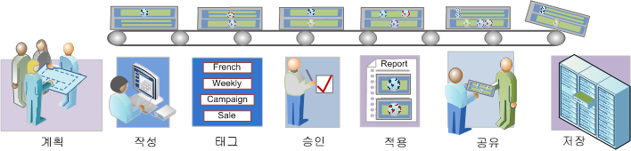

# 세그멘테이션 워크플로우 개요

세그먼트 빌더로 만들고 세그먼트 관리자를 통해 관리되는 세그먼트에 대해 제안되는 워크플로우에 대해 설명합니다.

## 세그멘테이션 워크플로우 개요

세그먼트 빌더로 만들고 세그먼트 관리자를 통해 관리되는 세그먼트에 대해 제안되는 워크플로우에 대해 설명합니다.

<!-- 

seg_workflow.xml

 -->

 계획 [ 세그먼트](/help/components/c-segmentation/c-segmentation-workflow/seg-plan.md)

세그먼트를 작성하고 세그먼트 관리 환경을 설정하기 전에 적절한 모든 질문을 했습니까? 의도한 목적 및 고유한 용도에 맞게 세그먼트를 디자인했습니까?

세그먼트 계획 및 구성에 도움을 얻으려면 세그먼트 계획 체크리스트를 참조하십시오.

 [세그먼트 작성](/help/components/c-segmentation/c-segmentation-workflow/seg-build.md)

모든 Analytics 기능에서 사용할 세그먼트를 작성하고 편집합니다.

THEN 연산자를 사용하여 세그먼트를 빌드하는 방법에 대해서는 [Build Sequential Segments](/help/components/c-segmentation/c-segmentation-workflow/seg-sequential-build.md) for how to build segments with the THEN operator.

 세그먼트 [ 태그 지정](/help/components/c-segmentation/c-segmentation-workflow/seg-tag.md)

편리한 구성 및 공유를 위해 세그먼트에 태깅합니다. 태깅은 Ad Hoc Analysis의 폴더 계층 구조를 대체합니다. 단순 및 고급 검색 및 조직에 대해 태그를 계획하고 할당하는 방법을 참조하십시오.

 세그먼트 [ 승인](/help/components/c-segmentation/c-segmentation-workflow/seg-approve.md)

세그먼트를 승인하여 표준 세그먼트로 지정합니다.

 세그먼트 [ 적용](/help/components/c-segmentation/c-segmentation-workflow/t-seg-apply.md)

보고서, 세그먼트 레일(세그먼트 표시)에서 직접 세그먼트를 적용할 수 있습니다.

 [ 세그먼트 공유](/help/components/c-segmentation/c-segmentation-workflow/t-seg-share.md)

다른 Analytics 도구, Adobe Target 및 Adobe Experience Cloud에서 의도한 대상과 세그먼트를 공유할 수 있습니다.

 세그먼트 [ 필터링](/help/components/c-segmentation/c-segmentation-workflow/t-seg-filter.md)

태그, 소유자 및 기타 필터 기준 필터링(모두, 내 세그먼트, 나와 공유, 즐겨찾기 및 승인됨 표시)

 세그먼트를 [ 즐겨찾기로 표시](/help/components/c-segmentation/c-segmentation-workflow/t-seg-favorite.md)

세그먼트를 즐겨찾기로 표시하는 것은 쉽게 사용할 수 있게 구성하는 또 다른 방법입니다.

[세그먼트 관리](/help/components/c-segmentation/c-segmentation-workflow/seg-manage.md)

세그먼트 관리자는 공유, 필터링, 태깅, 승인, 복사, 삭제 및 즐겨찾기로 표시 등 다양한 세그먼트 처리 작업을 제공합니다.
