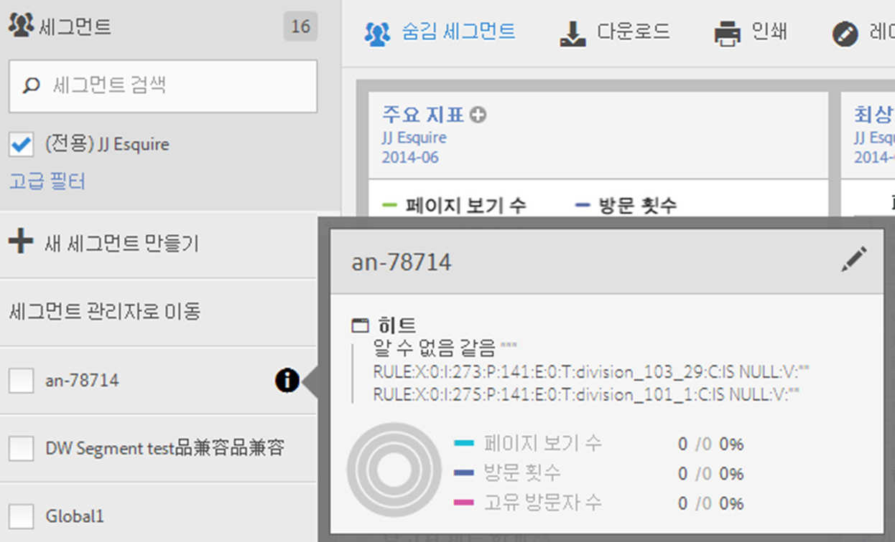
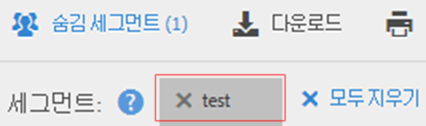

# 세그먼트 선택 및 적용

세그먼트 레일에서 보고서에 하나 이상의 세그먼트를 적용하는 방법

1. Bring up the report to which you want to apply a segment, for example the [!UICONTROL Pages Report].
1. Click **[!UICONTROL Show Segments]** above the report. 세그먼트 레일이 열립니다.

   

1. Mark the checkbox next to one or more of the segments or **[!UICONTROL Search Segments]** to find the right segment.

   >[!NOTE]
   >
   >보고서에 두 개 이상의 세그먼트를 적용할 수 있습니다(세그먼트 스택). 여러 세그먼트가 적용되면 각 세그먼트의 조건이 'and' 연산자를 사용하여 결합된 후 적용됩니다. 스택할 수 있는 세그먼트 수에는 제한이 없습니다.

   >[!NOTE]
   >
   >세그먼트 이름 옆에 있는 정보 아이콘(i)을 클릭하면 주요 지표를 미리 볼 수 있어 올바른 세그먼트가 있는지 여부 및 세그먼트의 범위를 확인할 수 있습니다.

1. You can filter by report suite by selecting the **[!UICONTROL (Only)`<report suite name>`]** check box. 이렇게 하면 보고서 세트에 마지막으로 저장한 세그먼트만 표시됩니다.
1. Click **[!UICONTROL Apply Segment]** and the report will refresh. 지금 적용한 세그먼트가 보고서 맨 위에 표시됩니다. 

   
