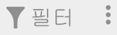
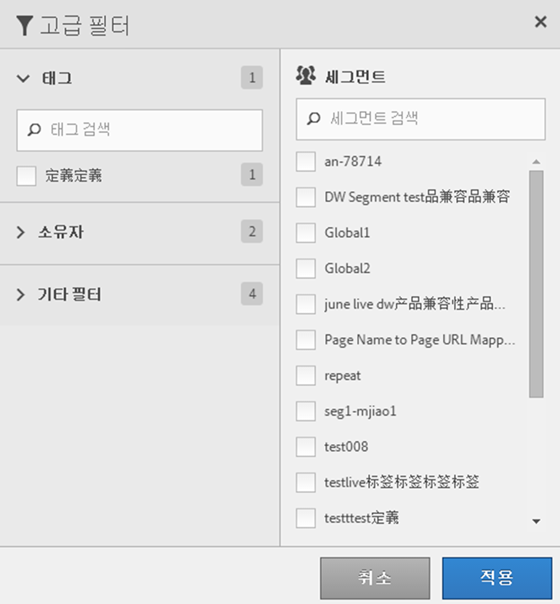

# 세그먼트 필터링

태그, 소유자 및 기타 필터 기준 필터링(모두, 내 세그먼트, 나와 공유, 즐겨찾기 및 승인됨 표시)

필터링을 수행하면 세그먼트 레일의 세그먼트를 더 쉽게 검색할 수 있습니다.

1. In the Segment Manager, click the **[!UICONTROL Filters]** icon:  

   

1. 다음 필터를 사용할 수 있습니다.

   | 필터 이름 | 설명 |
   |---|---|
   | 태그 | 특정 [태그](../../../components/c-segmentation/c-segmentation-workflow/seg-tag.md#concept_CD892CEB326C4986A1B67487052DBA50)가 있는 세그먼트만 필터링할 수 있습니다. 태그 열이 기본적으로 표시됩니다. |
   | 소유자 | 소유자별로 세그먼트를 필터링할 수 있습니다. |
   | 기타 필터 &gt; 모두 표시 | **(관리자만)** 모든 세그먼트, 해당 소유자 및 마지막으로 수정한 날짜가 표시됩니다. |
   | 기타 필터 &gt; 내 세그먼트 | 소유한 모든 세그먼트를 표시합니다. |
   | 기타 필터 &gt; 나와 공유 | 다른 사람이 사용자와 [공유한](../../../components/c-segmentation/c-segmentation-workflow/t-seg-share.md#task_7DC54643083E42C28F918E4F0845C5A5) 모든 세그먼트를 표시합니다. |
   | 기타 필터 &gt; 즐겨찾기 | 표시한 모든 세그먼트를 표시합니다. [즐겨찾기](../../../components/c-segmentation/c-segmentation-workflow/t-seg-favorite.md#task_F45DFA3FBF0C4082B46A0D032CB20FC5). |
   | 기타 필터 &gt; 승인됨 | 공식적으로 [승인된](../../../components/c-segmentation/c-segmentation-workflow/seg-approve.md#concept_DF477F151A9E483A92ED1DDAAF035953) 모든 세그먼트를 표시합니다. |
   | 세그먼트 검색 | 이름별로 세그먼트를 검색할 수 있습니다. |

