# 세그먼트 및 컨테이너 정보

세그먼트를 사용하여 특성 또는 웹 사이트 상호 작용에 따라 방문자 하위 집합을 식별할 수 있습니다. 세그먼트는 특정 요구에 대해 작성한 다음 확인, 편집 및 다른 팀 구성원과 공유하거나 다른 Adobe 제품 및 Analytics 기능에서 사용할 수 있는 정리된 대상 인사이트로 디자인됩니다.

## About segments and containers {#concept_82653C7E29FE49F5A4B5E5E93B0A6399}

세그먼트를 사용하여 특성 또는 웹 사이트 상호 작용에 따라 방문자 하위 집합을 식별할 수 있습니다. 세그먼트는 특정 요구에 대해 작성한 다음 확인, 편집 및 다른 팀 구성원과 공유하거나 다른 Adobe 제품 및 Analytics 기능에서 사용할 수 있는 정리된 대상 인사이트로 디자인됩니다.

<!-- 

seg_overview.xml

 -->

세그먼트는 중첩 컨테이너 모델을 사용하여 [!UICONTROL 방문자], [!UICONTROL 방문] 및 [!UICONTROL 히트] 수준 계층을 기준으로 합니다. 중첩된 컨테이너를 사용하여 컨테이너 간 규칙 및 컨테이너 내부 규칙에 따라 방문자 속성 및 작업을 정의할 수 있습니다. Analytics 세그먼트는 [!DNL Adobe Experience Cloud]의 여러 제품 및 기능에서 작성, 승인, 공유, 저장 및 실행할 수 있습니다. 보고서에서 세그먼트를 생성하거나, 대시보드 보고서로 작성하거나, 빠른 액세스를 위해 책갈피를 지정할 수 있습니다.

세그먼트 빌더에서 세그먼트를 작성하고 저장하거나 폴아웃 보고서([!DNL ad hoc analysis])에서 세그먼트를 생성할 수 있습니다. 중첩된 컨테이너 간 특정 규칙에 따라 미리 작성한 세그먼트를 사용 및 확장하고 결과를 필터링하여 보고서에 적용할 수 있습니다. 또한 세그먼트를 [스택 세그먼트](../../components/c-segmentation/c-segmentation-workflow/seg-workflow.md#concept_40C299B60B354E10B344702EA3138B34)로 함께 사용할 수도 있습니다.

세그먼트를 사용하여 페이지 보기의 특성 및 시퀀스에 따라 방문자를 식별할 수 있습니다.

## 세그먼트 {#section_CC4EBA2A6CCB4F8BBB8437052A880657}

세그먼트는 방문자가 누구인지(국가, 성별, 커피숍), 어떤 장치 및 서비스를 사용하는지(브라우저, 검색 엔진, 모바일 장치), 탐색을 시작한 위치(검색 엔진, 이전 종료 페이지, 자연어 검색) 등을 식별합니다.

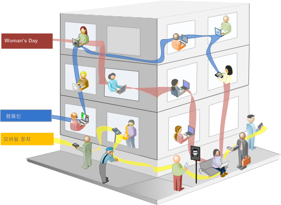

세그먼트는 다음 값을 기반으로 할 수 있습니다.

* 특성 기준 방문자—브라우저 유형, 장치, 방문 수, 국가, 성별
* 상호 작용 기준 방문자—캠페인, 키워드 검색, 검색 엔진
* 종료 및 시작 기준 방문자—Facebook, 정의된 랜딩 페이지, 참조 도메인의 방문자
* 사용자 지정 변수 기준 방문자—양식 필드, 정의된 카테고리, 고객 ID

세그먼트 빌더에서 대상 세그먼트를 작성할 경우 컨테이너 사이에 [!UICONTROL AND] 및 [!UICONTROL OR] 연산자를 사용하여 조건을 정의합니다.


이러한 유형의 세그먼트는 [!UICONTROL AND] 및 [!UICONTROL OR] 연산자를 사용하여 연결된 특성에 따라 데이터 세트를 필터링합니다.

## 순차적 세그먼트 {#section_EE5B14287FC44E0B96E77679A2438948}

순차적 세그먼트는 사이트 내의 탐색 및 페이지 보기에 따라 방문자를 식별할 수 있도록 하며 정의된 작업 및 상호 작용 세그먼트를 제공합니다. 순차적 세그먼트는 방문자가 좋아하는 항목 및 방문자가 피하는 항목을 식별하는 데 도움이 됩니다. 순차적 세그먼트를 작성할 때는 방문자 탐색을 정의하고 순서를 지정하는 데 [!UICONTROL THEN] 연산자가 사용됩니다.


| 방문 1 | 방문 2 | 방문 3 |
|---|---|---|
| 첫 번째 방문에서 방문자는 기본 랜딩 페이지(A)로 이동하고, 캠페인 페이지(B)를 제외한 다음 제품 페이지(C)를 열람했습니다. | 두 번째 방문에서 방문자는 다시 기본 랜딩 페이지(A)로 이동하고, 캠페인 페이지(B)를 제외하고, 제품 페이지(C)로 다시 이동했다가 새 페이지(D)로 이동했습니다. | 세 번째 방문에서 방문자는 첫 번째 및 두 번째 방문과 같은 경로로 이동한 다음 페이지 F를 제외하고 타게팅된 제품 페이지(G)로 바로 이동했습니다. |

순차적 세그먼트는 다음 히트 값에 기반을 둘 수 있습니다.

* 페이지 히트 시퀀스(단일 방문 내 페이지 보기, 별도 방문 간 페이지 보기, 페이지 보기를 제외한 방문)를 기반으로 하는 방문자
* 페이지 보기 간 및 페이지 보기 후 시간(시간 제한 후, 히트 사이, 이벤트 후)을 기준으로 하는 방문자


순차적 세그먼트는 [!UICONTROL THEN] 연산자를 사용하여 사용자 작업을 기준으로 데이터 세트를 필터링합니다. 

## 세그먼트 컨테이너 정보 {#concept_A38E7000056547399E346559D85E2551}

세그먼트는 속성 또는 사이트와의 상호 작용에 따라 방문자를 필터링하는 조건을 설정합니다. 세그먼트에서 조건을 설정하려면 방문자 특성 및/또는 탐색 트레이트에 따라 방문자를 필터링하기 위한 규칙을 설정합니다. 방문자 데이터를 더 자세히 분류하려면 각 방문자에 대한 특정 방문 및/또는 페이지 보기 히트별로 필터링할 수 있습니다. 세그먼트 빌더는 이러한 하위 집합을 작성하고 중첩된 계층형 방문자 &gt; 방문 &gt; 히트 컨테이너로 규칙을 적용하는 간단한 아키텍처를 제공합니다.

<!-- 

seg_container_overview.xml

 -->

## 방법 비디오 {#section_89D6184890AF4086A8056BFBB0B68C29}

YouTube 비디오에서는 세그먼트 컨테이너의 의미와 세그먼트 컨테이너를 사용하는 방법에 대한 간단한 개요를 제공합니다.

| 비디오 이름 | 비디오 링크 |
|---|---|
| 세그먼트 컨테이너 | [Adobe Analytics의 세그먼트 컨테이너](https://www.youtube.com/watch?v=A513j-ej0oc&index=2&list=PL2tCx83mn7GtHqZicFTa--aE6d02BvvTd) |

## 컨테이너 정보 {#section_AF2A28BE92474DB386AE85743C71B2D6}

세그먼트 빌더에 사용된 컨테이너 아키텍처는 **[!UICONTROL 방문자]를 가장 바깥쪽 컨테이너로 정의하고 여러 방문 및 페이지 보기에서 해당 방문자 고유의 중요 데이터를 포함합니다.** 중첩된 **[!UICONTROL 방문]** 컨테이너를 사용하여 방문에 따라 방문자의 데이터를 분석하는 규칙을 설정할 수 있고, 중첩된 **히트]컨테이너를 사용하여 개별 페이지 보기에 따라 방문자 정보를 분류할 수 있습니다.[!UICONTROL ** 각 컨테이너를 사용하여 방문자 내역에서 방문별로 분류된 상호 작용을 보고하거나 개별 히트를 분류할 수 있습니다.

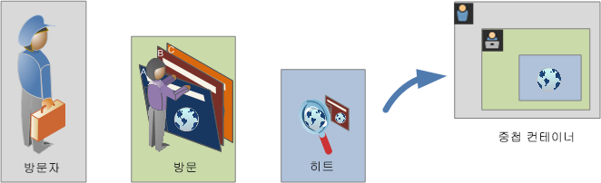

**방문자 컨테이너**

방문자 컨테이너에는 지정된 기간 내의 방문자에 대한 모든 방문 및 페이지 보기가 포함됩니다. 방문자 수준의 세그먼트는 조건을 충족하는 페이지와 방문자가 열람한(그리고 정의된 날짜 범위에 의해서만 제한되는) 다른 모든 페이지를 반환합니다. 가장 광범위하게 정의된 컨테이너인 방문자 컨테이너에서 생성된 보고서는 모든 방문에 대한 페이지 보기를 반환하고 다중 방문 분석을 생성할 수 있도록 합니다. 따라서 방문자 컨테이너는 정의된 날짜 범위에 따라 변경되기가 가장 쉽습니다.

방문자 컨테이너는 방문자의 전체 내역을 기반으로 하는 값을 포함할 수 있습니다.

* 첫 구매까지 소요된 일 수
* 원래 시작 페이지
* 처음 참조 도메인

**방문 컨테이너**

방문 컨테이너에서 특정 웹 세션에 대한 페이지 상호 작용, 캠페인 또는 대화를 식별할 수 있습니다. 방문 컨테이너는 규칙이 충족되면 전체 방문 세션에 대한 동작을 캡처하므로 가장 일반적으로 사용되는 컨테이너이며 세그먼트 작성 및 적용 시 포함 또는 제외할 방문을 정의할 수 있도록 합니다. 또한 동일한 방문에서 뉴스 및 스포츠 섹션을 열람한 방문자 수를 묻는 질문에 답변하는 데 도움이 될 수 있습니다. 또는 성공적으로 판매로 전환되도록 한 페이지도 확인할 수 있습니다.

방문 컨테이너에는 방문당 발생 횟수에 따른 값이 포함됩니다.

* 방문 번호
* 시작 페이지
* 재방문 주기
* 기여도 지표
* 선형 할당 지표

**히트 컨테이너**

히터 컨테이너는 세그먼트에서 포함 또는 제외할 페이지 히트를 정의합니다. 이것은 조건이 참일 때 특정 클릭 수 및 페이지 보기를 식별하는 데 사용할 수 있는 가장 좁은 범위의 컨테이너로, 단일 추적 코드를 확인하거나 특정 사이트 섹션 내에서의 동작을 격리할 수 있습니다. 주문이 이행되었을 때의 마케팅 채널과 같이 한 동작이 발생할 때의 특정 값을 정확히 알아내고 싶을 수 있습니다.

히트 컨테이너에는 단일 페이지 분류에 따른 값이 포함되어 있습니다.

* 제품
* 목록 Prop
* 목록 eVar
* 머천다이징 eVar(이벤트 컨텍스트)

   >[!NOTE]
   >
   >Evar와 같이 지속되는 값에 이 컨테이너를 사용하면 해당 값이 지속되는 모든 히트가 생성됩니다. 1주 후에 만료되는 추적 코드의 경우 여러 방문에서 이 값이 유지될 수 있습니다.

**논리 그룹 컨테이너**

논리 그룹 컨테이너를 사용하면 세그먼트 규칙 내의 별도 컨테이너를 제공하여 계층 구조를 기반으로 하지 않는 개체들을 필터링할 수 있습니다. 예를 들어, 방문자를 기반으로 필터링을 수행하는 세그먼트 내의 중첩된 컨테이너를 제공할 수 있습니다. 이런 유형의 논리에서는 선택한 방문자들에 대해서만 계층 구조를 세분화하여(이미 최상위 방문자 컨테이너를 가지고 있으므로) 필터링해야 합니다. 이 작업은 논리 그룹 컨테이너를 사용하여 완수할 수 있습니다. 자세한 내용은 [논리 그룹 예](../../components/c-segmentation/c-segmentation-workflow/seg-sequential-build.md#concept_83AEC78CD25F442EBEE364856A889560)를 참조하십시오.

## 컨테이너 중첩 {#section_7FDF47B3C6A94C38AE40D3559AFFAF70}

다른 컨테이너 내에 세그먼트 컨테이너를 만들면 세그먼트 내에 세그먼트를 만들게 됩니다. 중첩 컨테이너에는 다음 논리가 사용됩니다.

1. 가장 바깥쪽 컨테이너를 사용하여 포함된 데이터를 확인합니다. 이 바깥쪽 규칙에 맞지 않는 모든 데이터는 세그먼트화된 보고서에서 삭제됩니다.
1. 나머지 데이터에 중첩 규칙을 적용합니다. 중첩 규칙은 첫 번째 규칙에 해당되지 않는 어떤 히트에도 적용되지 않습니다.
1. 모든 중첩 컨테이너 규칙이 계산될 때까지 반복합니다. 나머지 데이터는 결과 보고서에 포함됩니다.

컨테이너 사이 및 한 컨테이너 내의 규칙 사이에 중첩을 사용할 수 있습니다. 다음은 각 컨테이너에 중첩할 수 있는 항목입니다.

| 컨테이너 이름 | 내부에 중첩할 수 있는 항목 |
|---|---|
| 히트 | 이벤트만 |
| 방문 | 히트 컨테이너, 이벤트 |
| 방문자 | 방문 컨테이너, 히트 컨테이너, 이벤트 |
| 논리 그룹에 포함될 수도 있습니다. | 방문자 컨테이너, 방문 컨테이너, 히트 컨테이너 |

**단일 정의 내에 여러 컨테이너 포함**

새 조합 세그먼트에 여러 세그먼트를 포함하면 데이터를 좀 더 세분화할 수 있습니다. 두 개의 기존 세그먼트를 함께 드래그하면 방문자를 필터링할 때의 "OR" 문처럼 작동합니다. 캔버스의 모든 컨테이너가 모든 데이터에 대해 검토되고 컨테이너 중 하나와 일치하는 모든 데이터는 보고에 포함됩니다.

예를 들어 다음과 같이 Country = United States인 방문 컨테이너와 Order = True인 방문 컨테이너를 함께 드래그하면

```
Country = United States + Order = True
```

다음 순서로 동작하는 세그먼트가 작성됩니다.

1. 이 세그먼트는 처음에는 전체 데이트를 확인한 다음 미국 내의 모든 방문자를 파악합니다.
1. 그런 후 이 세그먼트는 모든 데이터를 다시 확인하면서 방문자가 주문을 했는지 알아봅니다.
1. 이렇게 확인된 두 데이터 세트가 보고서에 적용됩니다.

## 순차적 세그먼트의 컨테이너 {#section_324AF503F51A4A62806151FE440F3B2E}

순차적 세그멘테이션은 계층적으로 중첩된 [!UICONTROL 방문자], [!UICONTROL 방문] 및 [!UICONTROL 히트](페이지 보기 또는 기타 차원 포함)를 포함하는 동일한 기본 컨테이너를 사용합니다.


[!UICONTROL 방문]은 [!UICONTROL 방문자] 컨테이너에 포함되어 있고 [!UICONTROL 히트 수]는 [!UICONTROL 방문자] 또는 [!UICONTROL 방문] 컨테이너에 포함되어 있어 [!UICONTROL 방문자]가 순차적 세그멘테이션에서 가장 높은 수준의 컨테이너를 이루게 됩니다. 잘 정렬된 순차적 세그먼트를 만들려면 반드시 이 [컨테이너 계층](../../components/c-segmentation/seg-overview.md#section_7FDF47B3C6A94C38AE40D3559AFFAF70)을 유지해야 합니다.

**순차적 세그먼트를 작성하려면** 컨테이너가 중첩되고 순차적 논리가 [!UICONTROL THEN] 연산자로 연결되어야 하며 이를 위해서는 방문자 시퀀스를 기준으로 각 컨테이너가 참이어야 합니다.


이 컨테이너 계층에 대한 유일한 예외는  [논리 그룹 컨테이너](../../components/c-segmentation/c-segmentation-workflow/seg-sequential-build.md#concept_83AEC78CD25F442EBEE364856A889560)를 사용하는 경우입니다. [!UICONTROL 논리 그룹] 컨테이너를 통해 이벤트 및 차원 캡처 순서 없이 순차적 순서를 벗어나서 히트를 컨테이너 내에 중첩할 수 있습니다.


## 컨테이너 데이터 기반 보고서 {#concept_BE822C12F87C4F07B7147D80BEFBAB87}

컨테이너를 사용하면 세그먼트를 분류하고 보고서에 적용할 때 보고 값에 따라 다른 데이터를 다르게 필터링할 수 있습니다.

<!-- 

seg_container_reports.xml

 -->

방문자 &gt; 방문 &gt; 히트 컨테이너 계층 구조의 각 수준에서 캡처된 데이터는 세그먼트를 작성하는 방식에 영향을 줍니다. 동일한 데이터 세트를 사용하여 동일한 보고서에 적용된 동일한 세그먼트를 가져올 경우 보고서를 생성하는 원본 컨테이너를 기준으로 다른 값이 파생됩니다. 컨테이너 보고 수준 및 히트 간 값 지속성과 같은 요인은 보고 정확도를 크게 변경시킬 수 있습니다.

## 컨테이너 데이터의 기본 사항 {#section_9576D970F912450191AFB5B83F7F1656}

예를 들어 아래 표시된 방문자는 첫 번째 방문에서 특정 사이트를 방문하고, 홈 페이지를 방문했다가 3개의 추가 페이지를 방문한 다음 매출로 이어졌습니다. 별도의 방문에서 방문자는 이번에는 제품 페이지부터 들어갔다가 홈 페이지를 방문한 후 다시 제품 페이지로 이동한 다음 겨울 모자를 보고 세션을 마감했습니다. 세그먼트의 각 컨테이너에 대해 캡처한 데이터에 따라, 보고서에는 다른 값이 표시됩니다.

아래의 *Pages equals Winter Coat* 세그먼트는 **페이지 보고서**&#x200B;에 적용됩니다.

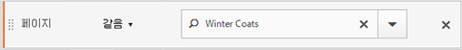

선택한 컨테이너에 따라 보고서에 다른 결과가 표시됩니다.

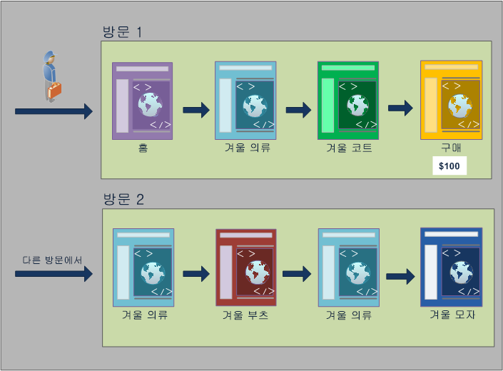

**히트 컨테이너에서 보고**

이 조건이 히트 컨테이너를 벗어나지 않으면 보고서에는 *Page = Winter Coats*&#x200B;에 부합되는 페이지만 표시됩니다. 한 페이지로만 이루어진 컨테이너에서는 한 페이지만 이 조건에 부합되므로 겨울 코트 페이지만 표시됩니다.

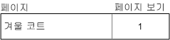

히트 컨테이너에서 보고하는 경우 여러 다른 컨테이너에서 보고하는 방식이 전체 보고 값에 어떤 영향을 미치는지 확인할 수 있습니다. 세그먼트 보고서를 보면 페이지 보기 수가 방문 횟수와 거의 비슷하고(약 2,000명의 방문자가 한 번의 방문에서 중복된 페이지를 열람하여 총 페이지 보기 횟수로 계산됨) 고유한 방문자 수가 방문 횟수와 거의 비슷하다는 사실을 알 수 있습니다(약 2,000명의 고유한 방문자가 2번 이상 방문함).


>[!IMPORTANT]
>
>이 예에서는 히트, 방문 또는 방문자 컨테이너에서 데이터를 보는 방법에 관계없이 모두 동일한 수의 방문자, 63, 541 이 있습니다. 보고서 생성 방식에 관계없이 초기 방문자 조건(겨울 코트 페이지를 열람한 방문자)이 그대로 유지됩니다. 다른 수준에서 보고하는 데이터의 하위 집합입니다.

**방문 컨테이너에서 보고**

동일한 조건이 방문 컨테이너 내에 있는 경우 보고서는 *Page equals Winter Coats*&#x200B;가 참인 방문의 모든 페이지를 표시합니다. 겨울 코트 페이지를 필터링하지만 이 조건이 참인 방문의 다른 모든 페이지를 캡처합니다. 이 방문자는 해당 조건이 충족된 방문 내의 홈, 제품 및 구매 페이지도 방문했으므로 방문자 컨테이너 데이터를 사용하여 보고할 때 보고서에 이러한 추가 페이지가 표시됩니다.

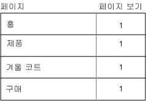

방문 컨테이너의 세그먼트 값을 표시하면 페이지 보기 수가 크게 증가했음을 알 수 있습니다. 이것은 방문 컨테이너에서 보고할 경우 해당 조건을 충족하는 모든 페이지와 해당 방문에서 열람된 다른 모든 페이지가 식별됩니다(모든 페이지 보기가 각 방문 컨테이너에서 캡처됨).


**방문자 컨테이너에서 보고**

동일한 조건이 방문자 컨테이너 내에 있는 경우 보고서는 *Page equals Winter Coats*&#x200B;가 참인 방문자가 열람한 모든 페이지를 표시합니다. 즉, 방문자가 겨울 코트 페이지를 열람한 경우 방문자 컨테이너의 모든 페이지(다른 방문의 페이지 보기 포함)가 표시됩니다. 결과적으로 이 조건에 맞지 않는 페이지는 해당 방문자가 이전에 열람했기 때문에 보고서에 표시됩니다. 이전에 나왔고 조건을 특별히 충족하지 않더라도 방문자 컨테이너의 모든 페이지가 보고서에 표시됩니다.

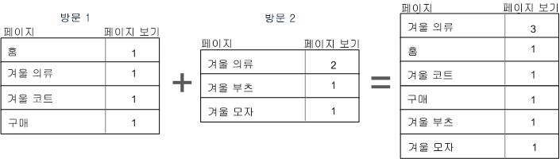

방문자 컨테이너의 세그먼트를 표시하면 해당 페이지 보기 및 방문 횟수가 증가했음을 알 수 있습니다. 이것은 방문자 수준에서 방문자가 겨울 코트 페이지를 한 번 방문한 경우(해당 조건 충족) 해당 방문자에 대해 다른 모든 페이지 보기 및 다른 모든 방문이 캡처되기 때문입니다.

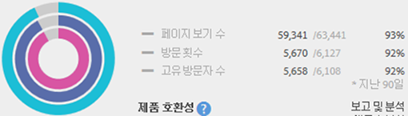

요약하면 다양한 데이터 분류 시 세그멘테이션이 작동하는 방식을 이해하면 반환되는 데이터를 보다 정확하게 해석할 수 있습니다.

## 컨테이너 수준에서 보고 {#section_D0604748F2794327B8C668617A31EC18}

세그먼트 데이터의 모든 분류에는 적용되는 범위가 있습니다. 대부분의 보고서 분류는 페이지 보기를 기반으로 하지만 여러 중요한 세그먼트는 방문 컨테이너를 기반으로 하며 이보다는 적지만 방문자 컨테이너를 기반으로 하는 경우도 있습니다. 컨테이너 범위를 기반으로 보고를 이해하는 것이 중요합니다.

앞서 사용된 *Page = Winter Coats* 세그먼트 예제를 기반으로 하는 아래 나열된 문제는 컨테이너 데이터가 적용되는 방식과 데이터 범위가 세그먼트 유형과 일치하는 방식을 기반으로 세그먼트의 다른 측면을 정의합니다.

** 일치하는 세그먼트 규칙을 기반으로 한 세그먼트 컨테이너**

데이터의 기본 범위에 따라 세그먼트 컨테이너를 적용하면 라인 항목이 세그먼트 규칙과 일치하는 경우 예상되는 결과가 나타납니다.

* **페이지가 "겨울 코트"인 경우의 히트 컨테이너**: 이 세그먼트를 사용한 [페이지 보기] 보고서는 "겨울 코트"와 동일한 값만 반환됩니다. 다른 모든 페이지는 보고에서 제외됩니다.
* **시작 페이지가 "겨울 의류"인 방문 컨테이너**: 이 세그먼트를 사용한 [시작 페이지 보기] 보고서는 해당 시작 페이지가 세그먼트 규칙과 일치하므로 두 번째 방문만 반환합니다.
* **방문 횟수가 1인 경우의 방문 컨테이너**: 첫 번째 방문의 [모두 방문 보기] 페이지 보기는 세그먼트 규칙과 일치하므로 보고서에 포함됩니다.

**방문 컨테이너 수준의 페이지 보기**

많은 세그먼트 규칙이 방문당 페이지 보기 횟수를 식별합니다. 이러한 경우 단일 히트가 규칙과 일치하는 경우에만 전체 방문자 컨테이너가 적용됩니다. 이 세그먼트 보고서는 방문을 기준으로 하는 페이지 보기가 방문당 페이지 보기에 따른 인사이트를 제공하므로 특히 유용합니다.

* **페이지가 "겨울 코트" 페이지인 방문 컨테이너**: 방문자 컨테이너 수준의 [페이지] 보고서에는 "겨울 의류" 페이지 보기를 포함하는 방문의 모든 페이지 보기가 표시됩니다. 페이지가 세그먼트 규칙과 일치하는 경우 해당 방문과 연결된 모든 페이지가 보고서에 포함됩니다.
* **페이지가 "홈" 페이지인 방문 컨테이너**: 이 세그먼트가 있는 [페이지] 보고서에는 첫 번째 방문의 데이터만 표시됩니다. 두 번째 방문에서는 방문자가 "홈" 페이지를 보지 않았기 때문입니다.
* **페이지가 "겨울 의류"인 방문자 컨테이너**: [페이지] 보고서에서 이 세그먼트는 두 방문에서 방문자가 "겨울 의류" 페이지를 열람했으므로 두 방문의 모든 데이터를 가져옵니다.

**페이지 보기 수보다 작은 히트를 식별하는 세그먼트 컨테이너**

분류 범위보다 더 작은 컨테이너를 포함하는 세그먼트를 사용하면 예기치 않은 결과가 반환됩니다. 더 작은 분류를 사용하면 해당 데이터 범위의 모든 히트가 포함됩니다.

* **시작 페이지가 제품 페이지인 히트 컨테이너**: 모든 페이지는 방문자의 시작 페이지와 연결되므로 방문 기반 분류가 진행됩니다. 이 세그먼트를 사용하면 시작 페이지인 제품 페이지 뿐만 아니라 해당 방문의 모든 히트도 포함됩니다.
* **목록 변수 1에 ValueA가 포함되는 히트 컨테이너**: 목록 변수와 동일한 히트에 대해 여러 개의 값이 정의되어 있으면 모든 변수 값이 세그먼트에 포함됩니다. 히트 컨테이너는 히트를 분류할 가장 작은 세그먼트 컨테이너이므로 동일한 페이지 보기에서 나타나는 값을 분리할 방법이 없습니다.
* **페이지가 "구매"인 히트 컨테이너**: 페이지 보기를 지표로 사용하는 경우 예상대로 구매 페이지만 표시됩니다. [매출 기여도] 보고서를 사용하는 경우 기여도 지표가 방문을 기반으로 하므로 첫 번째 방문의 모든 페이지가 $100를 받습니다.
* **페이지가 "겨울 코트"인 히트 컨테이너**: 페이지 보기를 지표로 사용하는 경우 예상대로 겨울 코트 페이지만 표시됩니다. [매출 기여도] 보고서를 사용할 경우 이 차원은 지속성 차원을 요구하므로 페이지가 크레딧을 받지 못합니다. 실제로 구매를 하는 페이지 보기(구매 페이지)는 히트 컨테이너에 포함되지 않으므로 어떤 항목에도 매출 기여도가 부여되지 않습니다. 하만 방문 컨테이너에서 보고서를 실행할 경우에는 해당 방문의 모든 페이지 보기가 포함되며, 세션에서 열람된 모든 페이지에 매출 기여도($100)가 분산됩니다.

## 컨테이너 간 지속성 {#concept_E579D72B1C644AE9A4C4EAF6B47A4DCB}

캠페인 eVar 또는 참조 차원과 같이 페이지 범위에 걸쳐 지속되는 차원별로 수행한 필터링은 컨테이너 수준에서 수집된 데이터에 적용되며, 보고의 정확성 측면에서 이해되어야 합니다.

<!-- 

seg_container_persistence.xml

 -->

세그먼트 데이터는 차원의 지속성 또는 선택한 여러 페이지에 적용된 변수에 따라 다를 수 있습니다. 페이지 차원과 같은 일부 차원은 페이지 수준에서 고유한 값을 제공하며 히트 컨테이너의 데이터를 기준으로 필터링됩니다. (자세한 내용은  [컨테이너 데이터 기반 보고서](../../components/c-segmentation/seg-overview.md#concept_BE822C12F87C4F07B7147D80BEFBAB87) 예제 참조). 참조 도메인 차원과 같은 기타 차원은 한 번에 방문한 여러 페이지에서 지속됩니다. 일부 차원 또는 적용된 변수(예: Visit Duration)는 방문자의 전체 내역 내에서 그대로 유지됩니다.

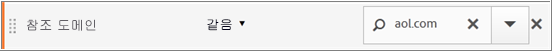

페이지 차원과 달리, 참조 도메인 값은 이 방문의 각 페이지에 연결됩니다. 예를 들어 아래 방문자는 참조 사이트에서 홈 페이지에 도달합니다. 결과적으로 해당 방문 내의 모든 페이지에 동일한 참조 도메인 값이 할당됩니다.

아래의 *Referring Domain equals aol.com* 세그먼트는 **페이지 보고서**&#x200B;에 적용됩니다.

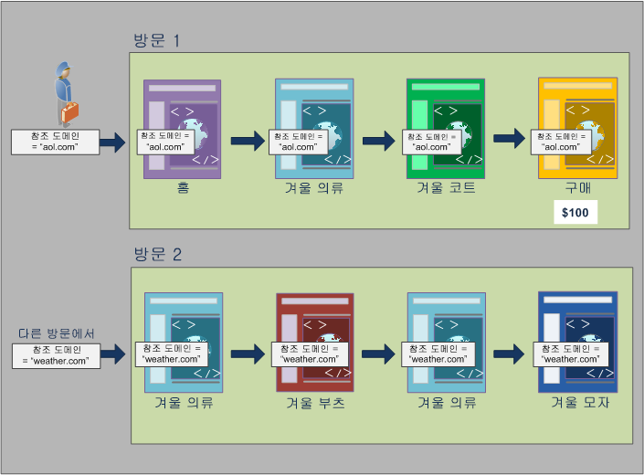

새 방문에서 해당 방문자는 다른 사이트에서 참조됩니다. 따라서 새 방문의 모든 페이지에는 각 페이지 보기에 대한 새로운 참조 도메인 값이 할당됩니다.

**히트 컨테이너에서 보고**

동일한 방문 내의 모든 페이지 보기에는 동일한 참조 도메인 값이 할당되므로 *Referring Domain = "aol.com"*&#x200B;인 히트 컨테이너 수준에서 보고를 하면 아래 표에 나오는 모든 페이지가 반환됩니다.

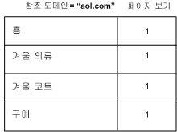

히트 컨테이너의 데이터를 표시하여 겨우 32,000명이 넘는 방문자의 33,000번이 넘는 방문에서 겨우 92,000번 이상의 페이지 보기가 확인되었습니다. 평균적으로 각 방문당 3번의 페이지 보기가 있었으며 거의 모든 방문이 고유한 방문자에 의한 것이었습니다.


**방문 컨테이너에서 보고**

이와 동일한 조건이 페이지 보고서에 대한 방문 컨테이너에서 필터링되면 *Referring Domain = "aol.com"*&#x200B;이 참인 방문의 모든 페이지가 조건에 부합되는 것입니다. 참조 도메인의 값은 방문 수준에서 설정되므로 페이지 보기 및 방문 수준의 보고서는 동일합니다.


이 예제에서 모든 페이지는 방문을 기준으로 동일한 참조 도메인 값을 가지므로 방문 컨테이너 수준의 보고서는 페이지 보기 컨테이너의 보고서와 (거의) 동일합니다(데이터 오류로 인해 98, 234 ~ 98,248 정도의 미미한 차이는 있음).


**방문자 컨테이너에서 보고**

방문자 컨테이너에서 페이지 보고서는 *Referring Domain equals "aol.com"*&#x200B;이 참인 모든 방문자가 열람한 모든 페이지를 표시합니다. 따라서 내역(정의된 시간 내)에서 언제든지 방문자의 참조 도메인으로 *"aol.com"*&#x200B;이 사용되면 방문자 컨테이너의 모든 페이지(다른 방문의 페이지 보기 포함)가 표시됩니다. 기본 조건을 충족하지 않는 페이지도 방문자 컨테이너에 포함되므로 보고서에 표시됩니다. 이전에 나왔고 조건을 특별히 충족하지 않더라도 방문자 컨테이너의 모든 페이지가 보고서에 표시됩니다.

참조 도메인 보고서에서 4개의 페이지 보기에서는 *Referring Domain = "aol.com"*&#x200B;이 적용되지만, 방문자가 방문한 다른 페이지에서는 *Referring Domain = "weather.com"*&#x200B;이 적용됩니다. 방문자 컨테이너에서는 "aol.com"에 해당하는 방문자 목록이 표시되지만 참조 도메인이 세그먼트의 초기 요청과 일치하지 않는 "weather.com"인 페이지가 표시됩니다.

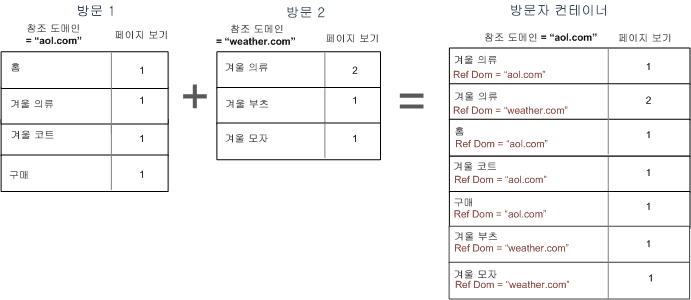

방문자 컨테이너에서 데이터를 볼 때는 페이지 보기가 크게 증가했다는 사실을 알 수 있습니다(98,248 ~ 112, 925). 이것은 다른 참조 도메인 값이 방문자 컨테이너 수준에 저장된 경우를 비롯하여 해당 방문자의 모든 페이지 보기가 포함되었기 때문입니다(해당 방문자의 추가 방문도 포함되어 방문이 33,203에서 43,448로 늘어남).

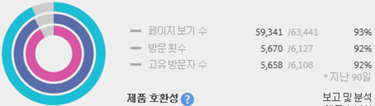

요약하면 다음과 같습니다.

* 방문 컨테이너는 적어도 한 페이지가 조건을 충족하는 방문에서 본 모든 페이지를 반환합니다. 따라서 특정 페이지를 첫째 날, 방문 1에서만 열람했다고 해도 전체 방문에서 열람한 모든 페이지가 데이터에 포함됩니다.
* 세그먼트화하는 조건이 eVar 또는 다른 유형의 지속형 변수와 관련된 경우에는 유의하시기 바랍니다. 예를 들어 조건 “where campaign contains email”을 사용할 수 있으며 7일 이후에는 만료됩니다. 따라서 이 캠페인이 첫 번째 방문에서 설정된 경우 7일 더 지속됩니다. 이 캠페인이 첫 번째 방문에서만 설정되었더라도 각 방문이 포함됩니다. 다른 방문도 포함됩니다(보고서의 날짜 범위에 포함되는 경우). 지속되는 값을 포함하지 않으려면 이벤트 “instance of” 또는 동급의 Prop 변수(사용 가능한 경우)를 사용합니다.

