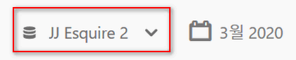
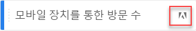
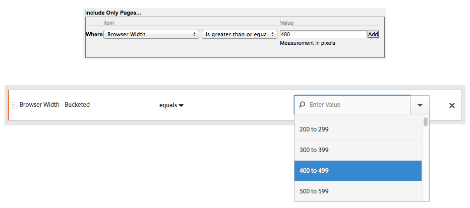

# FAQ

세그멘테이션 기능, 액세스, 권한, 우수 사례 및 기존 세그먼트 관리에 대한 자주 묻는 질문에 대답합니다.

## 기능 {#section_BD58629D1A9346BF879E229FA6BEC7A2}

* Analysis Workspace의 세그멘테이션:

   * [세그먼트를 비교](https://marketing.adobe.com/resources/help/en_US/analytics/analysis-workspace/segment-comparison.html)할 수 있습니다.
   * 비교에서 [세그먼트를 차원으로](https://marketing.adobe.com/resources/help/en_US/analytics/analysis-workspace/segments_as_dimensions.html) 사용합니다.
   * [폴아웃 분석](https://marketing.adobe.com/resources/help/en_US/analytics/analysis-workspace/graphics/compare-segments-fallout.html)에서 세그먼트를 사용합니다.

* [여러 세그먼트를 보고서 또는 프로젝트에 적용](../../components/c-segmentation/c-segmentation-workflow/seg-workflow.md#task_13E69C7D428A43EF9CCCA7F1104F1E8F)할 수 있습니다.
* 세그먼트는 모든 보고서 세트에 범용입니다.
* [세그먼트 빌더는](../../components/c-segmentation/c-segmentation-workflow/seg-workflow.md#concept_643F2DF74C544796B58F4656ABC5F726) 세그먼트 작성을 단순화합니다.
* [세그먼트 관리자](../../components/c-segmentation/c-segmentation-workflow/seg-workflow.md#concept_7A2E019317864065B7C641DC3315928F)를 사용하면 세그먼트 공유, 태그 지정, 확인 및 승인 기능을 포함하는 [워크플로우](../../components/c-segmentation/c-segmentation-workflow/seg-workflow.md#concept_6D2E1A72A3AD4EBBB9135094F2D9DEDF)를 설정할 수 있습니다.

* [세그먼트를 태그 지정](../../components/c-segmentation/c-segmentation-workflow/seg-workflow.md#concept_CD892CEB326C4986A1B67487052DBA50)하여 나중에 폴더를 사용하지 않고도 구성 및 검색이 가능합니다. Previously, you used folders (in [!DNL Ad Hoc Analysis]) to organize your segments.

* Ad Hoc Analysis 외부에서 [순차적 세그먼트](/help/components/c-segmentation/c-segmentation-workflow/seg-sequential-build.md)를 만들 수 있습니다.
* 페이지 보기 컨테이너는 단지 페이지 보기가 아닌 모든 유형의 데이터를 포함한다는 사실을 나타내기 위해 히트 컨테이너로 이름이 변경되었습니다. 예를 들어 모바일 SDK에서 발생한 링크 추적 호출 및 trackAction 호출은 히트 컨테이너에 의해 모두 포함 및 제외됩니다. 이 컨테이너가 작동하는 방식은 변경되지 않았으며 이름만 바뀌었습니다.

자세한 내용은 디지털 마케팅 블로그의 [Adobe Analytics에서의 세그멘테이션 개선](https://blogs.adobe.com/digitalmarketing/analytics/improving-segmentation-adobe-analytics/) 게시물을 참조하십시오.

## Access the Segmentation Tools {#section_088AD0E4E21943DFA8CF7206AEC485DD}

**세그먼트 빌더로 이동하는 방법**

다음 작업을 수행하여 세그먼트 빌더에 액세스할 수 있습니다.

* 기존 보고서를 표시하고 왼쪽 탐색에서 세그먼트 아이콘  In the segment rail that displays, then click **[!UICONTROL Add]**, or

* 세그먼트 관리자 위쪽에 있는 **[!UICONTROL + 추가를 클릭합니다]**.  

   또는 

* 세그먼트 관리자에서 기존 세그먼트 제목을 클릭하여 세그먼트 빌더에서 세그먼트를 편집합니다.

**세그먼트 관리자로 이동하는 방법**

세그먼트 빌더 액세스 방법:

* Going to  **[!UICONTROL Analytics]** &gt; **[!UICONTROL Components]** in the top navigation. Then click **[!UICONTROL Segments]**, or

* 기존 보고서를 표시하고 왼쪽 탐색에서 세그먼트 아이콘  Then click **[!UICONTROL Manage]**, or

* 인터페이스의 어디에서든지 슬래시 키 '/'를 누르고 세그먼트 관리자를 검색합니다.

**이전 세그먼트 드롭다운은 어디로 이동했습니까?**

Reports &amp; Analytics의 세그먼트 드롭다운은 기능이 훨씬 더 풍부한 [세그먼트 빌더](../../components/c-segmentation/c-segmentation-workflow/seg-workflow.md#concept_643F2DF74C544796B58F4656ABC5F726) 인터페이스 기능으로 바뀌었습니다. 이 인터페이스를 사용하여 여러 보고서 세트 및 Adobe Analytics 솔루션에서 유용한 "범용" 세그먼트를 만들 수 있습니다. To view a list of existing segments, click the Segments icon  

왼쪽 탐색에서 세그먼트 레일이 표시됩니다.

**이전 보고서 세트 드롭다운은 어디로 이동했습니까?**

보고서 세트 드롭다운이 각 보고서 또는 대시보드의 오른쪽 상단에 있는 날짜 선택기 옆으로 이동되었습니다.

## 권한 {#section_648DFA3A882146C485A84ED014EEC707}

**세그먼트를 사용하고 만들고 관리하는 데 필요한 권한**

기본적으로 모든 사용자는 개인용 세그먼트를 만들고 편집할 수 있습니다. 하지만, 관리자는 [세그먼트를 만들 수 있는 권한](https://marketing.adobe.com/resources/help/en_US/reference/groups.html)을 가져야 하는 사용자를 결정하고, 이러한 사용자를 특정 그룹에 지정할 수 있습니다. 이러한 세그먼트는 다른 Analytics 사용자와 직접 공유할 수 있습니다.

관리자는 세그먼트를 편집하고, 그룹 및 조직의 모든 사람과 세그먼트를 공유할 수 있습니다. [더 보기...](../../components/c-segmentation/seg-reference/seg-rights.md)

**회사의 세그먼트를 볼 수 있습니까?**

Yes, Admins can see all segments within the [!DNL Analysis Workspace] and [!DNL Reports & Analytics] user interfaces.

Ad Hoc Analysis 및 Report Builder는 사용자가 소유한 세그먼트와 사용자와 공유된 세그먼트를 표시합니다.

**세그먼트 관리자에서 모든 Analytics 세그먼트를 관리할 수 있습니까?**

예, 모든 세그먼트는 Analysis Workspace, Reports &amp; Analytics 및 Ad Hoc Analysis의 세그먼트 관리자에서 관리할 수 있습니다. 세그먼트 관리자는 소유자(세그먼트를 만든 사용자), 공유 사용자 및 관리 사용자가 볼 수 있는 세그먼트를 표시합니다. 세그먼트 선택기는 사용자가 소유하고 사용자와 공유된 세그먼트를 표시합니다.

관리자는 Analysis Workspace 및[!DNL Reports & Analytics] 사용자 인터페이스 내에서 모든 세그먼트를 볼 수 있습니다.

Ad Hoc Analysis 및 Report Builder는 사용자가 작성한 세그먼트나 특별히 사용자와 공유한 세그먼트만 표시합니다.

**이 세그먼트를 삭제할 수 없는 이유**

세그먼트가 [Experience Cloud로 게시된 경우](../../components/c-segmentation/c-segmentation-workflow/seg-workflow.md#concept_1E9FC92437D748C392546542B6511D01) 삭제하거나 편집할 수 없습니다. 그렇지만 복사한 후 복사한 버전을 편집할 수 있습니다.

## 우수 사례 {#section_E2C3A1B4B4274D1B86CAA9C0359D049C}

**이름은 같지만 정의는 다른 중복 세그먼트가 있는 경우 어떻게 해야 합니까?**
세그먼트가 여러 보고서 세트에서 작동되므로 이름이 같은 여러 세그먼트를 찾을 수 있습니다. 다음이 권장됩니다.

* 이름이 같지만 정의가 다른 세그먼트의 이름을 변경합니다. 또는
* 더 이상 필요하지 않은 세그먼트를 삭제합니다.

**권장되는 세그먼트 정리 방법은 무엇입니까?**

* 모든 세그먼트에 레거시 태그를 태깅합니다.
* 보유한 세그먼트를 검토합니다.
* 적용 가능한 경우 세그먼트 라이브러리에 추가합니다.
* 표준 세그먼트를 승인합니다.
* 세그먼트에 [우수 사례](../../components/c-segmentation/c-segmentation-workflow/seg-workflow.md#concept_CD892CEB326C4986A1B67487052DBA50)에 따라 세그먼트에 태그를 지정합니다.

## 이전 세그먼트 관리 {#section_76CF47142D1A4FB6A0718AD9073049FE}

**기존 세그먼트에 발생한 결과**

기존 세그먼트는 계속해서 이전과 동일하게 작동합니다. 이러한 세그먼트가 적용된 모든 보고서는 계속 제대로 작동합니다. [더 보기...](../../components/c-segmentation/seg-transition.md#section_83ACAB256F394DCD8B424D8920BDD853)

대부분의 이전에 미리 정의된 세트 세그먼트는 세그먼트 템플릿으로 사용되어 세그먼트 빌더로 마이그레이션됩니다. 세그먼트 템플릿은 공통 대상을 갖는 사용자 지정 세그먼트를 빠르게 작성하는 데 사용됩니다. 세그먼트 템플릿을 보고서에 직접 적용할 수는 없지만 사용자 지정 세그먼트로 쉽게 저장할 수 있습니다.

세그먼트 템플릿은 세그먼트 빌더에서 특수 아이콘으로 표시됩니다.

**기존 세그먼트 폴더에 발생한 결과**

세그먼트 관리자는 (Ad Hoc Analysis) 폴더 대신 태그가 있는 세그먼트만 필터링할 수 있습니다. 폴더 이름은 자동으로 태그로 변환되고 해당 태그는 해당 세그먼트에 적용됩니다.

**세그먼트가 적용된 예약된 보고서에 발생한 결과**

예약된 보고서는 정의한 세그먼트에서 계속 잘 실행됩니다.

세그먼트를 삭제할 때 이 세그먼트가 적용된 예약된 보고서 및 대시보드는 정상적으로 계속 작동합니다(예: 세그먼트 또는 대시보드는 삭제된 세그먼트를 계속 사용함).

예약된 보고서는 같은 이름의 세그먼트를 편집해도 업데이트되지 않습니다. 예를 들어 이름이 같은 2개의 세그먼트가 다른 보고서 세트에 있을 수 있습니다.

기본 제품 보고서 세트의 세그먼트를 참조하는 책갈피가 있습니다. 그런 후 해당 세그먼트가 중복되어 있으므로 삭제합니다. 책갈피는 계속 실행되며 삭제된 세그먼트의 정의를 참조합니다. 기본 개발 세그먼트에 대한 세그먼트 정의를 Catalina Island 및 Tijuana Mexico를 포함하도록 변경해도 해당 책갈피에 적용된 세그먼트는 변경되지 않습니다. 또한 이전 정의를 사용합니다. 이 문제를 해결하려면 새 정의를 참조하도록 책갈피를 업데이트합니다. 책갈피, 대시보드 또는 예약된 보고서가 삭제된 세그먼트를 사용하는지 확실하지 않은 경우 책갈피에 나머지 세그먼트가 사용되고 있는지를 좀 더 명확히 알 수 있도록 나머지 세그먼트의 이름을 변경할 수 있습니다.

**Data Warehouse 세그먼트에 나타나는 결과**

모든 기존 Data Warehouse 세그먼트는 여전히 Data Warehouse에서 작동합니다. 대부분의 데이터 웨어하우스 세그먼트는 분석 작업 공간, 애드혹 분석, 보고 및 분석과 같은 다른 구성 요소에서 작동합니다.

세그먼트 빌더/관리자에서 새 Data Warehouse 세그먼트를 만들거나 편집할 수 있습니다. 세그먼트 빌더의 제품 호환성 메커니즘은 세그먼트가 Data Warehouse와 호환되는지의 여부를 자동으로 확인합니다.

**즐겨찾는 세그먼트(Ad Hoc Analysis)에 나타나는 결과**

이러한 Ad Hoc Analysis 세그먼트는 Adobe Analytics에 일반 세그먼트로 표시됩니다.

세그먼트를 즐겨찾기로 표시할 수 있는 세그먼트 관리자의 즐겨찾기 기능과 혼동하지 않도록 합니다.

**사전 구성된 세그먼트에 나타나는 결과**

* **단일 페이지 방문 횟수**
* **모바일 기기로부터 찾아온 방문**
* **자연어 검색으로 찾아온 방문**
* **유료 검색을 통한 방문 수**
* **방문자 ID를 갖는 방문**

이러한 세그먼트는 세그먼트 템플릿으로 사용되어 세그먼트 빌더로 마이그레이션됩니다.

이러한 세그먼트가 적용된 기존의 보고서는 계속 제대로 작동합니다.

** Experience Cloud (Suite) 세그먼트에 나타나는 결과: **

* 비구매자
* 구매자
* 최초 방문
* 소셜 사이트에서 찾아온 방문
* 10분 이상 방문한 횟수*
* 이전 방문 횟수가 5회 이상인 방문*
* Facebook에서 찾아온 방문*

이러한 세그먼트 대부분(별표*가 표시된 세그먼트 제외)은 세그먼트 템플릿으로 사용되어 세그먼트 빌더로 마이그레이션됩니다. 또한 몇 개의 새 세그먼트 템플릿이 추가되었습니다.

이러한 세그먼트가 적용된 기존의 보고서는 계속 제대로 작동합니다.

**관리 세그먼트("전역" 세그먼트라고도 함)에 나타나는 결과**

**관리** 세그먼트는 새 세그먼트 인터페이스로 마이그레이션되고 모든 사람과 공유되는 세그먼트로 표시됩니다.

이러한 세그먼트의 소유자는 로그인 회사의 관리자 사용자 목록에서 계정이 가장 오래된 관리자로 설정되지만 모든 관리자가 이러한 세그먼트를 삭제, 편집 및 공유할 수 있습니다.

관리자가 이러한 전역 세그먼트를 만들고 관리하는 관리 콘솔의 세그먼트 관리 인터페이스는 더 이상 사용 가능하지 않습니다. 관리자는 이제 새 세그먼트 빌더를 사용하여 세그먼트를 만들고 해당 그룹이나 개인 또는 모든 사람과 공유하는 것이 좋습니다.

<!-- 

seg_definition.xml

 -->

이 문서에 설명된 대로 변경된 논리를 사용하는 기존 세그먼트는 다시 저장하려면 먼저 업데이트해야 하지만 계속 제대로 작동합니다. 예를 들어 US States에 'New York'이 포함된 기존 세그먼트가 있는 경우 다음 번에 세그먼트를 편집할 때 동일 조건으로 열거형 유형을 사용하려면 업데이트가 필요하지만 계속 제대로 작동합니다.

**마이그레이션 팁**

다음 팁은 일반 차원을 마이그레이션하는 데 도움이 됩니다.

* 지역-도시/지역/국가 - 부분 일치를 사용하지 않고 특정 도시, 지역 또는 국가를 검색하고 선택합니다.
* 브라우저 - 브라우저 유형 차원을 사용하여 유형의 모든 브라우저 (예: Google Chrome) 를 가져옵니다.
* 운영 체제 - OS 유형 차원을 사용하여 한 유형의 모든 운영 체제 (예: Microsoft Windows) 를 가져옵니다.

* [새 차원 및 이름이 변경된 차원](../../components/c-segmentation/seg-transition.md#section_73CF121B64A24DEF8E6499F3167BF742)
* [Contains to Contains](../../components/c-segmentation/seg-transition.md#section_1A9EDEE5CBC44B5AA6262560052ABE77)
* [보다 작음 및 다음보다 큼](../../components/c-segmentation/seg-transition.md#section_84A8AAD0344148AD9F9211D3EB271903)

## 새 차원 및 이름이 변경된 차원 {#section_73CF121B64A24DEF8E6499F3167BF742}

다음 표에는 세그먼트 빌더에서 이름이 변경된 차원 목록이 포함되어 있습니다.

<table id="table_1A8C1940FD0446FA8414C6A7DE66E44C"> 
 <thead> 
  <tr> 
   <th colname="col1" class="entry"> 새로운 차원 이름 </th> 
   <th colname="col2" class="entry"> 이전 이름 </th> 
   <th colname="col3" class="entry"> 메모 </th> 
  </tr> 
 </thead>
 <tbody> 
  <tr> 
   <td colname="col1"> 운영 체제 유형 </td> 
   <td colname="col2"> 신규 </td> 
   <td colname="col3"> 2015년 봄에 추가되었습니다. </td> 
  </tr> 
  <tr> 
   <td colname="col1"> 브라우저 너비 - Bucketed </td> 
   <td colname="col2"> 브라우저 너비 </td> 
   <td colname="col3"> 이 차원은 모든 인터페이스와 호환되며 특정 정수 값 대신 열거된 범위 목록으로 분할됩니다. 특정 값을 세그먼트화해야 하는 경우 Data Warehouse 세그먼트에서 이 차원의 세분화 버전을 사용합니다. </td> 
  </tr> 
  <tr> 
   <td colname="col1"> 브라우저 높이 - Bucketed </td> 
   <td colname="col2"> 브라우저 높이 </td> 
   <td colname="col3"> 이 차원은 모든 인터페이스와 호환되며 특정 정수 값 대신 열거된 범위 목록으로 분할됩니다. 특정 값을 세그먼트화해야 하는 경우 Data Warehouse 세그먼트에서 이 차원의 세분화 버전을 사용합니다. </td> 
  </tr> 
  <tr> 
   <td colname="col1"> 브라우저 너비 - Granular </td> 
   <td colname="col2"> 브라우저 너비 </td> 
   <td colname="col3"> 
이 차원은 이름이 변경되었으며 현재 Data Warehouse와만 호환됩니다. 모든 인터페이스와 호환되는 세그먼트를 정의할 때는 열거형 유형 브라우저 너비 - Bucketed를 사용하십시오. 
 </td> 
  </tr> 
  <tr> 
   <td colname="col1"> 브라우저 높이 - Granular </td> 
   <td colname="col2"> 브라우저 높이 </td> 
   <td colname="col3"> 
이 차원은 이름이 변경되었으며 현재 Data Warehouse와만 호환됩니다. 모든 인터페이스와 호환되는 세그먼트를 정의할 때는 열거형 유형 브라우저 높이 - Bucketed를 사용하십시오. 
 </td> 
  </tr> 
  <tr> 
   <td colname="col1"> 쿠키 지원 </td> 
   <td colname="col2"> 쿠키 </td> 
   <td colname="col3"> - </td> 
  </tr> 
  <tr> 
   <td colname="col1"> 색상 깊이 </td> 
   <td colname="col2"> 모니터 색상 깊이 </td> 
   <td colname="col3"> - </td> 
  </tr> 
  <tr> 
   <td colname="col1"> - </td> 
   <td colname="col2"> "앱 - *" </td> 
   <td colname="col3"> "App -" 접두사는 많은 차원 유형에서 제거되었습니다. 모바일 앱 데이터는 일반적으로 웹 데이터를 포함하지 않는 보고서 세트에서 캡처되므로 이러한 접두사가 필요하지 않았습니다. </td> 
  </tr> 
  <tr> 
   <td colname="col1"> 시작 페이지 원본 </td> 
   <td colname="col2"> 원래 시작 페이지 </td> 
   <td colname="col3"> - </td> 
  </tr> 
  <tr> 
   <td colname="col1"> Java 활성화 </td> 
   <td colname="col2"> Java </td> 
   <td colname="col3"> - </td> 
  </tr> 
  <tr> 
   <td colname="col1"> 모바일 최대 브라우저 URL 길이 </td> 
   <td colname="col2"> 모바일 브라우저 URL 길이 </td> 
   <td colname="col3"> - </td> 
  </tr> 
  <tr> 
   <td colname="col1"> 모바일 메일 데코레이션 </td> 
   <td colname="col2"> 모바일 데코레이션 메일 지원 </td> 
   <td colname="col3"> - </td> 
  </tr> 
  <tr> 
   <td colname="col1"> 모바일 장치 </td> 
   <td colname="col2"> 모바일 장치 이름 </td> 
   <td colname="col3"> - </td> 
  </tr> 
  <tr> 
   <td colname="col1"> 모바일 최대 책갈피 길이 </td> 
   <td colname="col2"> 모바일 최대 북마크 URL 길이 </td> 
   <td colname="col3"> - </td> 
  </tr> 
  <tr> 
   <td colname="col1"> 모바일 최대 이메일 길이 </td> 
   <td colname="col2"> 모바일 최대 메일 URL 길이 </td> 
   <td colname="col3"> - </td> 
  </tr> 
  <tr> 
   <td colname="col1"> 모바일 운영 체제(더 이상 사용되지 않음) </td> 
   <td colname="col2"> 모바일 OS </td> 
   <td colname="col3"> 대신 운영 체제 차원을 사용하고 모바일 장치 세그먼트의 방문을 적용합니다. </td> 
  </tr> 
  <tr> 
   <td colname="col1"> 모바일 Push To Talk </td> 
   <td colname="col2"> 모바일 PTT </td> 
   <td colname="col3"> - </td> 
  </tr> 
  <tr> 
   <td colname="col1"> 설문 조사 보기 수 </td> 
   <td colname="col2"> 총 설문 조사 보기 수 </td> 
   <td colname="col3"> - </td> 
  </tr> 
  <tr> 
   <td colname="col1"> 설문 조사 응답 수 </td> 
   <td colname="col2"> 총 설문 조사 응답 수 </td> 
   <td colname="col3"> - </td> 
  </tr> 
  <tr> 
   <td colname="col1"> 방문 깊이 </td> 
   <td colname="col2"> 경로 길이 </td> 
   <td colname="col3"> - </td> 
  </tr> 
  <tr> 
   <td colname="col1"> 우편번호 </td> 
   <td colname="col2"> ZIP/우편 번호 </td> 
   <td colname="col3"> - </td> 
  </tr> 
 </tbody> 
</table>

## 알려진 값이 있는 문자열 기반 차원에 대한 변경 사항 {#section_1A9EDEE5CBC44B5AA6262560052ABE77}

알려진 값 세트가 있는 문자열 기반 차원이 열거형 유형으로 변경되었습니다. 이러한 차원을 사용하여 세그먼트를 만들 경우 목록은 알려진 모든 값으로 미리 채워지며 같음 연산자만 지원됩니다. 따라서 덜 제한적인 일치를 사용할 때도 의도치 않은 값을 선택하지 않고 원하는 정확한 값을 빠르게 세그먼트화할 수 있습니다.

다음 차원은 열거형 목록으로 변경되었습니다.

| 모바일 제조업체 | 모바일 이메일 길이 | 색상 깊이 |
|---|---|---|
| 모바일 화면 크기 | 모바일 장치 번호 | 모니터 해상도 |
| 모바일 화면 높이 | 모바일 Push To Talk | 플러그인을 사용하는 것이 좋습니다 |
| 모바일 쿠키 지원 | 모바일 메일 데코레이션 | 운영 체제 |
| 모바일 이미지 지원 | 모바일 정보 서비스 | 레퍼러 유형 |
| 모바일 색상 깊이 | 모바일 장치 유형 | 검색 엔진 |
| 모바일 오디오 지원 | 브라우저 유형 | state |
| 모바일 비디오 지원 | browser | 지역 - 국가 |
| 모바일 DRM | 연결 유형 | 지역 - 지역 |
| 모바일 네트 프로토콜 | 이동통신사 | 지역 - 도시 |
| 모바일 OS | 쿠키 | 지역 DMA |
| 모바일 Java VM | 고객 충성도 | 영구적 쿠키 |
| 모바일 책갈피 길이 | Java 활성화 | 유료 검색 |
| 모바일 URL 길이 | language |  |

## 알려진 값이 있는 정수 기반 차원에 대한 변경 사항 {#section_84A8AAD0344148AD9F9211D3EB271903}

알려진 값 세트를 갖는 정수 기반 차원(예: 브라우저 너비)은 열거형 범위로 분할되었으므로 특정 범위의 세그먼트를 빠르게 정의할 수 있습니다. 이러한 열거된 목록은 차원 이름 뒤에 " - Bucketed"가 붙습니다. 다음 화면은 이러한 차원이 이전 및 새 세그먼트 빌더 인터페이스를 사용하여 세그먼트화되는 방식을 보여줍니다.

보다 작음, 보다 큼 및 비슷한 연산자는 이제 Data Warehouse 세그먼트와만 호환됩니다. 모든 보고 인터페이스와 호환되도록 지정된 세그먼트는 같음 연산자와 함께 "Bucketed" 버전의 지표를 사용해야 합니다.
