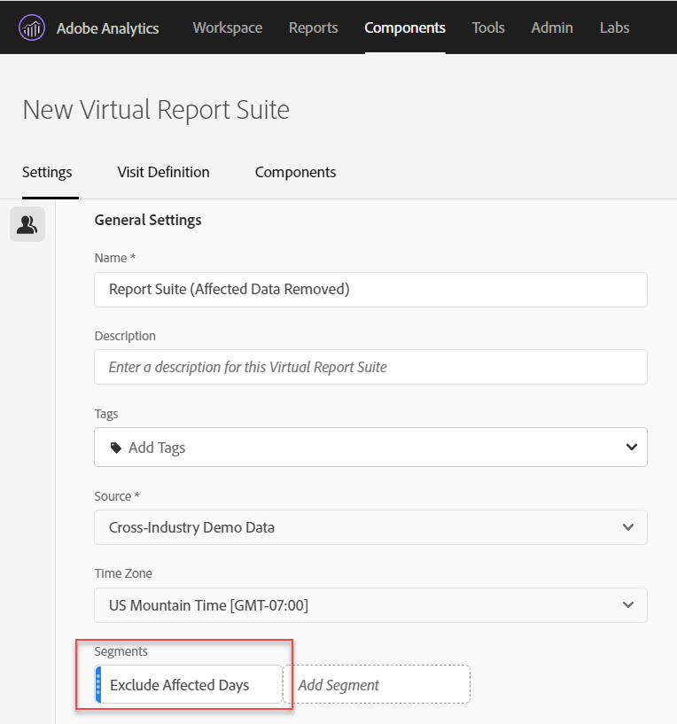

# 분석에서 특정 날짜 제외

이벤트에 [의해](/help/technotes/event-impacted.md)영향을 받는 데이터가 있는 경우 세그먼트를 사용하여 보고서에 포함하지 않을 모든 날짜 범위를 제외할 수 있습니다. 이벤트 영향을 받은 날짜를 세그먼트화하면 조직에서 일부 데이터에 대한 결정을 내리지 못하도록 할 수 있습니다.

## 영향을 받는 일 격리

영향을 받는 날짜 또는 날짜 범위를 격리하는 세그먼트를 만듭니다. 이 세그먼트는 영향을 받는 부분에 대한 자세한 정보를 보기 위해 문제 일에만 집중하려는 경우에 유용합니다.

1. > **[!UICONTROL Components]** 로 이동하여 세그먼트 빌더를 **[!UICONTROL Segments]**&#x200B;연 다음 을 **[!UICONTROL Add]**&#x200B;클릭합니다.
2. &#39;일&#39; 차원을 정의 캔버스로 드래그하고 분리할 날짜와 동일하게 설정합니다.
3. 보고서에서 분리하려는 매일 위의 단계를 반복합니다.

자주색 날짜 범위 구성 요소가 아닌 주황색 차원 구성 요소를 사용하는 것이 좋습니다. 자주색 날짜 범위 구성 요소를 사용하는 경우 프로젝트의 달력 범위를 덮어씁니다.

## 영향을 받는 일 제외

영향을 받는 일 또는 날짜 범위를 제외하는 세그먼트를 만듭니다. 이 세그먼트는 문제가 발생한 날을 제외하여 전체 보고에 미치는 영향을 최소화하려는 경우에 유용합니다.

1. > **[!UICONTROL Components]** 로 이동하여 세그먼트 빌더를 **[!UICONTROL Segments]**&#x200B;연 다음 을 **[!UICONTROL Add]**&#x200B;클릭합니다.
2. 세그먼트 정의 캔버스의 오른쪽 맨 위에서 **[!UICONTROL Options]** > **[!UICONTROL Exclude]**&#x200B;을 클릭합니다.
3. &#39;일&#39; 차원을 정의 캔버스로 드래그하고 제거할 날짜와 동일하게 설정합니다.
4. 보고서에서 제거할 매일 위의 단계를 반복합니다.

## 보고서에서 이러한 세그먼트 사용

제외 세그먼트를 만든 후에는 다른 세그먼트를 사용할 때와 동일하게 사용할 수 있습니다.

### 트렌드 보고서에서 세그먼트 비교

보고서에서 &#39;영향을 받는 일 수&#39; 세그먼트와 &#39;영향을 받는 일 제외&#39; 세그먼트를 모두 적용하여 나란히 비교할 수 있습니다. 두 세그먼트를 지표 위 또는 아래로 드래그하여 비교할 수 있습니다.

### 프로젝트에 제외 세그먼트 적용

&#39;영향을 받는 일 수 제외&#39; 세그먼트를 작업 공간 프로젝트에 적용할 수 있습니다. 제외 세그먼트를 작업 영역 캔버스 섹션으로 드래그하여 여기에 *세그먼트를*&#x200B;놓습니다.

>[!TIP] 제외된 데이터에 대한 메모를 패널의 설명에 포함시켜 보고서를 보는 데 도움이 됩니다. 패널 제목을 마우스 오른쪽 단추로 클릭한 다음 을 클릭합니다 **[!UICONTROL Edit description]**.

### 가상 보고서 세트에서 제외 세그먼트 사용

가상 보고서 세트의  세그먼트를 사용하여 보다 편리하게 데이터를 제외할 수 있습니다. 이 옵션은 영향을 받는 날짜 범위를 포함하는 각 보고서에 세그먼트를 적용할 필요가 없다는 점에서 이상적입니다. 이미 가상 보고서 세트를 기본 데이터 소스로 사용하는 경우 기존 VRS에 세그먼트를 추가할 수 있습니다.

1. > **[!UICONTROL Components]** 으로 **[!UICONTROL Virtual report suites]**&#x200B;이동합니다.
2. 클릭 **[!UICONTROL Add]**.
3. 가상 보고서 세트에 대해 원하는 이름과 설명을 입력합니다.
4. 제외 세그먼트를 레이블이 지정된 영역으로 드래그합니다 **[!UICONTROL Add segment]**.
5. 오른쪽 **[!UICONTROL Continue]** 상단을 클릭한 다음 을 클릭합니다 **[!UICONTROL Save]**.

