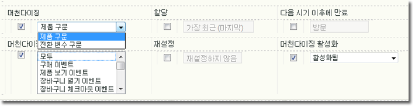

# 머천다이징 변수 구현

머천다이징 변수를 활성화하고 구현하는 방법을 설명합니다.

## 머천다이징 변수 활성화 {#section_331B41FF5AED42F2AEFE043DD60238C7}

Merchandising can be enabled for any custom eVar on the **[!UICONTROL Admin Tools]** &gt; **[!UICONTROL Report Suites]** &gt; **[!UICONTROL Conversion Variables]** page (you no longer need to call Adobe):



| 설정 | 설명 |
|--- |--- |
| 다음 동작이 끝나면 만료 | 머천다이징 값이 얼마나 지속될지 결정합니다. |
| 머천다이징 | 제품 구문: 값이 s.products 내에 설정됩니다.    전환 변수 구문: 값이 지정된 머천다이징 s.eVar 내에 설정됩니다. |
| 머천다이징 결합 이벤트(전환 변수 구문만 해당) | 제품이 현재 머천다이징 카테고리에 언제 연결되는지 나타냅니다. Ctrl을 누른 채로 목록의 항목을 클릭하면 여러 개의 이벤트를 선택할 수 있습니다.   참고: "제품 구문"이 선택된 경우 이벤트를 선택할 수 없습니다(비활성화되어 있으나 회색으로 표시되지는 않음). "전환 변수 구문"이 선택된 경우에만 이벤트를 선택할 수 있습니다. |

## 제품 구문을 사용하여 구현 {#section_2774578D09CE40A093CB0D0A294DBF7C}

제품 구문이 활성화된 경우 머천다이징 카테고리가 제품 변수 내에서 직접 작성되므로 결합 이벤트를 선택하고 설정할 필요가 없습니다. 성공 이벤트가 발생할 때 변수를 `s.products`에서 사용할 수 없는 경우를 제외하고 이 방법이 권장됩니다.

* **구문**

```js
  s.products="category;product;quantity;price;event_incrementer; 
<codeph outputclass="syntax">
  eVarN=merch_category| 
 <codeph outputclass="syntax">
   eVarM=merch_category2" 
 </codeph outputclass="syntax"> 
</codeph outputclass="syntax">
```

* **예**

```js
  s.events="prodView" 
  s.products=";Fernie Snow Goggles;;;; 
<codeph outputclass="syntax">
  eVar1=goggles" 
   In 
</codeph outputclass="syntax">
```

eVar1에 대한 "고글"이라는 값이 "Fernie Snow Goggles" 제품에 지정됩니다. "고글"이 이 제품과 관련된 모든 후속 성공 이벤트(제품 추가, 체크아웃, 구매 등)의 요인으로 인정됩니다.

## 전환 변수 구문을 사용한 구현 {#section_6AE10F69F4A14636AB050BEA89A34E4E}

`s.products`에서 eVar 값을 설정할 수 없을 때 전환 변수 구문을 사용해야 합니다. 이는 일반적으로 페이지에 머천다이징 채널 또는 검색 방법 컨텍스트가 없음을 의미합니다. 이 경우 제품 페이지에 도착하기 전에 머천다이징 변수를 설정해야 하고 결합 이벤트가 발생할 때까지 값이 지속되어야 합니다.

구성 중에 선택한 결합 이벤트가 발생하면 eVar의 지속된 값이 제품과 연결됩니다. 예를 들어 prodView가 결합 이벤트로 지정된 경우 머천다이징 카테고리가 이벤트가 발생하는 시점에만 현재 제품 목록과 연결됩니다. 후속 결합 이벤트만이 이미 제품에 지정된 머천다이징 eVar를 업데이트할 수 있습니다.

* **구문** 결합 이벤트 전의 동일 페이지 또는 이전 페이지:

   ```js
   s.eVar1="merchandising_category"
   ```

   결합 이벤트가 발생할 때의 페이지:

   ```js
   s.events="prodView" 
   s.products="category;product"
   ```

* **예** 방문 페이지 1:

   ```js
   s.eVar1="Outdoors:Ski Goggles"
   ```

   방문 페이지 2:

   ```js
   s.events="prodView" 
   s.products=";Fernie Snow Goggles"
   ```

   eVar1에 대한 "고글"이라는 값이 "Outdoors:Ski Goggles" 제품에 지정됩니다. "고글"이 이 제품과 관련된 모든 후속 성공 이벤트(제품 추가, 체크아웃, 구매 등)의 요인으로 인정됩니다.

또한 다음 조건 중 하나가 만족될 때까지 머천다이징 변수의 현재 값이 모든 후속 제품에 연결됩니다.

* eVar 만료("다음 이후에 만료" 설정에 따름)
* 머천다이징 eVar가 새로운 값으로 덮어쓰기됨

자세한 내용은 [에서 "](https://analyticsdemystified.com/adobe-analytics/advanced-conversion-syntax-merchandising/)고급 변환 구문 머천다이징[!DNL analyticsdemystified.com]"을 참조하십시오.
