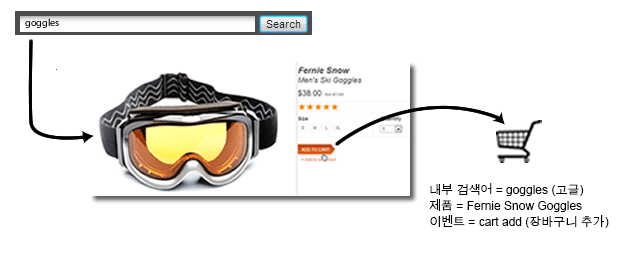
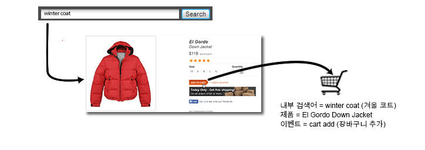

# 머천다이징 변수 개요

일반적으로 외부 캠페인 또는 외부 검색 용어의 성공을 측정할 때는 하나의 값이 성공 이벤트 발생 요인으로 인정되기를 원할 것입니다. 예를 들어 고객이 이메일 캠페인의 링크를 클릭하여 웹 사이트를 방문하면 그에 따라 이루어진 모든 구매가 해당 캠페인 덕분인 것으로 됩니다.

하지만 내부 검색 또는 고객이 여러 항목을 찾을 때 카테고리 탐색으로 인해 발생한 이벤트의 경우 어떻습니까? 예를 들어 고객이 귀하의 사이트에서 "고글"을 검색하여 찾은 다음 장바구니에 추가합니다.

이 고객은 결제에 앞서 "겨울 코트"를 검색하고 장바구니에 다운 재킷을 추가합니다.

구매가 완료되면 가장 최근에서 할당이 변경되지 않았다고 가정했을 때 "겨울 코트"에 대한 내부 검색이 고글 구매의 요인으로 되는 것입니다. 이는 마케팅 의사 결정을 위한 데이터로 적합하지 않습니다.

| 내부 검색어 | 매출 |
|---|---|
| 겨울 코트 | $157 |

**머천다이징 변수로 이 문제를 해결하는 방법**

크로스 카테고리 머천다이징 변수 또는 "머천다이징 evar"를 통해 eVar의 현재 값을 성공 이벤트가 발생하는 시점에 제품으로 할당할 수 있습니다. 이 값은 나중에 특정 eVar에 대해 새로운 값이 하나 이상 설정되어도 제품과의 연결을 유지합니다.

이전 예제에서 eVar에 대해 머천다이징이 활성화되었다면 "고글"이라는 검색어가 Fernie Snow Goggles에 연결되고 "겨울 코트"라는 검색어가 El Gordo Down Jacket에 연결됩니다. 머천다이징 변수는 제품 수준에서 매출을 할당하므로 각 용어가 그것과 연결된 제품 수익 금액에 대한 요인으로 인정됩니다.

| 내부 검색어 | 매출 |
|---|---|
| 겨울 코트 | $119 |
| 고글 | $38 |

