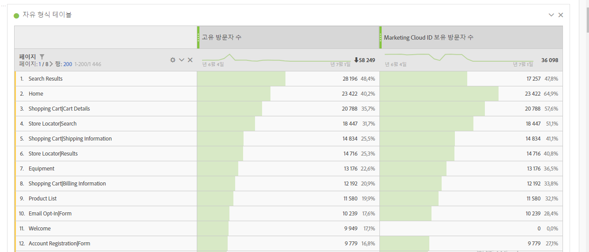
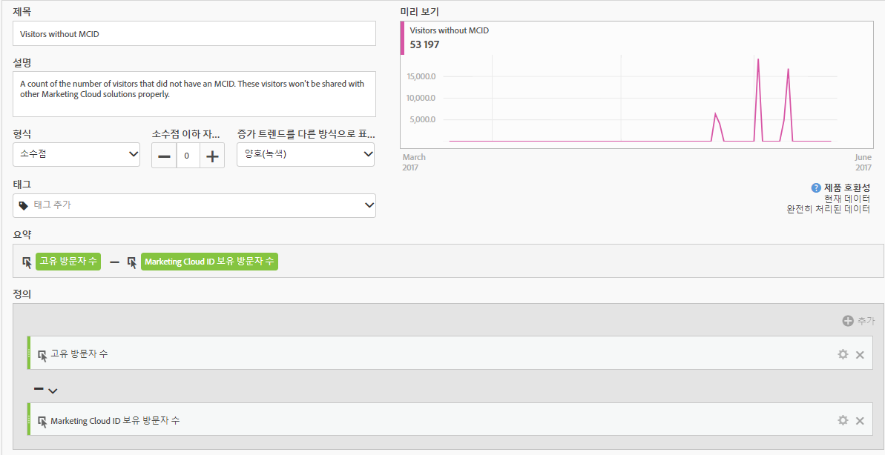
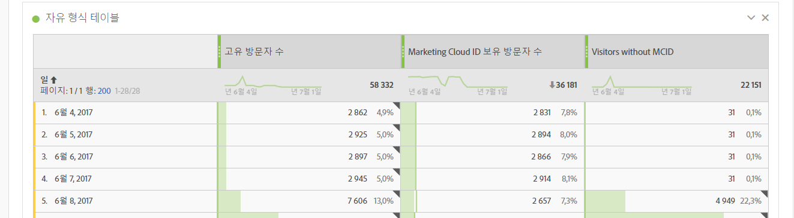
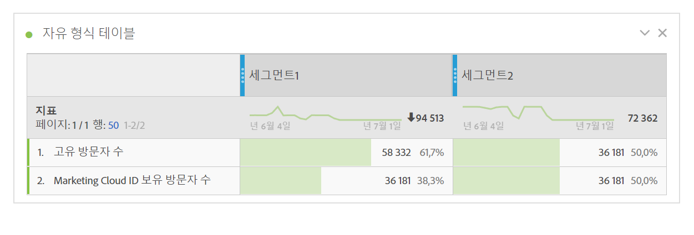

# Experience Cloud ID를 가진 방문자

Analysis Workspace 및 세그먼트 빌더에서 사용할 수 있습니다.

Experience Cloud ID가 있는 방문자 수를 표시합니다. ID 서비스가 배포된 페이지를 파악하고 다른 Experience Cloud 솔루션과 공유할 수 있는 방문자 수를 파악할 수 있습니다. 또한 Experience Cloud에 공유된 세그먼트에서 이 지표를 사용할 수 있습니다.

>[!IMPORTANT]
>
>For this metric to appear, you have to have the [Identity Service](https://marketing.adobe.com/resources/help/en_US/mcvid/) running for the report suite.

## Experience Cloud ID 설정 디버깅 {#section_679E62142A3E46548FF8FBDA46568005}

The [!UICONTROL Visitors with Experience Cloud ID] metric is a useful metric in Adobe Analytics intended to help you find and debug your [!UICONTROL Identity Service]setup. 지표는 ID 서비스에서 Experience Cloud ID가 지정된 보고서 세트의 방문자 수를 카운트한 횟수입니다. 이 지표는 특정 Experience Cloud 통합이 예상만큼 많은 방문자를 공유하지 못하는 이유를 진단하거나 MCID가 아직 배포되지 않은 사이트의 영역을 식별하는 데 매우 유용합니다.

Experience Cloud ID가 있는 방문자 수 지표를 사용하려면 다음 [!UICONTROL 페이지] 보고서와 같이 모든 보고서에 지표로 드래그하기만 하면 됩니다.

이 예에서 각 페이지의 고유 방문자 수와 Experience Cloud ID가 있는 방문자 수가 동일하지만 고유 방문자 수의 총계는 Experience Cloud ID가 있는 방문자 수의 총계보다 큽니다. 모든 방문자에 대해 MCID를 설정하지 않은 페이지를 찾으려면, 다음 정의로 [계산된 지표를 만듭니다](https://marketing.adobe.com/resources/help/en_US/analytics/calcmetrics/cm_build_metrics.html).

보고서에 계산된 지표를 추가하면 MCID가 없는 방문자 수가 가장 많은 페이지를 표시하도록 페이지 보고서를 정렬할 수 있습니다.

이제 «Product Quick Views (제품 빠른 보기)» 페이지가 Identity Service로 제대로 구현되지 않으므로 가능한 빨리 업데이트해야 합니다. 브라우저 유형, 사이트 섹션 또는 컨텐츠 유형과 같은 모든 유형의 측정기준에서 유사한 보고서를 작성할 수 있습니다.

MCID가 없는 방문자가 있는 페이지를 확인한 후에는 구현 팀에 알려서 해당 페이지를 수정할 수 있도록 해야 합니다.

MCID 서비스가 해당 페이지에 구현되어 있어도 일부 방문자에게는 소수의 MCID가 설정되지 않는 경우가 있습니다. 이러한 경우는 보고서 세트를 제공하기 전에 AppMeasurement 함수를 호출하는 Analytics JavaScript 또는 DTM 구성의 일반적인 구성 오류로 인한 것일 수 있습니다. 이를 방지하려면 적절하게 [핵심 AppMeasurement 코드를 삽입](https://marketing.adobe.com/resources/help/en_US/sc/implement/dtm/t_appmeasurement-code.html)해야 합니다.

Experience Cloud와 공유하는 "제품 빠른 보기" 페이지(위 참조)를 기반으로 하는 모든 세그먼트는 다른 Experience Cloud 솔루션과의 일치율이 매우 낮습니다. 세그먼트에 대한 MCID 적용 범위를 확인하려면 다음과 같이 보고서를 구성할 수 있습니다.

고유 방문자 수와 Experience Cloud ID가 있는 방문자 수를 비교한 이 표에서 "세그먼트 1"에는 MCID 적용범위가 100%가 아니지만 "세그먼트 2"에는 100%라는 것을 쉽게 파악할 수 있습니다. 즉 세그먼트 1을 Experience Cloud와 공유하는 경우 3,859명의 방문자 중 2,186명만 공유 대상이 됩니다.
