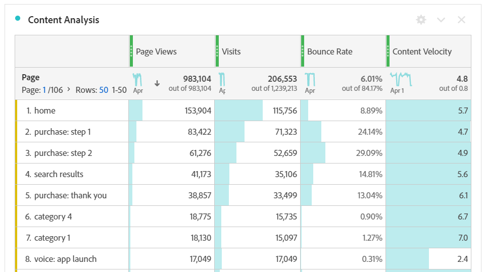

# [!UICONTROL Content Velocity]

[!UICONTROL Content Velocity] 는 표준 Adobe Analytics 지표 템플릿입니다. [!UICONTROL Content Velocity] 는 [[!UICONTROL Page Views] ]로 정의됨| [!UICONTROL Visit Participation]] / [[!UICONTROL Visits]] 그리고 특정 컨텐츠 조각이 미치는 영향을 측정하는 데 도움이 됩니다(페이지, 사이트 섹션 등). 가 다운스트림 컨텐츠에 있었습니다. 웹 사이트 또는 모바일 앱의 사용자를 유지하지 않고 어떤 콘텐츠가 있는지 파악하는 데 도움이 됩니다.

[!UICONTROL Content Velocity] 은 검색 또는 태그 사용(#Adobe Template)으로 왼쪽 레일을 필터링하여 분석 작업 공간에서 찾을 수 있습니다.

[!UICONTROL Content Velocity] 는 일반적으로 컨텐츠 분석에 [!UICONTROL Page Views], [!UICONTROL Visits]및 [!UICONTROL Bounce Rate]같은 다른 주요 지표와 함께 사용됩니다.

