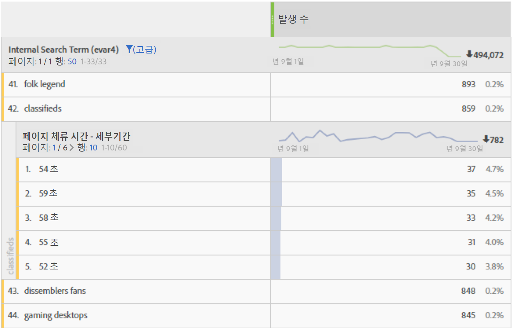
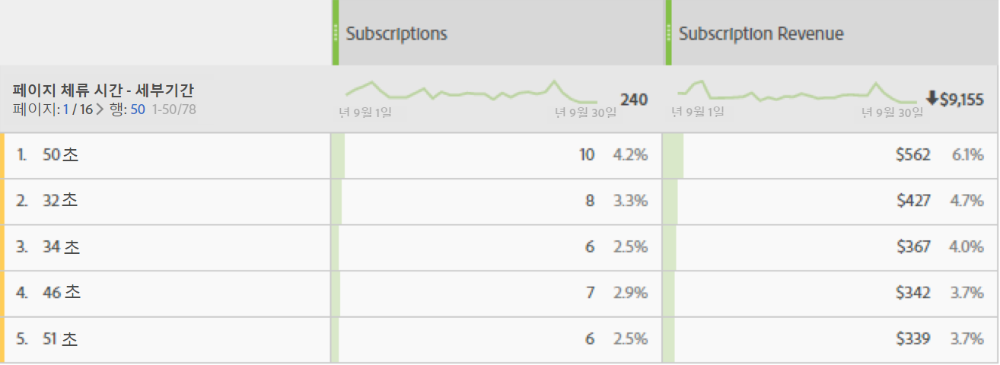

# 체류 시간

Adobe Analytics에서는 다양한 체류 시간 지표와 차원을 제공합니다. 이러한 지표와 차원에 대한 정의와 계산 방법을 확인하십시오.

* [체류 시간 지표](../../../components/c-variables/c-metrics/metrics-time-spent.md#section_4F54D70300944748A62088F5870E4B6C)
* [체류 시간 차원](../../../components/c-variables/c-metrics/metrics-time-spent.md#section_D51606544CB046FC902E2E317318892C)
* [체류 시간 계산 방법](../../../components/c-variables/c-metrics/metrics-time-spent.md#section_90A3882638974969A4B8B674FFDB7624)
* [체류 시간에 대한 FAQ](../../../components/c-variables/c-metrics/metrics-time-spent.md#section_51C2735BACAB42CCBA1DD3CBF238E2F7)
* [계산 예](../../../components/c-variables/c-metrics/metrics-time-spent.md#section_3D63D6A601F34E42AD5366435CB610D5)

## 체류 시간 지표 {#section_4F54D70300944748A62088F5870E4B6C}

이 표에는 다양한 체류 시간 지표, 해당 정의 및 이 지표를 사용할 수 있는 Adobe Analytics 내에서의 위치가 나와 있습니다.

<table id="table_7095406DF1614F3CAD5E437B919598D1"> 
 <thead> 
  <tr> 
   <th colname="col1" class="entry"> 지표 </th> 
   <th colname="col2" class="entry"> 정의 </th> 
   <th colname="col3" class="entry"> 사용할 수 있는 곳 </th> 
  </tr> 
 </thead>
 <tbody> 
  <tr> 
   <td colname="col1"> 
총 체류 시간(초) 
 </td> 
   <td colname="col2"> 
방문자가 특정 차원 항목과 상호 작용하는 총 시간을 나타냅니다. 
 
모든 후속 조회에서의 값 및 지속성 인스턴스를 포함합니다. Prop의 경우, 체류 시간은 후속 링크 이벤트에서도 계산됩니다. 
 </td> 
   <td colname="col3"> 
Analysis Workspace 
 
Reports &amp; Analytics 
 
Report Builder('총 체류 시간'이라고 함) 
 
Data Warehouse 
 </td> 
  </tr> 
  <tr> 
   <td colname="col1"> 
방문당 체류 시간(초) 
 </td> 
   <td colname="col2"> 
<i>총 체류 시간(초)/(방문-바운스)</i> 
 
방문자가 각 방문 중 특정 차원 항목과 상호 작용하는 평균 시간을 나타냅니다. 
 </td> 
   <td colname="col3"> 
Analysis Workspace 
 
Reports &amp; Analytics 
 </td> 
  </tr> 
  <tr> 
   <td colname="col1"> 
방문자당 체류 시간(초) 
 </td> 
   <td colname="col2"> 
<i>총 체류 시간(초)/(고유 방문자 - 바운스 고유 방문자)</i> 
 
방문자가 방문자의 라이프타임(해당 쿠키 길이) 동안 특정 차원 항목과 상호 작용하는 평균 시간을 나타냅니다. 
 </td> 
   <td colname="col3"> 
Analysis Workspace 
 
Reports &amp; Analytics 
 </td> 
  </tr> 
  <tr> 
   <td colname="col1"> 
사이트에서 보낸 평균 시간(초) 
 </td> 
   <td colname="col2"> 
방문자가 특정 차원 항목과 상호 작용하는 총 시간(차원 항목 시퀀스당)을 나타냅니다. 이름으로 예상되듯이 "사이트" 평균으로 제한되지 않습니다. 시퀀스에 대한 자세한 내용은 '체류 시간 계산 방법 섹션'을 참조하십시오. 
 
참고: 이 지표는 계산에 사용된 분모의 차이로 인해 차원 항목 수준에서 방문당 체류 시간과 다를 수 있습니다. 
 </td> 
   <td colname="col3"> 
Analysis Workspace 
 
Reports &amp; Analytics(분으로 표시) 
 
Report Builder(분으로 표시) 
 </td> 
  </tr> 
  <tr> 
   <td colname="col1"> 
페이지에서 보낸 평균 시간 
 </td> 
   <td colname="col2"> 
<b>더 이상 사용되지 않는 지표. </b> 
 
차원 항목에 대한 평균 시간이 필요한 경우 '사이트에서 보낸 평균 시간'을 사용하는 것이 좋습니다. 
 </td> 
   <td colname="col3"> 
Report Builder(요청에 차원이 있을 때) 
 </td> 
  </tr> 
  <tr> 
   <td colname="col1"> 
총 세션 길이 
 
('이전 세션 길이'라고도 함) 
 </td> 
   <td colname="col2"> 
Mobile 앱 SDK만 해당. 다음번에 앱을 시작할 때 이전 세션에 대해 결정됩니다. 초 단위로 계산되는 이 지표는 앱이 배경에 있을 때에는 계산되지 않고, 사용 중인 경우에만 계산됩니다. 세션 수준 지표입니다. 
 
예: 앱 ABC를 설치하고 2분 동안 사용한 다음 앱을 닫습니다. 이 세션 시간에 전송된 데이터는 없습니다. 다음에 실행할 때 총 세션 길이는 120이라는 값으로 전송됩니다. 
 </td> 
   <td colname="col3"> 
Analysis Workspace 
 
Reports &amp; Analytics 
 
Report Builder 
 
Mobile Services UI 
 </td> 
  </tr> 
  <tr> 
   <td colname="col1"> 
평균 세션 길이(모바일) 
 </td> 
   <td colname="col2"> 
총 세션 길이/(론치 - 첫 번째 실행) 
 
Mobile 앱 SDK만 해당. 세션 수준 지표입니다. 
 </td> 
   <td colname="col3"> 
Report Builder 
 
Mobile Services UI 
 </td> 
  </tr> 
 </tbody> 
</table>

## 체류 시간 차원 {#section_D51606544CB046FC902E2E317318892C}

이 표에는 다양한 체류 시간 차원, 해당 정의 및 이 지표를 사용할 수 있는 Adobe Analytics 내에서의 위치가 나와 있습니다.

<table id="table_BF1B7B8620714105BFB5C1AC37ABE02C"> 
 <thead> 
  <tr> 
   <th colname="col1" class="entry"> 차원 </th> 
   <th colname="col2" class="entry"> 정의 </th> 
   <th colname="col3" class="entry"> 사용할 수 있는 곳 </th> 
  </tr> 
 </thead>
 <tbody> 
  <tr> 
   <td colname="col1"> 
방문당 체류 시간 - 세부기간 
 </td> 
   <td colname="col2"> 
방문하는 동안 소요된 총 시간을 가장 가까운 두 번째 방문으로 자르며, 방문에 포함되는 모든 조회에 적용합니다. 방문 수준 차원입니다. 
 </td> 
   <td colname="col3"> 
Analysis Workspace 
 </td> 
  </tr> 
  <tr> 
   <td colname="col1"> 
방문당 체류 시간 - 그룹화됨 
 </td> 
   <td colname="col2"> 
세분화된 차원이 9개의 서로 다른 범위로 그룹화됩니다. 방문 수준 차원입니다. 범위는 다음과 같습니다. 
 
    <ul id="ul_BC909A2D22ED4D48A3F7CE6A666F26E5"> 
     <li id="li_0FB28A1F0D894B7C95724A8C6BD5B00B">1분 미만 </li> 
     <li id="li_10223656420A475AAB3443981D49D10E">1-5분 </li> 
     <li id="li_0DEE723B81C64EAFB5BD1125D48D3AD2">5-10분 </li> 
     <li id="li_B736AC970E0049EB8844480702F345A6">10-30분 </li> 
     <li id="li_21B8ECC3EE66497E8D870A004351B04B">30-60분 </li> 
     <li id="li_79FB658128FD4F97AAE1A803F1687BD1">1-2시간 </li> 
     <li id="li_CCC0746FEB954BECB9E670ECCDBF30F3">2-5시간 </li> 
     <li id="li_BD7AFC524C814F9FAE423A4E301661D4">5-10시간 </li> 
     <li id="li_C9B5F1A83F99437A98A61756EE286687">10-15시간 </li> 
     <li id="li_8CC5A279D5804C5EA34C1B3589EF07BA">15시간 이상 </li> 
    </ul> 
참고: 12시간 이상 걸리는 방문은 히트를 잘못된 순서로 받을 때 발생할 수 있습니다. 
 </td> 
   <td colname="col3"> 
Analysis Workspace 
 
Reports &amp; Analytics 
 
Report Builder 
 </td> 
  </tr> 
  <tr> 
   <td colname="col1"> 
페이지 체류 시간 - 세부기간 
 </td> 
   <td colname="col2"> 
각 조회에서 소요된 총 시간을 가장 가까운 두 번째 방문으로 자릅니다. 페이지 조회 수와 링크 이벤트를 포함한 조회 수준 차원입니다. 이름으로 예상되듯이, "페이지" 차원으로 제한되지 않습니다. 
 </td> 
   <td colname="col3"> 
Analysis Workspace 
 </td> 
  </tr> 
  <tr> 
   <td colname="col1"> 
페이지 체류 시간 - 그룹화됨 
 </td> 
   <td colname="col2"> 
10개의 서로 다른 범위로 그룹화된 세분화된 차원입니다. 하지만, 그룹화된 차원은 페이지 보기 횟수만 계산합니다(링크 이벤트는 제외). 조회 수준 차원입니다. 범위는 다음과 같습니다. 
 
    <ul id="ul_D5F067A2520646A99AA261F9A4625C03"> 
     <li id="li_82307DE66EC548F0AD79DB1505A21F0D">15초 미만 </li> 
     <li id="li_585965B82C4D43B6870978A5CE63B5B6">15-29초 </li> 
     <li id="li_5C20DC78E126472A838818EBA1D954D0">30-59초 </li> 
     <li id="li_2579C0B9279340ABA3AD4A527D758239">1-3분 </li> 
     <li id="li_E0FD800E948049A48DB4329A3E7A2478">3-5분 </li> 
     <li id="li_D9DBBFE6004F42BD80BB4F9268DF7DA7">5-10분 </li> 
     <li id="li_20F146799679456E8D6434D79EE12C31">10-15분 </li> 
     <li id="li_A38951A553A14AE7A0F23A904EEE35DE">15-20분 </li> 
     <li id="li_D44D773A344E47BFAA771302A49D8BD4">20-30분 </li> 
     <li id="li_8766683DB29147CD8470D2317F750E97">30분 이상 </li> 
    </ul> </td> 
   <td colname="col3"> 
Analysis Workspace 
 
Reports &amp; Analytics 
 </td> 
  </tr> 
 </tbody> 
</table>

## 체류 시간 계산 방법 {#section_90A3882638974969A4B8B674FFDB7624}

Adobe Analytics는 명시적 값(링크 이벤트 및 비디오 보기 횟수 포함)을 사용하여 [!UICONTROL 체류 시간]을 계산합니다.

>[!NOTE]
>
>[!UICONTROL 비디오 보기] 횟수 또는 [!UICONTROL 종료 링크와]같은 링크 이벤트가 없으면, 마지막 방문 히트에서 보낸 시간을 알 수 없습니다. 또한 비슷한 이유로 [!UICONTROL 바운스 방문 횟수](즉, 단일 조회의 [!UICONTROL 방문 횟수])에는 [!UICONTROL 체류 시간]이 연결되어 있지 않습니다.

모든 체류 시간 계산에 사용된 **분자**&#x200B;는 "총 체류 시간(초)"입니다.

**분모**&#x200B;는 Analytics에서 별도의 지표로 사용할 수 없습니다. 조회 수준 체류 시간 지표의 경우 분모는 시퀀스 수입니다. 시퀀스는 주어진 변수가 같은 값(설정되었는지, 확산되었는지 또는 지속되었는지에 상관없이)을 포함하는 연속된 조회 세트입니다. "확산"은 페이지 보기 횟수(즉, 후속 링크 이벤트에서) 사이에 체류 시간 계산을 목적으로 하는 Prop의 지속성을 의미합니다.

* 예를 들어, [!UICONTROL 페이지 이름]이나 조회수 수준의 다른 차원일 경우 분모는 기본적으로 [!UICONTROL 인스턴스] 또는 [!UICONTROL 페이지 보기 횟수]지만, 다시 로드하고 설정이 해제된 값(예: 링크 이벤트)이 있으면 단일 상호 작용(시퀀스)으로서 계산합니다.

* 체류 시간을 알 수 없으므로 [!UICONTROL 바운스] 및 [!UICONTROL 종료]도 분모에서 제거됩니다.

## 체류 시간에 대한 FAQ {#section_51C2735BACAB42CCBA1DD3CBF238E2F7}

<table id="table_D8BA825412B6420390CA78D77A5E57C2"> 
 <thead> 
  <tr> 
   <th colname="col1" class="entry"> 질문 </th> 
   <th colname="col2" class="entry"> 답변 </th> 
  </tr> 
 </thead>
 <tbody> 
  <tr> 
   <td colname="col1"> 
모든 체류 시간 지표를 어떤 차원에나 적용할 수 있습니까? 
 </td> 
   <td colname="col2"> 
다음 체류 시간 지표는 어떤 차원에나 적용할 수 있습니다. 
 
    <ul id="ul_FC9513D0184B4A74BA1F4CCEA8BC1940"> 
     <li id="li_669156CC549040E08AB4977AF4B8AECB">총 체류 시간(초) </li> 
     <li id="li_3CCD7E7D127448689228E98A5EE854CB">방문당 체류 시간(초) </li> 
     <li id="li_1F61C157EC414C7F8702BC3F365AA2D7">방문자당 체류 시간(초) </li> 
     <li id="li_A3EF959A9BAB4872915F1A5C1A86D48E">사이트에서 보낸 평균 시간(초) </li> 
    </ul> </td> 
  </tr> 
  <tr> 
   <td colname="col1"> 
어느 체류 시간 차원이 다른 차원을 사용한 분류에 가장 잘 사용됩니까? 
 </td> 
   <td colname="col2"> 
" 페이지에서 보낸 시간 - 세부기간 "차원은 히트 수준 차원입니다. 이것을 다른 차원으로 분류하면 분류 차원도 있었던 조회가 유지되는 시간(초)을 알 수 있습니다. 
 
아래 예에서 검색어 "분류됨"은 방문자가 해당 검색어에 대해 반환된 컨텐츠를 읽는 데 소비하는 시간일 수 있는 54초, 59초 등의 조회 시간과 연관됩니다. 
 
 
 </td> 
  </tr> 
  <tr> 
   <td colname="col1"> 
" 페이지에서 보낸 시간 - 세부기간 "차원에 적합한 지표는 무엇입니까? 
 </td> 
   <td colname="col2"> 
모든 지표. 이 차원은 이벤트가 발생한 바로 그 조회에서 소비한 시간을 보여줍니다. 높은 체류 시간은 이벤트가 발생한 페이지(적중)에서 방문자가 오래 머물렀음을 의미합니다. 
 
 
 </td> 
  </tr> 
  <tr> 
   <td colname="col1"> 사이트에서 보낸 평균 시간은 방문당 체류 시간과 어떻게 다릅니까 ? </td> 
   <td colname="col2"> 
차이점은 지표에 사용된 분모입니다. 
 
    <ul id="ul_E9D7B4D3EDCC4691B2C724E0FE5480D2"> 
     <li id="li_CA34D84A3164473A8737D258425CA468">  사이트에서 보낸 평균 시간에서는 차원 항목을 포함하는 시퀀스를 사용합니다. </li> 
     <li id="li_2F2639480BE24927919732D00364EECA"> 방문당 체류 시간에서는 방문 수를 사용합니다. </li> 
    </ul> 
그 결과, 이러한 지표들은 방문 수준에서는 비슷한 결과를 산출할 수 있지만 조회 수준에서는 다릅니다. 
 </td> 
  </tr> 
 </tbody> 
</table>

## 계산 예 {#section_3D63D6A601F34E42AD5366435CB610D5}

다음의 서버 호출 세트가 단일 방문 내의 단일 방문자에 대한 것이라고 가정하십시오.

<table id="table_63CBB5097E5A46659877E2CA3C94D81C"> 
 <thead> 
  <tr> 
   <th colname="col1" class="entry"> 방문 조회 번호 </th> 
   <th colname="col2" class="entry"> 1 </th> 
   <th colname="col3" class="entry"> 2 </th> 
   <th colname="col4" class="entry"> 3 </th> 
   <th colname="col5" class="entry"> 4 </th> 
   <th colname="col6" class="entry"> 5 </th> 
   <th colname="col7" class="entry"> 6 </th> 
   <th colname="col8" class="entry"> 7 </th> 
  </tr> 
 </thead>
 <tbody> 
  <tr> 
   <td colname="col1"> <b>방문 경과 시간(초)</b> </td> 
   <td colname="col2"> 0 </td> 
   <td colname="col3"> 30 </td> 
   <td colname="col4"> 80 </td> 
   <td colname="col5"> 180 </td> 
   <td colname="col6"> 190 </td> 
   <td colname="col7"> 230 </td> 
   <td colname="col8"> 290 </td> 
  </tr> 
  <tr> 
   <td colname="col1"> <b>체류 시간(초)</b> </td> 
   <td colname="col2"> 30 </td> 
   <td colname="col3"> 50 </td> 
   <td colname="col4"> 100 </td> 
   <td colname="col5"> 10 </td> 
   <td colname="col6"> 40 </td> 
   <td colname="col7"> 60 </td> 
   <td colname="col8"> - </td> 
  </tr> 
  <tr> 
   <td colname="col1"> <b>히트 유형</b> </td> 
   <td colname="col2"> 페이지 </td> 
   <td colname="col3"> 링크 </td> 
   <td colname="col4"> 페이지 </td> 
   <td colname="col5"> 페이지 </td> 
   <td colname="col6"> 페이지 </td> 
   <td colname="col7"> 페이지 </td> 
   <td colname="col8"> 페이지 </td> 
  </tr> 
  <tr> 
   <td colname="col1"> <b>페이지 이름</b> </td> 
   <td colname="col2"> Home </td> 
   <td colname="col3"> - </td> 
   <td colname="col4"> 제품 </td> 
   <td colname="col5"> 홈 </td> 
   <td colname="col6"> 홈 
(다시 로드) 
 </td> 
   <td colname="col7"> 장바구니 </td> 
   <td colname="col8"> Order Confirmation </td> 
  </tr> 
 </tbody> 
</table>

### eVar 예

<table id="table_6D0CF0C53DC145D3A53C06EC3012BCC0">  
 <thead> 
  <tr> 
   <th colname="col1" class="entry"> 방문 조회 번호 </th> 
   <th colname="col2" class="entry"> 1 </th> 
   <th colname="col3" class="entry"> 2 </th> 
   <th colname="col4" class="entry"> 3 </th> 
   <th colname="col5" class="entry"> 4 </th> 
   <th colname="col6" class="entry"> 5 </th> 
   <th colname="col7" class="entry"> 6 </th> 
   <th colname="col8" class="entry"> 7 </th> 
  </tr> 
 </thead>
 <tbody> 
  <tr> 
   <td colname="col1"> <b>eVar1</b> </td> 
   <td colname="col2"> 빨간색 
(설정과 연결할 수 있습니다) 
 </td> 
   <td colname="col3"> 빨간색 
(지속됨) 
 </td> 
   <td colname="col4"> (만료됨) </td> 
   <td colname="col5"> 파란색 
(설정과 연결할 수 있습니다) 
 </td> 
   <td colname="col6"> 파란색 
(설정과 연결할 수 있습니다) 
 </td> 
   <td colname="col7"> 파란색 
(지속됨) 
 </td> 
   <td colname="col8"> 빨간색 
(설정과 연결할 수 있습니다) 
 </td> 
  </tr> 
  <tr> 
   <td colname="col1"> <b>eVar 체류 시간(초)</b> </td> 
   <td colname="col2"> 30 </td> 
   <td colname="col3"> 50 </td> 
   <td colname="col4"> - </td> 
   <td colname="col5"> 10 </td> 
   <td colname="col6"> 40 </td> 
   <td colname="col7"> 60 </td> 
   <td colname="col8"> - </td> 
  </tr> 
 </tbody> 
</table>

### Prop 예

<table id="table_1CB4D24A6CAA479C8E59A7C77FFB8226">  
 <thead> 
  <tr> 
   <th colname="col1" class="entry"> 방문 조회 번호 </th> 
   <th colname="col2" class="entry"> 1 </th> 
   <th colname="col3" class="entry"> 2 </th> 
   <th colname="col4" class="entry"> 3 </th> 
   <th colname="col5" class="entry"> 4 </th> 
   <th colname="col6" class="entry"> 5 </th> 
   <th colname="col7" class="entry"> 6 </th> 
   <th colname="col8" class="entry"> 7 </th> 
  </tr> 
 </thead>
 <tbody> 
  <tr> 
   <td colname="col1"> <b>prop1</b> </td> 
   <td colname="col2"> A 
(설정과 연결할 수 있습니다) 
 </td> 
   <td colname="col3"> A 
(확산) 
 </td> 
   <td colname="col4"> (설정되지 않음) </td> 
   <td colname="col5"> B 
설정과 연결할 수 있습니다) 
 </td> 
   <td colname="col6"> B 
(설정과 연결할 수 있습니다) 
 </td> 
   <td colname="col7"> A 
(설정과 연결할 수 있습니다) 
 </td> 
   <td colname="col8"> C 
(설정과 연결할 수 있습니다) 
 </td> 
  </tr> 
  <tr> 
   <td colname="col1"> <b>prop1 체류 시간(초)</b> </td> 
   <td colname="col2"> 30 </td> 
   <td colname="col3"> 50 </td> 
   <td colname="col4"> - </td> 
   <td colname="col5"> 10 </td> 
   <td colname="col6"> 40 </td> 
   <td colname="col7"> 60 </td> 
   <td colname="col8"> - </td> 
  </tr> 
 </tbody> 
</table>

위의 표를 기반으로 체류 시간 지표는 다음과 같이 계산됩니다.

| prop1 | 소요된 총 시간(초) | 방문당 체류 시간 | 방문자당 체류 시간 | 시퀀스 수 | 사이트에서 보낸 평균 시간 |
|---|---|---|---|---|---|
| A | 30+50+60=140 | 140/1=140 | 140/1=140 | 2 | 140/2=70 |
| B | 10+40=50 | 50/1=50 | 50/1=50 | 1 | 50/1=50 |
| C | 0 | 0 | 0 | 0 | 0 |
| 연결되지 않은 시간 | 100 | - | - | - | - |

| eVar1 | 소요된 총 시간(초) | 방문당 체류 시간 | 방문자당 체류 시간 | 시퀀스 수 | 사이트에서 보낸 평균 시간 |
|---|---|---|---|---|---|
| 빨간색 | 30+50=80 | 80/1=80 | 80/1=80 | 1 | 80/1=80 |
| 파란색 | 10+40+60=110 | 110/1=110 | 110/1=110 | 1 | 110/1=110 |
| 연결되지 않은 시간 | 100 | - | - | - | - |

체류 시간 차원의 경우 관련 보고서에 다음 행이 표시됩니다.

* 방문당 체류 시간(세부기간): 290
* 페이지 체류 시간(세부기간): 10, 30, 40, 50, 60, 100

예를 지원하는 몇 가지 추가 참고 사항:

* 모든 체류 시간 계산은 방문의 첫 번째 조회에서 0부터 시작하는 방문 경과 시간을 기반으로 합니다.
* "체류 시간(초)"는 현재 조회의 타임스탬프와 다음 조회의 타임스탬프 간의 차이입니다. 결과적으로 방문(및 바운스)의 마지막 조회에는 체류 시간이 없습니다.
* "시퀀스"는 주어진 변수가 같은 값(설정되었는지, 확산되었는지 또는 지속되었는지에 상관없이)을 포함하는 연속된 조회 세트입니다. 예를 들어, prop1 "A"에는 조회 1 및 2와 조회 6, 이렇게 두 개의 시퀀스가 있습니다. 마지막 조회에 체류 시간이 없으므로 방문의 마지막 조회 시간에 대한 값은 새 시퀀스를 시작하지 않습니다. 사이트에서 보낸 평균 시간(초)은 분모에서 시퀀스를 사용합니다.

   * 체류 시간 전용인 경우 Prop은 조회 2의 prop1에 대해 위에 표시된 대로 페이지 조회수에서 후속 링크 조회로 "확산"됩니다. 따라서 조회 1("A")의 prop1에 대해 설정된 값은 조회2의 체류 시간을 누적할 수 있습니다.
   * eVar는 eVar가 설정되어 있거나 지속되는 모든 조회에서 체류 시간을 누적합니다. eVar 지속성은 Analytics 관리의 eVar 설정에 의해 정의됩니다.
