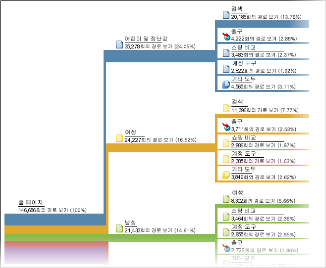

# 경로 지정

경로 분석을 기반으로 한 보고서 그룹. 기술적으로 경로 지정은 한 페이지 이름을 다른 이름으로(한 값에서 다른 값으로) 이동하는 것을 말합니다.

보다 유연한 경로 지정 옵션이 필요하면 [Analysis Workspace 흐름](https://marketing.adobe.com/resources/help/en_US/analytics/analysis-workspace/flow.html)을 사용하십시오.

>[!NOTE]
>
>To enable pathing, go to **[!UICONTROL Admin &gt; Report Suites &gt; Edit Settings &gt; Traffic &gt; Traffic Variables]**. 사이트 섹션 및 서버 보고서에서 경로 지정을 활성화하려면 고객 지원에 문의하십시오.

값이 수집되는 순서를 알아야 하는 경우는 해당 값을 수집하는 변수의 경로 지정을 활성화해야 합니다. 경로 지정은 기본적으로 페이지에 대해 활성화됩니다. prop에 대해서는 경로 지정이 적절하지 않은 경우도 많기 때문에 기본적으로 활성화되지 않습니다. prop에 대해 경로 지정을 활성화하려면 고객 지원 센터에 문의하십시오.

>[!NOTE]
>
>애드혹 분석에서 prop에 대해 분류를 활성화하면 활성화된 prop에 대해 설정된 모든 분류에 대해 경로 지정 지표를 사용할 수 있게 됩니다.

**예 - 사이트 섹션의 경로 지정**

변수 *`s.channel`*&#x200B;에 대해 경로 지정을 활성화하면 값이 변함에 따라 사이트 섹션 사이에서 사이트 방문자가 이동하는 방식을 추적할 수 있습니다.


그러고 나면 방문자가 페이지 그룹 또는 사이트의 섹션 사이를 이동하는 방식을 표시할 [!UICONTROL 다음 사이트 섹션 흐름] 등의 다양한 경로 보고서에서 경로 지정을 사용할 수 있습니다.



**예 - 검색의 경로 지정**

한 값에서 다른 값으로 가는 개념은 *`s.props`*. For example, if you enable pathing for your Internal Search Term *`s.prop`*, you could see the path visitors take through search terms.

**예 - 로그인 상태별 경로 지정**

방문자의 로그인 상태를 기반으로 사람들이 사이트를 이동하는 방식을 파악할 수도 있습니다. 이 정보를 보려면 경로 지정 보고서에서 로그인 상태를 확인하지 않습니다. 방문자가 보고서에서 값을 변경하는 방식이나 방문자가 로그인 상태에서 로그아웃 상태로 변경되는 방식을 표시하기 때문입니다. 대신 세그먼트 값을 *`s.pageName`* 변수와 연결한 후 결과 변수에 경로를 지정합니다. 다음은 구성원 상태당 페이지 경로 지정에 사용되는 샘플 코드입니다.

```js
s.pageName=“Home Page”; 
s.prop18=“Gold”; // Member Status 
s.prop19=s.prop18 + “:” + s.pageName;
```

그런 다음 *`s.prop19`* 의 경로 지정을 활성화하여 구성원이 페이지 사이의 경로를 이동하는 것을 확인합니다.

>[!NOTE]
>
>애드혹 분석을 수행하는 경우 세그먼트 값을 연결하지 않고 페이지 경로를 세그먼트화하고 세그먼트를 경로 지정 보고서에 적용할 수 있습니다.

