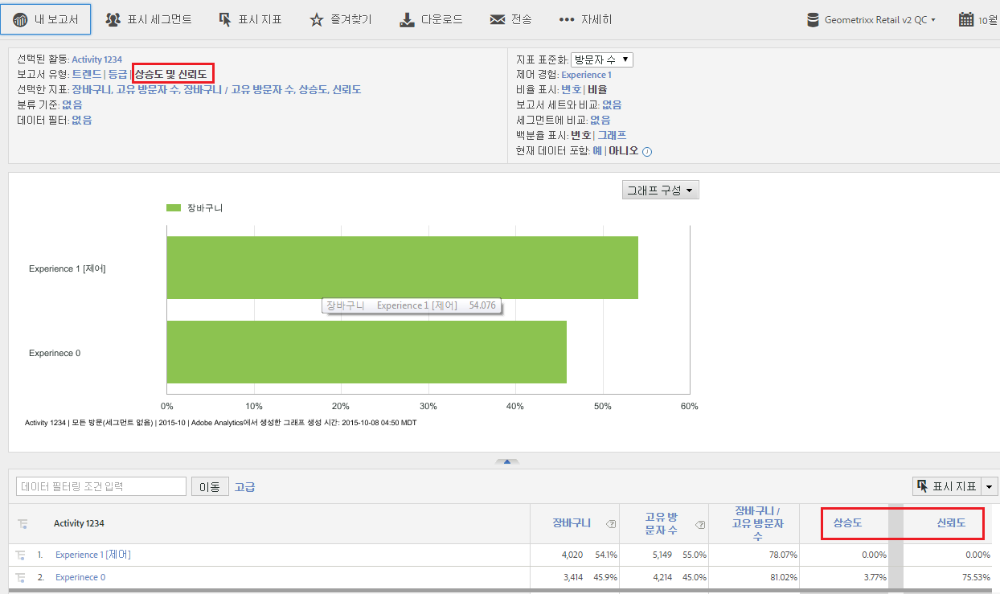

# Target 상승도 및 신뢰도

Lets you assess the success of campaigns in Adobe Analytics in the same way you have done in [!DNL Target Classic]  in the past.

**[!UICONTROL Analytics]** &gt; **[!UICONTROL 보고서]** &gt; **[!UICONTROL 모든 보고서]** 보기 &gt; **[!UICONTROL Adobe Target]** &gt; **[!UICONTROL 타겟]** &gt; **[!UICONTROL 타겟 활동]** 분석

Adobe Target 설명서에는 [상승도](https://marketing.adobe.com/resources/help/en_US/target/target/?f=c_estimating_lift_in_revenue) 및 [신뢰도](https://marketing.adobe.com/resources/help/en_US/rec/?f=c_Confidence_Level_and_Confidence_Interval)에 대한 추가 정보가 들어 있습니다.

상승도 및 신뢰도를 계산하려면:

1. **[!UICONTROL 타겟 활동]보고서에서 세부 사항을 가져올 활동을 클릭합니다.**
1. 보고서 유형에서 **[!UICONTROL 상승도 및 신뢰도를 선택합니다]**.
1. **[!UICONTROL 지표 표시]를 클릭하여 지표 하나를 추가합니다.** 이것은 한 지표로만 테스트를 평가하는 우수 사례이므로 이 유형의 보고서에는 지표를 두 개 이상 추가할 수 없습니다. 추가 지표는 노이즈를 추가하고 테스트 신호만 줄일 뿐입니다.
1. (Optional) Under **[!UICONTROL Normalizing Metric]**, select one of the following: Visitors, Visits, or Impressions. 대부분의 경우, 방문자 수가 기본값이 됩니다.

1. 보고서는 지표와 표준화 지표 간 비율을 포함하여, 이러한 지표들을 추가하게 됩니다.

## 보고서 설정 {#section_3508439E09CA4E38B2EA309BA477C01D}

<table id="table_0FBB257C96454CDA82D487DC68459C13"> 
 <thead> 
  <tr> 
   <th colname="col1" class="entry"> 설정 </th> 
   <th colname="col2" class="entry"> 설명 </th> 
  </tr> 
 </thead>
 <tbody> 
  <tr> 
   <td colname="col1"> 선택한 활동 </td> 
   <td colname="col2"> 현재 상승도와 신뢰도를 보고 계산하고 있는 타겟 활동. </td> 
  </tr> 
  <tr> 
   <td colname="col1"> 보고서 유형 </td> 
   <td colname="col2"> 상승도와 신뢰도를 선택하는 곳으로서, 상승도와 신뢰도는 아래 보고서 결과에 지표로 나타납니다. </td> 
  </tr> 
  <tr> 
   <td colname="col1"> 선택한 지표 </td> 
   <td colname="col2"> 선택한 지표(의의 예에서는, 매출액), 표준화 지표(고유 방문자 수), 그 2지표 간 비율, 그 다음으로 제어 경험과 비교할 때의 상승도와 신뢰도 계산을 보여줍니다. </td> 
  </tr> 
  <tr> 
   <td colname="col1"> 분류 기준 </td> 
   <td colname="col2"> 보고서를 다른 보고서로 분류할 수 있습니다. </td> 
  </tr> 
  <tr> 
   <td colname="col1"> 데이터 필터 </td> 
   <td colname="col2"> 특정 필터를 이 보고서에 적용할 수 있도록 해줍니다. </td> 
  </tr> 
  <tr> 
   <td colname="col1"> 표준화 지표 </td> 
   <td colname="col2"> 방문 횟수, 방문자 수 또는 노출 횟수를 사용하여 표준화할 수 있습니다. 표준화 지표는 상승도 계산의 분모가 됩니다. 이것은 신뢰도 계산이 적용되기 전에 데이터가 종합되는 방식에도 영향을 줍니다. </td> 
  </tr> 
  <tr> 
   <td colname="col1"> 제어 경험 </td> 
   <td colname="col2"> 비교하고 상승도를 계산하는 타겟 경험. </td> 
  </tr> 
  <tr> 
   <td colname="col1"> 보고서 세트와 비교 </td> 
   <td colname="col2"> 비교할 다른 보고서 세트를 선택할 수 있도록 해줍니다. </td> 
  </tr> 
  <tr> 
   <td colname="col1"> 세그먼트에 비교 </td> 
   <td colname="col2"> 비교할 다른 세그먼트를 선택할 수 있도록 해줍니다. </td> 
  </tr> 
  <tr> 
   <td colname="col1"> 숫자/그래프로 표시된 비율 </td> 
   <td colname="col2"> 상승도와 신뢰도를 숫자나 그래프로 보여줍니다. </td> 
  </tr> 
  <tr> 
   <td colname="col1"> 현재 데이터 포함 </td> 
   <td colname="col2"> 
[Reports &amp; Analytics] 메뉴의 [현재 데이터 포함] 옵션을 사용하면 일반적으로 데이터가 모두 처리되고 완료되기 전에 최신 분석 데이터를 볼 수 있습니다. 현재 데이터에는 대부분의 지표가 몇 분 이내에 표시되어, 신속한 의사 결정에 필요한 실용적인 데이터를 제공합니다. 
 </td> 
  </tr> 
 </tbody> 
</table>

