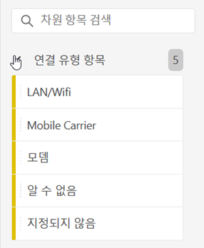
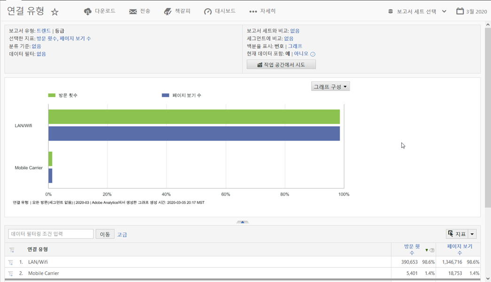

# 연결 유형

모뎀, LAN/Wifi, 이동통신사 등을 비롯한 인터넷 연결 유형에 대한 지표를 표시합니다.

## 예

다음 보고서는 지표 방문 횟수 및 페이지 [보기에 대한](https://docs.adobe.com/content/help/ko-KR/analytics/components/variables/metrics/metrics-visit.html) 연결 유형을 [비교합니다](https://docs.adobe.com/content/help/en/analytics/components/variables/dimensions-reports/reports-page-views.html).

이동통신사 보고서를 보면 이동통신사 연결 유형에 대한 추가 인사이트를 찾을 [**수 있습니다&#x200B;**](https://docs.adobe.com/content/help/en/analytics/components/variables/dimensions-reports/reports-mobile-carrier.html).
