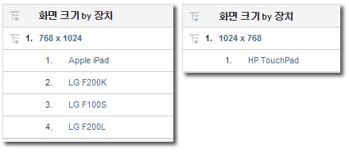

# 모바일

모바일 장치에서의 웹 사이트 액세스에 대한 정보를 표시합니다. 모바일 보고서는 사이트를 보는 데 사용된 모바일 장치에 대한 데이터를 수집하여 방문자 식별 정확도를 높입니다. 모바일 보고서는 장치의 제조업체 및 기능(예: 화면 크기, 비디오, 오디오, 쿠키 지원 및 기타 지표)을 식별할 수 있습니다. 모바일 보고서는 모든 보고서 세트에 사용할 수 있습니다.

## 모바일{#topic_D306EA4558194488AC47A45B9C570150}을 참조하십시오 

모바일 장치에서의 웹 사이트 액세스에 대한 정보를 표시합니다. 모바일 보고서는 사이트를 보는 데 사용된 모바일 장치에 대한 데이터를 수집하여 방문자 식별 정확도를 높입니다. 모바일 보고서는 장치의 제조업체 및 기능(예: 화면 크기, 비디오, 오디오, 쿠키 지원 및 기타 지표)을 식별할 수 있습니다. 모바일 보고서는 모든 보고서 세트에 사용할 수 있습니다.

>[!NOTE]
>
>모바일 보고서는 모바일 웹 트래픽만 표시합니다. iOS, Android 및 기타 SDK를 사용하여 수집한 모바일 앱 데이터는 모바일 앱 보고서에 나타나며, 관리 도구에서 활성화되었을 때만 표시됩니다.

다음 모바일 보고서를 사용할 수 있습니다.

<table id="table_900BB8F2F3A746B6B97DC629B39910DA"> 
 <thead> 
  <tr> 
   <th colname="col1" class="entry"> 보고서 </th> 
   <th colname="col2" class="entry"> 설명 </th> 
  </tr> 
 </thead>
 <tbody> 
  <tr> 
   <td colname="col1"> 
장치 
 </td> 
   <td colname="col2"> 
iOS 또는 Android를 실행하는 장치 같은 모바일 장치를 사용하여 사이트에 액세스한 방문자 수를 표시합니다. 이 보고서를 통해 모바일 이니셔티브의 영향을 이해하고 그에 따라 계획을 수립할 수 있습니다. 이 보고서를 사용하여 다음을 수행할 수 있습니다. 
 
 
     <ul id="ul_8CC40461C2944A63AED561E384275D24"> 
      <li id="li_4667815ED7384DE9824FB47F02040374"> 
모바일 사용자를 취급하는 전략을 개발합니다. 
 </li> 
      <li id="li_12C1F430E5464FB4AC29C2D970165935"> 
대상의 선호도를 파악합니다. 
 </li> 
      <li id="li_BFECB3B1F5A345BA82FC22BF99E8E418"> 
무선 및 모바일 사용자의 출현을 추적합니다. 
 </li> 
     </ul> 
 </td> 
  </tr> 
  <tr> 
   <td colname="col1"> 제조업체 </td> 
   <td colname="col2"> 모바일 장치의 사이트 히트 수를 모바일 장치 제조업체별로 그룹화합니다. 이 보고서는 제조업체 유형, 각 제조업체의 보기 수 및 해당 백분율을 보여줍니다.  </td> 
  </tr> 
  <tr> 
   <td colname="col1"> 화면 크기 </td> 
   <td colname="col2"> 
 모바일 장치의 사이트 히트 수를 장치의 화면 크기별로 그룹화합니다. 이 보고서는 각 화면 크기, 각 화면 크기를 사용한 사이트 방문자의 수 및 전체 보기의 각 화면 크기 백분율로 보여줍니다. 화면 크기 보고서는 화면 크기의 높이 및 너비를 화면 높이 보고서 및 화면 너비 보고서와 비교하여 보여줍니다. 
 
현재 모바일 화면 크기 보고서는 장치에 대해 고정적입니다. 화면 방향과 상관없이 각 장치는 보고서에서 화면 해상도를 고정했습니다. 이것은 모바일 장치별 화면 크기를 분류하여 확인할 수 있습니다. 
 </td> 
  </tr> 
  <tr> 
   <td colname="col1"> 화면 높이 </td> 
   <td colname="col2"> 
 다양한 모바일 장치의 화면 높이와 각 화면 높이의 보기 수를 표시합니다. 또한 화면 크기 보고서를 보고 화면 높이와 너비 모두를 확인할 수 있습니다. 
 </td> 
  </tr> 
  <tr> 
   <td colname="col1"> 화면 너비 </td> 
   <td colname="col2"> 
 다양한 모바일 장치의 화면 너비와 각 화면 너비의 보기 수를 표시합니다. 또한 화면 크기 보고서를 보고 화면 높이와 너비 모두를 확인할 수 있습니다. 
 </td> 
  </tr> 
  <tr> 
   <td colname="col1"> 쿠키 지원 </td> 
   <td colname="col2"> 
모바일 장치 히트 수를 쿠키 지원 여부에 따라 그룹화합니다. 방문자는 쿠키를 지원하는 그룹과 쿠키를 지원하지 않는 그룹으로 분류됩니다. 모바일 장치 유형은 사용자 에이전트 문자열에서 식별됩니다. Adobe는 쿠키를 지원하는 것으로 알려진 모바일 장치 목록을 유지합니다. 사용자 에이전트 문자열에 나열된 모바일 장치는 Adobe의 모바일 장치 목록에도 표시되며  쿠키 지원 보고서의 지원  라인 항목이 증가됩니다. Otherwise, the  Not Supported line item in the report is incremented. 
 </td> 
  </tr> 
  <tr> 
   <td colname="col1"> 이미지 지원 </td> 
   <td colname="col2"> 
 모바일 장치를 지원하는 이미지 유형에 따라 그룹화합니다. 
 
예를 들어 .jpeg 이미지를 지원하는 방문자 전화기가 사이트에 액세스하면 이미지 지원 보고서가 최소 하나씩 증가합니다. 전화기가 둘 이상의 이미지 형식을 지원하는 경우에는 사이트 방문 결과 해당 방문에 대한 여러 증분이 발생할 수 있습니다. 즉, 전화기가 .jpeg, .png 및 .gif 형식을 지원하는 경우 보고서의 해당 그룹이 각각 증가합니다. 따라서 그룹 합계는 보고서 하단에 표시된 총계보다 더 클 수 있습니다. 
 </td> 
  </tr> 
  <tr> 
   <td colname="col1"> 색상 깊이 </td> 
   <td colname="col2"> 
 모바일 장치 히트 수를 지원되는 색상의 수로 그룹화합니다. 이 보고서는 모바일 장치를 사용한 총 사이트 방문자 수를 보여주며 해당 모바일 장치에 구성된 색상의 수에 따라 방문자를 그룹화합니다.  
 
예를 들어 방문자의 휴대 전화기가 24색을 지원하는 경우 보고서에서는 24색에 해당하는 라인 항목이 증가합니다. 
 </td> 
  </tr> 
  <tr> 
   <td colname="col1"> 오디오 지원 </td> 
   <td colname="col2"> 
 모바일 장치를 지원하는 오디오 형식 유형에 따라 그룹화합니다. 
 
예를 들어 방문자의 전화기가 .mp3 형식을 지원하는 경우 오디오 지원 보고서가 최소 하나씩 증가합니다. 전화기가 둘 이상의 이미지 형식을 지원하는 경우에는 사이트 방문 결과 지원되는 오디오 형식에 대한 증분이 발생할 수 있습니다. 즉, 전화기가 .mp3, .aac 및 .amr 형식을 지원하는 경우 보고서의 해당 그룹이 각각 증가합니다. 따라서 그룹 합계는 보고서 하단에 표시된 총계보다 더 클 수 있습니다. 
 </td> 
  </tr> 
  <tr> 
   <td colname="col1"> 비디오 지원 </td> 
   <td colname="col2"> 
 모바일 장치를 지원하는 비디오 형식 유형에 따라 그룹화합니다. 
 
예를 들어, 방문자의 모바일 장치가 .mp4를 지원하는 경우 비디오 지원 보고서는 사이트에 액세스할 때마다 최소 하나씩 증가합니다. 전화기가 여러 이미지 형식을 지원하는 경우(.mp4, .wmv 등) 보고서에서 각 그룹이 증가됩니다. 이로 인해 그룹 합계는 보고서 하단에 표시된 총계보다 더 클 수 있습니다. 
 </td> 
  </tr> 
  <tr> 
   <td colname="col1"> DRM </td> 
   <td colname="col2"> 
 모바일 장치를 지원하는 DRM(디지털 권한 관리) 유형에 따라 그룹화합니다. DRM 그룹은  Forward Lock,  Combined Delivery,  Separate Delivery및  Unknown. 
 </td> 
  </tr> 
  <tr> 
   <td colname="col1"> 네트 프로토콜 </td> 
   <td colname="col2"> 
 모바일 장치를 지원하는 네트워크 프로토콜(GPRS, CSD, EDGE, HSCSD 등)에 따라 그룹화합니다. 보고서는 식별되지 않은 네트워크 프로토콜을 위해 알 수 없음 그룹도 포함하고 있습니다. 
 
방문자가 모바일 장치를 사용하여 사이트에 액세스하면 네트 프로토콜 보고서는 최소 하나 증가합니다. 전화기가 여러 네트워크 프로토콜을 지원하는 경우 보고서에서 각 그룹이 증가합니다. 이로 인해 그룹 합계는 보고서 하단에 표시된 총계보다 더 클 수 있습니다. 
 </td> 
  </tr> 
  <tr> 
   <td colname="col1"> 운영 체제 (사용되지 않음) </td> 
   <td colname="col2"> 
 장치에서 실행되는 모바일 운영 체제를 기준으로 모바일 장치를 그룹화합니다. 모바일 운영 체제에는 Windows, RIM, iOS, Symbian 등이 포함되어 있습니다. 보고서는 식별되지 않은 모바일 운영 체제를 위해 알 수 없음 그룹도 포함하고 있습니다. 
 
Note: This report was deprecated when the Technology &gt; <a href="../../../components/c-variables/dimensionslist/reports-operating-system.md#concept_3FADC871C6204533B4FCE73316B0B34F" format="dita" scope="local"> Operating Systems</a> report was updated to include all operating systems, including mobile. "모바일 장치"가 있는 세그먼트를 만들어, 기술 &gt; 운영 체제 보고서에 적용하여 모바일 운영 체제만 볼 수 있습니다. 
 </td> 
  </tr> 
  <tr> 
   <td colname="col1"> Java 버전 </td> 
   <td colname="col2"> 
 모바일 장치가 지원하는 Java 버전을 기준으로 모바일 장치를 그룹화합니다. Java 버전 보고서는 장치에서 지원하는 JSR(Java Specification Request)로 Java 버전을 식별합니다. 보고서는 식별되지 않은 모바일 운영 체제를 위해 알 수 없음 그룹도 포함하고 있습니다. 
 
<a href="https://jcp.org/en/jsr/overview" scope="external" format="html">Java Community Process</a> 웹 사이트에서 해당 JSR에 대한 자세한 내용을 볼 수 있습니다. 
 </td> 
  </tr> 
  <tr> 
   <td colname="col1"> 북마크 URL 길이 </td> 
   <td colname="col2"> 
 책갈피 URL의 지원되는 최대 길이(문자 수)를 기준으로 모바일 장치를 그룹화합니다. 
 </td> 
  </tr> 
  <tr> 
   <td colname="col1"> 메일 URL 길이 </td> 
   <td colname="col2"> 
 이메일 URL의 지원되는 최대 길이(문자 수)를 기준으로 모바일 장치를 그룹화합니다. 
 </td> 
  </tr> 
  <tr> 
   <td colname="col1"> 브라우저 URL 길이 </td> 
   <td colname="col2"> 
 웹 브라우저 URL의 지원되는 최대 길이(문자 수)를 기준으로 모바일 장치를 그룹화합니다. 
 </td> 
  </tr> 
  <tr> 
   <td colname="col1"> 장치 번호 전송(온/오프) </td> 
   <td colname="col2"> 
 장치 번호 전송이 지원되는지 여부를 기준으로 모바일 장치를 그룹화합니다. 보고서는 장치 번호 전송 지원을 확인할 수 없는 장치를 위해 알 수 없음 그룹도 포함하고 있습니다. 
 </td> 
  </tr> 
  <tr> 
   <td colname="col1"> PTT </td> 
   <td colname="col2"> 
 장치가 PTT(Push To Talk)를 지원하는지 여부를 기준으로 모바일 장치를 그룹화합니다. 이 보고서에는 PTT 지원을 결정할 수 없는 장치들에 대한  PTT 지원을 확인할 수 없는 장치를 위한 알 수 없음 그룹입니다. 
 </td> 
  </tr> 
  <tr> 
   <td colname="col1"> 데코레이션 메일 지원 </td> 
   <td colname="col2"> 
 사용자가 그래픽과 애니메이션으로 메일을 장식할 수 있는 DecoMail을 장치가 지원하는지 여부를 기준으로 모바일 장치를 그룹화합니다. 이 보고서에는 PTT 지원을 결정할 수 없는 장치들에 대한  데코레이션 메일 지원을 확인할 수 없는 장치를 위한 알 수 없음 그룹입니다. 
 </td> 
  </tr> 
  <tr> 
   <td colname="col1"> 정보 서비스 </td> 
   <td colname="col2"> 
 모바일 장치가 지원하는 뉴스 서비스(Channel I/B, EZ News Flash, W+INFO 등)를 기준으로 모바일 장치를 그룹화합니다. 방문자가 뉴스 서비스를 지원하는 모바일 장치를 사용하여 사이트에 액세스하면 정보 서비스 보고서는 최소 하나 증가합니다. 전화기가 여러 뉴스 서비스를 지원하는 경우 보고서에서 각 그룹이 증가합니다. 이로 인해 그룹 합계는 보고서 하단에 표시된 총계보다 더 클 수 있습니다. 
 </td> 
  </tr> 
 </tbody> 
</table>

