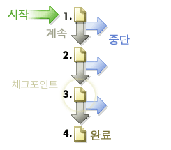

# 경로

웹 사이트 페이지에 액세스하는 순서에 대한 정보를 표시합니다. 방문자가 사용자 사이트를 방문하기 전에 있었던 사이트와 방문 후에 가는 사이트에 대한 정보를 수집할 수 있습니다.

## 경로 {#topic_39F11BCBEDC3495EA1300149FC6D4F14}

웹 사이트 페이지에 액세스하는 순서에 대한 정보를 표시합니다. 방문자가 사용자 사이트를 방문하기 전에 있었던 사이트와 방문 후에 가는 사이트에 대한 정보를 수집할 수 있습니다.

경로 보고서에는 본 페이지의 클릭스트림을 표시하는 표준 상세 및 선택적 고급 분석 보고서가 포함되어 있어서 전체 경로, 최장 경로 및 가장 빈도가 높은 경로를 파악하고, 페이지 흐름, 폴아웃 및 드롭아웃을 그래픽으로 표시하고, 일정 기간의 새로운 패턴과 변경 패턴을 표시하고, 시작 및 종료 경로를 분석할 수 있습니다.

**[!UICONTROL 다음 페이지 흐름]** 또는 **[!UICONTROL 다음 사이트 흐름]: 방문자가 선택한 페이지에서 멀어진 후 보는 선택한 페이지(또는 섹션, 부서 등)의 두 단계 깊이 분기 그래픽을 표시합니다.** 이 보고서를 사용하면 방문자가 선택한 페이지를 본 후 종종 밟게 되는 단계를 분석 및 식별할 수 있습니다. 다음을 수행할 수 있습니다.

* 선택한 페이지를 본 후에 가장 빈번하게 수행되는 단계를 파악합니다.
* 원하는 목표 페이지로 트래픽이 집중되도록 사이트 경로를 디자인합니다.
* 원하는 목표 페이지 대신 방문자가 향하는 곳을 파악합니다.

**[!UICONTROL 다음 페이지]**(또는 다음 카테고리): 다음 페이지 보고서는 방문자가 선택한 페이지를 본 후에 본 사이트의 페이지를 보여주어 자세한 사이트 경로 분석을 제공합니다. 예를 들어 이 보고서는 전체 사이트를 선택하고 보고할 때 상위 10개의 랜딩 페이지를 보여주며 가장 인기 있는 5개의 다음 페이지를 각 랜딩 페이지 아래에 나열합니다. 이 데이터를 사용하면 사이트에서 방문자를 가장 자주 이동시키는 컨텐츠, 기능 및 기타 데이터를 이해하는 데 도움이 됩니다.

**[!UICONTROL 이전 페이지 흐름]**(또는 다른 이전 카테고리 흐름): 방문자가 선택한 페이지에 앞서 본 두 수준의 가장 방문 빈도가 높은 페이지를 보여줍니다. 방문자가 사이트로 들어오는 시점도 강조해서 보여줍니다.

**[!UICONTROL 이전 페이지]**(또는 다른 이전 카테고리): 방문자가 사이트에서 선택한 페이지를 보기 전에 본 사이트의 페이지를 보여줌으로써 자세한 사이트 경로 분석을 제공합니다.

**[!UICONTROL 폴아웃]**: 사용자가 정의하는 각 체크포인트 사이의 방문 감소율과 전환율을 보여줍니다. 단계는 위에서 아래로 배열되며 초기 숫자와 비율은 왼쪽에 표시되고 전환율과 폴아웃 비율은 오른쪽에 표시됩니다.

자세한 내용은  [폴아웃 보고서](../../../components/c-variables/dimensionslist/reports-fallout.md#concept_DE1F8040F1B741F087B78568B342EC41).

**[!UICONTROL 경로 탐색]**: 전체 경로를 단편으로 분석하여 사이트 최적화에 유용한 정확한 패턴을 제공합니다. 경로 탐색 마법사를 사용하면 보고서를 생성하는 데 사용되는 선택 기준을 지정할 수 있으므로 경로 단편을 분석하여 특정 페이지로 시작되거나 특정 페이지로 끝나는 경로 단편 또는 하나의 페이지로 시작되고 다른 페이지로 끝나는 경로 단편을 조회할 수 있습니다.

**[!UICONTROL 경로 길이]**: 방문자가 사이트를 검색하는 깊이를 백분율과 총 계수로 보여줍니다. 즉, 사이트의 평균 방문자가 떠나기 전에 보게 되는 페이지 수를 보여줍니다.

**[!UICONTROL 페이지 분석]**: 다음을 분석할 수 있는 보고서 하위 세트가 들어 있습니다.

* **[!UICONTROL 페이지 요약/사이트 카테고리 요약]**: 페이지 보고서에 대해 알아야 하는 모든 것을 알려줍니다. 이 보고서는 한 페이지의 고유한 정보를 수집하여 하나의 보고서로 구성합니다.
* **[!UICONTROL 다시 로드]**: 방문자가 개별 페이지를 다시 로드한 횟수를 보여줍니다.
* **[!UICONTROL 페이지에서 보낸 시간/사이트 카테고리]**: 방문자가 사이트에서 개별 페이지를 검색하는 시간을 표시합니다. 보낸 시간은 15초 미만, 15 - 30초, 30 - 60초, 1 - 3분, 3 - 5분, 5 - 10분, 10 - 15분, 15 - 20분, 20 - 30분 및 30분 이상 등 10개의 카테고리로 구분되어 있습니다.
* **[!UICONTROL 페이지 클릭 수]**: 방문자가 사이트의 각 페이지에 액세스하는 데 사용한 클릭 수를 식별합니다. 페이지 깊이는 해당 페이지 이전에 본 페이지 수를 계산하여 측정합니다.

**[!UICONTROL 시작 및 종료]**: 시작 페이지 보고서는 사이트에서 새 방문자가 맨 처음으로 보는 페이지를 백분율과 총 방문 횟수로 보여줍니다. 다음을 볼 수 있습니다.

* **[!UICONTROL 시작 페이지]**(또는 섹션): 백분율과 총 방문 횟수로 사이트에서 신규 방문자가 처음으로 본 페이지들을 표시합니다. 이 보고서를 사용하여 가장 빈번한 시작 지점으로 사용된 웹 페이지를 식별하고 사이트의 1차 시작 지점을 최적화하며, 시작 트래픽을 사이트의 주요 메시지로 유도합니다.
* **[!UICONTROL 원래 시작 페이지]**: 사이트를 처음 방문한 사용자가 본 첫 번째 페이지를 보여줍니다. 각 사용자는 쿠키를 삭제하지 않거나 쿠키로 추적하는 경우 한 번만 카운트됩니다.
* **[!UICONTROL 단일 페이지 방문 횟수]**: 세션을 탐색 중인 방문자의 시작 페이지 및 종료 페이지로 가장 많이 이용되는 페이지를 보여줍니다.
* **[!UICONTROL 종료 페이지]**: 사이트에서 방문자가 마지막으로 본 페이지를 백분율과 총 방문 횟수로 보여줍니다.

