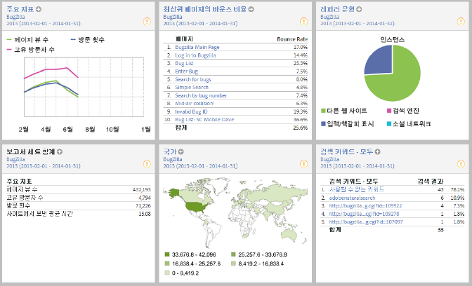

# 사이트 개요

사이트 지표 &gt; 사이트 개요 보고서는 로그인 시 표시되며 관련 데이터를 즉시 확인하고 이 데이터와 상호 작용할 수 있도록 해줍니다. 레이아웃을 편집하고 대시보드로 저장하고 보다 심층 있는 분석을 위해 데이터를 드릴다운할 수 있습니다.

도구 모음에서 **[!UICONTROL 레이아웃]을 클릭하여 이 보고서를 사용자 지정하고 대시보드로서 저장합니다.**

랜딩 페이지로 표시할 대시보드를 지정하는 경우 이 보고서가 자동으로 표시되지 않습니다.
