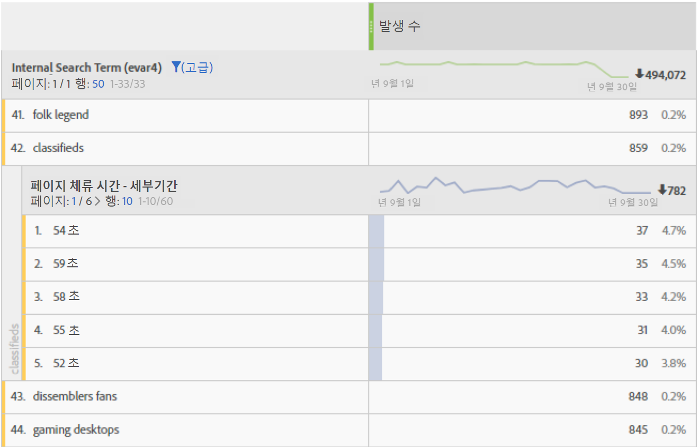

# 페이지에서 보낸 시간

Adobe Analytics는 Analytics 보고서에서 보낸 시간을 확인하는 여러 가지 방법을 제공합니다. 대부분의 경우 체류 시간은 다음 단계를 사용하여 계산됩니다.

1. 지정된 히트의 경우 타임스탬프 및 차원 값을 확인합니다.
2. 이 히트를 방문에서 다음 히트의 타임스탬프와 비교합니다.
3. 이 두 히트 사이에 경과된 시간이 해당 페이지에 걸린 시간에 기여합니다.

체류 시간 차원 데이터를 볼 때는 다음 사항에 유의하십시오.

* 소요 시간은 할당과 만료가 고려됩니다.
* 체류 시간 데이터를 계산할 때 페이지 보기 횟수와 링크 추적 히트 유형은 모두 고려됩니다.
* 경과 시간을 측정할 후속 이미지 요청이 없기 때문에 체류 시간은 방문의 마지막 히트 동안 측정되지 않습니다.
* 방문은 단일 히트로 구성되므로 바운스는 체류 시간을 측정할 수 없습니다.

페이지에서 보낸 시간은 방문에서 히트 사이의 경과 시간을 측정합니다. 개별 차원은 **세분화된** 차원과 **버킷**&#x200B;간에 존재합니다.

* **** 세부기간:각 차원 값은 두 히트 사이의 다른 체류 시간(초)입니다.
* **** Bucketed:각 차원 값은 미리 정의된 버킷입니다.
   * 15초 미만
   * 15-29초
   * 1-3분
   * 3-5분
   * 5-10분
   * 10-15분
   * 15-20분
   * 20-30분
   * 30분 이상

이 차원은 히트 기반이며, 분류로 사용되는 경우 보다 의미 있는 데이터를 제공할 수 있습니다. 이 차원을 [방문](reports-time-spent-per-visit.md)기반 차원인 방문당 체류 시간과 비교합니다.

