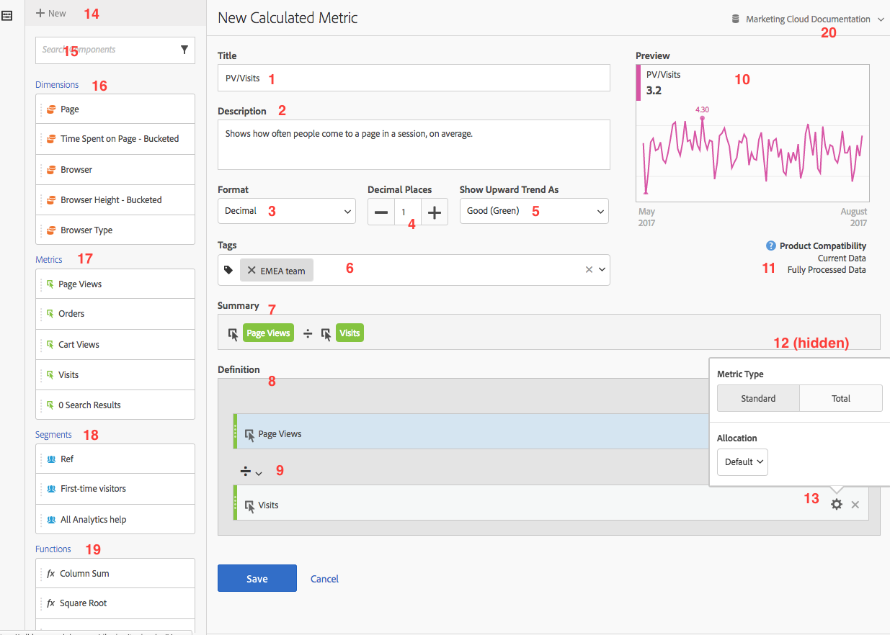

# 계산된 지표 빌드 {#build-metrics}

Adobe Analytics는 차원, 지표, 세그먼트 및 함수를 끌어다 놓음으로써 컨테이너 계층 논리, 규칙 및 연산자를 기준으로 사용자 정의 지표를 만들 수 있는 캔버스를 제공합니다. 이러한 통합 개발 도구를 사용하여 간단하거나 복잡한 계산된 지표를 빌드하고 저장할 수 있습니다.

계산된 지표 빌더를 사용하여 계산된 지표를 만들거나 편집할 수 있습니다. 이렇게 생성되면 계산된 지표가 구성 요소 목록에서 사용 가능하며, 조직 전체의 프로젝트에서 사용할 수 있습니다. 또는 [지표](/help/analyze/analysis-workspace/components/apply-create-metrics.md)에서 [단일 프로젝트에 대한 계산된 지표 만들기](/help/analyze/analysis-workspace/components/apply-create-metrics.md#create-calculated-metrics-for-a-single-project)에 설명된 대로 계산된 지표가 생성된 프로젝트에 대해서만 사용할 수 있는 계산된 지표를 빠르게 만들 수 있습니다.

[계산된 지표 만들기](../cm-workflow.md)는 새 계산된 지표 만들기에 사용할 수 있는 다양한 옵션을 설명해 줍니다.

## 계산된 지표 빌더의 영역

**[!UICONTROL 계산된 지표 빌더]** 대화 상자는 새 계산된 지표를 만들거나 기존의 계산된 지표를 편집하는 데 사용됩니다. 대화 상자의 제목은 **[!UICONTROL 새 계산된 지표]**&#x200B;이거나 [[!UICONTROL 계산된 지표] 관리자](../cm-manager.md)에서 지표를 만들거나 관리하는 **[!UICONTROL 계산된 지표 편집]**&#x200B;입니다.

>[!BEGINTABS]

>[!TAB 계산된 지표 빌더]

>[!TAB 계산된 지표 만들기 또는 편집]

>[!ENDTABS]

1. 다음 세부 정보를 지정합니다(는 필수 입력 항목).

   | 요소 | 설명 |
   | --- | --- |
   | **[!UICONTROL 보고서 세트]** | 계산된 지표에 대한 보고서 세트를 선택할 수 있습니다.  정의한 계산된 지표는 선택한 보고서 세트에 따라 Workspace 프로젝트에서 사용할 수 있습니다. |
   | **[!UICONTROL 프로젝트 전용 지표]** | 단일 프로젝트에 대해 생성된 계산된 지표를 편집할 때, [단일 프로젝트에 대한 계산된 지표 만들기](/help/analyze/analysis-workspace/components/apply-create-metrics.md#create-calculated-metrics-for-a-single-project)에 설명된 대로 이 대화 상자의 맨 위에 정보 상자가 나타납니다. 
이 계산된 지표를 모든 프로젝트에서 사용할 수 있도록 하려면 **[!UICONTROL 이 지표가 모든 프로젝트에 사용할 수 있도록 설정하기 및 구성 요소 목록 추가하기]** 옵션을 선택합니다.
 |
   | **[!UICONTROL 제목]**  | 계산된 지표의 이름을 지정합니다. 예: `Conversion Rate`. |
   | **[!UICONTROL 설명]** | 세그먼트에 대한 설명을 제공합니다. 예: `Calculated metric to define the conversion rate.` 계산된 지표에 대한 공식은 이미 [!UICONTROL 요약]에서 자동으로 사용할 수 있으므로 설명할 필요가 없습니다. |
   | **[!UICONTROL 포맷]** | 계산된 지표의 형식을 선택합니다. **[!UICONTROL 소수점]**, **[!UICONTROL 시간]**, **[!UICONTROL 백분율]**, **[!UICONTROL 통화]** 중에서 선택할 수 있습니다. |
   | **[!UICONTROL 소수점 이하 자리 수]** | 선택한 형식에 소수점 이하 자리 수를 지정합니다. 선택한 형식이 소수점, 통화, 백분율인 경우에만 활성화됩니다. |
   | **[!UICONTROL 증가 트렌드를 다음으로 표시]** | 계산된 지표의 상승 추세를 ▲ **[!UICONTROL 좋음(녹색)]**&#x200B;으로 표시할지 ▼ **[!UICONTROL 나쁨(빨간색)]**&#x200B;으로 표시할지 지정합니다. |
   | **[!UICONTROL 통화]** | 계산된 지표의 통화를 지정합니다. 형식이 통화로 선택된 경우에만 활성화됩니다. |
   | **[!UICONTROL 태그]** | 하나 이상의 태그를 만들거나 적용하여 계산된 지표를 구성합니다. 이름을 입력하여 선택할 수 있는 기존 태그를 찾습니다. 또는 **[!UICONTROL ENTER]** 키를 눌러 새 태그를 추가합니다. 를 선택하여 태그를 제거합니다. |
   | **[!UICONTROL 미리보기]** | 미리보기는 지난 90일을 포함하며, 이를 통해 지표를 올바르게 정의했는지 측정할 수 있습니다. |
   | **[!UICONTROL 요약]** | 계산된 지표의 정의 요약을 표시합니다.  예:  **[!UICONTROL 총 주문]**   **[!UICONTROL 세션]**. |
   | **[!UICONTROL 정의]**  | [정의 빌더](#definition-builder)를 사용하여 세그먼트를 정의합니다. |

1. 계산된 지표 정의가 올바른지 확인하려면 계산된 지표의 결과를 지속적으로 업데이트하는 **[!UICONTROL 미리보기]**&#x200B;를 사용합니다. **[!UICONTROL 미리보기]**&#x200B;는 지난 90일을 포함하며 계산된 지표의 정의를 지속적으로 평가합니다.

   **[!UICONTROL 제품 호환성]**&#x200B;은 계산된 지표와 Adobe Analytics 기능 간 호환 여부를 나타냅니다. 자세한 내용은 [지표 호환성](/help/components/calculated-metrics/cm-compatibility.md) 을 참조하십시오.

1. 다음을 선택합니다.
   * 계산된 지표를 저장하려면 **[!UICONTROL 저장]**&#x200B;을 클릭합니다.
   * 계산된 지표 사본을 저장하려면 **[!UICONTROL 다른 이름으로 저장]**&#x200B;을 사용합니다.
   * 계산된 지표에 대한 변경 사항을 취소하거나 새 계산된 지표 생성을 취소하려면 **[!UICONTROL 지표]**&#x200B;를 선택합니다.

## 정의 빌더

정의 빌더를 사용하여 차원, 지표, 세그먼트 및 함수를 끌어다 놓아 컨테이너 계층 논리, 규칙 및 연산자를 기반으로 사용자 정의 지표를 만듭니다. 해당 구성에서는 표준 지표, Adobe 정의 지표, 계산된 지표, 세그먼트, 차원 및 함수를 사용할 수 있습니다. 이러한 모든 구성 요소는 계산된 지표 빌더의 구성 요소 패널에서 사용할 수 있습니다. 또한 정의에서 연산자와 컨테이너를 사용할 수 있습니다.

**[!UICONTROL 정의]** 영역에서는 지표만 단일 구성 요소로 정의됩니다. 다른 모든 구성 요소는 컨테이너, 자동 줄바꿈 지표 또는 다른 컨테이너로 정의됩니다. 자세한 내용은 [컨테이너](#containers)를 참조하십시오.

### 지표

지표 추가 방법:

* 구성 요소 패널에서  **[!UICONTROL 지표]** 구성 요소를 **[!UICONTROL 지표, 차원, 차원 항목, 세그먼트 및/또는 함수를 여기에 드래그 앤 드롭]**&#x200B;으로 끌어다 놓습니다. 특정 구성 요소를 검색하려면 구성 요소 표시줄의 을 사용할 수 있습니다.

정의의 일부로 계산된 지표를 사용하면 계산된 지표가 확장됩니다.

지표 수정 방법:

1.  영역에서 지표 구성 요소의 **[!UICONTROL 설정]**&#x200B;을 선택합니다.
1. 팝업 대화 상자에서 지표 유형과 속성 모델을 정의할 수 있습니다. [지표 유형 및 속성](m-metric-type-alloc.md)을 확인합니다.

지표 삭제 방법:

* 지표에서 를 선택합니다.

### 연산자

연산자를 사용하면 구성 요소 또는 컨테이너 간의 연산자를 지정할 수 있습니다. 다음 사이에 연산자가 자동으로 나타납니다.

* 컨테이너에 두 개 이상의 지표
* 컨테이너에 두 개 이상의 컨테이너
* 컨테이너에 하나 이상의 지표와 하나 이상의 컨테이너.

다음 항목을 선택할 수 있습니다.

| 기호 | 연산자 |
|:---:|---|
|  | 나누기 (기본값) |
|  | 곱하기 |
|  | 빼기 |
|  | 추가 |

### 정적 숫자

계산된 지표 정의에 정적 숫자를 추가할 수 있습니다. 정적 숫자 추가 방법:

* 컨테이너 내에서  **[!UICONTROL 추가]**&#x200B;를 선택합니다.
* **[!UICONTROL 정적 숫자]**&#x200B;를 선택합니다. 정적 숫자 컨테이너가 나타납니다.
* [!UICONTROL *값을 추가하려면 클릭*]&#x200B;을 선택하고 값을 입력합니다.

### 컨테이너

계산된 지표 정의에 차원, 세그먼트 및 함수를 컨테이너로 추가합니다. 일반적인 컨테이너를 추가할 수도 있습니다. 컨테이너는 수학 표현식처럼 작동하고 작업 순서를 결정합니다. 컨테이너 내의 모든 항목은 다음 구성 요소나 컨테이너보다 먼저 처리됩니다.

#### 세그먼트 컨테이너

세그먼트 컨테이너의 개념을 사용하여 [세분화된 지표](metrics-with-segments.md)를 만들 수 있습니다. 세그먼트를 사용하거나 차원에서 만든 세그먼트를 사용하여 세그먼트 컨테이너를 구성할 수 있습니다.

* 차원에서 세그먼트 컨테이너를 추가하는 방법은 다음과 같습니다.

   1. 구성 요소 패널에서  **[!UICONTROL 차원]** 구성 요소를 끌어다 **[!UICONTROL 지표, 차원, 차원 항목, 세그먼트 및/또는 함수를 여기에 드래그 앤 드롭]**&#x200B;에 놓습니다. 특정 구성 요소를 검색하려면 구성 요소 표시줄의 을 사용할 수 있습니다.
   1. **[!UICONTROL 차원에서 세그먼트 만들기]** 팝업에서 세그먼트에 대한 조건을 정의합니다. 연산자 목록에서 선택한 후 값을 선택하거나 값을 입력합니다. 예를 들어 **[!UICONTROL 월]**&#x200B;은  `Sep 2024`와 **[!UICONTROL 같습니다]**.
   1. **[!UICONTROL 완료]**&#x200B;를 선택합니다. **[!UICONTROL 정의]**&#x200B;에 세그먼트 컨테이너가 추가됩니다.

* 세그먼트에서 세그먼트 컨테이너를 추가하기 위해 다음을 사용할 수 있습니다.

   * 구성 요소 패널에서  **[!UICONTROL 세그먼트]** 구성 요소를 끌어다 **[!UICONTROL 지표, 차원, 차원 항목, 세그먼트 및/또는 함수를 여기에 드래그 앤 드롭]**&#x200B;에 놓습니다. 특정 세그먼트를 검색하려면 구성 요소 표시줄의 을 사용할 수 있습니다.
세그먼트 이름을 사용하여 세그먼트 컨테이너가 자동으로 **[!UICONTROL 정의]**&#x200B;에 추가됩니다.

   *  **[!UICONTROL 세그먼트]** 구성 요소를 구성 요소 패널에서 일반 컨테이너로 끌어다 놓습니다. 해당 컨테이너가 세그먼트 컨테이너로 수정됩니다.

   * 컨테이너 내에서  **[!UICONTROL 추가]**&#x200B;를 선택합니다.

      1. **[!UICONTROL 세그먼트]**&#x200B;를 선택합니다. **[!UICONTROL 정의]**&#x200B;에 세그먼트 컨테이너가 추가됩니다.
      1. 새 세그먼트 컨테이너에서의 [!UICONTROL *선택...*] 드롭다운 메뉴에서 세그먼트를 선택합니다.

  >[!TIP]
  >
  >컨테이너에 여러 개의 세그먼트를 추가할 수 있습니다.

  컨테이너 내의 세그먼트는 세그먼트 구성 요소의 이름을 따서 명명됩니다. 예:  **[!UICONTROL 웹 세션]**. 세그먼트에 대한 더 자세한 내용이 포함된 팝업이 표시되도록 하려면 을 선택합니다. 팝업에서 을 선택해 세그먼트 정의를 편집합니다.

컨테이너에서 세그먼트를 제거하는 방법은 다음과 같습니다.

* 세그먼트 이름 옆의 를 선택합니다.

보다 자세한 내용과 예제는 [세분화된 지표](metrics-with-segments.md)를 참조하십시오.

#### 함수 컨테이너

함수 컨테이너를 추가하기 위해 다음을 사용할 수 있습니다.

* 드래그 앤 드롭:

   1. 구성 요소 패널에서  **[!UICONTROL 함수]** 구성 요소를 끌어다 **[!UICONTROL 지표, 차원, 차원 항목, 세그먼트 및/또는 함수를 여기에 드래그 앤 드롭]**&#x200B;에 놓습니다. 특정 함수를 검색하려면 구성 요소 표시줄의 을 사용할 수 있습니다.
   1. 함수 이름을 사용하여 함수 컨테이너가 자동으로 **[!UICONTROL 정의]**&#x200B;에 추가됩니다.

* 컨테이너 내에서  **[!UICONTROL 추가]**&#x200B;를 선택합니다.

   1. **[!UICONTROL 함수]**&#x200B;를 선택합니다.
   1. 컨테이너의 [!UICONTROL *선택...*] 드롭다운 메뉴에서 함수를 선택합니다.

함수 컨테이너는 함수 구성 요소의 이름을 따서 명명됩니다. 예:  **[!UICONTROL SQUARE ROOT(지표)]**. 함수에 대한 더 자세한 내용이 포함된 팝업이 표시되도록 하려면 을 선택합니다. 함수에 대한 자세한 내용은 **[!UICONTROL 자세히 알아보기]**&#x200B;를 참조하십시오.

계산된 지표를 만드는 데 사용할 수 있는 함수와 함수를 사용하는 방법에 대한 자세한 내용은 [함수 사용](cm-using-functions.md)을 참조하십시오.

#### 일반 컨테이너

일반 컨테이너 추가 방법:

* 컨테이너 내에서  **[!UICONTROL 추가]**&#x200B;를 선택합니다.
* **[!UICONTROL 컨테이너]**&#x200B;를 선택합니다. 새로운 빈 일반 컨테이너가 **[!UICONTROL 정의]**&#x200B;에 추가됩니다. 일반 컨테이너를 사용하여 계산된 지표 정의에 계층을 중첩하거나 만들 수 있습니다.

#### 컨테이너 삭제

컨테이너를 삭제하려면 컨테이너 수준에서 를 선택합니다.

>[!MORELIKETHIS]
>
>[함수 사용](cm-using-functions.md)
>>[세그먼트](/help/components/segmentation/seg-overview.md)
>

<!--

Adobe Analytics provides a canvas to drag and drop dimensions, metrics, segments, and functions to create custom metrics based on container hierarchy logic, rules, and operators. This integrated development tool lets you build and save simple or complex calculated metrics.

## Begin building a calculated metric

You can use the calculated metric builder to create or edit calculated metrics. When created in this way, calculated metrics are available in the component list and can then be used in projects throughout your organization. Alternatively, you can quickly create a calculated metric that is available only for the project where it was created, as described in [Create calculated metrics for a single project](/help/analyze/analysis-workspace/components/apply-create-metrics.md#create-calculated-metrics-for-a-single-project) in [Metrics](/help/analyze/analysis-workspace/components/apply-create-metrics.md).

Access the calculated metric builder to begin creating a calculated metric that is available in the component list. 

1. Access the calculated metric builder in any of the follows ways:

   * In Analysis Workspace, open a project, then select **[!UICONTROL Components]** > **[!UICONTROL Create metric]**.
   * In Analysis Workspace, open a project, then select the **Plus** icon next to the [!UICONTROL **Metrics**] section in the left rail.
   * In [!DNL Adobe Analytics], go to **[!UICONTROL Components]** > **[!UICONTROL Calculated metrics]**, then select **[!UICONTROL + Add]** at the top of the Calculated metrics page.

1. Continue with [Areas of the calculated metric builder](#areas-of-the-calculated-metrics-builder).

## Areas of the Calculated metrics builder

The following image and accompanying table explain some of the main areas and features of the Calculated metrics builder.

| Location in image  | Name and function  |
|---|---|
| 1 | **Title:** Naming the metric is mandatory. You cannot save the metric unless it is named.  |
| 2 | **Description:** Give it a user-friendly description to show what it's used for and to distinguish it from similar ones. 
The description also appears within a report. It's best NOT to put the formula into the description - instead, describe what this metric should and should not be used for. (The formula is generated as you build the metric, underneath the Summary heading. As a result, there is no need to add the formula to the description.) 
  |
| 3 | **Format:** Choices include Decimal, Time, Percent, and Currency.  |
| 4 | **Decimal Places:** Shows how many decimal places will be shown in the report. The maximum number of decimal places you can specify is 10.  |
| 5| **Show Upward Trend As:** This metric polarity setting shows whether Analytics should consider an upward trend in the metric as good (green) or bad (red). As a result, the report's graph will show as green or red when it's going up.  |
| 6 | **Tags:** Tagging is a good way to organize metrics. All users can create tags and apply one or more tags to a metric. However, you can see tags only for those segments that you own or that have been shared with you. What kinds of tags should you create? Here are some suggestions for useful tags:<ul><li>**Team names**, such as Social Marketing, Mobile Marketing.</li><li>**Projects** (analysis tags), such as Entry-page analysis.</li><li>**Categories**, such as Women's; Geography.</li><li>**Workflows**, such as To be approved; Curated for (a specific business unit)</li></ul> |
| 7 | **Summary:** 
The Summary formula updates anytime you make a change to the metric definition. This formula also shows up in the metrics rail on the left when you hover over a metric and click the  icon. 
  |
| 8 | **Definition:** This is where you drag in metrics/calculated metrics, segments, and/or functions to build the calculated metric. <ul><li>If you drag in a calculated metric, it will expand its metric definition automatically. </li> <li>You can nest definitions with containers. However, unlike segment containers, these containers function like a math expression and determine the order of operations. </li> </ul>  |
| 9 | **Operator:** Divided by (  ) is the default operator, plus there are the +, -, and x operators. |
| 10 | **Preview:** Provides a quick read on any possible errors. The preview covers the last 90 days. This is a way of initially gauging whether you have selected the right components for your metric. An unexpected result would mean you need to take a second look at the metric definition.  |
| 11 | **Product compatibility:** Product compatibility shows you whether the metric is compatible with <a href="/help/analyze/reports-analytics/current-data.md"  > Current Data </a>, with Fully Processed Data, or only with Marketing Channel reports (first-touch allocation). 
Note:  Current Data does not support all metrics. Metrics that contain segments or functions are not compatible with current data. <a href="/help/components/calculated-metrics/cm-compatibility.md"  > More... </a> 
 
  |
| 12 | **Add:** For all types of calculated metrics, you can add containers and static numbers to the definition. For advanced calculated metrics, you can also add segments and functions. <ul><li>Containers function like a math expression and determine the order of operations. So anything in a container will get processed before the next operation.</li><li>Dragging a segment onto a container segments everything in that container. (Advanced calculated metrics only)</li><li>You can stack multiple segments in a container.</li></ul> |
| 13 | **Gear icon (Metric Type, Attribution):** Selecting the gear icon next to a metric lets you specify the <a href="/help/components/calculated-metrics/workflow/c-build-metrics/m-metric-type-alloc.md"  > metric type and attribution models </a>. |
| 14 | **New:** Lets you create a new component, such as a new segment (which takes you to the <a href="/help/components/segmentation/segmentation-workflow/seg-build.md"  > Segment Builder </a>.) |
| 15 | **Search Components:** This search bar lets you search for dimensions, metrics, segments (advanced calculated metrics only), and functions (advanced calculated metrics only). |
| 16 | **List of Dimensions:** Rather than leaving the Calculated Metric Builder in order to build a simple segment (in the Segment Builder), e.g. "Page = Homepage", you can drag in Page and select Homepage directly from the Calculated Metric Builder.
This results in a much more streamlined workflow for creating segmented calculated metrics.
 |
| 17 | **List of Metrics:** Metrics come in 3 categories: <ul> <li>Standard metrics () </li><li>Calculated metrics ( ) </li><li id="li_8735E76637ED4C3F983731A66E04C93E">Metrics templates ( ) - at the bottom of the list. </li> </ul> 
When you hover over a metric, you can see the Info icon to the right of it: . Clicking this icon gives you the following information: 
<ul> <li>The formula of how it is calculated. </li><li>A preview trend of the metric. </li><li>An edit (pencil) icon  at the top right that will take you to the Calculated Metrics Builder where you can edit this calculated metric. </li></ul> |
| 18 | **List of Segments:** (Advanced calculated metrics only) As an Admin, this list shows all segments created in your login company. If you are a non-Admin user, this list shows segments you own and those shared with you. <a href="/help/components/segmentation/segment-reference/seg-rights.md"  > More... </a> |
| 19 | **List of Functions:** (Advanced calculated metrics only) Functions are divided into two lists: <a href="/help/components/calculated-metrics/cm-reference/cm-functions.md"  > Basic </a> (used most often) and <a href="/help/components/calculated-metrics/cm-reference/cm-adv-functions.md"  > Advanced </a>. |
| 20 | **Report Suite selector:** Lets you switch to a different report suite. |

{style="table-layout:auto"}

-->
