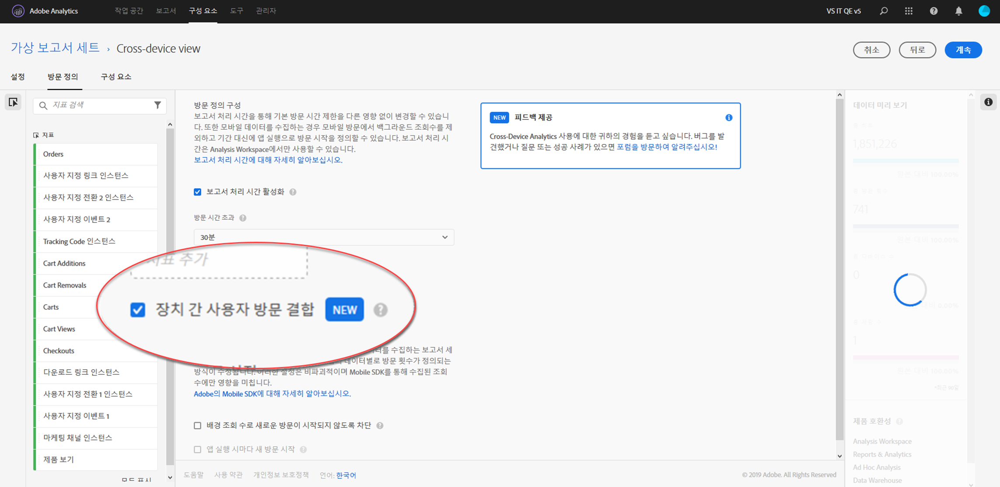

# 장치 간 분석 설정

> [!NOTE] 크로스 디바이스 분석 문서는 기능이 추가로 개발됨에 따라 변경될 수 있습니다. 업데이트를 정기적으로 확인할 수 있습니다.

모든 사전 요구 사항이 충족되면 다음 단계를 사용하여 장치 간 분석을 활성화합니다. 다음 단계를 수행하려면 제품 프로필 관리 그룹에 속하거나 Adobe Analytics에서 관리자 권한을 가지고 있어야 합니다.

> [!IMPORTANT] 다음 단계를 수행하기 전에 모든 전제 조건을 충족해야 합니다. 모든 사전 요구 사항이 충족되지 않으면 기능은 사용할 수 없거나 작동하지 않습니다. 전제 조건 및 제한 사항에 대한 자세한 내용은 [장치 간 분석을](cda-home.md) 참조하십시오.

## CDA에 사용할 장치 간 보고서 세트를 선택합니다.

CDA를 사용할 수 있도록 조직이 프로비저닝되면 사용할 보고서 세트를 선택합니다. 이 선택 사항은 Adobe 계정 관리자를 통해 전달될 수 있습니다. 그런 다음 CDA 처리를 위해 선택한 보고서 세트를 활성화합니다.

## 장치 간 가상 보고서 세트를 만들어 장치 간 보기 보기

가상 보고서 세트를 만들기 위한 액세스 권한이 있는 관리자는 CDA 가상 보고서 세트를 다음과 같이 만들 수 있습니다.

1. [experiencecloud.adobe.com](https://experiencecloud.adobe.com) 로 이동하고 Adobeid 자격 증명을 사용하여 로그인합니다.
2. 상단에 있는 9 개의 격자 아이콘을 클릭한 다음 분석을 클릭합니다.
3. 상단에 있는 구성 요소 위로 마우스를 가져간 다음 가상 보고서 세트를 클릭합니다.
4. 추가를 클릭합니다.
5. 가상 보고서 세트의 이름을 입력하고 CDA 지원 보고서 세트를 선택해야 합니다.
6. 장치 간 분석 등 여러 가지 옵션을 사용할 수 있는 확인란을 클릭하십시오.
7. ' 장치 간 사용자 방문'확인란을 클릭합니다.
8. 계속을 클릭하고, 가상 보고서 세트 구성을 완료한 다음 저장을 클릭합니다.

## 장치 간 가상 보고서 세트 추가 및 변경 사항

가상 보고서 세트에서 장치 간 분석이 활성화되면 다음 변경 사항을 참고하십시오.

* 가상 보고서 세트 이름 옆에 새 장치 간 아이콘이 나타납니다. 이 아이콘은 장치 간 가상 보고서 세트에만 해당됩니다.
* ' People'및'Unique Devices'레이블이 지정된 새 지표를 사용할 수 있습니다.
* 지표'고유 방문자 수'는 사람 및 고유 장치로 대체되므로 사용할 수 없습니다.
* 세그먼트를 작성할 때'방문자'세그먼트 컨테이너는'사람'컨테이너로 대체됩니다.

## 압축 계산 지표

디바이스 간 분석을 연결하는 크로스 디바이스 분석 기능은 다양한 요인에 따라 다릅니다. 기능의 stitch 기능에 대한 효과는 압축이라는 계산된 지표를 사용하여 측정할 수 있습니다. 압축에 기여하는 요인에는 다음이 포함됩니다.

* Co-op 그래프 또는 개인 그래프 사용: 일반적으로 Device Co-op를 사용하는 조직은 개인 그래프를 사용하는 조직보다 더 나은 압축률을 보는 경향이 있습니다.
* 로그인 비율: 더 많은 사용자가 사이트에 로그인하면 더 많은 Adobe가 여러 장치에서 방문자를 식별하고 연결할 수 있습니다. 로그인 비율이 낮은 사이트도 압축률이 낮습니다.
* Experience Cloud ID 커버리지: ECID가 있는 방문자만 스티칭할 수 있습니다. ECID를 사용하여 사이트 방문자의 비율이 더 낮으면 압축률이 낮아집니다.
* 다양한 디바이스 사용: 사이트 방문자가 여러 장치를 사용하지 않는 경우 낮은 압축률을 볼 수 있습니다.
* 보고 세부기간: 일별 압축은 일반적으로 월 또는 연도별 압축보다 작습니다. 한 달 내에 개인이 여러 디바이스를 사용할 수 있는 기회가 한 달 내에 작아집니다. 분류 차원을 세그먼트화, 필터링 또는 사용하는 경우에도 낮은 압축률이 표시됩니다.

주어진 기간 동안 조직의 압축을 확인하려면 다음을 수행하십시오.

1. 맨 위의 작업 영역을 클릭한 다음'새 프로젝트 만들기'를 클릭합니다.
2. 빈 프로젝트로 시작한 다음 만들기를 클릭합니다.
3. 고유 장치 지표를'여기에 지표 놓기'레이블이 지정된 캔버스 영역으로 드래그합니다.
4. 사람 지표를 고유한 장치 지표 머리글의 오른쪽으로 바로 캔버스로 드래그하면 두 지표를 나란히 놓고 볼 수 있습니다.
5. 왼쪽의 사용 가능 지표 옆에 있는 ' +' 기호를 클릭하여 계산된 지표 빌더를 엽니다.
6. 이 계산된 지표에 다음 설정을 지정합니다.
   * 이름: 크로스 디바이스 압축
   * 형식: 퍼센트
   * 소수점 이하: 2
   * 정의: `[Static Number: 1] minus [People] divided by [Unique Devices]`
      > [!NOTE] 정적 숫자를 추가하려면 정의 영역의 오른쪽 위 모서리에 있는'추가'를 클릭합니다. 왼쪽의 사용 가능한 지표 목록에서 사람 및 고유 장치를 드래그합니다.
7. 저장을 클릭합니다.
8. 새 계산된 지표를 사용자 지표 머리글의 바로 오른쪽에 있는 캔버스로 드래그하여 세 개의 지표를 모두 나란히 놓습니다.
9. 옵션: 작업 영역은 기본적으로 일 차원을 로드합니다. 다른 시간 세부기간이 필요한 경우 요일 또는 월과 같은 대체 날짜 차원을 요일 차원 위로 드래그합니다.
