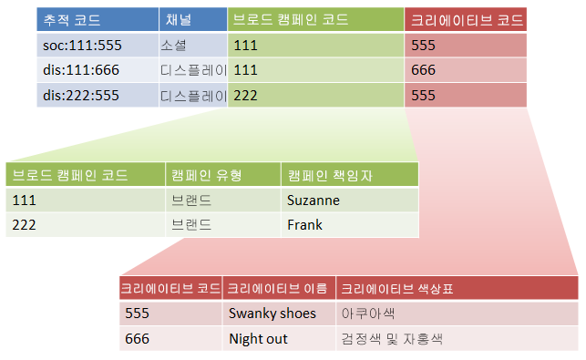

# 하위 분류 및 규칙 빌더(기존)

{{classification-rulebuilder-deprecation}}

모든 하위 분류에 상위 값이 있는지 확인한 경우에는 분류 규칙 빌더를 하위 분류와 결합할 수 있습니다.

분류 규칙 빌더를 하위 분류와 결합하여 분류 관리를 단순화하고 필요한 규칙 수를 줄일 수 있습니다. 추적 코드가 따로 분류하려는 코드로 구성되어 있는 경우 이러한 작업을 원할 수 있습니다.

하위 분류에 대한 개념적 정보가 필요하면 [하위 분류](/help/components/classifications/importer/subclassifications.md)를 참조하십시오.

## 예

다음 추적 코드를 가정해보십시오.

`channel:broad_campaign:creative`

분류 계층을 사용하면 분류에 분류를 적용(*`sub-classification`*&#x200B;라고 함)할 수 있습니다. 즉, 여러 테이블이 있는 관계형 데이터베이스처럼 가져오기를 사용할 수 있습니다. 한 테이블은 전체 추적 코드를 키에 매핑하고 다른 테이블은 해당 키를 다른 테이블에 매핑합니다.

이 구조를 만든 후에는 [분류 규칙 빌더](/help/components/classifications/crb/classification-rule-builder.md)를 사용하여 조회 테이블(이전 이미지에서 녹색 및 빨간색 테이블)만 업데이트하는 작은 파일을 업로드할 수 있습니다. 그런 다음 규칙 빌더를 사용하여 기본 분류 테이블을 최신 상태로 유지할 수 있습니다.

다음 작업에서는 이 작업을 수행하는 방법에 대해 설명합니다.

## 규칙 빌더를 사용하여 하위 분류 설정

규칙 빌더를 사용하여 하위 분류를 업로드하는 방법을 설명하는 예제 단계입니다.

1. 분류 관리자에서 분류 및 하위 분류를 만듭니다.

   예:

   

1. [분류 규칙 빌더](/help/components/classifications/crb/classification-rule-builder.md)에서 원래 추적 코드로부터 하위 분류 키를 분류합니다.

   이 작업은 정규 표현식을 사용하여 수행합니다. 이 예에서 *`Broad Campaign code`*&#x200B;을(를) 채우는 규칙은 다음 정규 표현식을 사용합니다.

   | `#` | 규칙 유형 | 일치 | 분류 설정 | 종료 |
   |---|---|---|---|---|
   |   | 정규 표현식 | `[^\:]:([^\:]):([^\:])` | 브로드 캠페인 코드 | `$1` |
   |   | 정규 표현식 | `[^\:]:([^\:]):([^\:])` | 크리에이티브 코드 | `$2` |

   >[!NOTE]
   >
   >이때 하위 분류 *`Campaign Type`* 및 *`Campaign Director`*&#x200B;는 채우지 않습니다.

1. 지정된 하위 분류만 포함하는 분류 파일을 업로드합니다.

   [복수 수준 분류](/help/components/classifications/importer/subclassifications.md)를 참조하십시오.

   예:

   | 키 | Channel | 브로드 캠페인 코드 | 브로드 캠페인 코드&amp;Hat;캠페인 유형 | 브로드 캠페인 코드&amp;Hat;캠페인 책임자 | ... |
   |---|---|---|---|---|---|
   | &#42; |  | 111 | 브랜드 | 수잔 |  |
   | &#42; |  | 222 | 브랜드 | 프랭크 |  |

1. 조회 테이블을 유지 관리하려면 작은 파일(위에 표시)을 업로드합니다.

   예를 들어 새 *`Broad Campaign code`* 도입 시 이 파일을 업로드합니다. 이 파일은 이전에 분류된 값에 적용됩니다. 마찬가지로 새 하위 분류를 만드는 경우(예: *`Creative Theme`*&#x200B;을(를) *`Creative code`*&#x200B;의 하위 분류로 만드는 경우) 전체 분류 파일이 아닌 하위 분류 파일만 업로드합니다.

   이러한 하위 분류 보고의 경우 최상위 분류와 정확히 동일하게 작동합니다. 이를 통해 이를 사용하는 데 필요한 관리 부담을 줄일 수 있습니다.
