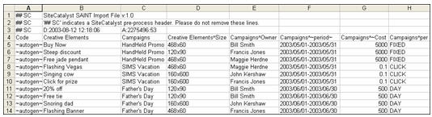

# 분류 데이터 파일 (기존)

가져오기를 사용하여 분석 보고에 대한 분류 데이터를 파일로 일괄 업로드할 수 있습니다. 가져오기를 통해 데이터를 제대로 업로드하려면 특정 파일 형식이 필요합니다.

유효한 데이터 파일을 만들려면 분류 데이터를 붙여넣을 수 있는 파일 구조를 제공하는 템플릿 파일을 다운로드할 수 있습니다. 자세한 내용은 [분류 템플릿 다운로드](/help/components/classifications/importer/c-download-saint-data.md)를 참조하십시오.

분류의 문자 제한에 대한 자세한 내용은 [일반 파일 구조](/help/components/classifications/importer/c-saint-data-files.md)를 참조하십시오.

## 일반 파일 구조

다음 그림은 샘플 데이터 파일입니다.



데이터 파일은 다음 구조 규칙을 준수해야 합니다.

* 분류의 값은 0일 수 없습니다.
* 가져오기 및 내보내기 열의 수는 30개로 제한하는 것이 좋습니다.
* 업로드한 파일은 BOM 문자 인코딩 없이 UTF-8을 사용해야 합니다.
* v2.1 파일 형식이 지정되고 셀이 적절히 [이스케이프되는](/help/components/classifications/importer/importer-faq.md) 경우 탭, 줄바꿈, 따옴표와 같은 특수 문자가 셀 내부에 임베드될 수 있습니다. 특수 문자에는 다음이 포함됩니다.

  ```text
  \t     tab character 
  \r     form feed character 
  \n    newline character 
  "       double quote
  ```

  쉼표는 특수 문자가 아닙니다.

* 이 문자는 하위 분류를 나타내는 데 사용되므로 분류 이름에는 캐럿(^)을 포함할 수 없습니다.
* 하이픈(-)을 사용할 때 주의하십시오. 예를 들어 Social 용어에서 하이픈(-)을 사용하는 경우, Social은 하이픈을 [!DNL Not] 연산자(빼기 기호)로 인식합니다. 예를 들어 가져오기를 사용하여 *`fragrance-free`*&#x200B;를 용어로 지정할 경우 Social은 이 용어를 fragrance *`minus`* free로 인식하고 *`fragrance`*&#x200B;가 아닌 *`free`*&#x200B;를 언급한 게시물을 수집합니다.
* 보고서 데이터를 분류하는 데에는 문자 제한이 적용됩니다. 예를 들어 제품 이름이 100자(바이트)를 초과하는 제품(*`s.products`*)에 대한 분류 텍스트 파일을 업로드하는 경우, 해당 제품은 보고에 표시되지 않습니다. 추적 코드와 모든 사용자 정의 전환 변수(eVars)는 255바이트를 허용합니다. 이 정책은 동일한 255바이트 제한이 적용되는 분류 및 하위 분류 열 값에도 적용됩니다.
* 탭 구분 데이터 파일(스프레드시트 애플리케이션이나 텍스트 편집기를 사용하여 템플릿 파일 생성)입니다.
* `.tab` 또는 `.txt` 파일 확장명을 사용합니다.
* 파운드 기호(#)는 행을 사용자 주석으로 식별합니다. Adobe는 # 기호로 시작하는 모든 행을 무시합니다.
* SC(`## SC`)가 뒤에 오는 이중 파운드 기호는 보고에 사용되는 전처리 헤더 주석으로 줄을 식별합니다. 이러한 행은 삭제하지 마십시오.
* 분류 내보내기에는 키의 새 줄 문자로 인해 중복 키가 생길 수 있습니다. 이 문제는 FTP 또는 브라우저 내보내기에서 FTP 계정에 대해 따옴표 기능을 사용하여 해결할 수 있습니다. 이렇게 하면 새 줄 문자가 있는 각 키를 싸는 인용 부호가 배치됩니다.
* 파일 가져오기의 첫 번째 라인에 있는 셀 C1에는 파일의 나머지 부분 전체에서 분류가 인용 부호의 사용을 처리하는 방법을 결정하는 버전 식별자가 들어 있습니다.

   * v2.0에서는 인용 부호를 무시하고, 지정된 키 및 값의 모든 부분이라고 가정합니다. 예를 들어 이 값을 &quot;This is &quot;&quot;some value&quot;&quot;&quot;라고 생각해 보십시오. v2.0은 이를 &quot;This is &quot;&quot;some value&quot;&quot;&quot;라고 문자 그대로 해석합니다.
   * v2.1에서는 분류에게 인용 부호가 Excel 파일에 사용된 파일 형식의 일부라고 가정하도록 합니다. 따라서 v2.1은 위의 예에 다음과 같이 형식을 지정합니다. This is &quot;some value&quot;
   * 파일에 v2.1이 지정되어 있지만, 실제로 원하는 것은 v2.0이면 문제가 발생할 수 있습니다. 즉, 인용 부호가 Excel 형식에서 잘못된 방법으로 사용되는 경우 문제가 발생할 수 있습니다. 예를 들어 다음 값이 있는 경우: &quot;VP NO REPS&quot; S/l Dress w/ Overlay v2.1에서, 이는 잘못된 형식(값을 여는 따옴표와 닫는 따옴표로 둘러싸야 하며, 실제 값의 일부인 따옴표는 따옴표로 이스케이프 처리를 해야 함)이며, 이 이후에는 분류가 작동하지 않습니다.
   * 따라서, 반드시 업로드하는 파일에서 헤더(셀 C1)를 변경하여 파일 형식을 v2.0으로 변경하거나, 파일 전체에서 Excel 인용 부호 사용을 제대로 구현하십시오.

* 데이터 파일의 첫 번째(설명 아님) 행은 열 제목을 포함하여 해당 열의 분류 데이터를 식별하는데 사용됩니다. 가져오기 기능을 사용하려면 열 제목이 특정 형식이어야 합니다. 자세한 내용은 [열 제목 형식](/help/components/classifications/importer/c-saint-data-files.md)을 참조하십시오.
* 데이터 파일에서 헤더 행 바로 뒤에 오는 것은 데이터 행입니다. 각 데이터 행은 각 열 제목에 대해 하나의 데이터 필드를 포함해야 합니다.
* 데이터 파일은 Adobe가 파일에 구조를 제공하고 분류 데이터를 제대로 가져오는 데 사용하는 다음 제어 코드를 지원합니다.

<table id="table_0548F2E58B6644208147434EB9B3C21B"> 
 <thead> 
  <tr> 
   <th colname="col1" class="entry"> 제어 코드 </th> 
   <th colname="col2" class="entry"> 설명 </th> 
  </tr> 
 </thead>
 <tbody> 
  <tr> 
   <td colname="col1"> <p>&lt;새 라인&gt; </p> </td> 
   <td colname="col2"> <p>새 라인 문자는 데이터 파일의 데이터 라인/레코드 사이에서 유일하게 지원되는 구분 기호입니다. 일반적으로 데이터 파일을 자동으로 생성하기 위해 프로그램을 작성할 때만 이러한 문자를 삽입해야 합니다. </p> </td> 
  </tr> 
  <tr> 
   <td colname="col1"> <p>~autogen~ </p> </td> 
   <td colname="col2"> <p>Adobe가 이 요소에 대한 고유 ID를 자동 생성하도록 요청합니다. </p> <p>캠페인 컨텍스트에서는 이 제어 값을 통해 Adobe가 각 크리에이티브 요소에 식별자를 할당하도록 합니다. <a href="/help/components/classifications/importer/c-saint-data-files.md"  >키</a>를 참조하십시오. </p> </td> 
  </tr> 
  <tr> 
   <td colname="col1"> <p>~period~ </p> </td> 
   <td colname="col2"> <p>데이터 열이 항목과 연관된 날짜 범위를 나타내도록 지정합니다. <a href="/help/components/classifications/importer/c-saint-data-files.md"  >날짜</a>를 참조하십시오. </p> </td> 
  </tr> 
  <tr> 
   <td colname="col1"> <p>비어 있는 필드 </p> </td> 
   <td colname="col2"> <p>현재 필드에 대한 NULL 값을 나타냅니다. 특정 데이터 열이 현재 레코드에 적용되지 않을 경우 이 값을 사용합니다. </p> </td> 
  </tr> 
  <tr> 
   <td colname="col1"> <p>PER 수정자 </p> </td> 
   <td colname="col2"> <p>데이터 열이 <span class="wintitle">PER 수정자</span> 필드를 나타내도록 지정합니다. <a href="/help/components/classifications/importer/c-saint-data-files.md"  >PER 수정자 제목</a>을 참조하십시오. </p> </td> 
  </tr> 
 </tbody> 
</table>

## 열 제목 형식

>[!NOTE]
>
>가져오기 및 내보내기 열의 수는 30개로 제한하는 것이 좋습니다.

분류 파일은 다음 열 제목을 지원합니다.

### 키

각 값은 전체 시스템에서 고유해야 합니다. 이 필드의 값은 웹 사이트의 [!DNL JavaScript] 비콘에 있는 [!DNL Analytics] 변수에 할당된 값에 해당합니다. 이 열의 데이터는 ~autogen~ 또는 기타 고유한 추적 코드를 포함할 수 있습니다.

### 분류 열 제목

>[!NOTE]
>
>[!UICONTROL 분류] 열 제목의 값은 분류 명명 규칙과 정확히 일치해야 하며, 그렇지 않은 경우 가져오기에 실패합니다. 예를 들어 관리자가 [!UICONTROL 캠페인]을 [!UICONTROL 캠페인 설정 관리자]의 [!UICONTROL 내부 캠페인 이름]으로 변경하는 경우 파일 열 제목을 일치하도록 변경해야 합니다. “키”는 예약된 분류(헤더) 값입니다. “키”라는 새 분류는 지원되지 않습니다.

또한 데이터 파일은 하위 분류 및 기타 전문 데이터 열을 식별하기 위해 다음과 같은 추가 제목 규칙을 지원합니다.

### 하위 분류 제목

예를 들어 `Campaigns^Owner`은(는) `Campaign Owner` 값을 포함하는 열의 열 머리글입니다. 마찬가지로 `Creative Elements^Size`은(는) `Creative Elements` 분류의 `Size` 하위 분류를 포함하는 열에 대한 열 머리글입니다.

## 분류 문제 해결

* [일반적인 업로드 문제](https://helpx.adobe.com/kr/analytics/kb/common-saint-upload-issues.html): 잘못된 파일 형식 및 파일 콘텐츠로 인해 발생하는 문제를 설명하는 기술 자료 문서입니다.
