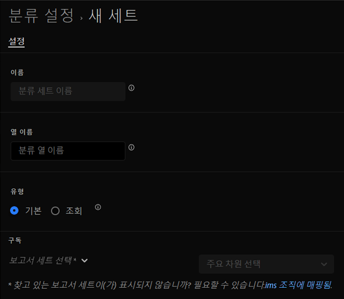

# 분류 세트 만들기

분류 세트 관리자를 사용하여 분류 세트를 만들 수 있습니다.

>[!NOTE]
>
>이 기능은 현재 제한적인 릴리스가 실시되고 있습니다. 이 기능에 액세스하려면 요청을 분류 팀에 전달하여 프로비저닝할 수 있는 Adobe 고객 지원 센터 또는 계정 관리자에게 문의하십시오.

**[!UICONTROL 구성 요소]** > **[!UICONTROL 분류 세트]** > **[!UICONTROL 설정]** > **[!UICONTROL 추가]**

분류 세트를 만들 때 다음 필드를 사용할 수 있습니다.

* **[!UICONTROL 이름]**: 분류 세트를 식별하는 데 사용되는 텍스트 필드입니다. 이 필드는 만들 때는 편집할 수 없지만 나중에 이름을 바꿀 수 있습니다.
* **[!UICONTROL 열 이름]**: 생성하려는 분류 차원의 이름입니다. 이 필드는 Analysis Workspace에서 사용되는 차원 이름과 분류 데이터를 내보낼 때의 열 이름입니다.
* **[!UICONTROL 유형]**: 분류 유형을 나타내는 라디오 버튼입니다. 일반적으로 기본 분류가 사용되며, 조회 분류는 [하위 분류](../c-sub-classifications.md)를 나타냅니다.
* **[!UICONTROL 구독]**: 이 분류 세트가 적용되는 보고서 세트 및 차원입니다. 여러 보고서 세트에 대한 지원이 계획되어 있습니다.

지정된 보고서 세트 + 변수에 대한 분류 세트가 있는 경우 분류가 대신 스키마에 추가됩니다.
