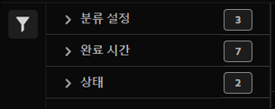

# 분류 세트 작업 관리자

분류 세트 작업 관리자를 사용하면 분류 세트에서 생성된 현재 및 완료된 분류 작업을 볼 수 있습니다. 또한 이 인터페이스를 사용하여 특정 작업에 대한 분류 데이터 또는 템플릿을 다운로드하거나 추가 데이터를 작업에 업로드할 수도 있습니다.

**[!UICONTROL 구성 요소]** > **[!UICONTROL 분류 세트]** > **[!UICONTROL 작업]**

이 인터페이스에서는 작업을 만들 수 없습니다. 수동으로 또는 구성된 외부 위치를 통해 분류 세트에 데이터를 업로드하거나, 다운로드 파일을 요청하거나, 템플릿 파일을 요청하여 작업을 만듭니다.

## 분류 세트 필터링

분류 세트 작업 관리자의 왼쪽에는 원하는 작업을 찾는 필터 설정을 제공합니다. 필터 아이콘을 클릭하면 필터 설정 가시성이 전환됩니다. 분류 세트를 다음으로 필터링할 수 있습니다. **[!UICONTROL 분류 세트]**, **[!UICONTROL 완료 시간]**, **[!UICONTROL 상태]**, **[!UICONTROL 작업 유형]**, 또는 **[!UICONTROL 소스]**.

분류 세트 작업 관리자 열 위에서 추가 필터 옵션을 사용할 수 있습니다.

* **[!UICONTROL 제목별 검색]**: 파일 이름별로 작업을 검색합니다.
* **[!UICONTROL 추가 로드]**: 분류 세트 작업 관리자에는 처음에 최대 1000개의 작업이 표시됩니다. 작업이 더 있는 경우 이 단추를 클릭하여 1000개의 작업을 더 로드합니다.
* **열 표시/숨기기**: [!UICONTROL 파일 이름] 및 [!UICONTROL 완료 시간] 옆에서 열에 대한 가시성을 전환합니다.

## 분류 세트 작업 관리자 열

분류 세트 작업 관리자에서 다음 열을 사용할 수 있습니다.

* **[!UICONTROL 파일 이름]**: 업로드 또는 다운로드 파일의 이름입니다.
* **[!UICONTROL 분류 세트]**: 파일이 적용되는 분류 세트의 이름입니다. 분류 세트 이름을 클릭하여 분류 세트에 도달할 수 있습니다. [설정](manage/settings.md).
* **[!UICONTROL 크기]**: 파일 크기입니다.
* **[!UICONTROL 상태]**: 파일을 처리하는 작업의 상태입니다.
   * **[!UICONTROL 생성됨]**: 작업이 제출되었습니다.
   * **[!UICONTROL 대기 중]**: 파일을 처리할 준비가 되었으며 분류 서버가 파일을 처리 대기 중입니다.
   * **[!UICONTROL 확인됨]**: 파일이 유효하며 처리 대기 중입니다.
   * **[!UICONTROL 확인 실패]**: 파일의 포맷이 올바르지 않거나 잘못되었습니다. 파일이 처리되지 않습니다.
   * **[!UICONTROL 처리 중]**: Adobe에서 현재 파일을 처리 중입니다.
   * **[!UICONTROL 처리 실패]**: 파일 처리가 실패했습니다.
   * **[!UICONTROL 완료]**: 처리가 완료되었습니다. 분류 데이터를 보고에서 볼 수 있습니다.
   * **[!UICONTROL 실패]**: 유효성 검사 또는 처리와 관련이 없는 일반 오류입니다.
* **[!UICONTROL 작업 유형]**: 작업 유형입니다.
* **[!UICONTROL 소스]**: 작업 소스입니다.
* **[!UICONTROL 파일 다운로드]**: 분류 데이터 다운로드 또는 템플릿 다운로드와 같은 다운로드 작업에만 적용됩니다. 다운로드가 준비되면 이 열은 다운로드 링크를 제공합니다.
* **[!UICONTROL 수정된 라인]**: 수정된 라인 수
* **[!UICONTROL 완료된 라인]**: 완료된 라인 수
* **[!UICONTROL 완료 시간]**: 작업을 완료(또는 실패)한 날짜 및 시간입니다.
