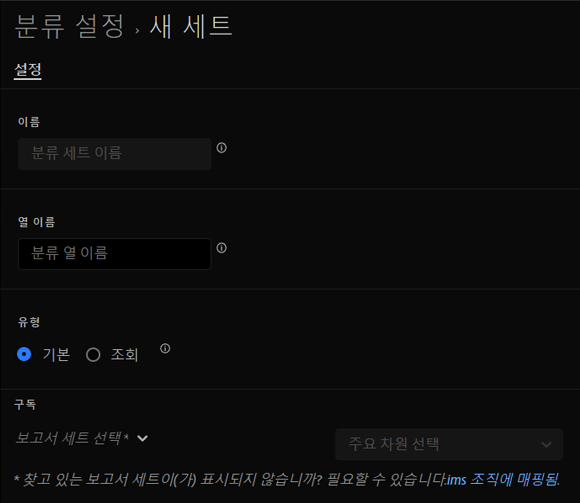

# 분류 세트 만들기

분류 세트 관리자를 사용하여 분류 세트를 만들 수 있습니다.

**[!UICONTROL 구성 요소]** > **[!UICONTROL 분류 세트]** > **[!UICONTROL 설정]** > **[!UICONTROL 추가]**

분류 세트를 만들 때 다음 필드를 사용할 수 있습니다.

* **[!UICONTROL 이름]**: 분류 집합을 식별하는 데 사용되는 텍스트 필드입니다. 이 필드는 만들 때는 편집할 수 없지만 나중에 이름을 바꿀 수 있습니다.
* **[!UICONTROL 열 이름]**: 만들려는 첫 번째 분류 차원의 이름입니다. 이 필드는 Analysis Workspace에서 사용되는 차원 이름이며 분류 데이터를 내보낼 때의 열 이름입니다. 분류 세트를 만든 후 더 많은 열 이름을 추가할 수 있습니다.
* **[!UICONTROL 유형]**: 분류 유형을 나타내는 라디오 버튼입니다. 일반적으로 기본 분류가 사용되며, 조회 분류는 [하위 분류](../../c-sub-classifications.md)를 나타냅니다.
* **[!UICONTROL 구독]** 이 분류 세트가 적용되는 보고서 세트 및 차원입니다. 여러 보고서 세트 및 차원 조합을 분류 세트에 추가할 수 있습니다.

지정된 보고서 세트 + 변수에 대한 분류 세트가 있는 경우 분류가 대신 스키마에 추가됩니다. 주어진 보고서 세트 + 변수 조합은 여러 분류 세트에 속할 수 없습니다.
