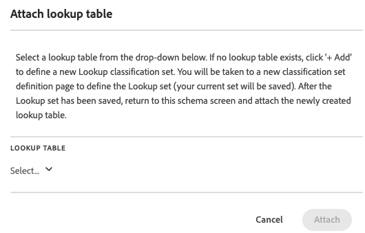

# 분류 세트 스키마

스키마는 분류 세트에 대해 정의한 주요 차원에 적용할 분류 목록입니다. 예를 들어, 제품을 키 차원으로 정의했으며 이 필드에 제품 SKU가 포함되어 있는 경우 스키마를 사용하여 제품 이름, 제품 색상, 제품 크기 등과 같은 분류를 추가합니다.

분류 세트에 대한 스키마를 정의하려면

1. **[!UICONTROL 분류 세트]** 관리자에서 스키마를 편집할 분류 세트를 선택합니다.
1. **[!UICONTROL 분류 집합: _분류 집합_]**&#x200B;대화 상자에서 스키마 탭을 선택합니다. 해당 탭은 다음 인터페이스 요소로 구성됩니다.

   

   * [분류 목록](#classification-list)
   * [검색](#search)
   * [액션](#actions)
   * [작업 표시줄](#action-bar)

## 분류 목록

분류 목록에는 다음 열이 있습니다.

| 열 | 설명 |
|---|---|
| **[!UICONTROL 분류 이름]** | 분류에 제공한 이름입니다. |
| **[!UICONTROL ID 이름]** | 시스템에서 분류에 대해 파생된 이름입니다. |
| **[!UICONTROL 분류자]** | 사용하는 경우 이 분류를 분류하는 데 사용되는 조회 분류 세트에 대한 링크입니다. |

## 검색

에서 하나 이상의 분류를 빠르게 검색할 수 있습니다. 을(를) 사용하여 검색을 지웁니다.

## 액션

다음 작업은 분류 목록 맨 위에 있는 버튼으로 사용할 수 있습니다.

| 아이콘 | 액션 | 설명 |
|---|---|---|
|  | **[!UICONTROL 추가]** | 목록에 [분류를 추가](#add)합니다. |
|  | **[!UICONTROL 업로드]** | [JSON, CSV, TSV 또는 TAB 파일 업로드](#upload). |
|  | **[!UICONTROL 다운로드]** | [분류 데이터를 다운로드합니다](#download). |
|  | **[!UICONTROL 템플릿]** | 분류 데이터에 대해 [템플릿을 다운로드합니다](#template). |
|  | **[!UICONTROL 작업 기록]** | 선택한 분류 세트에 대해 필터링된 [분류 세트 작업 관리자](/help/components/classifications/sets/job-manager.md)를 표시합니다. |
|  | **[!UICONTROL 자동화]** | 클라우드 위치를 사용하여 [분류 데이터 수집 자동화](#automate). |

### 추가

새 분류를 추가하려면  **[!UICONTROL 추가]**&#x200B;를 선택하십시오.

**[!UICONTROL _분류 집합_]**&#x200B;에 대한 새 분류 추가 대화 상자에서&#x200B;**[!UICONTROL 분류 이름]**&#x200B;을 입력하고&#x200B;**[!UICONTROL 추가]**&#x200B;를 선택합니다. 분류가 목록에 추가됩니다.

### 업로드

분류를 위해 스키마로 분류 데이터를 가져오려면  **[!UICONTROL Upload]**&#x200B;을(를) 선택하십시오.

1. **[!UICONTROL 새 분류 추가]** 대화 상자에서:

   * 분류 데이터가 포함된 파일을 **[!UICONTROL 여기에 끌어다 놓기]**(으)로 끌어다 놓습니다.
   * **[!UICONTROL 찾아보기]**&#x200B;를 선택하고 컴퓨터 또는 네트워크에서 파일을 선택하십시오.

   파일 내용 중 **[!UICONTROL 스키마 미리 보기]**&#x200B;가 표시됩니다. 미리 보기에는 파일의 데이터 열이 표시됩니다. 열 크기를 조정하려면 을 선택하고 **[!UICONTROL 열 크기 조정]**&#x200B;을 선택합니다. 열 크기를 조정할 수 있는 핸들이 나타납니다.

   열에 대한 분류 집합에 분류가 정의되지 않은 경우 경고 이(가) 표시됩니다. 기존 분류 스키마 세트에 분류가 없으며 가져올 때 생성된다는 경고가 표시됩니다.

1. **[!UICONTROL 충돌 시 데이터 덮어쓰기를 선택하시겠습니까?현재 분류 데이터를 가져온 새 데이터로 덮어쓰려는 경우]**. 예:

   | | 키 | 현재 제품 색상 | 파일 가져오기 | 새 제품 색상 |
   |---|---|---|---|---|
   |  **[!UICONTROL 충돌 시 데이터를 덮어쓰시겠습니까?]** | 1234 | 녹색 | 파랑 | 파랑 |
   |  **[!UICONTROL 충돌 시 데이터를 덮어쓰시겠습니까?]** | 1234 | 녹색 | 파랑 | 녹색 |

1. **[!UICONTROL 적용]**&#x200B;을 선택합니다. 열이 기존 스키마 세트에 분류로 존재하지 않으면 경고가 표시됩니다. 이러한 열은 업로드를 확인할 때 새 분류로 추가됩니다.

   

   업로드를 확인하려면 **[!UICONTROL 업로드 확인]**&#x200B;을 선택하십시오. 업로드를 취소하려면 **[!UICONTROL 업로드 취소]**&#x200B;를 선택하십시오.

### 다운로드

분류 데이터를 다운로드하려면  **[!UICONTROL 다운로드]**&#x200B;를 선택하십시오.

**[!UICONTROL _분류 집합_]**&#x200B;에 대한 데이터 다운로드 대화 상자에서:

1. 다운로드할 **[!UICONTROL 행]**&#x200B;의 수를 입력하십시오. 예: `10000`.
1. 분류 데이터 행을 다운로드할 기간을 선택하려면 **[!UICONTROL 다음 기간 사이에 받은 행 다운로드]**&#x200B;에 대한 시작 및 종료 데이터를 입력하십시오. 또는 을 사용하여 기간을 선택하는 달력 팝업을 사용합니다.
1. 반환할 데이터를 선택하려면 **[!UICONTROL 반환된 데이터]**&#x200B;에서 옵션을 선택하십시오.

   * **[!UICONTROL 모든 값]**&#x200B;은(는) 현재 분류 데이터에 대한 모든 값을 반환합니다.
   * **[!UICONTROL 비어 있는 모든 열]**&#x200B;은(는) 기존 분류 데이터에 대한 키 값이 있는 열을 반환합니다. 값이 없는 분류 데이터에 대한 값이 없는 열.
   * **[!UICONTROL 모든 열이 비어 있음]**&#x200B;은(는) 기존 분류 데이터에 대한 값이 있는 키 열을 반환합니다. 분류 데이터에 대한 값이 없는 열입니다.
1. 다운로드한 분류 데이터의 [파일 형식](/help/components/classifications/sets/data-files.md#general-file-requirements)을(를) 선택하려면 **[!UICONTROL 파일 형식]** 드롭다운 메뉴에서 옵션을 선택하십시오. 사용 가능한 옵션은 다음과 같습니다.

   * **[!UICONTROL JSON]**
   * **[!UICONTROL 쉼표로 구분된 값]**(CSV).
   * **[!UICONTROL Excel 탭으로 구분된 값]**(TSV 또는 TAB).

1. 파일을 다운로드할 때 [파일 인코딩](/help/components/classifications/sets/data-files.md#general-file-requirements)을 선택하려면 [파일 인코딩] 드롭다운 메뉴에서 옵션을 선택하십시오. 사용 가능한 옵션은 다음과 같습니다.

   * **[!UICONTROL UTF-8]**.
   * **[!UICONTROL Latin-1]**.

1. 분류 데이터를 다운로드하려면 **[!UICONTROL 다운로드]**&#x200B;를 선택하십시오. 다운로드한 파일은 브라우저의 기본 다운로드 디렉터리에 있으며 제목은 <code><i>분류 세트</i>입니다.<i>json</i>|<i>csv</i>|<i>tsv</i></code>. 파일이 이미 있는 경우 시퀀스 번호 <code>(<i>x</i>)</code> 가 파일 이름에 추가됩니다. 데이터를 반환하지 않는 옵션을 지정한 경우 반환된 날짜 범위 및 데이터에 대한 옵션을 변경하도록 알리는 **[!UICONTROL 알림]** 대화 상자가 표시됩니다.

### 템플릿

분류 데이터용 템플릿을 다운로드하려면  **[!UICONTROL 템플릿]**&#x200B;을 선택하세요.

**[!UICONTROL 분류 집합&#x200B;_에 대한_]**&#x200B;템플릿 다운로드 대화 상자에서:

1. 다운로드한 분류 데이터의 [파일 형식](/help/components/classifications/sets/data-files.md#general-file-requirements)을(를) 선택하려면 **[!UICONTROL 파일 형식]** 드롭다운 메뉴에서 옵션을 선택하십시오. 사용 가능한 옵션은 다음과 같습니다.

   * **[!UICONTROL 쉼표로 구분된 값]**&#x200B;입니다.
   * **[!UICONTROL Excel 탭으로 구분된 값]**.

1. 파일을 다운로드할 때 [파일 인코딩](/help/components/classifications/sets/data-files.md#general-file-requirements)을 선택하려면 [파일 인코딩] 드롭다운 메뉴에서 옵션을 선택하십시오. 사용 가능한 옵션은 다음과 같습니다.

   * **[!UICONTROL UTF-8]**.
   * **[!UICONTROL Latin-1]**.

1. 분류 데이터 템플릿을 다운로드하려면 **[!UICONTROL 다운로드]**&#x200B;를 선택하십시오. 다운로드한 파일은 브라우저의 기본 다운로드 디렉터리에 있으며 제목이 <code><i>분류 세트</i>입니다.<i>csv</i>|<i>tsv</i></code>. 파일이 이미 있는 경우 시퀀스 번호 <code>(<i>x</i>)</code> 가 파일 이름에 추가됩니다.

### 자동화

분류 수집을 자동화하려면  **[!UICONTROL 자동화]**&#x200B;를 선택하십시오.

**[!UICONTROL _분류 집합_]**&#x200B;에 대한 수집 위치 연결/업데이트 대화 상자에서:

1. 클라우드 위치를 선택하려면 **[!UICONTROL 위치 계정]**&#x200B;에서 옵션을 선택하십시오. 분류 데이터를 가져올 수 있는 [지원되는 계정 유형의 위치 계정](https://experienceleague.adobe.com/ko/docs/analytics/components/locations/configure-import-accounts)만 표시됩니다. 새 계정을 만들려면 **[!UICONTROL 새 계정]**&#x200B;을 선택하세요.
1. 위치를 선택하려면 **[!UICONTROL 위치]**&#x200B;에서 옵션을 선택하십시오. 분류 데이터를 가져오기 위해 선택한 계정 유형의 위치만 표시됩니다. 새 위치를 만들려면 **[!UICONTROL 새 위치]**&#x200B;를 선택하세요.
1. 구분 기호를 선택하려면 **[!UICONTROL 목록 구분 기호]**&#x200B;에서 옵션을 선택하십시오. 옵션은 다음과 같습니다.
   * **[!UICONTROL 쉼표 ,]**
   * **[!UICONTROL 세미콜론 ;]**
   * **[!UICONTROL 콜론:]**
   * **[!UICONTROL 세로 막대 |]**
   * **[!UICONTROL 스페이스]**
   * **[!UICONTROL 탭]**
1. 파일을 다운로드할 때 [파일 인코딩](/help/components/classifications/sets/data-files.md#general-file-requirements)을 선택하려면 **[!UICONTROL 파일 인코딩]** 드롭다운 메뉴에서 옵션을 선택하십시오. 사용 가능한 옵션은 다음과 같습니다.

   * **[!UICONTROL UTF-8]**.
   * **[!UICONTROL Latin-1]**.

1. 수집 작업이 완료되었음을 사용자에게 알리려면 **[!UICONTROL 수집 작업이 완료되었을 때 알릴 전자 메일(쉼표로 구분)]**&#x200B;에 대한 전자 메일 주소를 쉼표로 구분하여 입력하십시오.
1. **[!UICONTROL 유효성 검사]**&#x200B;를 선택합니다. 클라우드 위치에 대한 연결이 확인되었습니다.
1. 유효성 검사가 성공하면  **[!UICONTROL 위치 유효성 검사가 성공했음을 보여 주는 toast 메시지가 표시됩니다. 클라우드 스토리지에 대한 연결이 확인되었습니다.클라우드 연결에 대한 연결을 만든 경우 &#x200B;]** **[!UICONTROL &#x200B;저장&#x200B;]**&#x200B;을 선택합니다. 그렇지 않으면&#x200B;**[!UICONTROL &#x200B;업데이트&#x200B;]**&#x200B;를 선택하십시오. 또는&#x200B;**[!UICONTROL &#x200B;취소&#x200B;]**&#x200B;를 선택하여 클라우드 위치 구성을 취소하세요.

## 작업 표시줄

작업 표시줄에는 선택한 분류 세트에 사용할 수 있는 작업이 표시됩니다. 사용 가능한 옵션은 다음과 같습니다.

| 아이콘 | 액션 | 설명 |
|---|---|---|
|  | **[!UICONTROL 조회 추가]** | 분류 세트를 조회(하위 분류)로 추가합니다. 조회 첨부&#x200B;**[!UICONTROL 테이블의]**: <ol><li>**[!UICONTROL 분류 이름]** 드롭다운 메뉴에서 조회 분류를 선택합니다.</li><li>**[!UICONTROL 추가]**&#x200B;를 선택합니다.</li></ol>조회 분류가 분류에 추가되고 내부 ID를 사용하여 **[!UICONTROL 분류자]** 열에 나열됩니다. |
|  | **[!UICONTROL 조회 제거]** | 조회로 분류 세트를 제거합니다. 분류에서 조회를 영구적으로 삭제하려면 **[!UICONTROL 분류&#x200B;_확인 대화 상자에서__분류 세트 제거_]**&#x200B;에서&#x200B;**[!UICONTROL 삭제]**&#x200B;를 선택합니다. |
|  | **[!UICONTROL 이름 바꾸기]** | 분류 이름을 변경합니다. **[!UICONTROL 이름 바꾸기: _분류_]**&#x200B;대화 상자에서 새 이름을 입력하고&#x200B;**[!UICONTROL 이름 바꾸기]**&#x200B;를 선택합니다. |
|  | **[!UICONTROL 삭제]** | 분류 세트를 삭제합니다. **[!UICONTROL _분류 삭제_]**&#x200B;대화 상자가 나타납니다. 분류 세트를 삭제하려면&#x200B;**[!UICONTROL 삭제]**&#x200B;를 선택하십시오. |

<!--

View currently configured classification dimensions for this classification set.

**[!UICONTROL Components]** > **[!UICONTROL Classification sets]** > **[!UICONTROL Sets]** > Click the desired classification set name > **[!UICONTROL Schema]**

The following buttons are available:

* **[!UICONTROL Upload]**: Manually upload classification data for a classification dimensions. `JSON`, `CSV`, `TSV`, and `TAB` files are supported. Uploading a valid file shows a table preview of data to classify.
  * **[!UICONTROL File encoding]**: Select the correct file encoding using this drop-down. Valid options include [!UICONTROL UTF-8] and [!UICONTROL Latin1].
  * **[!UICONTROL List delimiter]**: Select the correct list delimiter. If using a downloaded file or template file, make sure that the [!UICONTROL List delimiter] here matches the [!UICONTROL List delimiter] when the file was downloaded.
  * **[!UICONTROL Apply]**: Save the uploaded classification data to the classification set.

  

* **[!UICONTROL Download]**: Download key values and their classification columns.
  * **[!UICONTROL Rows]**: The maximum number of rows to include in the download file.
  * **[!UICONTROL Download rows received between]**: A calendar date picker that allows you to filter key values by when they appear in reporting. If a key value was not collected in this date range, it does not appear in the downloaded file.
  * **[!UICONTROL Data returned]**: A drop-down list that lets you filter key values included in the downloaded file based on their associated classification data.
    * **[!UICONTROL All classified values]**: Includes rows where classification data is included in at least one column.
    * **[!UICONTROL All unclassified values]**: Includes rows where classification data is missing in at least one column.
  * **[!UICONTROL File format]**: A drop-down list that determines the file format that the download file is in. Options include [!UICONTROL JSON], [!UICONTROL Comma separated values], and [!UICONTROL Excel tab separated values].
  * **[!UICONTROL File encoding]**: A drop-down list that determines the file encoding. Options include [!UICONTROL UTF-8] and [!UICONTROL Latin1]. UTF-8 is recommended.

  

* **[!UICONTROL Template]**: Download a template file. This file is similar to the [!UICONTROL Download] button, except it does not contain any classification data or key values.
  * **[!UICONTROL File format]**: A drop-down list that determines the file format that the template file is in. Options include [!UICONTROL Comma separated values], and [!UICONTROL Excel tab separated values].
  * **[!UICONTROL File encoding]**: A drop-down list that determines the file encoding. Options include [!UICONTROL UTF-8] and [!UICONTROL Latin1]. UTF-8 is recommended.
  * **[!UICONTROL List delimiters]**: A drop-down list that determines the list delimiter separating classification columns on each row.

  

* **[!UICONTROL Job history]**: A shortcut link that takes you to the [Job manager](../job-manager.md), showing jobs only for this classification set.
* **[!UICONTROL Automate]**: Automatically ingest data from external storage locations.
  * **[!UICONTROL Location account]**: A drop-down list showing existing location accounts that your organization has configured. If your organization hasn't already configured a location account, you can configure one by selecting [!UICONTROL **Create a new account**].
    
    For information about configuring the location account, see [Configure cloud import and export accounts](/help/components/locations/configure-import-accounts.md).

  * **[!UICONTROL Location]**: A drop-down list showing existing locations that your organization has configured. If your organization hasn't already configured a location, you can configure one by selecting [!UICONTROL **Create a new location**]. 

    For information about configuring a location, see [Configure cloud import and export locations](/help/components/locations/configure-import-locations.md). 

  * **[!UICONTROL Delimiter]**: The column delimiter for uploaded files. Options include [!UICONTROL Comma], [!UICONTROL Semicolon], [!UICONTROL Colon], [!UICONTROL Vertical bar], [!UICONTROL Space], [!UICONTROL Forward slash], [!UICONTROL Backward slash], [!UICONTROL Dash], or [!UICONTROL Underscore].

  * **[!UICONTROL Encoding]**: A drop-down list that determines the file encoding. Options include [!UICONTROL UTF-8] and [!UICONTROL Latin1]. UTF-8 is recommended.

The following actions are available only after selecting a classification.

* **Add lookup**: A lookup table is a classification of a classification. It is metadata about a classification value, rather than the variable itself. For example, the Product variable might have a classification of "color code". A lookup table of "color name" might be attached to "color code" to explain what the colors are.

  

* **Rename**: Lets you rename the classification.

* **Delete**: Lets you delete the classification.
-->