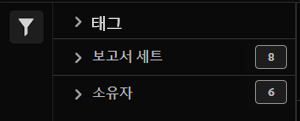

# 분류 세트 관리자

분류 세트 관리자를 사용하여 분류 세트를 생성, 편집 또는 삭제할 수 있습니다.

**[!UICONTROL 구성 요소]** > **[!UICONTROL 분류 세트]** > **[!UICONTROL 세트]**

분류 세트는 **구독** (이 분류 세트가 적용되는 보고서 세트) 및 **분류 이름** (분류 데이터를 포함하는 추가 차원).

## 분류 세트 필터링

분류 세트 관리자의 왼쪽에서는 원하는 분류 세트를 찾기 위한 필터 설정을 제공합니다. 필터 아이콘을 클릭하면 필터 설정 가시성이 전환됩니다. 분류 세트를 **[!UICONTROL 태그]**, **[!UICONTROL 보고서 세트]**, 또는 **[!UICONTROL 소유자]**.

## 분류 세트 관리자 열

분류 세트 관리자에서 다음 열을 사용할 수 있습니다.

* **[!UICONTROL 분류 세트]**: 분류 세트 이름입니다. 분류 세트 이름을 클릭하여 [설정 편집](settings.md).
* **[!UICONTROL 구독]**: 구독 수 또는 이 분류 세트가 적용되는 보고서 세트 수입니다.
* **[!UICONTROL 소유자]**: 분류 세트의 소유자입니다.
* **[!UICONTROL 분류]**: 분류 세트에 포함된 분류 차원의 수입니다.
* **[!UICONTROL 자동화된]**: 분류 세트가 FTP 사이트에서 데이터를 자동으로 가져오도록 구성되어 있는지 여부를 나타냅니다.
* **[!UICONTROL 마지막 수정 날짜]**: 분류 세트를 마지막으로 수정한 날짜 및 시간입니다.
* **[!UICONTROL FTP 호스트 + 경로]**: 자동화된 경우 분류 세트가 데이터를 가져오는 FTP 위치입니다.

## 선택 사항 만들기 또는 편집

분류 세트 관리자에서 다음 버튼을 사용할 수 있습니다.

* **[!UICONTROL 추가]**: [만들기](create.md) 분류 세트.
* **[!UICONTROL 제목별로 검색]**: 이름별로 분류 세트를 검색합니다.
* **[!UICONTROL 추가 로드]**: 분류 세트 관리자는 처음에 최대 1000개의 분류 세트를 표시합니다. 1,000개 이상의 분류 세트를 로드하려면 이 단추를 클릭하십시오.
* **열 표시/숨기기**: 열 이외의 열에 대한 가시성을 전환합니다. [!UICONTROL 분류 세트].

원하는 분류 세트 옆에 있는 확인란을 클릭하여 하나 이상의 분류 세트를 선택합니다. 분류 세트를 선택하면 다음 옵션이 표시됩니다.

* **[!UICONTROL 태그]**: 선택한 분류 세트에 하나 이상의 태그를 추가합니다. 그러면 분류 세트를 구성하거나 그룹화하여 나중에 더 쉽게 찾을 수 있습니다.
* **[!UICONTROL 이름 변경]**: 선택한 분류 세트의 이름을 변경합니다.
