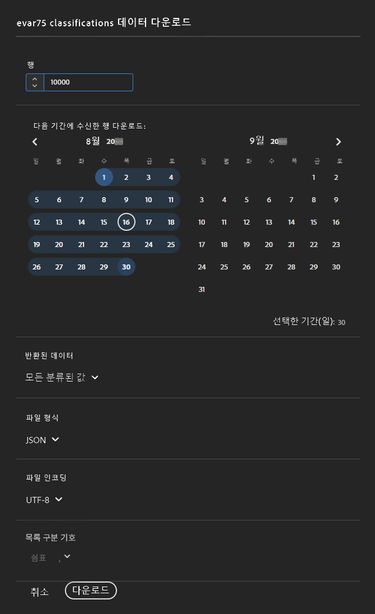
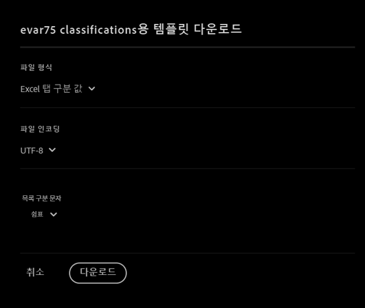

# 분류 세트 설정

분류 세트를 구성하거나, 데이터를 업로드하거나, 데이터를 다운로드합니다.

>[!NOTE]
>
>이 기능은 보고서 세트를 새 분류 아키텍처로 마이그레이션한 모든 고객이 사용할 수 있습니다. 자세한 내용은 Adobe 고객 지원 센터 또는 계정 관리자에게 문의하십시오.

**[!UICONTROL 구성 요소]** > **[!UICONTROL 분류 세트]** > **[!UICONTROL 설정]** > 원하는 분류 세트 이름을 클릭합니다.

분류 세트를 편집할 때 **[!UICONTROL 스키마]** 및 **[!UICONTROL 설정]**&#x200B;의 두 가지 탭을 사용할 수 있습니다.

## 설정

[!UICONTROL 설정] 탭에서 다음 필드를 사용할 수 있으며 편집할 수 있습니다.

* **[!UICONTROL 이름]**: 분류 세트 이름입니다.
* **[!UICONTROL 설명]**: 분류 세트에 대한 설명입니다.
* **[!UICONTROL 소유자 이름]**: 소유자 이름입니다.
* **[!UICONTROL 소유자 이메일]**: 소유자 이메일 주소입니다.
* **[!UICONTROL 문제 알림]**: 이 분류 세트와 관련된 문제를 알리는 쉼표로 구분된 이메일 주소 목록입니다.
* **[!UICONTROL 태그]**: 선택한 분류 세트에 태그를 하나 이상 추가하면 나중에 분류 세트를 쉽게 찾을 수 있도록 구성하거나 그룹화할 수 있습니다.

추가 필드는 정보 제공 목적으로 사용할 수 있으며 편집할 수 없습니다.

* **[!UICONTROL 유형]**: [!UICONTROL 기본] 및 [!UICONTROL 조회] 사이의 분류 유형입니다. 일반적으로 기본 분류가 사용됩니다.
* **[!UICONTROL 구독]**: 분류 세트가 적용되는 보고서 세트 및 변수입니다. 현재 지정된 분류 세트에 대해 하나의 보고서 세트만 지원됩니다. 여러 보고서 세트에 대한 지원이 계획되어 있습니다.

## 스키마

이 구독에 대해 현재 구성된 분류 차원을 봅니다. 다음 버튼을 사용할 수 있습니다.

* **[!UICONTROL 업로드]**: 하나 이상의 분류 차원에 대한 분류 데이터를 수동으로 업로드합니다. JSON, CSV, TSV 및 TAB 파일이 지원됩니다. 유효한 파일을 업로드하면 분류할 데이터의 테이블 미리보기가 표시됩니다.
   * **[!UICONTROL 파일 인코딩]**: 이 드롭다운을 사용하여 올바른 파일 인코딩을 선택합니다. 유효한 옵션에는 [!UICONTROL UTF-8] 및 [!UICONTROL Latin1]이 포함됩니다.
   * **[!UICONTROL 목록 구분 기호]**: 올바른 목록 구분 기호를 선택합니다. 다운로드한 파일 또는 템플릿 파일을 사용하는 경우, [!UICONTROL 목록 구분 기호]가 파일을 다운로드할 때의 [!UICONTROL 목록 구분 기호]와 일치하는지 확인하십시오.
   * **[!UICONTROL 적용]**: 업로드한 분류 데이터를 분류 세트에 저장합니다.

   

* **[!UICONTROL 다운로드]**: 키 값과 해당 분류 열을 다운로드합니다.
   * **[!UICONTROL 행]**: 다운로드 파일에 포함할 최대 행 수입니다.
   * **[!UICONTROL 다음 기간 동안 받은 행 다운로드]**: 보고에 나타나는 시점을 기준으로 키 값을 필터링할 수 있는 캘린더 날짜 선택기입니다. 이 날짜 범위에서 키 값이 수집되지 않은 경우 다운로드한 파일에 키 값이 나타나지 않습니다.
   * **[!UICONTROL 반환되는 데이터]**: 연결된 분류 데이터를 기준으로 다운로드한 파일에 포함된 키 값을 필터링할 수 있는 드롭다운입니다.
      * **[!UICONTROL 모든 분류된 값]**: 하나 이상의 열에 분류 데이터가 포함된 행을 포함합니다.
      * **[!UICONTROL 모든 분류되지 않은 값]**: 하나 이상의 열에 분류 데이터가 누락된 행을 포함합니다.
   * **[!UICONTROL 파일 포맷]**: 다운로드 파일이 있는 파일 포맷을 결정하는 드롭다운입니다. 옵션에는 [!UICONTROL JSON], [!UICONTROL 쉼표로 구분된 값] 및 [!UICONTROL Excel 탭으로 구분된 값]이 포함됩니다.
   * **[!UICONTROL 파일 인코딩]**: 파일 인코딩을 결정하는 드롭다운입니다. 옵션에는 [!UICONTROL UTF-8] 및 [!UICONTROL Latin1]이 포함됩니다. UTF-8이 권장됩니다.
   * **[!UICONTROL 목록 구분 기호]**: 각 행에서 분류 열을 구분하는 목록 구분 기호를 결정하는 드롭다운입니다.

   

* **[!UICONTROL 템플릿]**: 템플릿 파일을 다운로드합니다. 이 파일은 분류 데이터나 키 값을 포함하지 않는다는 점을 제외하면 [!UICONTROL 다운로드] 버튼과 유사합니다.
   * **[!UICONTROL 파일 포맷]**: 템플릿 파일이 있는 파일 포맷을 결정하는 드롭다운입니다. 옵션에는 [!UICONTROL 쉼표로 구분된 값] 및 [!UICONTROL Excel 탭으로 구분된 값]이 포함됩니다.
   * **[!UICONTROL 파일 인코딩]**: 파일 인코딩을 결정하는 드롭다운입니다. 옵션에는 [!UICONTROL UTF-8] 및 [!UICONTROL Latin1]이 포함됩니다. UTF-8이 권장됩니다.
   * **[!UICONTROL 목록 구분 기호]**: 각 행에서 분류 열을 구분하는 목록 구분 기호를 결정하는 드롭다운입니다.
* **[!UICONTROL 작업 내역]**: 이 분류 세트에 대한 작업만 표시하는 [작업 관리자](job-manager.md)로 이동하는 바로 가기 링크입니다.

   
