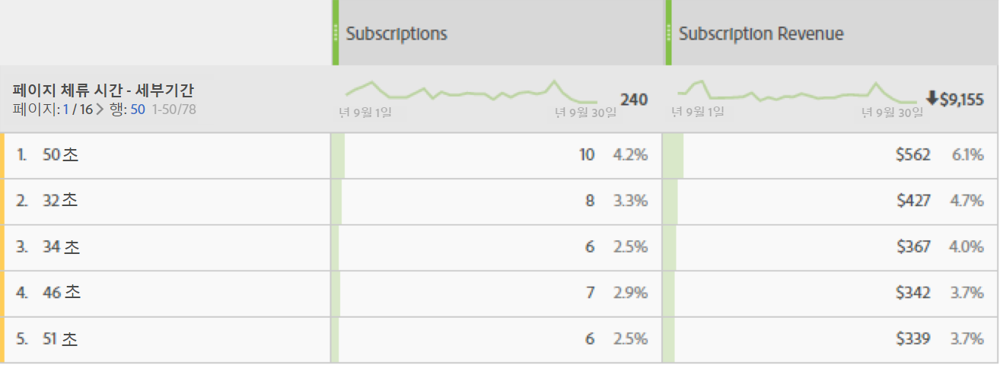

# 페이지에서 보낸 시간

페이지에서 보낸 시간 차원은 방문자가 페이지에서 체류한 시간을 기록합니다. 다음 절차를 사용하여 계산을 측정합니다.

1. 주어진 히트의 타임스탬프를 확인합니다.
2. 이 히트를 방문에서 다음 히트의 타임스탬프와 비교합니다. 페이지 보기와 링크 추적 히트가 모두 계산됩니다.
3. 이 두 히트 사이에 경과된 시간이 페이지에서 보낸 시간에 기여합니다.

이 차원은 방문자가 사이트에서 주어진 지표와 상호 작용하는 시간의 크기를 이해하려는 경우 유용합니다.

>[!TIP]
>
>경과 시간을 측정할 후속 이미지 요청이 없기 때문에 페이지에서 체류한 시간은 방문의 마지막 히트에 대해서는 측정되지 않습니다. 이 개념은 단일 히트(바운스)로 구성된 방문에도 적용됩니다.

이 차원은 히트 기반입니다. 즉, 모든 히트에 대해 값이 다릅니다. 이 차원을 방문 기반 차원인 [방문당 체류 시간](time-spent-per-visit.md)과 비교합니다. 높은 체류 시간은 페이지(히트)에서 방문자가 오래 머물렀음을 의미합니다.

## 이 차원을 데이터로 채우기

이 차원은 모든 구현에 대해 즉시 작동합니다. 보고서 세트에 데이터가 포함되어 있으면 이 차원이 작동합니다.

## 차원 항목

페이지에서 보낸 시간에 대해 여러 차원이 존재합니다.

* **페이지 체류 시간 - 그룹**: 시간이 버킷됩니다. 차원 항목의 범위는 `"Less than 15 seconds"`부터 `"More than 30 minutes"`까지 입니다. 페이지 보기 사이의 시간은 일반적으로 30분을 넘지 않습니다. 그러나 타임스탬프가 지정된 히트 또는 데이터 소스를 사용하는 경우 페이지 보기 사이의 시간은 30분을 초과할 수 있습니다.
* **페이지 체류 시간 - 세부기간**: 각각의 초 수는 고유한 차원 항목입니다.

체류 시간에 대한 일반적인 정보가 필요하면 [체류 시간 개요](../metrics/time-spent.md)를 참조하십시오.
