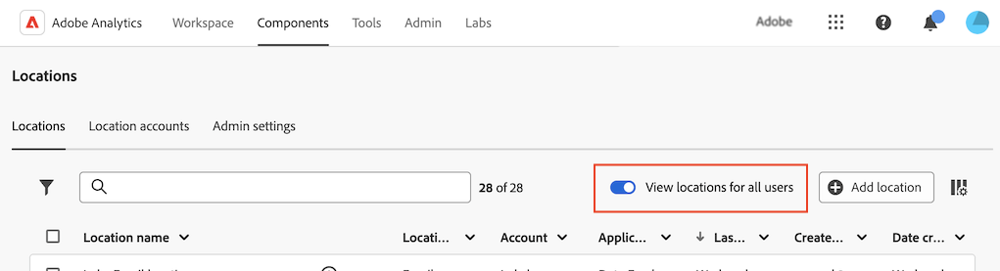

# 클라우드 가져오기 및 내보내기 위치 구성

<!-- This page is almost duplicated with the "Configure cloud export locations" article in CJA. Differences are that Snowflake isn't supported here and there is a Suffix field for each account type. -->

>[!NOTE]
>
>위치를 만들고 편집할 때 다음 사항을 고려하십시오.<ul><li>시스템 관리자는 [사용자가 위치를 만들 수 있는지 여부 구성](/help/components/locations/locations-manager.md#configure-whether-users-can-create-locations)에 설명된 대로 사용자의 위치 만들기를 제한할 수 있습니다. 이 섹션에 설명된 대로 위치를 만들 수 없는 경우 시스템 관리자에게 문의하십시오.</li><li>위치를 만든 사용자나 시스템 관리자만 위치를 편집할 수 있습니다.</li></ul>

[클라우드 계정을 구성](/help/components/locations/configure-import-accounts.md)한 후 해당 계정에서 위치를 구성할 수 있습니다. 단일 위치는 다음 목적 중 하나에 사용할 수 있습니다(단일 위치는 여러 목적과 연결할 수 없음).

* [데이터 피드](/help/export/analytics-data-feed/create-feed.md)를 사용하여 파일 내보내기
* [Data Warehouse](/help/export/data-warehouse/create-request/dw-request-report-destinations.md)을(를) 사용하여 보고서 내보내기
* [Report Builder](/help/analyze/report-builder/report-builder-export.md)을(를) 사용할 때 파일 내보내기
* [분류 세트](/help/components/classifications/sets/overview.md)를 사용하여 스키마를 가져오는 중

클라우드 계정에 액세스하려면 필요한 정보로 Adobe Analytics을 구성해야 합니다. 이 프로세스는 [클라우드 가져오기 및 내보내기 계정 구성](/help/components/locations/configure-import-accounts.md)에 설명된 대로 계정을 추가 및 구성(예: Amazon S3 역할 ARN, Google Cloud Platform 등)한 다음, 이 문서에 설명된 대로 해당 계정 내에서 위치를 추가 및 구성합니다.

기존 위치를 보고 삭제하는 방법에 대한 자세한 내용은 [위치 관리자](/help/components/locations/locations-manager.md)를 참조하세요.

## 위치 만들기 또는 편집 시작

1. Adobe Analytics에서 [!UICONTROL **구성 요소**] > [!UICONTROL **위치**]&#x200B;를 선택합니다.

1. [!UICONTROL 위치] 페이지에서 [!UICONTROL **위치**] 탭을 선택합니다.

1. (조건부) 시스템 관리자인 경우 [!UICONTROL **모든 사용자의 위치 보기**] 옵션을 활성화하여 조직의 모든 사용자가 만든 위치를 볼 수 있습니다.
   

1. 새 위치를 추가하려면 [!UICONTROL **위치 추가**]&#x200B;를 선택하세요. 아직 계정을 추가하지 않은 경우 [클라우드 가져오기 및 내보내기 계정 구성](/help/components/locations/configure-import-accounts.md)에 설명된 대로 계정을 추가하십시오.

   [!UICONTROL **위치 추가**] 대화 상자가 표시됩니다

   또는

   기존 위치를 편집하려면 위치 이름 옆에 있는 점 3개를 선택한 다음 [!UICONTROL **편집**]&#x200B;을 선택합니다.

   [!UICONTROL **위치 정보**] 대화 상자가 표시됩니다.

1. 다음 정보를 지정합니다.

   | 필드 | 함수 |
   |---------|----------|
   | [!UICONTROL **이름**] | 위치의 이름입니다. |
   | [!UICONTROL **설명**] | 동일한 계정 유형의 다른 계정과 구분할 수 있도록 계정에 대한 간단한 설명을 제공합니다. |
   | [!UICONTROL **함께 사용**] | 이 위치를 [!UICONTROL **데이터 피드**], [!UICONTROL **Data Warehouse**], [!UICONTROL **분류 세트**] 또는 **[!UICONTROL Report Builder]**&#x200B;에 사용할지 여부를 선택하십시오. 
선택할 때는 다음 사항을 고려하십시오.
<ul><li>단일 위치를 여러 용도로 사용할 수 없습니다. 예를 들어 데이터 피드에 사용되는 위치는 Data Warehouse 또는 분류 세트에도 사용할 수 없습니다.</li><li>위치 내에서 파일이 충돌하지 않도록 위치를 사용한 후에는 [!UICONTROL **다음 사용**] 필드의 값을 변경하지 마십시오.</li><li>전자 메일 계정의 위치를 만드는 경우 이 필드에서 [!UICONTROL **Data Warehouse**]&#x200B;을(를) 선택하십시오. 이메일 위치는 데이터 피드 및 분류 세트에서 지원되지 않습니다.</li></ul> |
   | [!UICONTROL **조직의 모든 사용자가 사용할 수 있는 위치 만들기**] | 조직의 다른 사용자가 위치를 사용할 수 있도록 하려면 이 옵션을 활성화합니다.
위치를 공유할 때는 다음 사항을 고려하십시오.
<ul><li>공유하는 위치는 공유 해제할 수 없습니다.</li><li>공유 위치는 해당 위치의 소유자만 편집할 수 있습니다.</li><li>위치가 연결된 계정도 공유된 경우에만 위치를 공유할 수 있습니다.</li></ul> |
   | [!UICONTROL **위치 계정**] | 이 위치를 만들 위치 계정을 선택합니다. 계정을 만드는 방법에 대한 자세한 내용은 [클라우드 가져오기 및 내보내기 계정 구성](/help/components/locations/configure-import-accounts.md)을 참조하십시오. |

1. 위치 구성 양식을 작성하려면 [!UICONTROL **위치 계정**] 필드에서 선택한 계정 유형에 해당하는 아래 섹션을 계속 사용하십시오. (추가적인 레거시 계정 유형도 사용할 수 있지만 권장되지는 않습니다.)

### Amazon S3 Role ARN

Amazon S3 역할 ARN 위치를 구성하려면 다음 정보를 지정합니다.

1. 위에서 설명한 대로 [위치 만들기 또는 편집을 시작합니다](#begin-creating-or-editing-a-location).

   | 필드 | 함수 |
   |---------|----------|
   | [!UICONTROL **버킷**] | Adobe Analytics 데이터를 전송할 Amazon S3 계정 내부 버킷입니다. 
Adobe에서 제공한 사용자 ARN에 이 버킷에 파일을 업로드할 수 있는 `S3:PutObject` 권한이 있는지 확인하십시오. 

버킷 이름은 특정 이름 지정 규칙을 충족해야 합니다. 예를 들면 3~63자 사이여야 하며 소문자, 숫자, 점(.), 하이픈(-)만 사용할 수 있고 문자나 숫자로 시작하고 끝나야 합니다. [이름 지정 규칙의 전체 목록은 AWS 설명서에서 확인할 수 있습니다](https://docs.aws.amazon.com/AmazonS3/latest/userguide/bucketnamingrules.html). 
 |
   | [!UICONTROL **접두사**] | 데이터를 입력할 버킷 내부 폴더입니다. 폴더 이름을 지정한 다음 이름 뒤에 백슬래시를 추가하여 폴더를 만듭니다. 예를 들어 폴더 이름/ |

   {style="table-layout:auto"}

1. [!UICONTROL **저장**]&#x200B;을 선택합니다.

   이제 구성한 계정 및 위치로 데이터를 가져오거나 내보낼 수 있습니다. 데이터를 내보내려면 [데이터 피드](/help/export/analytics-data-feed/create-feed.md) 또는 [Data Warehouse](/help/export/data-warehouse/create-request/dw-request-report-destinations.md)을(를) 사용하십시오. 데이터를 가져오려면 [분류 세트](/help/components/classifications/sets/overview.md)를 사용하십시오.

   가져온 데이터는 가져온 후 클라우드 대상에서 삭제되지 않습니다.

   >[!NOTE]
   >
   >   이전에 [FTP를 사용하여 분류를 Adobe Analytics으로 가져오기](/help/components/classifications/importer/c-uploading-saint-data-files-via-ftp.md)한 경우 FIN 파일을 업로드해야 합니다. 클라우드 계정에서 가져올 때는 이 FIN 파일이 필요하지 않습니다.

### Google Cloud Platform

Google Cloud Platform 위치를 구성하려면 다음 정보를 지정합니다.

1. 위에서 설명한 대로 [위치 만들기 또는 편집을 시작합니다](#begin-creating-or-editing-a-location).

   | 필드 | 함수 |
   |---------|----------|
   | [!UICONTROL **버킷**] | Adobe Analytics 데이터를 전송할 GCP 계정 내의 버킷입니다. 이 버킷에 파일을 업로드할 수 있도록 Adobe에서 제공한 주도자에 대한 권한을 부여했는지 확인하십시오. |
   | [!UICONTROL **접두사**] | 데이터를 입력할 버킷 내부 폴더입니다. 폴더 이름을 지정한 다음 이름 뒤에 백슬래시를 추가하여 폴더를 만듭니다. 예를 들어 폴더 이름/ |

   {style="table-layout:auto"}

1. [!UICONTROL **저장**]&#x200B;을 선택합니다.

   이제 구성한 계정 및 위치로 데이터를 가져오거나 내보낼 수 있습니다. 데이터를 내보내려면 [데이터 피드](/help/export/analytics-data-feed/create-feed.md) 또는 [Data Warehouse](/help/export/data-warehouse/create-request/dw-request-report-destinations.md)을(를) 사용하십시오. 데이터를 가져오려면 [분류 세트](/help/components/classifications/sets/overview.md)를 사용하십시오.

   가져온 데이터는 가져온 후 클라우드 대상에서 삭제되지 않습니다.

   >[!NOTE]
   >
   >   이전에 [FTP를 사용하여 분류를 Adobe Analytics으로 가져오기](/help/components/classifications/importer/c-uploading-saint-data-files-via-ftp.md)한 경우 FIN 파일을 업로드해야 합니다. 클라우드 계정에서 가져올 때는 이 FIN 파일이 필요하지 않습니다.

### Azure SAS

Azure SAS 위치를 구성하려면 다음 정보를 지정합니다.

1. 위에서 설명한 대로 [위치 만들기 또는 편집을 시작합니다](#begin-creating-or-editing-a-location).

   | 필드 | 함수 |
   |---------|----------|
   | [!UICONTROL **컨테이너**] | Adobe Analytics 데이터 전송 위치를 지정한 계정 내 컨테이너입니다. |
   | [!UICONTROL **접두사**] | 데이터를 입력할 컨테이너 내부 폴더입니다. 폴더 이름을 지정한 다음 이름 뒤에 백슬래시를 추가하여 폴더를 만듭니다. 예를 들어 `folder_name/` |

   {style="table-layout:auto"}

1. [!UICONTROL **저장**]&#x200B;을 선택합니다.

   이제 구성한 계정 및 위치로 데이터를 가져오거나 내보낼 수 있습니다. 데이터를 내보내려면 [데이터 피드](/help/export/analytics-data-feed/create-feed.md) 또는 [Data Warehouse](/help/export/data-warehouse/create-request/dw-request-report-destinations.md)을(를) 사용하십시오. 데이터를 가져오려면 [분류 세트](/help/components/classifications/sets/overview.md)를 사용하십시오.

   가져온 데이터는 가져온 후 클라우드 대상에서 삭제되지 않습니다.

   >[!NOTE]
   >
   >   이전에 [FTP를 사용하여 분류를 Adobe Analytics으로 가져오기](/help/components/classifications/importer/c-uploading-saint-data-files-via-ftp.md)한 경우 FIN 파일을 업로드해야 합니다. 클라우드 계정에서 가져올 때는 이 FIN 파일이 필요하지 않습니다.

### Azure RBAC

Azure RBAC 위치를 구성하려면 다음 정보를 지정합니다.

1. 위에서 설명한 대로 [위치 만들기 또는 편집을 시작합니다](#begin-creating-or-editing-a-location).

   | 필드 | 함수 |
   |---------|----------|
   | [!UICONTROL **계정**] | Azure 스토리지 계정입니다. |
   | [!UICONTROL **컨테이너**] | Adobe Analytics 데이터 전송 위치를 지정한 계정 내 컨테이너입니다. 앞서 만든 Azure 애플리케이션에 파일을 업로드할 권한을 부여하고 있는지 확인합니다. |
   | [!UICONTROL **접두사**] | 데이터를 입력할 컨테이너 내부 폴더입니다. 폴더 이름을 지정한 다음 이름 뒤에 백슬래시를 추가하여 폴더를 만듭니다. 예를 들어 `folder_name/` |

   {style="table-layout:auto"}

1. [!UICONTROL **저장**]&#x200B;을 선택합니다.

   이제 구성한 계정 및 위치로 데이터를 가져오거나 내보낼 수 있습니다. 데이터를 내보내려면 [데이터 피드](/help/export/analytics-data-feed/create-feed.md) 또는 [Data Warehouse](/help/export/data-warehouse/create-request/dw-request-report-destinations.md)을(를) 사용하십시오. 데이터를 가져오려면 [분류 세트](/help/components/classifications/sets/overview.md)를 사용하십시오.

   가져온 데이터는 가져온 후 클라우드 대상에서 삭제되지 않습니다.

   >[!NOTE]
   >
   >   이전에 [FTP를 사용하여 분류를 Adobe Analytics으로 가져오기](/help/components/classifications/importer/c-uploading-saint-data-files-via-ftp.md)한 경우 FIN 파일을 업로드해야 합니다. 클라우드 계정에서 가져올 때는 이 FIN 파일이 필요하지 않습니다.

### 이메일

전자 메일 위치를 구성하려면 다음 정보를 지정하십시오.

1. 위에서 설명한 대로 [위치 만들기 또는 편집을 시작합니다](#begin-creating-or-editing-a-location).

   | 필드 | 함수 |
   |---------|----------|
   | [!UICONTROL **제목**] | 이메일 메시지 제목입니다. |
   | [!UICONTROL **참고**] | 이메일 메시지의 콘텐츠입니다. |

   {style="table-layout:auto"}

1. [!UICONTROL **저장**]&#x200B;을 선택합니다.

   이제 [데이터 피드](/help/export/analytics-data-feed/create-feed.md)를 사용할 때 구성한 계정 및 위치로 데이터를 내보낼 수 있습니다. (전자 메일 위치는 [Data Warehouse](/help/export/data-warehouse/create-request/dw-request-report-destinations.md), [Report Builder](/help/analyze/report-builder/report-builder-export.md) 또는 [분류 집합](/help/components/classifications/sets/overview.md)에서 지원되지 않습니다.)

### 이전 계정 유형

이러한 기존 계정 유형은 [데이터 피드](/help/export/analytics-data-feed/create-feed.md) 및 [Data Warehouse](/help/export/data-warehouse/create-request/t-dw-create-request.md)을 사용하여 데이터를 내보내는 경우에만 사용할 수 있습니다. [분류 세트](/help/components/classifications/sets/manage/schema.md)를 사용하여 데이터를 가져올 때는 이러한 옵션을 사용할 수 없습니다.

+++FTP

데이터 피드 데이터는 Adobe 또는 고객이 호스팅하는 FTP 위치에 전달할 수 있습니다. 디렉토리 지정 경로 필드를 사용하여 폴더에 피드 파일을 저장합니다.

| 필드 | 함수 |
|---------|----------|
| [!UICONTROL **디렉터리 경로**] | FTP 서버의 디렉터리 경로를 입력합니다. 폴더는 이미 있어야 합니다. 지정된 경로가 존재하지 않는 경우 피드에서 오류가 발생합니다.  예: `/folder_name/folder_name`. |

{style="table-layout:auto"}

+++

+++SFTP

데이터 피드 데이터는 Adobe 또는 고객이 호스팅하는 SFTP 위치에 전달할 수 있습니다. 대상 사이트에는 유효한 RSA 또는 DSA 공개 키가 있어야 합니다. 피드를 만들 때 적절한 공개 키를 다운로드할 수 있습니다.

| 필드 | 함수 |
|---------|----------|
| [!UICONTROL **디렉터리 경로**] | FTP 서버의 디렉터리 경로를 입력합니다. 폴더는 이미 있어야 합니다. 지정된 경로가 존재하지 않는 경우 피드에서 오류가 발생합니다.  예: `/folder_name/folder_name`. |

{style="table-layout:auto"}

+++

+++S3

웨어하우스 데이터를 Amazon S3 버킷으로 직접 보낼 수 있습니다. 이 대상 유형에는 버킷 이름, 액세스 키 ID 및 보안 키가 필요합니다. 자세한 내용은 Amazon S3 문서 내의 [Amazon S3 버킷 이름 지정 요구 사항](https://docs.aws.amazon.com/awscloudtrail/latest/userguide/cloudtrail-s3-bucket-naming-requirements.html)을 참조하십시오.

데이터 Data Warehouse 업로드를 위해 제공한 사용자는 다음 [권한](https://docs.aws.amazon.com/AmazonS3/latest/API/API_Operations_Amazon_Simple_Storage_Service.html)이 있어야 합니다.

* s3:GetObject
* s3:PutObject
* s3:PutObjectAcl

다음 16개의 표준 AWS 지역이 지원됩니다(필요한 경우 적절한 서명 알고리즘 사용).

* us-east-2
* us-east-1
* us-west-1
* us-west-2
* ap-남-1
* ap-northeast-2
* ap-southeast-1
* ap-southeast-2
* ap-northeast-1
* ca-central-1
* eu-central-1
* eu-west-1
* eu-west-2
* eu-west-3
* eu-north-1
* sa-east-1

>[!NOTE]
>
>cn-north-1 지역은 지원되지 않습니다.

+++

+++Azure Blob

Data Warehouse는 Azure Blob 대상을 지원합니다. 컨테이너, 계정 및 키가 필요합니다. Amazon은 데이터를 사용하지 않을 때 자동으로 암호화합니다. 데이터를 다운로드할 때 데이터 암호화는 자동으로 해제됩니다. 자세한 내용은 Microsoft Azure 문서 내에서 [저장소 계정 만들기](https://docs.microsoft.com/ko-kr/azure/storage/common/storage-quickstart-create-account?tabs=azure-portal#view-and-copy-storage-access-keys)를 참조하십시오.

>[!NOTE]
>
>Data Warehouse 대상의 디스크 공간을 관리하려면 자체 프로세스를 구현해야 합니다. Adobe는 서버에서 데이터를 삭제하지 않습니다.

+++

