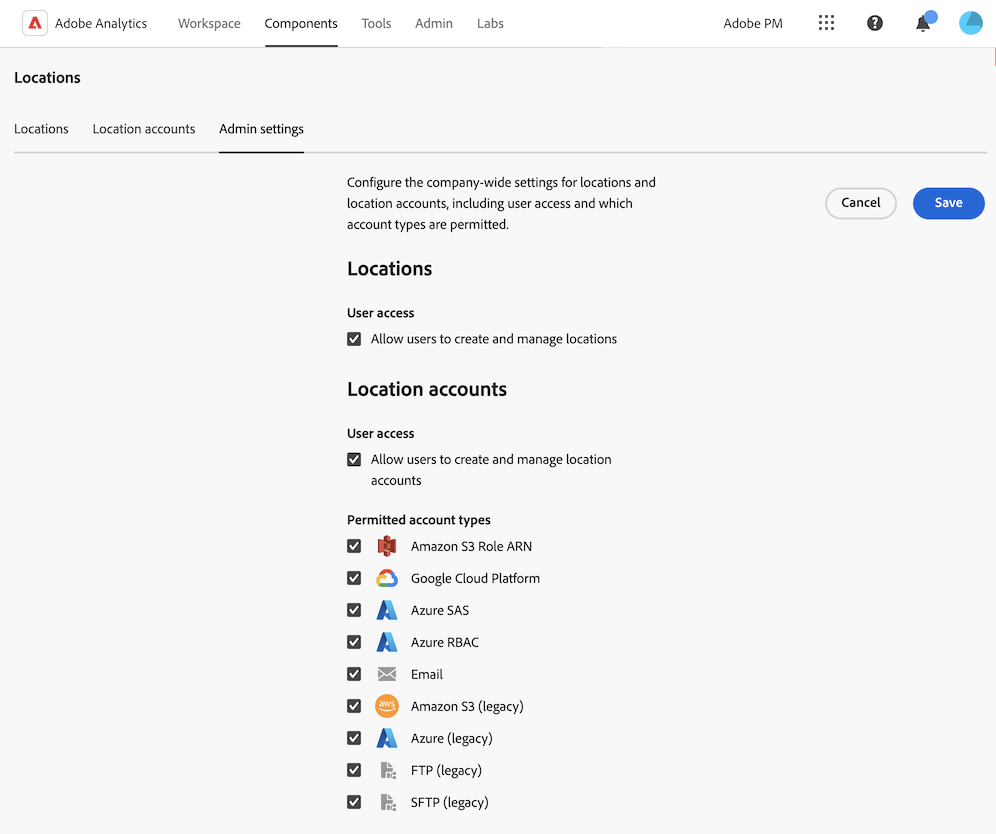

# 위치 관리자

위치 관리자를 사용하여 계정 및 위치를 보거나, 만들거나, 편집하거나, 삭제할 수 있습니다. 다음 용도로 사용할 수 있습니다.

* [데이터 피드](/help/export/analytics-data-feed/create-feed.md)를 사용하여 파일 내보내기
* [Data Warehouse](/help/export/data-warehouse/create-request/dw-request-report-destinations.md)을(를) 사용하여 보고서 내보내기
* [분류 세트](/help/components/classifications/sets/overview.md)를 사용하여 스키마를 가져오는 중

## 위치 보기, 필터링 및 검색

위치 관리자를 사용하면 생성한 위치나 조직과 공유되는 위치를 볼 수 있습니다. 시스템 관리자는 공유 여부에 관계없이 모든 사용자가 만든 위치를 볼 수 있습니다.

1. Adobe Analytics에서 위치 관리자에 액세스하려면 **[!UICONTROL 구성 요소]** > **[!UICONTROL 위치]**&#x200B;를 선택하십시오.

1. (조건부) 시스템 관리자인 경우 [!UICONTROL **모든 사용자의 위치 보기**] 옵션을 활성화하여 조직의 모든 사용자가 만든 위치를 볼 수 있습니다. <!-- Maybe add a screenshot? This is new functionality -->

1. 위치 목록을 필터링하거나 검색합니다.

   * **필터:** 필터 아이콘을 선택하여 위치 목록을 필터링합니다.

     **[!UICONTROL 위치 유형]**, **[!UICONTROL 계정]** 또는 **[!UICONTROL 만든 사람]**&#x200B;별로 위치를 필터링할 수 있습니다.

     

   * **검색:** 검색 필드에서 보려는 위치의 이름을 입력하세요. 입력한 대로 결과가 필터링됩니다. **위치 이름**, **위치 유형**, **계정** 및 **만든 사람** 열이 검색되었습니다.

1. (선택 사항) 위치가 1,000개를 초과하는 경우 처음 1,000개만 표시됩니다. 1,000개의 위치를 더 로드하려면 [!UICONTROL **추가 로드**]&#x200B;를 선택하십시오.

## 위치 관리자에서 열 구성

위치 관리자에서 다음 열을 사용할 수 있습니다. 테이블에 표시되는 열을 사용자 지정하려면 **테이블 사용자 지정** 아이콘 을 선택합니다.

* **[!UICONTROL 위치 이름]**: 위치 이름입니다. 위치 이름 옆에 있는 3점 메뉴를 선택하여 [위치를 편집](/help/components/locations/configure-import-locations.md)하거나 삭제합니다.
* **[!UICONTROL 위치 유형]**: 위치와 연결된 계정 유형입니다.
* **[!UICONTROL 계정]**: 위치와 연결된 특정 계정입니다.
* **응용 프로그램**: 위치를 사용할 수 있는 응용 프로그램 유형(예: 데이터 피드, Data Warehouse 또는 분류 세트)입니다.
* **[!UICONTROL 마지막으로 사용됨]**: 위치를 마지막으로 사용한 날짜입니다.
* **[!UICONTROL 만든 사람]**: 위치를 만든 사용자입니다.
* **[!UICONTROL 만든 날짜]**: 위치를 만든 날짜입니다.

## 위치 만들기 및 관리

위치를 생성, 편집 및 삭제할 수 있습니다.

### 위치 만들기

위치를 만드는 방법에 대한 자세한 내용은 [클라우드 가져오기 및 내보내기 위치 구성](/help/components/locations/configure-import-locations.md)을 참조하십시오.

<!-- Do I need to add some steps here about how to create a location and then assign that location to be used with DF, DW, or Classifications sets? Need to hear back from Ron and team whether we are including this functionality -->

### 위치 편집

위치를 만든 사용자나 시스템 관리자만 위치를 편집할 수 있습니다.

위치를 편집하는 방법에 대한 자세한 내용은 [클라우드 가져오기 및 내보내기 위치 구성](/help/components/locations/configure-import-locations.md)을 참조하십시오.

### 위치 삭제

>[!IMPORTANT]
>
>위치가 삭제되면 삭제된 위치와 연결된 데이터 피드 파일, Data Warehouse 보고서 또는 분류 세트 스키마를 다음에 사용할 때 실패합니다.
>
>위치를 삭제하면 [데이터 피드를 편집](/help/export/analytics-data-feed/create-feed.md), [Data Warehouse 보고서](/help/export/data-warehouse/create-request/dw-request-report-destinations.md) 및 [분류 설정 스키마](/help/components/classifications/sets/manage/schema.md)를 통해 제대로 작동하는 위치를 사용해야 합니다.

위치를 만든 사용자 또는 시스템 관리자만 위치를 삭제할 수 있습니다.

Adobe Analytics에서 위치 관리자에서 위치를 삭제하려면 다음을 수행하십시오.

1. **[!UICONTROL 구성 요소]** > **[!UICONTROL 위치]**&#x200B;를 선택한 다음 [!UICONTROL **위치**] 탭을 선택합니다.

1. [!UICONTROL **위치 이름**] 열에서 삭제할 위치에 대한 3점 메뉴를 선택합니다.

1. [!UICONTROL **삭제**]&#x200B;를 선택합니다.

## 계정 만들기 및 관리

계정을 만들고, 편집하고, 삭제할 수 있습니다.

### 계정 만들기

계정을 만드는 방법에 대한 자세한 내용은 [클라우드 가져오기 및 내보내기 계정 구성](/help/components/locations/configure-import-accounts.md)을 참조하십시오.

### 계정 편집

계정은 계정을 만든 사용자 또는 시스템 관리자만 편집할 수 있습니다.

계정을 편집하는 방법에 대한 자세한 내용은 [클라우드 가져오기 및 내보내기 계정 구성](/help/components/locations/configure-import-accounts.md)을 참조하십시오.

### 계정 키 보기

계정을 만든 후 해당 계정에 대해 연결된 계정 키를 볼 수 있습니다. [원래 계정을 구성](/help/components/locations/configure-import-accounts.md)했을 때 클라우드 공급자와 계정 구성을 완료하지 않은 경우 이 정보를 확인해야 합니다.

내보내기 계정과 연결된 키를 보려면 다음과 같이 하십시오.

1. Adobe Analytics에서 **[!UICONTROL 구성 요소]** > **[!UICONTROL 위치]**&#x200B;를 선택한 다음 [!UICONTROL **위치 계정**] 탭을 선택합니다.

1. (조건부) 시스템 관리자인 경우 [!UICONTROL **모든 사용자의 위치 보기**] 옵션을 활성화하여 조직의 모든 사용자가 만든 위치를 볼 수 있습니다. <!-- Maybe add a screenshot? This is new functionality -->

1. 편집할 계정의 3점 아이콘을 선택한 다음 [!UICONTROL **계정 키**]&#x200B;를 선택합니다.

### 계정 삭제

>[!IMPORTANT]
>
>계정을 사용하는 위치가 없는 경우에만 계정을 삭제할 수 있습니다. 계정을 삭제하기 전에 [위치 삭제](#delete-a-location)에 설명된 대로 먼저 계정에서 모든 위치를 삭제해야 합니다.

계정은 계정을 만든 사용자 또는 시스템 관리자만 삭제할 수 있습니다.

계정을 삭제하려면

1. Adobe Analytics에서 **[!UICONTROL 구성 요소]** > **[!UICONTROL 위치]**&#x200B;를 선택한 다음 [!UICONTROL **위치 계정**] 탭을 선택합니다.

1. (조건부) 시스템 관리자인 경우 [!UICONTROL **모든 사용자의 계정 보기**] 옵션을 활성화하여 조직의 모든 사용자가 만든 위치를 볼 수 있습니다.

1. 편집할 계정의 3점 아이콘을 선택한 다음 [!UICONTROL **계정 삭제**]&#x200B;를 선택합니다.

## 회사 전체 설정 구성(관리자만)

시스템 관리자는 사용자가 계정 및 위치를 만들지 못하도록 제한하거나 사용자가 만들고 사용할 수 있는 계정 유형을 제한할 수 있습니다.

### 사용자가 계정을 만들고 편집할 수 있는지 여부 구성

기본적으로 [클라우드 가져오기 및 내보내기 계정 구성](/help/components/locations/configure-import-accounts.md)에 설명된 대로 조직의 모든 사용자는 계정을 만들고 Adobe Analytics 환경에서 만드는 계정을 편집할 수 있습니다.

사용자가 계정을 생성하지 못하도록 제한할 수 있습니다. 이 경우 사용자는 이미 만든 계정을 계속 사용할 수 있지만 더 이상 편집할 수는 없습니다. [계정 삭제](#delete-an-account)에 설명된 대로 사용자가 만든 계정을 삭제할 수 있습니다.

모든 사용자가 계정을 만들고 편집하지 못하도록 제한하려면 다음을 수행합니다.

1. Adobe Analytics에서 **[!UICONTROL 구성 요소]** > **[!UICONTROL 위치]**&#x200B;를 선택한 다음 [!UICONTROL **관리자 설정**] 탭을 선택합니다.

1. [!UICONTROL **위치 계정**] 섹션에서 [!UICONTROL **사용자가 위치 계정을 만들고 관리할 수 있도록 허용**] 옵션을 선택 취소합니다.

1. [!UICONTROL **저장**]&#x200B;을 선택합니다.

1. (선택 사항) [계정 삭제](#delete-an-account)에 설명된 대로 사용자가 만든 계정 중 더 이상 사용하지 않을 계정을 삭제합니다.

### 사용자가 위치를 만들고 편집할 수 있는지 여부 구성

기본적으로 [클라우드 가져오기 및 내보내기 위치 구성](/help/components/locations/configure-import-locations.md)에 설명된 대로 조직의 모든 사용자는 Adobe Analytics 환경에서 위치를 만들고 위치를 편집할 수 있습니다.

사용자가 위치를 만들지 못하도록 제한할 수 있습니다. 이 경우 사용자는 이미 만든 위치를 계속 사용할 수 있지만 더 이상 편집할 수는 없습니다. [위치 삭제](#delete-a-location)에 설명된 대로 사용자가 만든 위치를 삭제할 수 있습니다.

모든 사용자가 위치를 만들고 편집하지 못하도록 제한하려면 다음을 수행합니다.

1. Adobe Analytics에서 **[!UICONTROL 구성 요소]** > **[!UICONTROL 위치]**&#x200B;를 선택한 다음 [!UICONTROL **관리자 설정**] 탭을 선택합니다.

1. [!UICONTROL **위치**] 섹션에서 [!UICONTROL **사용자가 위치를 만들고 관리할 수 있도록 허용**] 옵션을 선택 취소합니다.

1. [!UICONTROL **저장**]&#x200B;을 선택합니다.

1. (선택 사항) [위치 삭제](#delete-a-location)에 설명된 대로 사용자가 만든 위치 중 더 이상 사용하지 않을 위치를 삭제합니다.

### 사용자가 만들고 사용할 수 있는 계정 유형 제한

다음과 같은 경우 사용자에게 표시되는 계정 유형을 제한할 수 있습니다.

* [새 계정을 만드는 중](/help/components/locations/configure-import-accounts.md).

* [데이터 피드](/help/export/analytics-data-feed/create-feed.md)를 사용하여 파일을 내보내거나 [Data Warehouse](/help/export/data-warehouse/create-request/dw-request-report-destinations.md)을 사용하여 보고서를 내보내거나 [분류 세트](/help/components/classifications/sets/overview.md)를 사용하여 스키마를 가져올 때 사용할 계정을 선택할 때.

이 섹션에 설명된 대로 계정 유형을 제한하면 제한하는 유형의 모든 계정이 더 이상 사용자에게 표시되지 않습니다. 즉, 데이터 피드, Data Warehouse 또는 분류 세트를 만들 때 해당 유형의 새 계정을 만들 수 없고 해당 유형의 기존 계정을 사용할 수 없습니다.

그러나 예약된 내보내기에 대해 구성된 기존 계정은 사용을 제한하려면 삭제해야 합니다.

#### 예약된 내보내기에 계정이 사용되지 않는지 확인합니다.

계정 유형을 제한하면 기존 계정이 삭제되지 않고 숨겨집니다.

제한 유형의 계정에 데이터를 전송하도록 일정이 이미 구성되어 있는 경우 계정 유형을 제한한 후에도 일정이 계속 실행되고 데이터가 계정에 계속 전송됩니다.  예를 들어 데이터 피드가 사용자가 제한하는 계정 유형으로 데이터를 전송하도록 예약되면 일정이 계속 실행됩니다.

예약된 내보내기에 특정 유형의 계정이 사용되지 않도록 해야 하는 경우 [계정 유형을 제한](#limit-the-account-types-that-are-available-to-users)하기 전에 계정을 삭제할 수 있습니다.

계정을 삭제하려면

1. 제한하려는 계정 유형의 계정을 찾습니다. 이 계정은 예약된 내보내기에 사용됩니다.

1. [계정 삭제](#delete-an-account)에 설명된 대로 계정을 삭제합니다.

1. 다음 섹션을 계속합니다. [사용자가 사용할 수 있는 계정 유형을 제한합니다](#limit-the-account-types-that-are-available-to-users).

#### 사용자가 사용할 수 있는 계정 유형 제한

계정을 만들고 사용할 때 사용자가 사용할 수 있는 계정 유형을 제한하려면 다음을 수행합니다.

1. Adobe Analytics에서 **[!UICONTROL 구성 요소]** > **[!UICONTROL 위치]**&#x200B;를 선택한 다음 [!UICONTROL **관리자 설정**] 탭을 선택합니다.

1. [!UICONTROL **허용된 계정 유형**] 섹션을 찾습니다.

   사용자는 기본적으로 다음 계정 유형을 사용할 수 있습니다. 사용자의 사용을 제한하려는 이러한 계정 유형을 선택 취소합니다.

   계정 유형을 하나 이상 선택해야 합니다.

   * [!UICONTROL **Amazon S3 역할 ARN**]

   * [!UICONTROL **Google 클라우드 플랫폼**]

   * [!UICONTROL **Azure SAS**]

   * [!UICONTROL **Azure RBAC**]

   * [!UICONTROL **이메일**]

   * [!UICONTROL **Amazon S3**], [!UICONTROL **Azure**], [!UICONTROL **FTP**] 및 [!UICONTROL **SFTP**]&#x200B;을(를) 포함한 레거시 계정 유형

1. [!UICONTROL **저장**]&#x200B;을 선택합니다.

